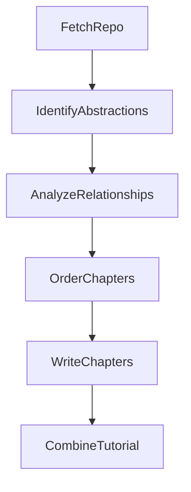

# 03 — Flow Orchestration

The orchestration layer is intentionally thin:

- [flow.py](../../flow.py) wires nodes into a pipeline
- PocketFlow executes the pipeline, passing the shared store through each stage

## The Flow Graph

The flow is created by `create_tutorial_flow()` in [flow.py](../../flow.py):

Key point: this is mostly a **straight line**.

## Why “Nodes” Instead of One Big Script?

Each node encapsulates one responsibility:

- **Prep**: read `shared` and build inputs for the step
- **Exec**: perform work (crawl, call LLM, parse YAML)
- **Post**: write results back to `shared`

This gives you:

- Easier debugging (you can inspect `shared` between steps)
- Retries (some nodes instantiate with `max_retries` + `wait`)
- An explicit “data contract” between steps

## The One Special Node: BatchNode

`WriteChapters` is a `BatchNode`, meaning:

- `prep()` returns a list of items to process
- `exec(item)` runs once per item
- `post()` receives the list of results

This maps nicely to “one chapter per abstraction”.

Next chapter: [04 — FetchRepo: Crawling GitHub or Local](04_node_fetchrepo.md)
