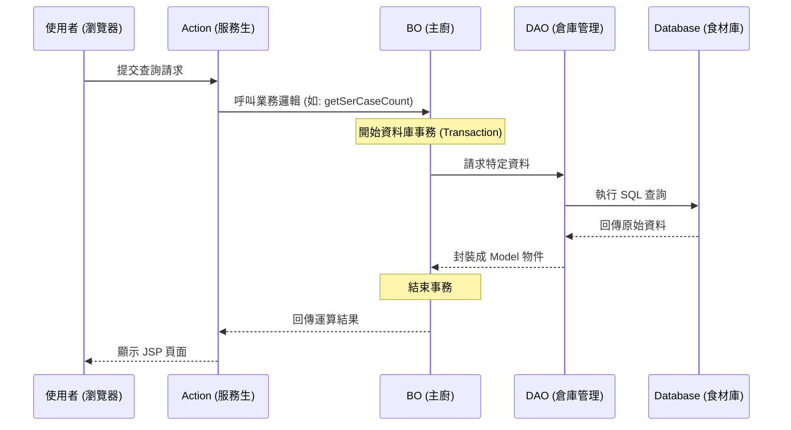

# Chapter 1: 分層架構模式 (Layering Pattern: Action/BO/DAO)


歡迎來到本專案的開發指南！作為開發者的第一站，我們必須先理解這個系統的核心骨架。本專案採用了一種非常經典且嚴謹的「分層架構」。

## 為什麼需要分層？

想像一下，如果你去一家餐廳吃飯，發現服務生不僅要點餐，還要進廚房炒菜，甚至還要負責去倉庫搬運食材。這會發生什麼事？
1. **混亂**：服務生忙不過來，客人等太久。
2. **難以維護**：如果想換個廚師，可能連點餐流程都要跟著改。

在軟體開發中，如果我們把所有程式碼（接收請求、運算邏輯、存取資料庫）全部寫在一起，這就是所謂的「義大利麵條式代碼」，非常難以維護。因此，我們將系統分為三層：**Action**、**BO** 與 **DAO**。

---

## 核心概念：餐廳類比法

我們可以透過下表快速理解這三層的角色分配：

| 層級 | 角色 | 對應技術 | 職責描述 |
| :--- | :--- | :--- | :--- |
| **Action** | 前台服務生 | Struts2 | 負責接待使用者，轉換請求參數，並回傳結果頁面。 |
| **BO** (Business Object) | 內場主廚 | Spring (邏輯) | **核心層**。處理所有的業務邏輯、運算與事務控制。 |
| **DAO** (Data Access Object) | 倉庫管理員 | iBATIS | 專門負責與資料庫溝通，進行資料的增刪改查。 |

---

## 實際案例：查詢客戶提問

假設我們要開發一個「查詢客戶提問筆數」的功能，看看這三層是如何分工合作的。

### 1. DAO 層：專注於資料
倉庫管理員只管拿資料。在 `ParameterDAOImpl.java` 中，你會看到類似這樣的代碼：

```java
// DAO 實作，繼承 SqlMapClientDaoSupport 來使用 iBATIS
public class ParameterDAOImpl extends SqlMapClientDaoSupport implements ParameterDAO {
    public Parameter selectByPrimaryKey(String paraid) {
        // 透過 iBATIS 設定檔執行 SQL 查詢
        return (Parameter) getSqlMapClientTemplate()
               .queryForObject("TXD2PF00.selectByPrimaryKey", paraid);
    }
}
```
**解釋**：DAO 不管這些資料要拿來做什麼，它只負責執行 SQL 並回傳結果。

### 2. BO 層：專注於邏輯與事務
主廚（BO）會呼叫管理員（DAO）拿食材，然後進行烹飪。這層最重要的是**事務管理 (Transaction)**。參考 `ServiceBOImpl.java`：

```java
public int getSerCaseCount(final ServiceSearchCondition cond) {
    // 使用 TransactionTemplate 確保資料一致性
    TransactionTemplate transactionTemplate = new TransactionTemplate(transactionManager);
    return (Integer) transactionTemplate.execute(new TransactionCallback() {
        public Object doInTransaction(TransactionStatus status) {
            // 呼叫 DAO 取得資料
            return getServiceUtilDAO().selectSerCaseCount(cond);
        }
    });
}
```
**解釋**：BO 層決定了什麼時候開始「處理事情」，並且確保如果中間出錯，資料可以安全地回滾。

### 3. Action 層：專注於溝通
服務生（Action）接收使用者的點餐（可能是網頁上的一個按鈕），然後轉告 BO。

```java
// 這是 Action 的偽代碼，展示其調用方式
public String execute() {
    // 1. 接收畫面參數
    // 2. 呼叫 BO 取得結果
    int count = serviceBO.getSerCaseCount(condition);
    // 3. 將結果交給 JSP 顯示
    return "SUCCESS";
}
```

---

## 運作流程圖

當一個請求進來時，系統內部的呼叫順序如下：



---

## 如何在專案中找到它們？

在本專案中，這些檔案通常分布在不同的模組中（如 `System`、`Service`、`Authority`）。你可以根據以下命名慣例快速定位：

*   **介面 (Interface)**：定義了有哪些功能。例如 `TempWorkBO.java` 或 `ParameterDAO.java`。
*   **實作 (Implementation)**：真正的程式碼邏輯。檔名通常結尾為 `Impl`。例如 `TempWorkBOImpl.java`。
*   **配置 (XML)**：因為我們使用 Spring 2.5，物件之間的關聯是寫在 XML 裡的。請參考 `applicationContext_[模組名].xml`。

> **小撇步**：如果你想了解資料庫是如何被存取的，請查看 [資料存取抽象 (DataAccessor & SKDataAccessor)](04_資料存取抽象__dataaccessor___skdataaccessor__.md)。

---

## 本章小結

在本章中，我們學習了：
1.  **分層架構**：將程式分為 Action、BO、DAO 三層。
2.  **職責分離**：Action 負責外在溝通，BO 負責內在邏輯與事務，DAO 負責資料存取。
3.  **依賴關係**：Action 呼叫 BO，BO 呼叫 DAO。

這種結構雖然一開始看起來檔案很多，但當系統變大時，它能讓開發者更精確地找到問題所在。

下一章，我們將深入探討系統的安全防護網：[權限管理系統 (Authority System)](02_權限管理系統__authority_system__.md)。

---

Generated by [AI Codebase Knowledge Builder](https://github.com/The-Pocket/Tutorial-Codebase-Knowledge)