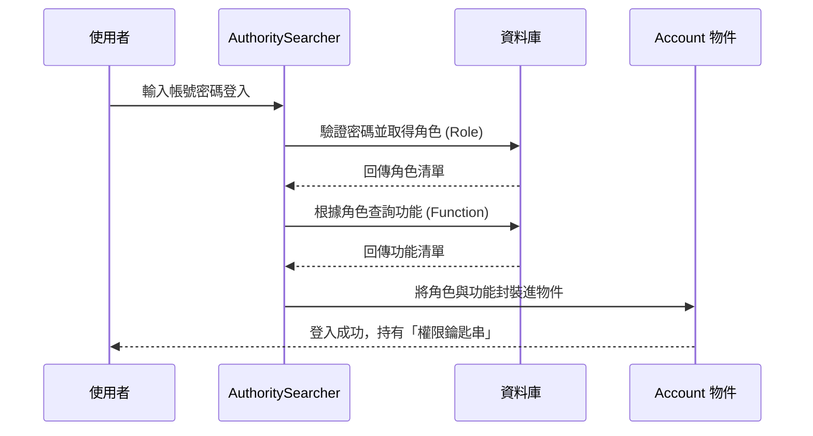

# Chapter 2: 權限管理系統 (Authority System)


在上一章 [分層架構模式 (Layering Pattern: Action/BO/DAO)](01_分層架構模式__layering_pattern__action_bo_dao__.md) 中，我們學習了系統的骨架。現在，我們要為這個骨架穿上「盔甲」——也就是**權限管理系統**。

---

## 為什麼需要權限管理？

想像你正在管理一間大型企業的辦公大樓。這棟大樓裡有：
1. **清潔工**：只能進入走廊和洗手間。
2. **會計師**：可以進入財務室。
3. **執行長**：可以進入所有房間，包括保險箱。

如果沒有門禁系統，任何人都能隨意翻閱財務報表，公司就會陷入混亂。在軟體系統中，權限管理系統就是這套「門禁系統」。它負責定義：**誰（Account）** 擁有什麼 **身份（Role）**，進而決定能使用哪些 **功能（Function）**。

---

## 核心概念：權限三要素

權限系統由三個核心組件構成，我們可以簡單理解為：

1. **帳號 (Account)**：「你是誰？」
   - 包含登入帳號、密碼、姓名等。
2. **角色 (Role)**：「你的身份是什麼？」
   - 例如：管理員、供應商、客服人員。一個帳號可以擁有多個角色。
3. **功能 (Function)**：「你能做什麼？」
   - 例如：新增產品、刪除訂單、查看報表。

### 代理人機制 (Agent)
這是企業環境中的特殊功能。當主廚請假時，他可以授權「代理人」暫時獲得他的權限，確保餐廳（系統）運作不中斷。

---

## 如何使用權限系統？

在程式碼中，我們通常會透過 `Account` 物件來判斷目前登入的使用者是否有權執行某個動作。

### 範例 1：檢查使用者角色
這段代碼檢查目前使用者是否具備「管理者」身份。

```java
// 檢查帳號是否為管理者 (Manager 或 Admin)
if (account.isManager()) {
    // 執行管理者專屬邏輯，例如審核帳單
    showAdminPanel();
}
```
**解釋**：`isManager()` 封裝了複雜的邏輯判斷，讓開發者只需關心使用者的身份類型。

### 範例 2：檢查特定功能權限
有時候我們不看身份，而是看使用者是否被賦予了「某項功能」的執行權。

```java
// 檢查使用者是否擁有執行「客服維護」的功能權限
if (account.canDoAction("m_ser_mod")) {
    // 允許使用者進入客服管理頁面
    goToServiceModule();
}
```
**解釋**：`canDoAction` 會去比對該帳號所屬角色所對應的所有功能清單。

---

## 內部運作原理

當一個使用者嘗試登入時，系統會進行一系列的資料載入與比對。

### 權限載入流程圖



### 關鍵程式碼實作

在 `AuthoritySearcher.java` 介面中，定義了系統如何處理登入與權限查詢：

```java
public interface AuthoritySearcher {
    // 核心功能：處理登入邏輯
    public Account logon(String iAcno, String iPswd) throws Exception;
    
    // 取得該角色清單對應的所有功能
    public FunctionList getFunctionList(RoleList i_roleList);
    
    // 重建系統角色清單（通常用於快取更新）
    public void rebuildSysRoleList();
}
```
**解釋**：這是權限系統的總管，負責把分散在資料庫各處的權限資料整合在一起。

在 `Account.java` 模型中，則儲存了這些動態載入的資訊：

```java
public class Account extends SKDataAccessor {
    // 儲存該帳號擁有的角色清單
    private AccRoleList roleList = new AccRoleList();
    // 儲存該帳號可執行的功能清單 (Map 結構方便快速查找)
    private HashMap actionsMap = new HashMap();

    public boolean canDoAction(String iActionName) {
        return this.actionsMap.containsKey(iActionName);
    }
}
```
**解釋**：`Account` 繼承自 [資料存取抽象 (DataAccessor & SKDataAccessor)](04_資料存取抽象__dataaccessor___skdataaccessor__.md)，它不僅是資料容器，還提供了像 `canDoAction` 這樣的便利方法。

---

## 系統安全的第一道防線

權限系統不僅僅是判斷 `if...else`。在本專案中，它與 [安全過濾器 (XSSRequestWrapper)](03_安全過濾器__xssrequestwrapper__.md) 協同工作，確保未經授權的請求在到達業務邏輯層（BO）之前就被攔截。

此外，系統透過 `AuthorityParameter` 對常用的權限設定進行快取，避免每次點擊網頁都要重新查詢資料庫，提升了企業級應用的效能。

---

## 本章小結

在本章中，我們學習了：
1. **權限三要素**：帳號（誰）、角色（身份）、功能（許可）。
2. **權限檢查**：如何透過 `Account` 物件判斷使用者權限。
3. **代理機制**：企業環境中彈性的權限委託。
4. **內部流程**：登入時系統如何從資料庫拼湊出完整的權限地圖。

掌握了權限管理後，下一章我們將探討如何防止惡意攻擊，保護系統資料的純淨：[安全過濾器 (XSSRequestWrapper)](03_安全過濾器__xssrequestwrapper__.md)。

---

Generated by [AI Codebase Knowledge Builder](https://github.com/The-Pocket/Tutorial-Codebase-Knowledge)