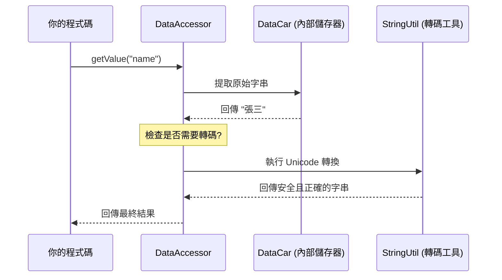

# Chapter 4: 資料存取抽象 (DataAccessor & SKDataAccessor)

在上一章 [安全過濾器 (XSSRequestWrapper)](03_安全過濾器__xssrequestwrapper__.md) 中，我們學習了如何確保輸入資料的純淨。現在，我們要處理開發中最常見的任務：**如何將這些資料存入資料庫，或者從資料庫拿出來使用？**

---

## 為什麼需要資料存取抽象？

在傳統的 Java 開發中，如果你有一個「使用者」資料表，你通常需要寫一個類別，裡面塞滿了這樣的程式碼：

```java
public class User {
    private String name;
    private String email;
    // 還有另外 20 個欄位...

    public String getName() { return name; }
    public void setName(String name) { this.name = name; }
    // 接下來是無窮無盡的 Getter 和 Setter...
}
```

**問題來了：** 如果資料庫增加了一個欄位，你就得回來改 Java 程式碼。如果系統有 100 張表，你就要寫 100 個這樣的類別。這簡直是開發者的噩夢！

本系統引入了 **DataAccessor**，它就像是一個**「萬用智慧容器」**。你不需要為每個欄位寫死程式碼，它能自動適應任何資料庫結構。

---

## 核心概念：萬用容器

`DataAccessor` 的核心思想是利用 `Hashtable` (一種鍵值對結構) 來存放資料。

1.  **動態存放**：欄位名是「鍵 (Key)」，資料是「值 (Value)」。
2.  **統一接口**：不管你是存員工資料還是訂單資料，都用同樣的方法取值。
3.  **自動轉碼**：它會在你讀取資料時，自動處理編碼問題（例如將特殊字元轉回 UTF-8）。

### 類比：智慧收納盒
想像 `DataAccessor` 是一個貼有標籤的收納盒。你不需要為「襪子」訂製一個盒子，再為「內衣」訂製另一個。你只需要把東西丟進去，並在外面貼上標籤。想拿東西時，說出標籤名字（如 `getValue("socks")`）就可以了。

---

## 如何使用 DataAccessor？

在專案中，你會看到許多實體類別（Model）都繼承自 `SKDataAccessor`（Single Key 版本的 DataAccessor）。

### 範例：操作語系資料
參考 `LangZone.java`，雖然它定義了一些常用的 Getter/Setter 以方便開發，但底層全是透過 `getValue` 和 `setValue` 運作的。

```java
// 取得語系代碼
public String getLangid() {
    return getValue("langid"); // 從內部的 Hashtable 拿資料
}

// 設定語系名稱
public void setLangnm(String i_val) {
    setValue("langnm", i_val); // 將資料存入 Hashtable
}
```
**解釋**：開發者呼叫 `getLangid()` 時，系統會自動去尋找資料庫中對應 `langid` 欄位的值。

---

## 內部的運作流程

當你呼叫 `getValue("name")` 時，系統內部發生了什麼？



---

## 深入底層實作

讓我們看看 `DataAccessor.java` 是如何處理這些邏輯的：

### 1. 統一的取值邏輯
這是最核心的方法，它處理了空值判斷與編碼轉換。

```java
public String getValue(String i_fn) {
    // 1. 從內部的 DataCar 取得原始資料
    String strReturn = dcData.getValue(i_fn, "0");
    
    // 2. 自動處理編碼轉換 (例如 UTF-8)
    if (isForceTransformUTF8()) {
        strReturn = new StringUtil().convertUnicodeField(strReturn);
    }
    return strReturn;
}
```
**解釋**：這段代碼確保了無論資料庫存的是什麼格式，你拿到的都會是正確的 Java 字串。

### 2. 靈活的空值控制
有時候資料庫需要 `null` 而不是空字串，`DataAccessor` 提供了開關：

```java
// 如果欄位不存在，是否回傳 null？
private boolean isReturnNullNoThisField = false;

public void setReturnNullNoThisField(boolean val) {
    this.isReturnNullNoThisField = val;
}
```
**解釋**：這讓 DAO 層（參考 [分層架構模式](01_分層架構模式__layering_pattern__action_bo_dao__.md)）在產生 SQL 指令時，能精確判斷哪些欄位不應該出現在 `UPDATE` 語句中。

---

## 批次處理：SKDataAccessorList

當我們從資料庫查出一整群資料（例如 10 筆訂單）時，我們會使用 `SKDataAccessorList`。

```java
// 檔案：SystemPicList.java
public class SystemPicList extends SKDataAccessorList {
    // 產生清單中的個別物件
    public DataAccessor genObj(Hashtable i_data) {
        return new SystemPic(i_data);
    }
}
```
**解釋**：這是一個容器的容器。它能幫你管理一整組的 `DataAccessor` 物件，讓你像操作陣列一樣方便。

---

## 本章小結

在本章中，我們學習了：
1.  **資料抽象化**：為什麼我們不再寫死 Getter/Setter。
2.  **DataAccessor**：一個基於 `Hashtable` 的萬用物件，能自動處理欄位存取與轉碼。
3.  **簡化開發**：透過 `getValue` 和 `setValue` 統一了所有資料庫實體的操作。

這種設計與 [核心工具模組 (FtcUtility)](08_核心工具模組__ftcutility__.md) 緊密結合，極大地提高了系統的擴充性。

下一章，我們將學習如何處理「填到一半的表單」——也就是系統的緩存機制：[暫存作業機制 (TempWork / ObjTemp)](05_暫存作業機制__tempwork___objtemp__.md)。

---

Generated by [AI Codebase Knowledge Builder](https://github.com/The-Pocket/Tutorial-Codebase-Knowledge)