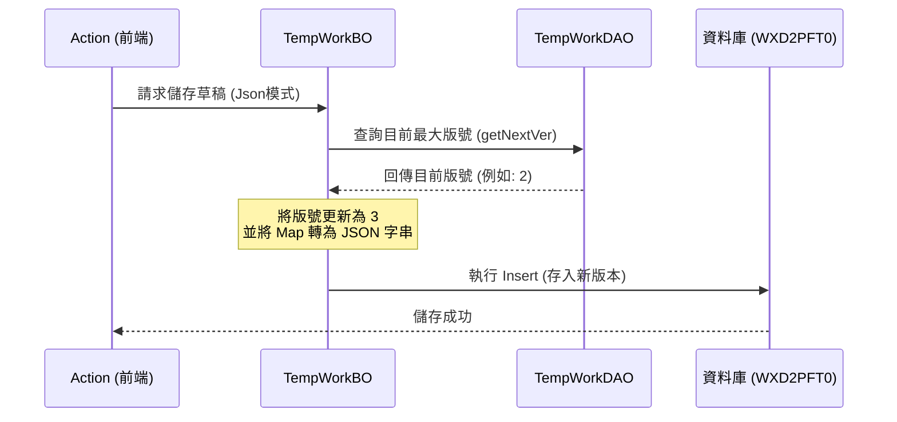

# Chapter 5: 暫存作業機制 (TempWork / ObjTemp)

在上一章 [資料存取抽象 (DataAccessor & SKDataAccessor)](04_資料存取抽象__dataaccessor___skdataaccessor__.md) 中，我們學習了如何讓 Java 物件與資料庫欄位進行靈活的對接。現在，我們要處理一個更貼近使用者需求的場景：**「如果內容還沒寫完，或者需要主管審核後才能發佈，該怎麼辦？」**

這就是 **暫存作業機制 (TempWork)** 發揮作用的地方。

---

## 為什麼需要暫存機制？

想像你正在維護一個電商網站的後台。管理員要新增一個非常複雜的產品資訊，包含規格、圖片、價格等。
*   **情境 A**：管理員寫到一半，電腦突然當機或斷網，如果不先存起來，剛才花一小時寫的東西就全沒了。
*   **情境 B**：公司規定，所有產品資訊必須經過經理審核後才能正式上架（即發佈到正式表）。

**暫存機制** 就像是辦公室裡的「待辦公文夾」。在文件正式歸檔（存入正式表）之前，我們先把它放在這個夾子裡。它支援：
1.  **草稿保存**：隨時存檔，下次繼續。
2.  **版本控制**：保留多次修改的紀錄（版號）。
3.  **格式彈性**：可以存成 JSON 字串或 BLOB 二進制檔案。

---

## 核心概念：ObjTemp 物件

系統中使用 `ObjTemp` 作為暫存資料的容器。它繼承自 [SKDataAccessor](04_資料存取抽象__dataaccessor___skdataaccessor__.md)，因此具備自動處理欄位的功能。

### 關鍵欄位說明：
*   **Tblnm (表名)**：這筆資料原本屬於哪張正式表（例如：產品表）。
*   **Objxuid (物件主鍵)**：這筆資料在正式表中的 ID。
*   **Ver (版號)**：這是第幾次的暫存版本。
*   **Type (類型)**：`J` 代表 JSON（適合簡單文字），`B` 代表 BLOB（適合複雜物件）。

---

## 如何使用暫存機制？

開發者通常透過 `TempWorkBO` 來操作暫存功能。我們來看幾個常見的範例。

### 範例 1：將資料存為 JSON 草稿
如果你有一組簡單的資料（存放於 Hashtable），想把它暫存起來：

```java
// 將資料存為 JSON 格式的暫存檔
// 參數：資料內容, 正式表名, 資料ID, 類別路徑, 使用者ID
tempWorkBO.saveObjTempWithJson(dataMap, "PRODUCT_TABLE", "P001", 
                               "com.model.Product", "USER_001");
```
**效果**：系統會自動將 `dataMap` 轉成 JSON 字串，存入 `WXD2PFT0` 暫存表中，並自動生成新的版號。

### 範例 2：取得最新的草稿
當使用者重新打開頁面，想要載入上次沒寫完的內容：

```java
// 取得 PRODUCT_TABLE 中 P001 物件最新的一筆暫存紀錄
ObjTemp lastDraft = tempWorkBO.getTheNewObjTemp("PRODUCT_TABLE", "P001");

// 取得存放在裡面的 JSON 內容
String jsonContent = lastDraft.getJson();
```
**解釋**：這讓你能夠輕鬆實現「自動回復草稿」的功能。

---

## 內部運作原理

當你呼叫 `saveObjTempWithJson` 時，系統內部的運作流程如下：



---

## 深入底層實作

讓我們看看 `TempWorkBOImpl.java` 是如何處理儲存邏輯的：

### 1. 自動版號管理
每次儲存時，系統都會自動計算下一個版號，這是在 `getNextVer` 私有方法中完成的：

```java
private String getNextVer(final ObjTemp i_obj) {
    // 透過 DAO 去資料庫找該物件目前最大的版號
    String strNextVer = getTempWorkDAO().selectObjTempNextVersion(i_obj);
    // 如果是空的就回傳 "0"，否則回傳下一個數字
    return strNextVer;
}
```
**解釋**：這確保了使用者的每一次「儲存」都不會覆蓋掉舊的紀錄，實現了簡單的版本控制。

### 2. 多樣化的儲存方式 (JSON vs BLOB)
系統提供了兩套方案。JSON 適合跨平台閱讀，而 BLOB 適合直接序列化 Java 物件：

```java
// JSON 模式：將 Map 轉為字串
JSONObject i_json = new JSONObject();
i_json.putAll(i_hashtable); 
i_obj.setJson(i_json.toJSONString());
i_obj.setType("J");

// BLOB 模式：直接存入二進制位元組 (byte[])
i_obj.setObjcont(i_objval);
i_obj.setType("B");
```
**解釋**：這讓暫存機制變得非常通用，無論是簡單的表單還是複雜的二進制檔案（如圖片暫存）都能處理。

---

## 本章小結

在本章中，我們學習了：
1.  **草稿系統**：利用 `ObjTemp` 機制實作內容的預存與審核準備。
2.  **版本控制**：系統自動管理版號，保留修改軌跡。
3.  **格式彈性**：支援 JSON 與 BLOB 兩種暫存方式。
4.  **解耦設計**：暫存表獨立於正式表，確保正式資料的純淨。

這種機制與 [分層架構模式 (Action/BO/DAO)](01_分層架構模式__layering_pattern__action_bo_dao__.md) 完美結合，讓業務邏輯在處理「發佈」流程時更加穩健。

下一章，我們將學習系統如何管理那些全域通用的設定值：[系統參數加載器 (System Parameter Loader)](06_系統參數加載器__system_parameter_loader__.md)。

---

Generated by [AI Codebase Knowledge Builder](https://github.com/The-Pocket/Tutorial-Codebase-Knowledge)