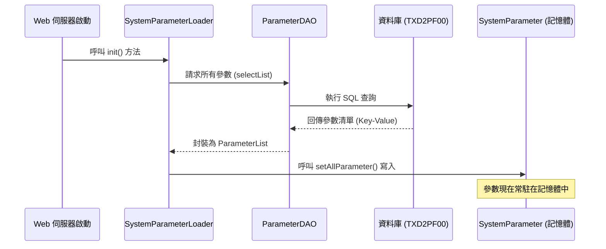

# Chapter 6: 系統參數加載器 (System Parameter Loader)

在上一章 [暫存作業機制 (TempWork / ObjTemp)](05_暫存作業機制__tempwork___objtemp__.md) 中，我們學習了如何處理使用者的草稿資料。現在，我們要切換到系統的「大腦」，學習它如何管理所有模組共用的全域設定值。

---

## 為什麼需要系統參數加載器？

想像你正在開發一個大型商城系統。系統中有很多資訊是每個頁面都會用到的：
*   **檔案路徑**：圖片要存放在哪個資料夾？
*   **郵件設定**：系統寄信時要連哪一台伺服器？
*   **語系預設值**：預設是繁體中文還是英文？

**如果不使用加載器：** 你可能得在每個程式檔裡寫死（Hard-code）路徑。一旦伺服器搬家，你就要修改幾百個檔案，這簡直是災難。

**使用加載器後：** 系統啟動時，會自動從資料庫讀取這些設定，並將它們「快取」在記憶體中。這就像是系統的**「設定中心」**，任何模組想知道路徑或設定，只要問它就行了。

---

## 核心概念：SystemParameter 與 Loader

這個機制由兩個主要部分組成：

1.  **SystemParameter (參數容器)**：這是一個靜態物件（Static Object），像是一個巨大的置物櫃，專門用來存放讀取進來的參數。
2.  **SystemParameterLoader (加載器)**：這是搬運工，負責在系統啟動的一瞬間，把資料庫裡的參數搬進「置物櫃」裡。

### 生活類比：飯店櫃檯
`SystemParameter` 就像是飯店櫃檯的「資訊手冊」，上面記載了早餐時間、泳池位置和接駁車班次。`Loader` 則是負責在飯店開門前，把這些資訊更新好並放在櫃檯的人。客人（其他模組）不需要去翻倉庫（資料庫），直接問櫃檯（SystemParameter）最快。

---

## 如何使用系統參數？

在程式碼中，你不需要實例化（New）它，直接透過靜態方法就能取得全域設定。

### 範例：取得圖片存取路徑
當你需要顯示產品圖片時，可以這樣寫：

```java
// 取得產品圖片的實體儲存路徑
String path = SystemParameter.getProductPicRealPath();

// 取得產品圖片的網頁參照路徑 (URL)
String url = SystemParameter.getProductPicRefPath();
```
**輸出結果**：`path` 可能會得到 `/nas/images/product/`，而你完全不需要知道這個路徑是從哪張資料表讀出來的。

---

## 內部運作原理

加載器是在系統啟動時（通常透過 Spring 容器初始化）執行的。

### 初始化流程圖



---

## 深入底層實作

讓我們看看 `SystemParameterLoaderImpl.java` 是如何完成這項任務的：

### 1. 啟動與基礎設定
在 `init()` 方法中，系統會先設定一些最基礎的環境變數。

```java
// 檔案：SystemParameterLoaderImpl.java
public void init() throws Exception {
    // 1. 設定 LOG 存放路徑
    Log.setLogPath(getServletContext().getRealPath("/log"));
    
    // 2. 取得 Servlet 的真實路徑
    SystemParameter.setServletRealPath(getServletContext().getRealPath("/"));
    
    // 3. 準備從資料庫讀取參數 (接續下一步)
}
```
**解釋**：這裡利用了 `ServletContext` 來取得網頁程式在伺服器上的實際位置。

### 2. 從資料庫搬運參數
接下來，加載器會利用 [分層架構模式](01_分層架構模式__layering_pattern__action_bo_dao__.md) 中提到的 DAO 層來抓取資料。

```java
// 取得資料庫中全部的參數清單
Parameter key = new Parameter();
List list = getParameterDAO().selectListBySelective(key);

// 將 List 轉為專用的 ParameterList 格式
ParameterList parameterList = new ParameterList();
parameterList.addAll(list);

// 一口氣塞進 SystemParameter 容器中
SystemParameter.setAllParameter(parameterList);
```
**解釋**：這段代碼體現了「一次讀取，多次使用」的原則。讀取後，就不再頻繁存取資料庫。

### 3. 分類存放與轉換
在 `SystemParameter.java` 內部，這些資料會被分門別類地存放在對應的變數中：

```java
// 檔案：SystemParameter.java
public static void setAllParameter(ParameterList parameterList) {
    // 從清單中找出名為 "mail_server" 的參數並存入變數
    mailServer = parameterList.getParameter("mail_server").getParaval();
    
    // 自動處理特殊邏輯：將 http 轉為 https
    mallDomainHttps = getMallDomain().replaceAll("http:", "https:");
}
```
**解釋**：這讓開發者在調用 `getMailServer()` 時，拿到的是乾淨的字串，而不是複雜的 [DataAccessor](04_資料存取抽象__dataaccessor___skdataaccessor__.md) 物件。

---

## 本章小結

在本章中，我們學習了：
1.  **全域設定中心**：為什麼不應該在程式碼中寫死路徑與設定。
2.  **SystemParameter**：作為參數的靜態容器，提供快速存取。
3.  **自動化載入**：系統啟動時自動同步資料庫與記憶體的設定。
4.  **環境適應**：加載器會根據不同的伺服器環境自動調整路徑。

掌握了系統參數後，我們就能確保系統在不同環境下都能正確運行。下一章，我們將探討如何讓系統支援多國語言：[多語系區域管理 (LangZone)](07_多語系區域管理__langzone__.md)。

---

Generated by [AI Codebase Knowledge Builder](https://github.com/The-Pocket/Tutorial-Codebase-Knowledge)