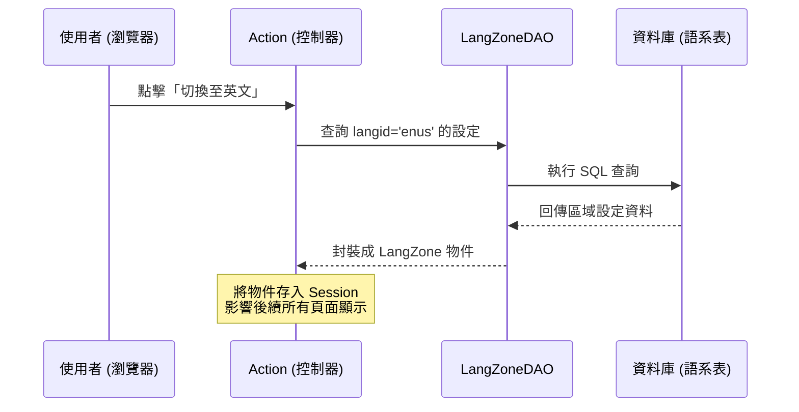

# Chapter 7: 多語系區域管理 (LangZone)

在上一章 [系統參數加載器 (System Parameter Loader)](06_系統參數加載器__system_parameter_loader__.md) 中，我們學習了如何管理全域的系統設定。現在，我們要讓系統具備「國際化」的視野，學習如何透過 **LangZone (多語系區域管理)** 讓應用程式服務全球不同地區的使用者。

---

## 為什麼需要多語系區域管理？

想像你經營一家跨國電商。
*   **台灣使用者**進來，他希望看到繁體中文，且商品價格以台幣 (TWD) 顯示。
*   **美國使用者**進來，他希望看到英文，且價格以美金 (USD) 顯示。

如果你的系統只寫死了一種語言或貨幣，你將失去全球市場。**LangZone** 的作用就是定義一個「區域（Zone）」，這個區域綁定了特定的**語系代碼**與**貨幣資訊**。它是系統切換顯示邏輯、過濾特定地區資料的核心基礎。

---

## 核心概念：LangZone 物件

在專案中，`LangZone` 物件就像是一張「地區身分證」，記錄了該區域的所有特徵。

### 關鍵屬性說明：
1.  **Langid (語系代號)**：例如 `zhtw` (繁中)、`enus` (美英)。
2.  **Cucyid (貨幣代碼)**：例如 `TWD`、`USD`。
3.  **Zone (區域代碼)**：定義該資料屬於哪個特定的地理或業務區域。
4.  **Url / Sslurl**：該語系對應的專屬網址。

### 生活類比：電視頻道的語言切換
當你切換電視頻道時，遙控器（LangZone 機制）會告訴電視：
*   現在是「台灣台」：請載入中文字幕，顯示台灣時間。
*   現在是「美國台」：請載入英文字幕，顯示紐約時間。

---

## 如何使用 LangZone？

`LangZone` 繼承自 [資料存取抽象 (DataAccessor & SKDataAccessor)](04_資料存取抽象__dataaccessor___skdataaccessor__.md)，因此你可以輕鬆地存取其屬性。

### 範例 1：定義常用語系常數
在 `LangZone.java` 中，系統預定義了幾種標準語系，方便程式碼中直接引用：

```java
// 檔案：LangZone.java
public static final String LANG_ENUS = "enus"; // 美國英文
public static final String LANG_ZHTW = "zhtw"; // 繁體中文
public static final String LANG_ZHCN = "zhcn"; // 簡體中文
```
**解釋**：使用常數可以避免在程式碼中到處寫死字串，減少打錯字的風險。

### 範例 2：獲取區域資訊
當你從資料庫取得一個 `LangZone` 物件後，可以這樣讀取資訊：

```java
// 取得語系名稱（例如：繁體中文）
String name = langZone.getLangnm();

// 取得該區域使用的貨幣（例如：TWD）
String currency = langZone.getCucyid();
```
**解釋**：這些資訊會影響前端頁面顯示哪種語言的標籤，以及商品價格後面的貨幣單位。

---

## 內部運作原理

系統通常會在使用者登入或切換語系時，從資料庫查詢對應的 `LangZone` 資訊。

### 語系切換流程圖



---

## 深入底層實作

### 1. 資料存取介面 (DAO)
系統透過 `LangZoneDAO.java` 來與資料庫溝通。這是一個典型的 DAO 介面（參考 [分層架構模式](01_分層架構模式__layering_pattern__action_bo_dao__.md)）。

```java
// 檔案：LangZoneDAO.java
public interface LangZoneDAO {
    // 根據主鍵 (xuid) 取得特定的語系區域設定
    LangZone selectByPrimaryKey(String xuid);

    // 根據條件（如 langid）查詢符合的語系清單
    List selectListBySelective(LangZone key);
}
```
**解釋**：這讓系統可以靈活地根據使用者的瀏覽器設定或手動選擇，找到對應的配置。

### 2. 批量管理：LangZoneList
當系統需要顯示「語言切換選單」時，會用到 `LangZoneList.java`。

```java
// 檔案：LangZoneList.java
public class LangZoneList extends SKDataAccessorList {
    // 將資料庫回傳的每一筆資料轉換為 LangZone 物件
    public DataAccessor genObj(Hashtable i_data) {
        return new LangZone(i_data);
    }
}
```
**解釋**：`LangZoneList` 繼承自 `SKDataAccessorList`，它能將多筆語系資料整合成一個方便操作的清單。

---

## 對系統的其他影響

LangZone 不僅僅是改變文字，它還會影響：
*   **資料過濾**：在查詢商品時，系統會自動帶入 `Zone` 參數，確保台灣使用者不會看到僅限美國販售的商品。
*   **URL 跳轉**：根據 `LangZone` 中的 `url` 設定，將使用者引導至正確的語系分站。
*   **日期與數字格式**：雖然基礎邏輯在 [核心工具模組 (FtcUtility)](08_核心工具模組__ftcutility__.md)，但格式的選擇往往依賴於目前的 `LangZone`。

---

## 本章小結

在本章中，我們學習了：
1.  **LangZone 的重要性**：它是系統達成全球化（i18n）與在地化（L10n）的基礎。
2.  **區域綁定**：一個 Zone 同時包含了語系、貨幣與專屬網址。
3.  **自動化物件**：透過 `LangZone` 物件，開發者可以輕鬆獲取目前環境的語系資訊。
4.  **連動效能**：語系設定會影響資料查詢的過濾條件。

掌握了多語系管理後，你已經具備開發國際化應用的能力。下一章，也是本系列教程的最後一章，我們將介紹系統中最強大的瑞士刀：[核心工具模組 (FtcUtility)](08_核心工具模組__ftcutility__.md)。

---

Generated by [AI Codebase Knowledge Builder](https://github.com/The-Pocket/Tutorial-Codebase-Knowledge)