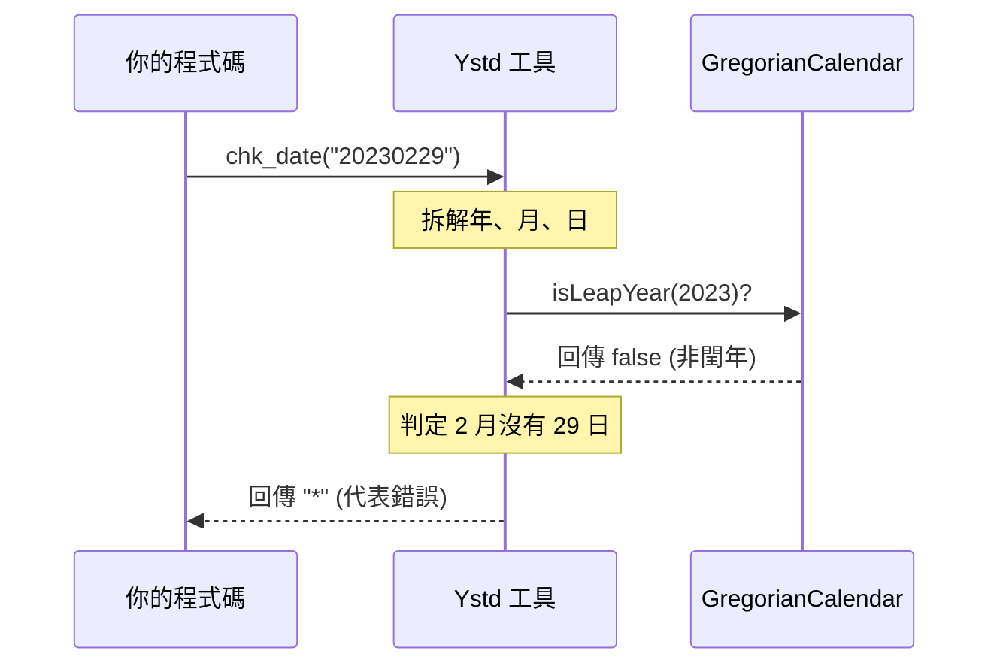

# Chapter 8: 核心工具模組 (FtcUtility)

在上一章 [多語系區域管理 (LangZone)](07_多語系區域管理__langzone__.md) 中，我們學習了如何讓系統具備國際化的視野。現在，我們要進入本教程的最後一站，介紹開發者的「瑞士刀」—— **核心工具模組 (FtcUtility)**。

---

## 為什麼需要核心工具模組？

想像你正在修理一台腳踏車，你需要螺絲起子；隔天你要組裝家具，你也需要螺絲起子。如果你每次都要從頭打造一把螺絲起子，那效率實在太低了。

在軟體開發中，有些動作會重複出現成千上萬次，例如：
*   把「20231225」變成「2023/12/25」。
*   檢查一個字串是不是空的。
*   把一封電子郵件寄給客戶。

**核心工具模組 (FtcUtility)** 就是系統的「工具箱」。它把這些高頻率使用的邏輯封裝成簡單的「靜態方法」。你不需要知道內部複雜的演算法，只需要呼叫它，就能得到結果。這不僅減少了重複代碼，也確保了全系統處理邏輯的一致性。

---

## 核心概念：四大工具金剛

這個模組主要由四個核心類別組成，每個類別負責一類特定的任務：

1.  **Ystd (日期大師)**：處理所有與時間、日期相關的運算與檢查。
2.  **StringUtil (字串專家)**：負責字串處理、加密、遮罩與格式轉換。
3.  **FileUtil (檔案管家)**：處理檔案讀寫、內容替換。
4.  **Mailer (郵件信使)**：負責將系統訊息發送到使用者的電子信箱。

---

## 如何使用這些工具？

這些工具最棒的地方在於：**你不需要 `new` 它們**（大部分情況下）。它們就像是路邊的公用電話，拿起就能用。

### 範例 1：日期運算 (Ystd)
假設你想知道「今天加 10 天」是哪一天：

```java
Ystd ystd = new Ystd();
// 取得今天日期 (格式 YYYYMMDD)
String today = ystd.udate(); 
// 加上 10 天
String futureDate = ystd.add_days(today, 10);
```
**輸出結果**：如果今天是 `20231001`，`futureDate` 就會是 `20231011`。它會自動幫你處理閏年和大、小月的問題。

### 範例 2：字串遮罩 (StringUtil)
為了保護個資，我們常需要把名字中間變星號：

```java
StringUtil sUtil = new StringUtil();
// 將 "張三豐" 的第 2 個字變成 "*"
String masked = sUtil.getMaskString("張三豐", 1, 1, "*");
```
**輸出結果**：`masked` 會變成 `張*豐`。這在處理信用卡號或手機號碼時非常有用。

### 範例 3：發送郵件 (Mailer)
當系統發生異常需要通知管理員時：

```java
Mailer mailer = new Mailer();
// 參數：主機, 寄件者, 收件者, 主旨, 內容
mailer.sendMail("smtp.fpg.com", "sys@fpg.com", "admin@fpg.com", 
                "系統告警", "資料庫連線超時！");
```
**效果**：系統會自動透過 SMTP 伺服器將告警郵件送出。

---

## 內部運作原理

這些工具類別通常是「無狀態」的，它們接收輸入，處理後立即回傳。以 `Ystd` 的日期檢查為例：



---

## 深入底層實作：StringUtil 的智慧

讓我們看看 `StringUtil.java` 是如何處理常見的「金額格式化」的。它結合了 Java 的 `BigDecimal` 與 `DecimalFormat`：

```java
// 檔案：StringUtil.java (簡化版)
public String rpad(String i_source, int i_len, char i_char) {
    StringBuffer strbTmp = new StringBuffer(i_source);
    // 計算還差多少長度，並用指定字元補齊
    int intOffset = i_len - i_source.length();
    for (int i = 0; i < intOffset; i++) {
        strbTmp.append(i_char);
    }
    return strbTmp.toString();
}
```
**解釋**：`rpad` 代表 Right Pad。如果你需要把「123」補足成 5 位數，變成「12300」，呼叫 `rpad("123", 5, '0')` 即可。

再看看它如何產生系統唯一 ID (XUID)，這在 [暫存作業機制 (TempWork / ObjTemp)](05_暫存作業機制__tempwork___objtemp__.md) 中被廣泛使用：

```java
// 檔案：StringUtil.java
public static String genXUID() {
    // 1. 取得目前精確到毫秒的時間字串
    String strNow = Ystd.utime4(); 
    long longNow = Long.parseLong(strNow);
    // 2. 轉換為 36 進位字串，縮短長度並保持唯一性
    return to36CarryString(longNow);
}
```
**解釋**：這確保了即便在一秒內產生多筆資料，它們的 ID 也不會重複。

---

## 工具箱與其他模組的關係

`FtcUtility` 是整個專案的底層基石：
*   **DAO 層**：使用 `StringUtil` 處理 SQL 語句中的特殊字元。
*   **BO 層**：使用 `Ystd` 計算業務邏輯中的到期日或排程。
*   **Action 層**：使用 `Mailer` 發送通知給使用者。
*   **系統核心**：[資料存取抽象 (DataAccessor & SKDataAccessor)](04_資料存取抽象__dataaccessor___skdataaccessor__.md) 依賴 `StringUtil` 進行自動轉碼。

---

## 本章小結

在本章中，我們學習了：
1.  **工具模組的價值**：封裝常用邏輯，提高開發效率。
2.  **Ystd**：日期處理的專家。
3.  **StringUtil**：字串處理與簡單加密的利器。
4.  **Mailer & FileUtil**：處理外部通訊與檔案操作。
5.  **靜態呼叫**：大多數工具方法可以直接呼叫，不需要複雜的初始化。

恭喜你！你已經完成了《code_to_analyze 開發指南》的所有章節。從最底層的 [分層架構模式 (Action/BO/DAO)](01_分層架構模式__layering_pattern__action_bo_dao__.md) 到現在的核心工具箱，你已經掌握了開發與維護本系統所需的全部核心知識。

現在，你可以放心地打開程式碼，開始你的開發旅程了！加油！

---

Generated by [AI Codebase Knowledge Builder](https://github.com/The-Pocket/Tutorial-Codebase-Knowledge)