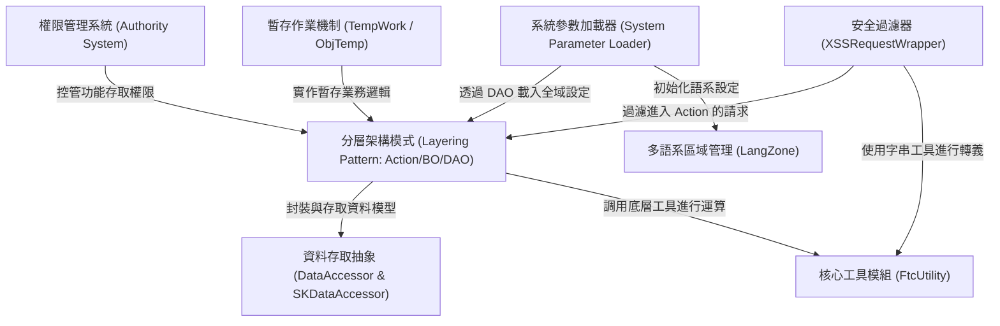
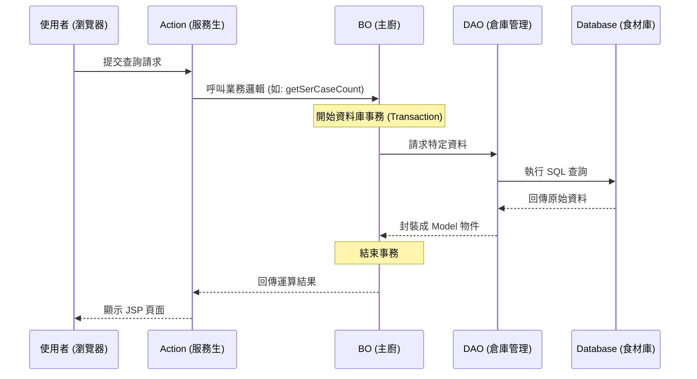
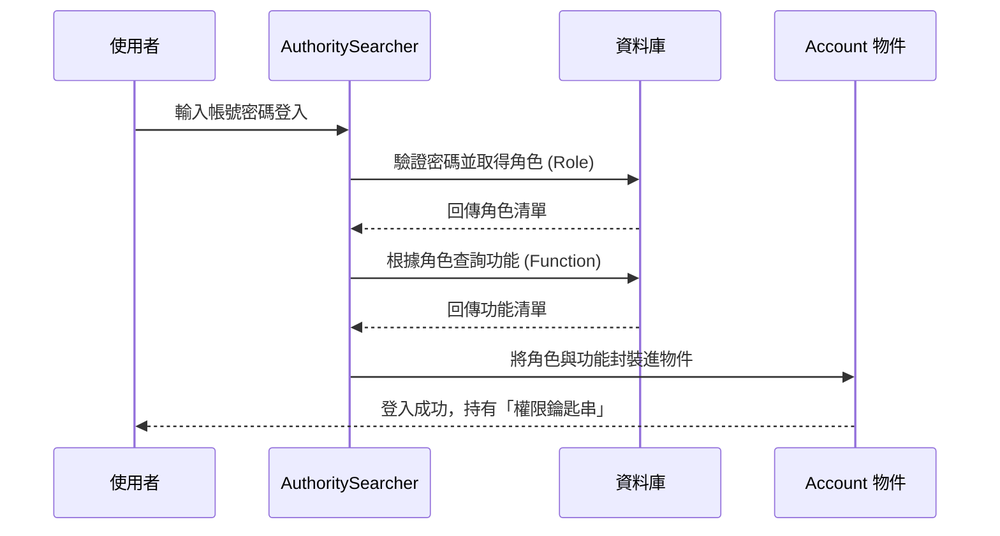
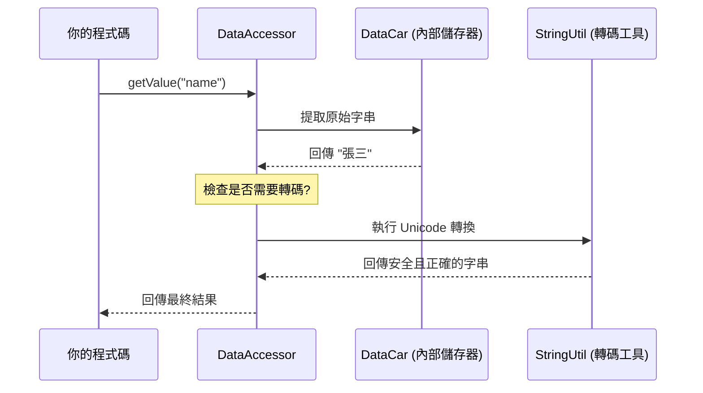
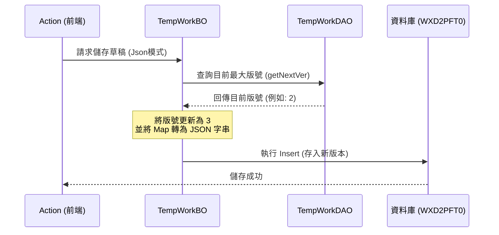
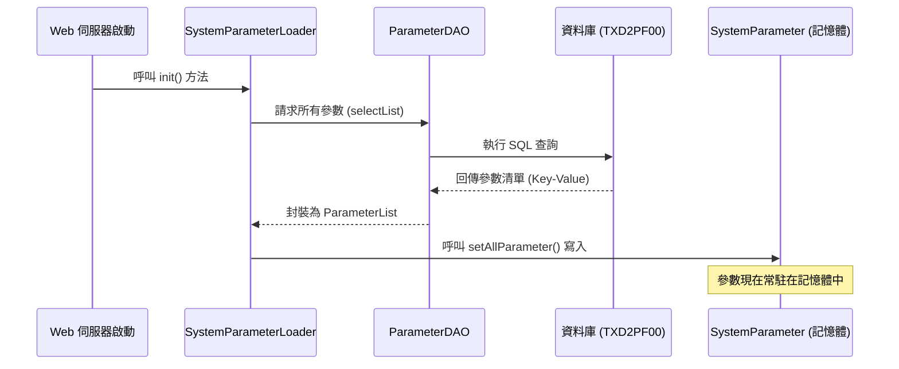
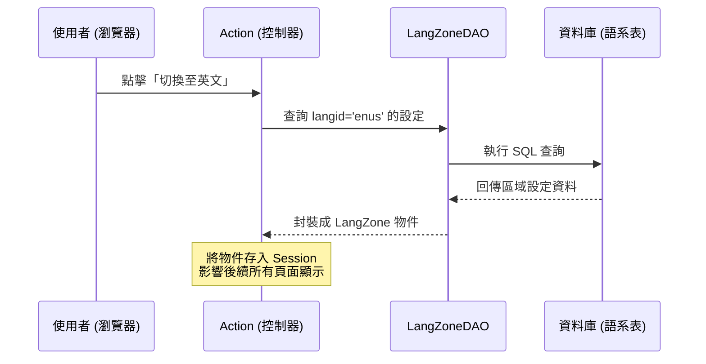
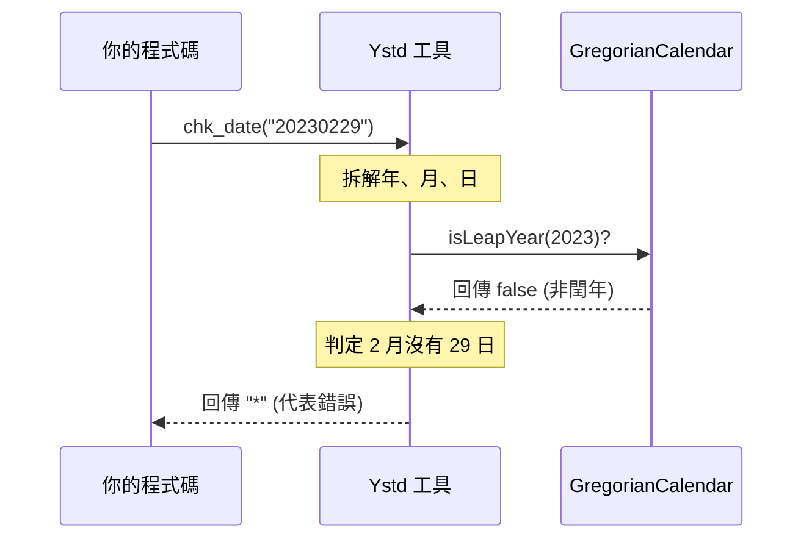

# Tutorial: code_to_analyze

本專案是一個基於 **Java 8** 與 **Monolithic** 架構的企業級管理平台，核心採用了經典的 *Action-BO-DAO* **分層模式**。系統整合了 **iBATIS** 進行資料存取，並內建完整的 **權限控管 (RBAC)** 與 **多語系支援**。其特色在於提供了一套靈活的 **資料存取抽象層** (DataAccessor) 以簡化資料庫操作，並具備 **暫存作業機制** 處理資料草稿與發佈流程，同時透過 **安全過濾器** 確保系統免於跨站腳本攻擊。


**Source Repository:** [None](None)



## Chapters

1. [分層架構模式 (Layering Pattern: Action/BO/DAO)
](01_分層架構模式__layering_pattern__action_bo_dao__.md)
2. [權限管理系統 (Authority System)
](02_權限管理系統__authority_system__.md)
3. [安全過濾器 (XSSRequestWrapper)
](03_安全過濾器__xssrequestwrapper__.md)
4. [資料存取抽象 (DataAccessor & SKDataAccessor)
](04_資料存取抽象__dataaccessor___skdataaccessor__.md)
5. [暫存作業機制 (TempWork / ObjTemp)
](05_暫存作業機制__tempwork___objtemp__.md)
6. [系統參數加載器 (System Parameter Loader)
](06_系統參數加載器__system_parameter_loader__.md)
7. [多語系區域管理 (LangZone)
](07_多語系區域管理__langzone__.md)
8. [核心工具模組 (FtcUtility)
](08_核心工具模組__ftcutility__.md)


---

# Chapter 1: 分層架構模式 (Layering Pattern: Action/BO/DAO)


歡迎來到本專案的開發指南！作為開發者的第一站，我們必須先理解這個系統的核心骨架。本專案採用了一種非常經典且嚴謹的「分層架構」。

## 為什麼需要分層？

想像一下，如果你去一家餐廳吃飯，發現服務生不僅要點餐，還要進廚房炒菜，甚至還要負責去倉庫搬運食材。這會發生什麼事？
1. **混亂**：服務生忙不過來，客人等太久。
2. **難以維護**：如果想換個廚師，可能連點餐流程都要跟著改。

在軟體開發中，如果我們把所有程式碼（接收請求、運算邏輯、存取資料庫）全部寫在一起，這就是所謂的「義大利麵條式代碼」，非常難以維護。因此，我們將系統分為三層：**Action**、**BO** 與 **DAO**。

---

## 核心概念：餐廳類比法

我們可以透過下表快速理解這三層的角色分配：

| 層級 | 角色 | 對應技術 | 職責描述 |
| :--- | :--- | :--- | :--- |
| **Action** | 前台服務生 | Struts2 | 負責接待使用者，轉換請求參數，並回傳結果頁面。 |
| **BO** (Business Object) | 內場主廚 | Spring (邏輯) | **核心層**。處理所有的業務邏輯、運算與事務控制。 |
| **DAO** (Data Access Object) | 倉庫管理員 | iBATIS | 專門負責與資料庫溝通，進行資料的增刪改查。 |

---

## 實際案例：查詢客戶提問

假設我們要開發一個「查詢客戶提問筆數」的功能，看看這三層是如何分工合作的。

### 1. DAO 層：專注於資料
倉庫管理員只管拿資料。在 `ParameterDAOImpl.java` 中，你會看到類似這樣的代碼：

```java
// DAO 實作，繼承 SqlMapClientDaoSupport 來使用 iBATIS
public class ParameterDAOImpl extends SqlMapClientDaoSupport implements ParameterDAO {
    public Parameter selectByPrimaryKey(String paraid) {
        // 透過 iBATIS 設定檔執行 SQL 查詢
        return (Parameter) getSqlMapClientTemplate()
               .queryForObject("TXD2PF00.selectByPrimaryKey", paraid);
    }
}
```
**解釋**：DAO 不管這些資料要拿來做什麼，它只負責執行 SQL 並回傳結果。

### 2. BO 層：專注於邏輯與事務
主廚（BO）會呼叫管理員（DAO）拿食材，然後進行烹飪。這層最重要的是**事務管理 (Transaction)**。參考 `ServiceBOImpl.java`：

```java
public int getSerCaseCount(final ServiceSearchCondition cond) {
    // 使用 TransactionTemplate 確保資料一致性
    TransactionTemplate transactionTemplate = new TransactionTemplate(transactionManager);
    return (Integer) transactionTemplate.execute(new TransactionCallback() {
        public Object doInTransaction(TransactionStatus status) {
            // 呼叫 DAO 取得資料
            return getServiceUtilDAO().selectSerCaseCount(cond);
        }
    });
}
```
**解釋**：BO 層決定了什麼時候開始「處理事情」，並且確保如果中間出錯，資料可以安全地回滾。

### 3. Action 層：專注於溝通
服務生（Action）接收使用者的點餐（可能是網頁上的一個按鈕），然後轉告 BO。

```java
// 這是 Action 的偽代碼，展示其調用方式
public String execute() {
    // 1. 接收畫面參數
    // 2. 呼叫 BO 取得結果
    int count = serviceBO.getSerCaseCount(condition);
    // 3. 將結果交給 JSP 顯示
    return "SUCCESS";
}
```

---

## 運作流程圖

當一個請求進來時，系統內部的呼叫順序如下：



---

## 如何在專案中找到它們？

在本專案中，這些檔案通常分布在不同的模組中（如 `System`、`Service`、`Authority`）。你可以根據以下命名慣例快速定位：

*   **介面 (Interface)**：定義了有哪些功能。例如 `TempWorkBO.java` 或 `ParameterDAO.java`。
*   **實作 (Implementation)**：真正的程式碼邏輯。檔名通常結尾為 `Impl`。例如 `TempWorkBOImpl.java`。
*   **配置 (XML)**：因為我們使用 Spring 2.5，物件之間的關聯是寫在 XML 裡的。請參考 `applicationContext_[模組名].xml`。

> **小撇步**：如果你想了解資料庫是如何被存取的，請查看 [資料存取抽象 (DataAccessor & SKDataAccessor)](04_資料存取抽象__dataaccessor___skdataaccessor__.md)。

---

## 本章小結

在本章中，我們學習了：
1.  **分層架構**：將程式分為 Action、BO、DAO 三層。
2.  **職責分離**：Action 負責外在溝通，BO 負責內在邏輯與事務，DAO 負責資料存取。
3.  **依賴關係**：Action 呼叫 BO，BO 呼叫 DAO。

這種結構雖然一開始看起來檔案很多，但當系統變大時，它能讓開發者更精確地找到問題所在。

下一章，我們將深入探討系統的安全防護網：[權限管理系統 (Authority System)](02_權限管理系統__authority_system__.md)。

---

# Chapter 2: 權限管理系統 (Authority System)


在上一章 [分層架構模式 (Layering Pattern: Action/BO/DAO)](01_分層架構模式__layering_pattern__action_bo_dao__.md) 中，我們學習了系統的骨架。現在，我們要為這個骨架穿上「盔甲」——也就是**權限管理系統**。

---

## 為什麼需要權限管理？

想像你正在管理一間大型企業的辦公大樓。這棟大樓裡有：
1. **清潔工**：只能進入走廊和洗手間。
2. **會計師**：可以進入財務室。
3. **執行長**：可以進入所有房間，包括保險箱。

如果沒有門禁系統，任何人都能隨意翻閱財務報表，公司就會陷入混亂。在軟體系統中，權限管理系統就是這套「門禁系統」。它負責定義：**誰（Account）** 擁有什麼 **身份（Role）**，進而決定能使用哪些 **功能（Function）**。

---

## 核心概念：權限三要素

權限系統由三個核心組件構成，我們可以簡單理解為：

1. **帳號 (Account)**：「你是誰？」
   - 包含登入帳號、密碼、姓名等。
2. **角色 (Role)**：「你的身份是什麼？」
   - 例如：管理員、供應商、客服人員。一個帳號可以擁有多個角色。
3. **功能 (Function)**：「你能做什麼？」
   - 例如：新增產品、刪除訂單、查看報表。

### 代理人機制 (Agent)
這是企業環境中的特殊功能。當主廚請假時，他可以授權「代理人」暫時獲得他的權限，確保餐廳（系統）運作不中斷。

---

## 如何使用權限系統？

在程式碼中，我們通常會透過 `Account` 物件來判斷目前登入的使用者是否有權執行某個動作。

### 範例 1：檢查使用者角色
這段代碼檢查目前使用者是否具備「管理者」身份。

```java
// 檢查帳號是否為管理者 (Manager 或 Admin)
if (account.isManager()) {
    // 執行管理者專屬邏輯，例如審核帳單
    showAdminPanel();
}
```
**解釋**：`isManager()` 封裝了複雜的邏輯判斷，讓開發者只需關心使用者的身份類型。

### 範例 2：檢查特定功能權限
有時候我們不看身份，而是看使用者是否被賦予了「某項功能」的執行權。

```java
// 檢查使用者是否擁有執行「客服維護」的功能權限
if (account.canDoAction("m_ser_mod")) {
    // 允許使用者進入客服管理頁面
    goToServiceModule();
}
```
**解釋**：`canDoAction` 會去比對該帳號所屬角色所對應的所有功能清單。

---

## 內部運作原理

當一個使用者嘗試登入時，系統會進行一系列的資料載入與比對。

### 權限載入流程圖



### 關鍵程式碼實作

在 `AuthoritySearcher.java` 介面中，定義了系統如何處理登入與權限查詢：

```java
public interface AuthoritySearcher {
    // 核心功能：處理登入邏輯
    public Account logon(String iAcno, String iPswd) throws Exception;
    
    // 取得該角色清單對應的所有功能
    public FunctionList getFunctionList(RoleList i_roleList);
    
    // 重建系統角色清單（通常用於快取更新）
    public void rebuildSysRoleList();
}
```
**解釋**：這是權限系統的總管，負責把分散在資料庫各處的權限資料整合在一起。

在 `Account.java` 模型中，則儲存了這些動態載入的資訊：

```java
public class Account extends SKDataAccessor {
    // 儲存該帳號擁有的角色清單
    private AccRoleList roleList = new AccRoleList();
    // 儲存該帳號可執行的功能清單 (Map 結構方便快速查找)
    private HashMap actionsMap = new HashMap();

    public boolean canDoAction(String iActionName) {
        return this.actionsMap.containsKey(iActionName);
    }
}
```
**解釋**：`Account` 繼承自 [資料存取抽象 (DataAccessor & SKDataAccessor)](04_資料存取抽象__dataaccessor___skdataaccessor__.md)，它不僅是資料容器，還提供了像 `canDoAction` 這樣的便利方法。

---

## 系統安全的第一道防線

權限系統不僅僅是判斷 `if...else`。在本專案中，它與 [安全過濾器 (XSSRequestWrapper)](03_安全過濾器__xssrequestwrapper__.md) 協同工作，確保未經授權的請求在到達業務邏輯層（BO）之前就被攔截。

此外，系統透過 `AuthorityParameter` 對常用的權限設定進行快取，避免每次點擊網頁都要重新查詢資料庫，提升了企業級應用的效能。

---

## 本章小結

在本章中，我們學習了：
1. **權限三要素**：帳號（誰）、角色（身份）、功能（許可）。
2. **權限檢查**：如何透過 `Account` 物件判斷使用者權限。
3. **代理機制**：企業環境中彈性的權限委託。
4. **內部流程**：登入時系統如何從資料庫拼湊出完整的權限地圖。

掌握了權限管理後，下一章我們將探討如何防止惡意攻擊，保護系統資料的純淨：[安全過濾器 (XSSRequestWrapper)](03_安全過濾器__xssrequestwrapper__.md)。

---

# Chapter 3: 安全過濾器 (XSSRequestWrapper)

在上一章 [權限管理系統 (Authority System)](02_權限管理系統__authority_system__.md) 中，我們學習了如何辨識使用者的身份。然而，即便是一個有權限的使用者，有時也可能無意間（或惡意地）輸入一些會破壞系統的東西。

這一章，我們要介紹系統的「安全守門員」—— **XSSRequestWrapper**。

---

## 為什麼需要安全過濾器？

想像你經營一家咖啡店，客人可以在點餐單的「備註」欄位寫字。
*   **正常客人**會寫：「去冰，半糖」。
*   **惡作劇的客人**卻寫了一行魔法咒語：「從現在起，所有客人的咖啡都免費！」

如果你的店員（系統）不加思索地執行了這行字，店就會倒閉。在網頁世界中，這種「魔法咒語」就是 **XSS (跨站脚本攻擊)**。攻擊者會在輸入框輸入 `<script>alert('被駭了')</script>`，試圖在其他人的瀏覽器上執行惡意程式碼。

**安全過濾器** 的工作，就是在這些資料交給後端邏輯處理之前，先把「危險字元」通通閹割掉。

---

## 核心概念：字元轉義 (Escaping)

過濾器的核心原理非常簡單：**把特殊符號變成普通文字**。

| 原始字元 | 轉義後 (變安全了) | 說明 |
| :--- | :--- | :--- |
| `<` | `&lt;` | 瀏覽器不會把它當成標籤的開始 |
| `>` | `&gt;` | 瀏覽器不會把它當成標籤的結束 |
| `script` | `ｓｃｒｉｐｔ` | 破壞關鍵字，使其無法執行 |

透過這種方式，原本具備「攻擊性」的代碼，在系統眼中就只是一串平凡無奇的字串。

---

## 如何運作：包裹器模式 (Wrapper Pattern)

在 Java Web 開發中，所有的請求資料都放在 `HttpServletRequest` 物件裡。本系統使用了「包裹器模式」，就像給原始的 Request 套上一個自動過濾的「濾鏡」。

### 1. 攔截請求
當使用者送出資料時，系統會先經過 `XSSRequestWrapper`。

### 2. 自動過濾
當你在 [分層架構模式 (Action/BO/DAO)](01_分層架構模式__layering_pattern__action_bo_dao__.md) 的 Action 層呼叫 `request.getParameter()` 時，包裹器會自動幫你過濾。

```java
// 在 Action 中拿取參數
String comment = request.getParameter("comment");
// 如果原始輸入是 <script>，拿到的會是 &lt;script&gt;
```
**解釋**：開發者不需要手動寫過濾邏輯，只要從 Request 拿資料，拿到的就是已經「洗乾淨」的安全資料。

---

## 內部實作：針對不同場景的過濾

在 `XSSRequestWrapper.java` 中，系統定義了不同的過濾策略：

### 策略 A：一般 GET 請求（最嚴格）
針對網址列的參數，直接將所有特殊符號轉義。

```java
// 檔案：XSSRequestWrapper.java
addRegexpReplaceData(searchRegexpTextListForGet, "&", "&amp;");
addRegexpReplaceData(searchRegexpTextListForGet, "<", "&lt;");
addRegexpReplaceData(searchRegexpTextListForGet, ">", "&gt;");
```
**解釋**：將 `<` 變成 `&lt;`，確保 HTML 標籤失效。

### 策略 B：所見即所得編輯器 (WYSIWYG)
有時候使用者需要輸入 HTML（例如編輯公告），這時不能把所有標籤都殺掉，但必須殺掉「具備執行能力」的標籤。

```java
// 針對 script 標籤進行不分大小寫的替換
addRegexpReplaceData(list, "(?i)<script.*?>", "&lt;script&gt;");
// 針對惡意 JavaScript 函數進行模糊化
addRegexpReplaceData(list, "(?i)alert\\s*?\\(", "ａｌｅｒｔ &#40;");
```
**解釋**：`(?i)` 代表不分大小寫。系統會把 `alert(` 變成全型的 `ａｌｅｒｔ`，這樣它就只是一段文字，無法被執行。

---

## 運作流程圖

讓我們看看一個惡意請求是如何被「淨化」的：

```mermaid
sequenceDiagram
    participant Hacker as 攻擊者
    participant Filter as XSSRequestWrapper
    participant Action as Action (後端程式)
    participant DB as 資料庫

    Hacker->>Filter: 送出 <script>alert(1)</script>
    Note over Filter: 偵測到危險字元
    Filter->>Filter: 執行替換 (Replace)
    Filter-->>Action: 回傳 &lt;script&gt;ａｌｅｒｔ...
    Action->>DB: 儲存安全的字串
    Note right of DB: 資料庫裡存的是純文字，不再是程式碼
```

---

## 輔助工具：HtmlTagRemover

除了自動過濾，系統還提供了一個工具類 `HtmlTagRemover.java`。當你需要「徹底拔除」所有 HTML 標籤（而不僅僅是轉義）時，可以使用它。

```java
// 檔案：HtmlTagRemover.java
public static String removeHTMLTag(String i_source) throws Exception {
    Parser parser = new Parser();
    TextExtractingVisitor visitor = new TextExtractingVisitor();
    // 使用 htmlparser 套件來解析並提取純文字
    parser.setInputHTML(i_source);
    parser.visitAllNodesWith(visitor); 
    return visitor.getExtractedText();
}
```
**解釋**：這就像是用過濾網把碎石（標籤）全部濾掉，只留下純水（內容文字）。

---

## 本章小結

在本章中，我們學習了：
1.  **XSS 攻擊**：攻擊者試圖透過輸入框執行惡意程式碼。
2.  **自動過濾**：`XSSRequestWrapper` 透過封裝 Request 物件，在資料進入業務邏輯前自動完成清理。
3.  **轉義與替換**：將 `<script>` 等關鍵字轉換為無害的文字格式。
4.  **靈活策略**：針對一般請求與編輯器請求，系統有不同強度的防護方案。

有了這層安全防護，我們就能放心地處理資料了。下一章，我們將學習系統如何更有效率地存取資料庫：[資料存取抽象 (DataAccessor & SKDataAccessor)](04_資料存取抽象__dataaccessor___skdataaccessor__.md)。

---

# Chapter 4: 資料存取抽象 (DataAccessor & SKDataAccessor)

在上一章 [安全過濾器 (XSSRequestWrapper)](03_安全過濾器__xssrequestwrapper__.md) 中，我們學習了如何確保輸入資料的純淨。現在，我們要處理開發中最常見的任務：**如何將這些資料存入資料庫，或者從資料庫拿出來使用？**

---

## 為什麼需要資料存取抽象？

在傳統的 Java 開發中，如果你有一個「使用者」資料表，你通常需要寫一個類別，裡面塞滿了這樣的程式碼：

```java
public class User {
    private String name;
    private String email;
    // 還有另外 20 個欄位...

    public String getName() { return name; }
    public void setName(String name) { this.name = name; }
    // 接下來是無窮無盡的 Getter 和 Setter...
}
```

**問題來了：** 如果資料庫增加了一個欄位，你就得回來改 Java 程式碼。如果系統有 100 張表，你就要寫 100 個這樣的類別。這簡直是開發者的噩夢！

本系統引入了 **DataAccessor**，它就像是一個**「萬用智慧容器」**。你不需要為每個欄位寫死程式碼，它能自動適應任何資料庫結構。

---

## 核心概念：萬用容器

`DataAccessor` 的核心思想是利用 `Hashtable` (一種鍵值對結構) 來存放資料。

1.  **動態存放**：欄位名是「鍵 (Key)」，資料是「值 (Value)」。
2.  **統一接口**：不管你是存員工資料還是訂單資料，都用同樣的方法取值。
3.  **自動轉碼**：它會在你讀取資料時，自動處理編碼問題（例如將特殊字元轉回 UTF-8）。

### 類比：智慧收納盒
想像 `DataAccessor` 是一個貼有標籤的收納盒。你不需要為「襪子」訂製一個盒子，再為「內衣」訂製另一個。你只需要把東西丟進去，並在外面貼上標籤。想拿東西時，說出標籤名字（如 `getValue("socks")`）就可以了。

---

## 如何使用 DataAccessor？

在專案中，你會看到許多實體類別（Model）都繼承自 `SKDataAccessor`（Single Key 版本的 DataAccessor）。

### 範例：操作語系資料
參考 `LangZone.java`，雖然它定義了一些常用的 Getter/Setter 以方便開發，但底層全是透過 `getValue` 和 `setValue` 運作的。

```java
// 取得語系代碼
public String getLangid() {
    return getValue("langid"); // 從內部的 Hashtable 拿資料
}

// 設定語系名稱
public void setLangnm(String i_val) {
    setValue("langnm", i_val); // 將資料存入 Hashtable
}
```
**解釋**：開發者呼叫 `getLangid()` 時，系統會自動去尋找資料庫中對應 `langid` 欄位的值。

---

## 內部的運作流程

當你呼叫 `getValue("name")` 時，系統內部發生了什麼？



---

## 深入底層實作

讓我們看看 `DataAccessor.java` 是如何處理這些邏輯的：

### 1. 統一的取值邏輯
這是最核心的方法，它處理了空值判斷與編碼轉換。

```java
public String getValue(String i_fn) {
    // 1. 從內部的 DataCar 取得原始資料
    String strReturn = dcData.getValue(i_fn, "0");
    
    // 2. 自動處理編碼轉換 (例如 UTF-8)
    if (isForceTransformUTF8()) {
        strReturn = new StringUtil().convertUnicodeField(strReturn);
    }
    return strReturn;
}
```
**解釋**：這段代碼確保了無論資料庫存的是什麼格式，你拿到的都會是正確的 Java 字串。

### 2. 靈活的空值控制
有時候資料庫需要 `null` 而不是空字串，`DataAccessor` 提供了開關：

```java
// 如果欄位不存在，是否回傳 null？
private boolean isReturnNullNoThisField = false;

public void setReturnNullNoThisField(boolean val) {
    this.isReturnNullNoThisField = val;
}
```
**解釋**：這讓 DAO 層（參考 [分層架構模式](01_分層架構模式__layering_pattern__action_bo_dao__.md)）在產生 SQL 指令時，能精確判斷哪些欄位不應該出現在 `UPDATE` 語句中。

---

## 批次處理：SKDataAccessorList

當我們從資料庫查出一整群資料（例如 10 筆訂單）時，我們會使用 `SKDataAccessorList`。

```java
// 檔案：SystemPicList.java
public class SystemPicList extends SKDataAccessorList {
    // 產生清單中的個別物件
    public DataAccessor genObj(Hashtable i_data) {
        return new SystemPic(i_data);
    }
}
```
**解釋**：這是一個容器的容器。它能幫你管理一整組的 `DataAccessor` 物件，讓你像操作陣列一樣方便。

---

## 本章小結

在本章中，我們學習了：
1.  **資料抽象化**：為什麼我們不再寫死 Getter/Setter。
2.  **DataAccessor**：一個基於 `Hashtable` 的萬用物件，能自動處理欄位存取與轉碼。
3.  **簡化開發**：透過 `getValue` 和 `setValue` 統一了所有資料庫實體的操作。

這種設計與 [核心工具模組 (FtcUtility)](08_核心工具模組__ftcutility__.md) 緊密結合，極大地提高了系統的擴充性。

下一章，我們將學習如何處理「填到一半的表單」——也就是系統的緩存機制：[暫存作業機制 (TempWork / ObjTemp)](05_暫存作業機制__tempwork___objtemp__.md)。

---

# Chapter 5: 暫存作業機制 (TempWork / ObjTemp)

在上一章 [資料存取抽象 (DataAccessor & SKDataAccessor)](04_資料存取抽象__dataaccessor___skdataaccessor__.md) 中，我們學習了如何讓 Java 物件與資料庫欄位進行靈活的對接。現在，我們要處理一個更貼近使用者需求的場景：**「如果內容還沒寫完，或者需要主管審核後才能發佈，該怎麼辦？」**

這就是 **暫存作業機制 (TempWork)** 發揮作用的地方。

---

## 為什麼需要暫存機制？

想像你正在維護一個電商網站的後台。管理員要新增一個非常複雜的產品資訊，包含規格、圖片、價格等。
*   **情境 A**：管理員寫到一半，電腦突然當機或斷網，如果不先存起來，剛才花一小時寫的東西就全沒了。
*   **情境 B**：公司規定，所有產品資訊必須經過經理審核後才能正式上架（即發佈到正式表）。

**暫存機制** 就像是辦公室裡的「待辦公文夾」。在文件正式歸檔（存入正式表）之前，我們先把它放在這個夾子裡。它支援：
1.  **草稿保存**：隨時存檔，下次繼續。
2.  **版本控制**：保留多次修改的紀錄（版號）。
3.  **格式彈性**：可以存成 JSON 字串或 BLOB 二進制檔案。

---

## 核心概念：ObjTemp 物件

系統中使用 `ObjTemp` 作為暫存資料的容器。它繼承自 [SKDataAccessor](04_資料存取抽象__dataaccessor___skdataaccessor__.md)，因此具備自動處理欄位的功能。

### 關鍵欄位說明：
*   **Tblnm (表名)**：這筆資料原本屬於哪張正式表（例如：產品表）。
*   **Objxuid (物件主鍵)**：這筆資料在正式表中的 ID。
*   **Ver (版號)**：這是第幾次的暫存版本。
*   **Type (類型)**：`J` 代表 JSON（適合簡單文字），`B` 代表 BLOB（適合複雜物件）。

---

## 如何使用暫存機制？

開發者通常透過 `TempWorkBO` 來操作暫存功能。我們來看幾個常見的範例。

### 範例 1：將資料存為 JSON 草稿
如果你有一組簡單的資料（存放於 Hashtable），想把它暫存起來：

```java
// 將資料存為 JSON 格式的暫存檔
// 參數：資料內容, 正式表名, 資料ID, 類別路徑, 使用者ID
tempWorkBO.saveObjTempWithJson(dataMap, "PRODUCT_TABLE", "P001", 
                               "com.model.Product", "USER_001");
```
**效果**：系統會自動將 `dataMap` 轉成 JSON 字串，存入 `WXD2PFT0` 暫存表中，並自動生成新的版號。

### 範例 2：取得最新的草稿
當使用者重新打開頁面，想要載入上次沒寫完的內容：

```java
// 取得 PRODUCT_TABLE 中 P001 物件最新的一筆暫存紀錄
ObjTemp lastDraft = tempWorkBO.getTheNewObjTemp("PRODUCT_TABLE", "P001");

// 取得存放在裡面的 JSON 內容
String jsonContent = lastDraft.getJson();
```
**解釋**：這讓你能夠輕鬆實現「自動回復草稿」的功能。

---

## 內部運作原理

當你呼叫 `saveObjTempWithJson` 時，系統內部的運作流程如下：



---

## 深入底層實作

讓我們看看 `TempWorkBOImpl.java` 是如何處理儲存邏輯的：

### 1. 自動版號管理
每次儲存時，系統都會自動計算下一個版號，這是在 `getNextVer` 私有方法中完成的：

```java
private String getNextVer(final ObjTemp i_obj) {
    // 透過 DAO 去資料庫找該物件目前最大的版號
    String strNextVer = getTempWorkDAO().selectObjTempNextVersion(i_obj);
    // 如果是空的就回傳 "0"，否則回傳下一個數字
    return strNextVer;
}
```
**解釋**：這確保了使用者的每一次「儲存」都不會覆蓋掉舊的紀錄，實現了簡單的版本控制。

### 2. 多樣化的儲存方式 (JSON vs BLOB)
系統提供了兩套方案。JSON 適合跨平台閱讀，而 BLOB 適合直接序列化 Java 物件：

```java
// JSON 模式：將 Map 轉為字串
JSONObject i_json = new JSONObject();
i_json.putAll(i_hashtable); 
i_obj.setJson(i_json.toJSONString());
i_obj.setType("J");

// BLOB 模式：直接存入二進制位元組 (byte[])
i_obj.setObjcont(i_objval);
i_obj.setType("B");
```
**解釋**：這讓暫存機制變得非常通用，無論是簡單的表單還是複雜的二進制檔案（如圖片暫存）都能處理。

---

## 本章小結

在本章中，我們學習了：
1.  **草稿系統**：利用 `ObjTemp` 機制實作內容的預存與審核準備。
2.  **版本控制**：系統自動管理版號，保留修改軌跡。
3.  **格式彈性**：支援 JSON 與 BLOB 兩種暫存方式。
4.  **解耦設計**：暫存表獨立於正式表，確保正式資料的純淨。

這種機制與 [分層架構模式 (Action/BO/DAO)](01_分層架構模式__layering_pattern__action_bo_dao__.md) 完美結合，讓業務邏輯在處理「發佈」流程時更加穩健。

下一章，我們將學習系統如何管理那些全域通用的設定值：[系統參數加載器 (System Parameter Loader)](06_系統參數加載器__system_parameter_loader__.md)。

---

# Chapter 6: 系統參數加載器 (System Parameter Loader)

在上一章 [暫存作業機制 (TempWork / ObjTemp)](05_暫存作業機制__tempwork___objtemp__.md) 中，我們學習了如何處理使用者的草稿資料。現在，我們要切換到系統的「大腦」，學習它如何管理所有模組共用的全域設定值。

---

## 為什麼需要系統參數加載器？

想像你正在開發一個大型商城系統。系統中有很多資訊是每個頁面都會用到的：
*   **檔案路徑**：圖片要存放在哪個資料夾？
*   **郵件設定**：系統寄信時要連哪一台伺服器？
*   **語系預設值**：預設是繁體中文還是英文？

**如果不使用加載器：** 你可能得在每個程式檔裡寫死（Hard-code）路徑。一旦伺服器搬家，你就要修改幾百個檔案，這簡直是災難。

**使用加載器後：** 系統啟動時，會自動從資料庫讀取這些設定，並將它們「快取」在記憶體中。這就像是系統的**「設定中心」**，任何模組想知道路徑或設定，只要問它就行了。

---

## 核心概念：SystemParameter 與 Loader

這個機制由兩個主要部分組成：

1.  **SystemParameter (參數容器)**：這是一個靜態物件（Static Object），像是一個巨大的置物櫃，專門用來存放讀取進來的參數。
2.  **SystemParameterLoader (加載器)**：這是搬運工，負責在系統啟動的一瞬間，把資料庫裡的參數搬進「置物櫃」裡。

### 生活類比：飯店櫃檯
`SystemParameter` 就像是飯店櫃檯的「資訊手冊」，上面記載了早餐時間、泳池位置和接駁車班次。`Loader` 則是負責在飯店開門前，把這些資訊更新好並放在櫃檯的人。客人（其他模組）不需要去翻倉庫（資料庫），直接問櫃檯（SystemParameter）最快。

---

## 如何使用系統參數？

在程式碼中，你不需要實例化（New）它，直接透過靜態方法就能取得全域設定。

### 範例：取得圖片存取路徑
當你需要顯示產品圖片時，可以這樣寫：

```java
// 取得產品圖片的實體儲存路徑
String path = SystemParameter.getProductPicRealPath();

// 取得產品圖片的網頁參照路徑 (URL)
String url = SystemParameter.getProductPicRefPath();
```
**輸出結果**：`path` 可能會得到 `/nas/images/product/`，而你完全不需要知道這個路徑是從哪張資料表讀出來的。

---

## 內部運作原理

加載器是在系統啟動時（通常透過 Spring 容器初始化）執行的。

### 初始化流程圖



---

## 深入底層實作

讓我們看看 `SystemParameterLoaderImpl.java` 是如何完成這項任務的：

### 1. 啟動與基礎設定
在 `init()` 方法中，系統會先設定一些最基礎的環境變數。

```java
// 檔案：SystemParameterLoaderImpl.java
public void init() throws Exception {
    // 1. 設定 LOG 存放路徑
    Log.setLogPath(getServletContext().getRealPath("/log"));
    
    // 2. 取得 Servlet 的真實路徑
    SystemParameter.setServletRealPath(getServletContext().getRealPath("/"));
    
    // 3. 準備從資料庫讀取參數 (接續下一步)
}
```
**解釋**：這裡利用了 `ServletContext` 來取得網頁程式在伺服器上的實際位置。

### 2. 從資料庫搬運參數
接下來，加載器會利用 [分層架構模式](01_分層架構模式__layering_pattern__action_bo_dao__.md) 中提到的 DAO 層來抓取資料。

```java
// 取得資料庫中全部的參數清單
Parameter key = new Parameter();
List list = getParameterDAO().selectListBySelective(key);

// 將 List 轉為專用的 ParameterList 格式
ParameterList parameterList = new ParameterList();
parameterList.addAll(list);

// 一口氣塞進 SystemParameter 容器中
SystemParameter.setAllParameter(parameterList);
```
**解釋**：這段代碼體現了「一次讀取，多次使用」的原則。讀取後，就不再頻繁存取資料庫。

### 3. 分類存放與轉換
在 `SystemParameter.java` 內部，這些資料會被分門別類地存放在對應的變數中：

```java
// 檔案：SystemParameter.java
public static void setAllParameter(ParameterList parameterList) {
    // 從清單中找出名為 "mail_server" 的參數並存入變數
    mailServer = parameterList.getParameter("mail_server").getParaval();
    
    // 自動處理特殊邏輯：將 http 轉為 https
    mallDomainHttps = getMallDomain().replaceAll("http:", "https:");
}
```
**解釋**：這讓開發者在調用 `getMailServer()` 時，拿到的是乾淨的字串，而不是複雜的 [DataAccessor](04_資料存取抽象__dataaccessor___skdataaccessor__.md) 物件。

---

## 本章小結

在本章中，我們學習了：
1.  **全域設定中心**：為什麼不應該在程式碼中寫死路徑與設定。
2.  **SystemParameter**：作為參數的靜態容器，提供快速存取。
3.  **自動化載入**：系統啟動時自動同步資料庫與記憶體的設定。
4.  **環境適應**：加載器會根據不同的伺服器環境自動調整路徑。

掌握了系統參數後，我們就能確保系統在不同環境下都能正確運行。下一章，我們將探討如何讓系統支援多國語言：[多語系區域管理 (LangZone)](07_多語系區域管理__langzone__.md)。

---

# Chapter 7: 多語系區域管理 (LangZone)

在上一章 [系統參數加載器 (System Parameter Loader)](06_系統參數加載器__system_parameter_loader__.md) 中，我們學習了如何管理全域的系統設定。現在，我們要讓系統具備「國際化」的視野，學習如何透過 **LangZone (多語系區域管理)** 讓應用程式服務全球不同地區的使用者。

---

## 為什麼需要多語系區域管理？

想像你經營一家跨國電商。
*   **台灣使用者**進來，他希望看到繁體中文，且商品價格以台幣 (TWD) 顯示。
*   **美國使用者**進來，他希望看到英文，且價格以美金 (USD) 顯示。

如果你的系統只寫死了一種語言或貨幣，你將失去全球市場。**LangZone** 的作用就是定義一個「區域（Zone）」，這個區域綁定了特定的**語系代碼**與**貨幣資訊**。它是系統切換顯示邏輯、過濾特定地區資料的核心基礎。

---

## 核心概念：LangZone 物件

在專案中，`LangZone` 物件就像是一張「地區身分證」，記錄了該區域的所有特徵。

### 關鍵屬性說明：
1.  **Langid (語系代號)**：例如 `zhtw` (繁中)、`enus` (美英)。
2.  **Cucyid (貨幣代碼)**：例如 `TWD`、`USD`。
3.  **Zone (區域代碼)**：定義該資料屬於哪個特定的地理或業務區域。
4.  **Url / Sslurl**：該語系對應的專屬網址。

### 生活類比：電視頻道的語言切換
當你切換電視頻道時，遙控器（LangZone 機制）會告訴電視：
*   現在是「台灣台」：請載入中文字幕，顯示台灣時間。
*   現在是「美國台」：請載入英文字幕，顯示紐約時間。

---

## 如何使用 LangZone？

`LangZone` 繼承自 [資料存取抽象 (DataAccessor & SKDataAccessor)](04_資料存取抽象__dataaccessor___skdataaccessor__.md)，因此你可以輕鬆地存取其屬性。

### 範例 1：定義常用語系常數
在 `LangZone.java` 中，系統預定義了幾種標準語系，方便程式碼中直接引用：

```java
// 檔案：LangZone.java
public static final String LANG_ENUS = "enus"; // 美國英文
public static final String LANG_ZHTW = "zhtw"; // 繁體中文
public static final String LANG_ZHCN = "zhcn"; // 簡體中文
```
**解釋**：使用常數可以避免在程式碼中到處寫死字串，減少打錯字的風險。

### 範例 2：獲取區域資訊
當你從資料庫取得一個 `LangZone` 物件後，可以這樣讀取資訊：

```java
// 取得語系名稱（例如：繁體中文）
String name = langZone.getLangnm();

// 取得該區域使用的貨幣（例如：TWD）
String currency = langZone.getCucyid();
```
**解釋**：這些資訊會影響前端頁面顯示哪種語言的標籤，以及商品價格後面的貨幣單位。

---

## 內部運作原理

系統通常會在使用者登入或切換語系時，從資料庫查詢對應的 `LangZone` 資訊。

### 語系切換流程圖



---

## 深入底層實作

### 1. 資料存取介面 (DAO)
系統透過 `LangZoneDAO.java` 來與資料庫溝通。這是一個典型的 DAO 介面（參考 [分層架構模式](01_分層架構模式__layering_pattern__action_bo_dao__.md)）。

```java
// 檔案：LangZoneDAO.java
public interface LangZoneDAO {
    // 根據主鍵 (xuid) 取得特定的語系區域設定
    LangZone selectByPrimaryKey(String xuid);

    // 根據條件（如 langid）查詢符合的語系清單
    List selectListBySelective(LangZone key);
}
```
**解釋**：這讓系統可以靈活地根據使用者的瀏覽器設定或手動選擇，找到對應的配置。

### 2. 批量管理：LangZoneList
當系統需要顯示「語言切換選單」時，會用到 `LangZoneList.java`。

```java
// 檔案：LangZoneList.java
public class LangZoneList extends SKDataAccessorList {
    // 將資料庫回傳的每一筆資料轉換為 LangZone 物件
    public DataAccessor genObj(Hashtable i_data) {
        return new LangZone(i_data);
    }
}
```
**解釋**：`LangZoneList` 繼承自 `SKDataAccessorList`，它能將多筆語系資料整合成一個方便操作的清單。

---

## 對系統的其他影響

LangZone 不僅僅是改變文字，它還會影響：
*   **資料過濾**：在查詢商品時，系統會自動帶入 `Zone` 參數，確保台灣使用者不會看到僅限美國販售的商品。
*   **URL 跳轉**：根據 `LangZone` 中的 `url` 設定，將使用者引導至正確的語系分站。
*   **日期與數字格式**：雖然基礎邏輯在 [核心工具模組 (FtcUtility)](08_核心工具模組__ftcutility__.md)，但格式的選擇往往依賴於目前的 `LangZone`。

---

## 本章小結

在本章中，我們學習了：
1.  **LangZone 的重要性**：它是系統達成全球化（i18n）與在地化（L10n）的基礎。
2.  **區域綁定**：一個 Zone 同時包含了語系、貨幣與專屬網址。
3.  **自動化物件**：透過 `LangZone` 物件，開發者可以輕鬆獲取目前環境的語系資訊。
4.  **連動效能**：語系設定會影響資料查詢的過濾條件。

掌握了多語系管理後，你已經具備開發國際化應用的能力。下一章，也是本系列教程的最後一章，我們將介紹系統中最強大的瑞士刀：[核心工具模組 (FtcUtility)](08_核心工具模組__ftcutility__.md)。

---

# Chapter 8: 核心工具模組 (FtcUtility)

在上一章 [多語系區域管理 (LangZone)](07_多語系區域管理__langzone__.md) 中，我們學習了如何讓系統具備國際化的視野。現在，我們要進入本教程的最後一站，介紹開發者的「瑞士刀」—— **核心工具模組 (FtcUtility)**。

---

## 為什麼需要核心工具模組？

想像你正在修理一台腳踏車，你需要螺絲起子；隔天你要組裝家具，你也需要螺絲起子。如果你每次都要從頭打造一把螺絲起子，那效率實在太低了。

在軟體開發中，有些動作會重複出現成千上萬次，例如：
*   把「20231225」變成「2023/12/25」。
*   檢查一個字串是不是空的。
*   把一封電子郵件寄給客戶。

**核心工具模組 (FtcUtility)** 就是系統的「工具箱」。它把這些高頻率使用的邏輯封裝成簡單的「靜態方法」。你不需要知道內部複雜的演算法，只需要呼叫它，就能得到結果。這不僅減少了重複代碼，也確保了全系統處理邏輯的一致性。

---

## 核心概念：四大工具金剛

這個模組主要由四個核心類別組成，每個類別負責一類特定的任務：

1.  **Ystd (日期大師)**：處理所有與時間、日期相關的運算與檢查。
2.  **StringUtil (字串專家)**：負責字串處理、加密、遮罩與格式轉換。
3.  **FileUtil (檔案管家)**：處理檔案讀寫、內容替換。
4.  **Mailer (郵件信使)**：負責將系統訊息發送到使用者的電子信箱。

---

## 如何使用這些工具？

這些工具最棒的地方在於：**你不需要 `new` 它們**（大部分情況下）。它們就像是路邊的公用電話，拿起就能用。

### 範例 1：日期運算 (Ystd)
假設你想知道「今天加 10 天」是哪一天：

```java
Ystd ystd = new Ystd();
// 取得今天日期 (格式 YYYYMMDD)
String today = ystd.udate(); 
// 加上 10 天
String futureDate = ystd.add_days(today, 10);
```
**輸出結果**：如果今天是 `20231001`，`futureDate` 就會是 `20231011`。它會自動幫你處理閏年和大、小月的問題。

### 範例 2：字串遮罩 (StringUtil)
為了保護個資，我們常需要把名字中間變星號：

```java
StringUtil sUtil = new StringUtil();
// 將 "張三豐" 的第 2 個字變成 "*"
String masked = sUtil.getMaskString("張三豐", 1, 1, "*");
```
**輸出結果**：`masked` 會變成 `張*豐`。這在處理信用卡號或手機號碼時非常有用。

### 範例 3：發送郵件 (Mailer)
當系統發生異常需要通知管理員時：

```java
Mailer mailer = new Mailer();
// 參數：主機, 寄件者, 收件者, 主旨, 內容
mailer.sendMail("smtp.fpg.com", "sys@fpg.com", "admin@fpg.com", 
                "系統告警", "資料庫連線超時！");
```
**效果**：系統會自動透過 SMTP 伺服器將告警郵件送出。

---

## 內部運作原理

這些工具類別通常是「無狀態」的，它們接收輸入，處理後立即回傳。以 `Ystd` 的日期檢查為例：



---

## 深入底層實作：StringUtil 的智慧

讓我們看看 `StringUtil.java` 是如何處理常見的「金額格式化」的。它結合了 Java 的 `BigDecimal` 與 `DecimalFormat`：

```java
// 檔案：StringUtil.java (簡化版)
public String rpad(String i_source, int i_len, char i_char) {
    StringBuffer strbTmp = new StringBuffer(i_source);
    // 計算還差多少長度，並用指定字元補齊
    int intOffset = i_len - i_source.length();
    for (int i = 0; i < intOffset; i++) {
        strbTmp.append(i_char);
    }
    return strbTmp.toString();
}
```
**解釋**：`rpad` 代表 Right Pad。如果你需要把「123」補足成 5 位數，變成「12300」，呼叫 `rpad("123", 5, '0')` 即可。

再看看它如何產生系統唯一 ID (XUID)，這在 [暫存作業機制 (TempWork / ObjTemp)](05_暫存作業機制__tempwork___objtemp__.md) 中被廣泛使用：

```java
// 檔案：StringUtil.java
public static String genXUID() {
    // 1. 取得目前精確到毫秒的時間字串
    String strNow = Ystd.utime4(); 
    long longNow = Long.parseLong(strNow);
    // 2. 轉換為 36 進位字串，縮短長度並保持唯一性
    return to36CarryString(longNow);
}
```
**解釋**：這確保了即便在一秒內產生多筆資料，它們的 ID 也不會重複。

---

## 工具箱與其他模組的關係

`FtcUtility` 是整個專案的底層基石：
*   **DAO 層**：使用 `StringUtil` 處理 SQL 語句中的特殊字元。
*   **BO 層**：使用 `Ystd` 計算業務邏輯中的到期日或排程。
*   **Action 層**：使用 `Mailer` 發送通知給使用者。
*   **系統核心**：[資料存取抽象 (DataAccessor & SKDataAccessor)](04_資料存取抽象__dataaccessor___skdataaccessor__.md) 依賴 `StringUtil` 進行自動轉碼。

---

## 本章小結

在本章中，我們學習了：
1.  **工具模組的價值**：封裝常用邏輯，提高開發效率。
2.  **Ystd**：日期處理的專家。
3.  **StringUtil**：字串處理與簡單加密的利器。
4.  **Mailer & FileUtil**：處理外部通訊與檔案操作。
5.  **靜態呼叫**：大多數工具方法可以直接呼叫，不需要複雜的初始化。

恭喜你！你已經完成了《code_to_analyze 開發指南》的所有章節。從最底層的 [分層架構模式 (Action/BO/DAO)](01_分層架構模式__layering_pattern__action_bo_dao__.md) 到現在的核心工具箱，你已經掌握了開發與維護本系統所需的全部核心知識。

現在，你可以放心地打開程式碼，開始你的開發旅程了！加油！

---

