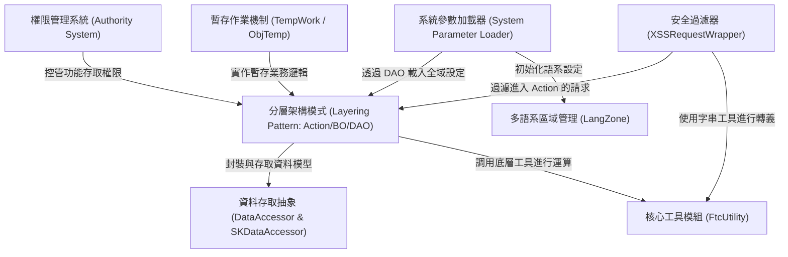

# Tutorial: code_to_analyze

本專案是一個基於 **Java 8** 與 **Monolithic** 架構的企業級管理平台，核心採用了經典的 *Action-BO-DAO* **分層模式**。系統整合了 **iBATIS** 進行資料存取，並內建完整的 **權限控管 (RBAC)** 與 **多語系支援**。其特色在於提供了一套靈活的 **資料存取抽象層** (DataAccessor) 以簡化資料庫操作，並具備 **暫存作業機制** 處理資料草稿與發佈流程，同時透過 **安全過濾器** 確保系統免於跨站腳本攻擊。

**Source Repository:** [None](None)

## Chapters

1. [分層架構模式 (Layering Pattern: Action/BO/DAO)
](01_分層架構模式__layering_pattern__action_bo_dao__.md)
2. [權限管理系統 (Authority System)
](02_權限管理系統__authority_system__.md)
3. [安全過濾器 (XSSRequestWrapper)
](03_安全過濾器__xssrequestwrapper__.md)
4. [資料存取抽象 (DataAccessor & SKDataAccessor)
](04_資料存取抽象__dataaccessor___skdataaccessor__.md)
5. [暫存作業機制 (TempWork / ObjTemp)
](05_暫存作業機制__tempwork___objtemp__.md)
6. [系統參數加載器 (System Parameter Loader)
](06_系統參數加載器__system_parameter_loader__.md)
7. [多語系區域管理 (LangZone)
](07_多語系區域管理__langzone__.md)
8. [核心工具模組 (FtcUtility)
](08_核心工具模組__ftcutility__.md)

---

Generated by [AI Codebase Knowledge Builder](https://github.com/The-Pocket/Tutorial-Codebase-Knowledge)