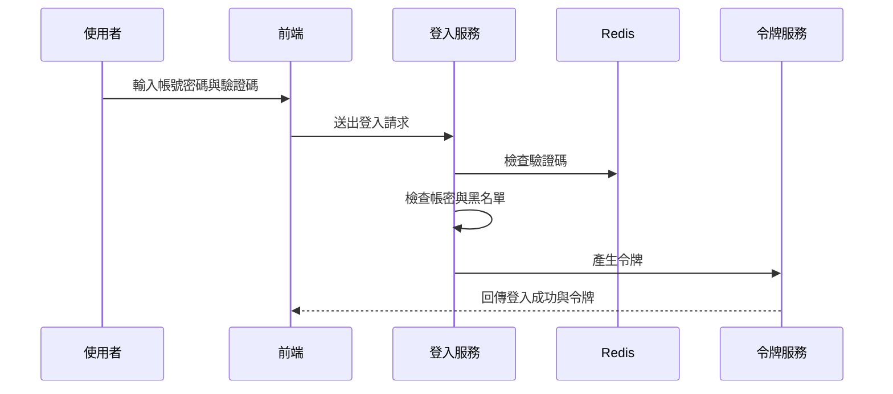
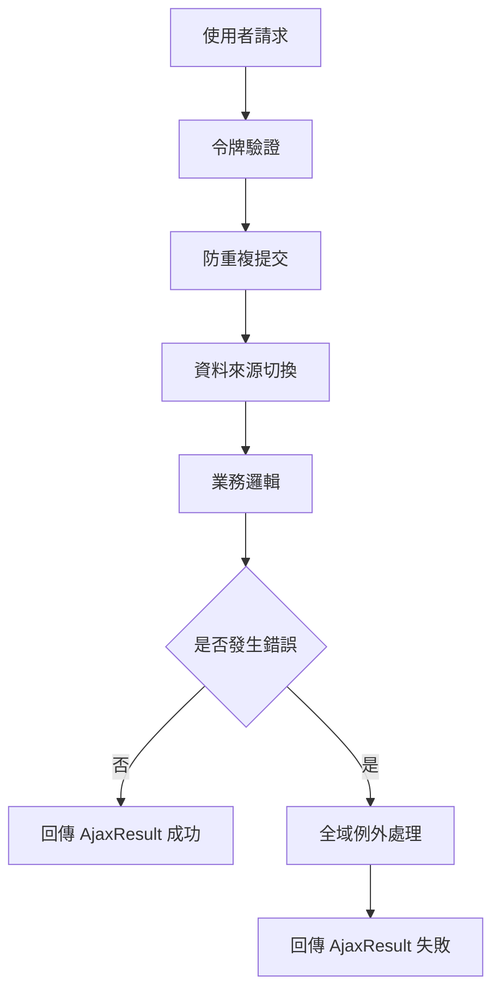

# Chapter 1：基礎平台與共用服務

在進入真正的業務功能之前，先來認識整個專案最底層、但也最重要的「地基」。

你可以把它想成一棟大樓的水電、電梯、消防、門禁系統：  
平常大家不會一直提到它，但只要少了其中一個，整棟樓就很難正常運作。

這一章的中心情境是：

> **當使用者登入系統、送出表單、查詢資料、匯出 Excel、或遇到錯誤時，系統是怎麼穩穩地把事情處理好？**

如果你是新手，這一章不用死背每個類別。  
你只要先建立一個概念：

- 前台畫面負責「輸入」
- 業務模組負責「規則」
- **基礎平台與共用服務**負責「安全、流程、共用能力、錯誤處理、資料工具」

---

## 這一層到底在做什麼？

這一層不是直接處理「申請單」、「通知」、「廠商」這些業務，而是提供所有模組都會用到的共通能力，例如：

- 登入與權限驗證
- JWT 令牌驗證
- 全域例外處理
- 多資料來源切換
- 防止重複提交
- Redis 快取
- 排程與背景工作
- Excel 匯入匯出
- 通用字串、日期、ID、回應物件等工具

你可以把它理解成：

> **業務模組像是店員，基礎平台像是櫃檯、保全、收銀系統、倉儲系統。**

店員負責賣東西，  
但如果沒有這些共用系統，店根本無法正常營運。

---

## 先用一個最常見的使用情境理解它

假設你做了一個「新增資料」的功能：

1. 使用者登入系統
2. 前端送出新增表單
3. 系統先確認使用者有沒有登入
4. 檢查這次提交是不是重複送出
5. 若資料格式錯誤，就回傳友善的錯誤訊息
6. 若資料要寫入主庫或從庫，就切換資料來源
7. 若新增成功，就記錄操作日誌
8. 若要匯出資料，就交給 Excel 工具處理

你會發現：  
**真正的業務只佔一小部分，很多事情都在共用層先幫你準備好了。**

---

## 本章你要先認識的幾個核心概念

我們用最簡單的方式一個一個看。

### 1. 登入與權限驗證

使用者進來系統，不是直接就能做所有事。  
系統要先知道：

- 你是誰
- 你有沒有登入
- 你能不能看這個功能

這部分主要靠：

- [`JwtAuthenticationTokenFilter`](fpg-framework/src/main/java/com/fpg/framework/security/filter/JwtAuthenticationTokenFilter.java)
- [`SecurityConfig`](fpg-framework/src/main/java/com/fpg/framework/config/SecurityConfig.java)
- [`SysLoginService`](fpg-framework/src/main/java/com/fpg/framework/web/service/SysLoginService.java)

你可以把它想像成門口保全：

- 沒帶證件：不能進
- 證件過期：要重新辦
- 證件有效：才能進入辦公區

---

### 2. 全域例外處理

如果系統中某個地方出錯，不希望每個頁面都自己寫一套錯誤畫面。  
所以會有一個統一的地方負責接住錯誤，轉成一致的回應格式。

這個角色是：

- [`GlobalExceptionHandler`](fpg-framework/src/main/java/com/fpg/framework/web/exception/GlobalExceptionHandler.java)

它像是大樓的總機：

- 收到不同類型的問題
- 再用統一方式回答使用者
- 讓前端比較好處理

---

### 3. 多資料來源切換

有些查詢要走主資料庫，有些要走從資料庫。  
有時候同一個系統裡還可能有不同資料庫。

這時候就需要「切換資料來源」。

相關類別：

- [`DruidConfig`](fpg-framework/src/main/java/com/fpg/framework/config/DruidConfig.java)
- [`DataSourceAspect`](fpg-framework/src/main/java/com/fpg/framework/aspectj/DataSourceAspect.java)

你可以把它想成：

> 同一張會員卡，可以決定你今天要走哪個入口。

---

### 4. 防止重複提交

使用者可能因為網路慢、連點按鈕、重整頁面，導致同一筆資料被送出兩次。  
這很容易造成重複新增、重複審核、重複匯款等問題。

相關類別：

- [`RepeatSubmitInterceptor`](fpg-framework/src/main/java/com/fpg/framework/interceptor/RepeatSubmitInterceptor.java)

像是超商收銀：  
你不能同一個商品掃兩次卻以為是不同商品。

---

### 5. Redis 與快取

有些資料很常查，但不需要每次都去資料庫。  
例如驗證碼、登入資訊、常用設定、限流資訊。

相關類別：

- [`RedisConfig`](fpg-framework/src/main/java/com/fpg/framework/config/RedisConfig.java)

你可以把 Redis 想成：

> 放在櫃台旁邊的快速抽屜，拿東西比去倉庫快很多。

---

### 6. Excel 匯入匯出

很多系統都需要把資料匯出成 Excel，或從 Excel 匯入資料。

相關類別：

- [`ExcelUtil`](fpg-common/src/main/java/com/fpg/common/utils/poi/ExcelUtil.java)

這就像：

> 你把資料整理成表格交給別人，或從別人整理好的表格再讀回來。

---

### 7. 通用工具類

專案中有很多很常用的小工具：

- [`StringUtils`](fpg-common/src/main/java/com/fpg/common/utils/StringUtils.java)
- [`DateUtils`](fpg-common/src/main/java/com/fpg/common/utils/DateUtils.java)
- [`IdUtils`](fpg-common/src/main/java/com/fpg/common/utils/uuid/IdUtils.java)
- [`BaseController`](fpg-common/src/main/java/com/fpg/common/core/controller/BaseController.java)
- [`AjaxResult`](fpg-common/src/main/java/com/fpg/common/core/domain/AjaxResult.java)
- [`BaseEntity`](fpg-common/src/main/java/com/fpg/common/core/domain/BaseEntity.java)

它們像是工具箱裡的螺絲起子、尺、剪刀、標籤紙。  
單獨看很小，但到處都會用到。

---

## 先看一個最簡單的回傳格式

很多介面最後都會回傳一種統一結果，像這樣：

```java
AjaxResult result = AjaxResult.success("新增成功");
return result;
```

這段的意思是：

- 系統回傳一個成功結果
- 訊息是「新增成功」

如果失敗，也可以這樣：

```java
AjaxResult result = AjaxResult.error("資料格式錯誤");
return result;
```

這段的意思是：

- 系統回傳一個失敗結果
- 訊息是「資料格式錯誤」

這種設計很適合前端，因為前端只要看：

- `code`：成功還是失敗
- `msg`：顯示什麼訊息
- `data`：有沒有資料

---

## `AjaxResult`：統一的回應包裝

[`AjaxResult`](fpg-common/src/main/java/com/fpg/common/core/domain/AjaxResult.java) 是很常見的共用回傳格式。

你可以把它想成一個「包裹盒」：

- 外面貼標籤：成功、失敗、警告
- 裡面放訊息與資料

它的優點是：

- 所有 API 回傳格式一致
- 前端容易判斷
- 錯誤處理更整齊

---

## `BaseEntity`：資料表共同欄位的基底

很多資料表都會有這些欄位：

- 建立者
- 建立時間
- 更新者
- 更新時間
- 備註

[`BaseEntity`](fpg-common/src/main/java/com/fpg/common/core/domain/BaseEntity.java) 就是把這些共用欄位整理起來。

你可以把它看成：

> 每個資料物件都會繼承的「基本身分證」。

這樣每個業務資料類別就不用重複寫一樣的欄位。

---

## `BaseController`：控制器的共用功能

[`BaseController`](fpg-common/src/main/java/com/fpg/common/core/controller/BaseController.java) 是很多控制器都會繼承的基底。

它幫你做幾件常見事：

- 自動處理日期格式
- 分頁
- 排序
- 回傳成功或失敗結果
- 取得目前登入使用者資訊

例如：

```java
protected AjaxResult toAjax(int rows)
{
    return rows > 0 ? AjaxResult.success() : AjaxResult.error();
}
```

意思很簡單：

- 如果受影響筆數大於 0，就回傳成功
- 否則回傳失敗

這可以讓你少寫很多重複判斷。

---

## 登入流程：系統怎麼知道你是誰？

登入是整個平台最重要的入口之一。  
我們看 [`SysLoginService`](fpg-framework/src/main/java/com/fpg/framework/web/service/SysLoginService.java) 的概念。

它大致做這些事：

1. 檢查驗證碼
2. 檢查帳密是否符合基本規則
3. 檢查黑名單 IP
4. 驗證密碼或 AD 網域
5. 成功後產生 token
6. 把登入資訊寫回系統

可以用這個流程理解：



你只要先記住：

> **登入不是只有驗密碼，還包含驗證碼、風險檢查、令牌發放。**

---

## `JwtAuthenticationTokenFilter`：每次請求先驗證令牌

登入成功後，前端通常會帶著 token 呼叫其他 API。  
這時候 [`JwtAuthenticationTokenFilter`](fpg-framework/src/main/java/com/fpg/framework/security/filter/JwtAuthenticationTokenFilter.java) 會先檢查 token。

它的流程很像：

- 從請求中拿 token
- 找到對應的登入使用者
- 檢查 token 是否有效
- 若有效，就把使用者資訊放進安全上下文
- 後面程式就知道「你已登入」

最簡單的理解是：

> 每次進門都要再刷一次卡，確定你還在有效身分內。

---

## `SecurityConfig`：哪些路可以不用登入，哪些一定要登入？

[`SecurityConfig`](fpg-framework/src/main/java/com/fpg/framework/config/SecurityConfig.java) 負責設定整個安全規則。

它會定義：

- 哪些網址可以匿名訪問
- 哪些網址必須登入
- 失敗時怎麼回應
- 登出怎麼處理
- token 過濾器何時執行

例如，登入頁、驗證碼、靜態資源通常可以匿名訪問；  
其他業務 API 則通常必須登入。

你可以把它想成：

> 大樓的門禁規則表。

---

## `GlobalExceptionHandler`：錯誤不要亂飛，統一接住

當系統發生錯誤時，如果沒有統一處理，前端可能看到一堆不規則的訊息。  
[`GlobalExceptionHandler`](fpg-framework/src/main/java/com/fpg/framework/web/exception/GlobalExceptionHandler.java) 就是負責把不同錯誤整理成一致格式。

例如它會分別處理：

- 權限不足
- 請求方式不對
- 參數格式錯誤
- 服務層自訂錯誤
- 系統錯誤
- 驗證失敗

你可以把它看成：

> 接線生把不同房間打來的故障電話，統一整理後再回報。

---

## `DataSourceAspect`：方法一進來就切換資料來源

有些方法執行前，系統要先決定要連哪個資料庫。  
[`DataSourceAspect`](fpg-framework/src/main/java/com/fpg/framework/aspectj/DataSourceAspect.java) 就是做這件事。

流程很簡單：

1. 檢查方法上有沒有資料來源註解
2. 如果有，就把當前資料來源設成指定值
3. 執行方法
4. 方法結束後清掉資料來源設定

它像什麼？

> 像是在進不同倉庫前，先告訴門禁系統你今天要去的是主倉庫還是分倉庫。

---

## `DruidConfig`：主庫、從庫、多資料源的設定入口

[`DruidConfig`](fpg-framework/src/main/java/com/fpg/framework/config/DruidConfig.java) 負責建立資料庫連線與多資料來源。

它主要做三件事：

- 建立主資料來源
- 建立從資料來源
- 把它們交給動態資料來源管理

你可以簡單理解成：

> 先準備好幾條水管，再由系統決定現在要打開哪一條。

---

## `RepeatSubmitInterceptor`：避免同一筆資料被送兩次

有些操作最怕重複按鈕，例如：

- 新增資料
- 送出審核
- 匯款
- 申請流程

[`RepeatSubmitInterceptor`](fpg-framework/src/main/java/com/fpg/framework/interceptor/RepeatSubmitInterceptor.java) 會在請求到達前先檢查：

- 這個方法有沒有標記「防重複提交」
- 如果有，就判斷是不是重複送出
- 若重複，直接回錯誤，不讓它進業務邏輯

簡單說：

> 按鈕雖然按下去了，但保全會先幫你擋住第二次。

---

## `LogAspect`：操作日誌自動記錄

業務系統通常要知道：

- 是誰操作的
- 什麼時間操作的
- 對哪個 URL 操作
- 內容是什麼
- 成功還是失敗

[`LogAspect`](fpg-framework/src/main/java/com/fpg/framework/aspectj/LogAspect.java) 就是幫你自動記錄這些資料。

你不需要每個方法都手動寫「記錄日誌」；  
只要標上註解，它就會在方法前後自動收集資訊。

這非常像：

> 監視器自動錄影，不需要每個人自己拿手機拍。

---

## `RedisConfig`：快取與限流的基礎

[`RedisConfig`](fpg-framework/src/main/java/com/fpg/framework/config/RedisConfig.java) 的核心任務是建立 Redis 操作模板，讓系統可以：

- 存取快取
- 保存暫時資料
- 做限流控制

例如驗證碼就很適合放 Redis：

- 產生後先存起來
- 使用者登入時拿來比對
- 用完即刪

這種資料不適合一直寫資料庫。  
Redis 速度快，很適合做這件事。

---

## `StringUtils`、`DateUtils`、`IdUtils`：小工具，大幫手

### `StringUtils`

[`StringUtils`](fpg-common/src/main/java/com/fpg/common/utils/StringUtils.java) 提供很多字串處理方法，例如：

- 判斷空值
- 擷取子字串
- 轉駝峰
- 分隔字串
- 比對路徑

你可以把它當成「字串專用小工具包」。

---

### `DateUtils`

[`DateUtils`](fpg-common/src/main/java/com/fpg/common/utils/DateUtils.java) 負責日期處理，例如：

- 取得現在時間
- 格式化日期
- 解析字串成日期
- 計算時間差

例如：

```java
String now = DateUtils.getTime();
```

這會取得目前時間字串，像 `2026-04-21 10:30:00` 這樣的格式。

---

### `IdUtils`

[`IdUtils`](fpg-common/src/main/java/com/fpg/common/utils/uuid/IdUtils.java) 用來產生 UUID。

例如：

```java
String id = IdUtils.simpleUUID();
```

這會得到一組沒有連字號的唯一識別碼。

你可以把它想像成：

> 幫每個資料打上一個幾乎不會重複的編號。

---

## `ExcelUtil`：匯入匯出的重頭戲

[`ExcelUtil`](fpg-common/src/main/java/com/fpg/common/utils/poi/ExcelUtil.java) 是很大的工具類，但新手先抓住重點就好：

它主要負責：

- 匯出 Excel
- 匯入 Excel
- 標題樣式
- 欄位對應
- 下拉選單
- 日期與數字格式
- 圖片欄位
- 合計列

你可以把它想成：

> 一台很強的表格工廠，輸入資料後，幫你變成 Excel；  
> 或者把 Excel 資料拆回 Java 物件。

---

## 一個很小的匯出例子

假設你有一批資料，要匯出成 Excel：

```java
ExcelUtil<User> excelUtil = new ExcelUtil<>(User.class);
AjaxResult result = excelUtil.exportExcel(userList, "使用者資料");
```

這段的意思是：

- 建立一個對應 `User` 類別的 Excel 工具
- 把 `userList` 匯出成名為「使用者資料」的 Excel

如果成功，系統會產生檔案。  
前端通常可以拿到下載連結或檔案名稱。

---

## 一個很小的匯入例子

如果你要把 Excel 檔讀回來：

```java
ExcelUtil<User> excelUtil = new ExcelUtil<>(User.class);
List<User> users = excelUtil.importExcel(inputStream);
```

這段的意思是：

- 用 `User` 類別作為對照
- 把 Excel 每一列轉成一個 `User` 物件
- 最後得到 `users` 清單

這就是「表格和物件互轉」的概念。

---

## 背後是怎麼運作的？先看整體流程

如果把整個基礎平台想像成一個自動處理系統，大致會長這樣：

1. 使用者送出請求
2. 安全過濾器先檢查 token
3. 若方法有防重複註解，攔截器先檢查是否重送
4. 若方法有資料來源註解，切面先切換資料庫
5. 進入控制器與業務邏輯
6. 若出錯，統一交給全域例外處理器
7. 成功或失敗都回傳 `AjaxResult`
8. 若有標註日誌註解，操作資料會被自動記錄

可以用這張圖來理解：



---

## 進一步看幾個核心實作

下面挑幾個最代表性的類別，用非常簡單的方式看它們怎麼做。

---

### 1. 令牌驗證是怎麼被放進每次請求的？

看 [`JwtAuthenticationTokenFilter`](fpg-framework/src/main/java/com/fpg/framework/security/filter/JwtAuthenticationTokenFilter.java)。

它的核心概念是：

- 先從請求中找登入使用者
- 如果使用者存在，而且目前尚未建立驗證資訊
- 就把登入資訊放進安全上下文
- 後面的程式就能直接取得使用者身分

簡化後可以理解成：

```java
LoginUser loginUser = tokenService.getLoginUser(request);
if (loginUser != null) {
    tokenService.verifyToken(loginUser);
    SecurityContextHolder.getContext().setAuthentication(authenticationToken);
}
```

這表示：

- token 能找到人
- token 還有效
- 系統就承認這個人已登入

---

### 2. 登入時為什麼先驗證驗證碼？

看 [`SysLoginService`](fpg-framework/src/main/java/com/fpg/framework/web/service/SysLoginService.java)。

它在登入流程中先做驗證碼檢查，因為：

- 防止機器人亂試密碼
- 防止大量暴力登入
- 保護系統安全

簡化概念如下：

```java
String captcha = redisCache.getCacheObject(verifyKey);
if (captcha == null) {
    throw new CaptchaExpireException();
}
if (!code.equalsIgnoreCase(captcha)) {
    throw new CaptchaException();
}
```

意思是：

- Redis 裡找不到驗證碼，代表過期
- 找得到但不一樣，代表輸入錯誤

---

### 3. 全域例外怎麼統一處理？

看 [`GlobalExceptionHandler`](fpg-framework/src/main/java/com/fpg/framework/web/exception/GlobalExceptionHandler.java)。

它用很多個 `@ExceptionHandler` 分別接不同錯誤。  
例如權限不足時：

```java
@ExceptionHandler(AccessDeniedException.class)
public AjaxResult handleAccessDeniedException(AccessDeniedException e, HttpServletRequest request)
```

這表示：

- 只要丟出 `AccessDeniedException`
- 就會進這個方法
- 然後回傳固定格式的錯誤訊息

你可以把它想成：

> 不管哪裡報錯，最後都交給同一個客服窗口。

---

### 4. 多資料來源怎麼自動切換？

看 [`DataSourceAspect`](fpg-framework/src/main/java/com/fpg/framework/aspectj/DataSourceAspect.java)。

它在方法執行前先找註解，再決定資料來源：

```java
DataSource dataSource = getDataSource(point);
DynamicDataSourceContextHolder.setDataSourceType(dataSource.value().name());
return point.proceed();
```

你可以這樣理解：

- 先看這次工作要用哪個資料庫
- 設定好之後再執行
- 執行完記得清掉設定

這樣下一個方法才不會沿用錯誤的資料來源。

---

### 5. Excel 匯出為什麼能自動對欄位？

看 [`ExcelUtil`](fpg-common/src/main/java/com/fpg/common/utils/poi/ExcelUtil.java)。

它會：

1. 掃描類別欄位
2. 找出有 Excel 註解的欄位
3. 根據註解決定欄位名稱、格式、寬度
4. 將每筆資料寫進表格

簡化理解：

```java
List<Object[]> fields = getFields();
for (Object[] os : fields) {
    Excel excel = (Excel) os[1];
    createHeadCell(excel, row, column++);
}
```

這代表：

- 不是手動一欄欄寫死
- 而是靠註解驅動
- 所以同一套工具可重複用在很多資料類別上

---

## 這一層和後面業務章節的關係

之後你會看到很多業務功能，例如：

- [前端介面與 API 對接](02_前端介面與_api_對接_.md)
- [參考資料與欄位對照平台](03_參考資料與欄位對照平台_.md)
- [多語係與關鍵字字典管理](04_多語係與關鍵字字典管理_.md)

這些章節講的是「業務怎麼做」。  
但它們都建立在今天這些共用能力上：

- 登入與權限
- 回傳格式
- 錯誤處理
- 資料來源
- Redis
- Excel
- 通用工具

所以你可以把今天這章當成：

> 之後所有章節的地基。

---

## 新手最容易混淆的地方

### 1. `AjaxResult` 不是業務資料本身

它只是回傳格式，不是某個實體資料。  
例如：

- 成功
- 失敗
- 提示
- 帶資料的成功結果

---

### 2. `BaseEntity` 是共用欄位，不是完整業務模型

它只是每個資料物件的底層共通欄位。  
真正的業務欄位要看各模組自己的資料類別。

---

### 3. `SecurityConfig` 和 `JwtAuthenticationTokenFilter` 分工不同

- `SecurityConfig`：定規則，哪些路能走
- `JwtAuthenticationTokenFilter`：每次請求都先驗證你是不是合法登入者

---

### 4. `DataSourceAspect` 不負責資料庫本身，只負責切換時機

它不是建立資料庫，而是告訴系統這次用哪個資料來源。

---

## 你可以怎麼記住這一章？

如果你現在只想記住一句話：

> **基礎平台與共用服務，就是把登入、權限、錯誤、資料庫、快取、Excel、工具這些共通能力先做好，讓後面的業務模組專心處理自己的事情。**

這樣就夠了。

---

## 本章小結

這一章我們先建立了整個專案的「底層概念」：

- 使用者怎麼登入、怎麼驗證 token
- 系統怎麼統一處理錯誤
- 怎麼切換資料來源
- 怎麼防止重複提交
- 怎麼使用 Redis、Excel 與共用工具
- 為什麼 `AjaxResult`、`BaseEntity`、`BaseController` 這些基礎類別很重要

你現在不需要把每個類別背下來，  
但你應該知道：**它們是所有業務模組背後的支撐系統。**

下一章我們會開始看真正的前端互動流程，也就是如何把畫面與後端 API 接起來。  
請繼續閱讀：[前端介面與 API 對接](02_前端介面與_api_對接_.md)

---

Generated by [AI Codebase Knowledge Builder](https://github.com/The-Pocket/Tutorial-Codebase-Knowledge)