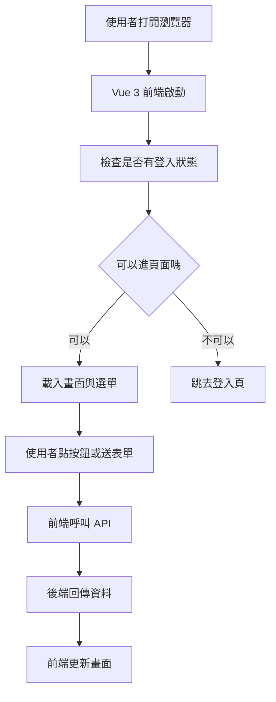
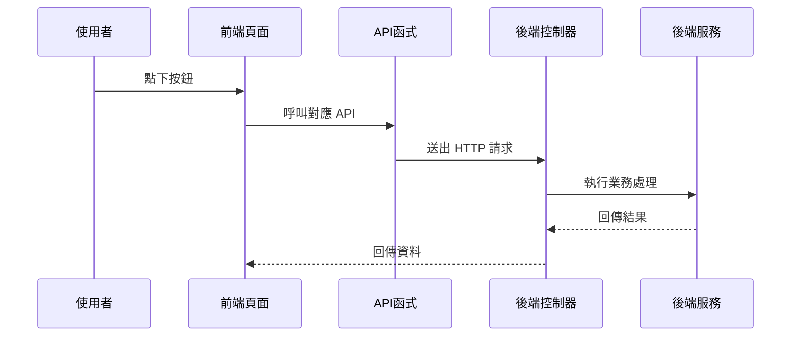
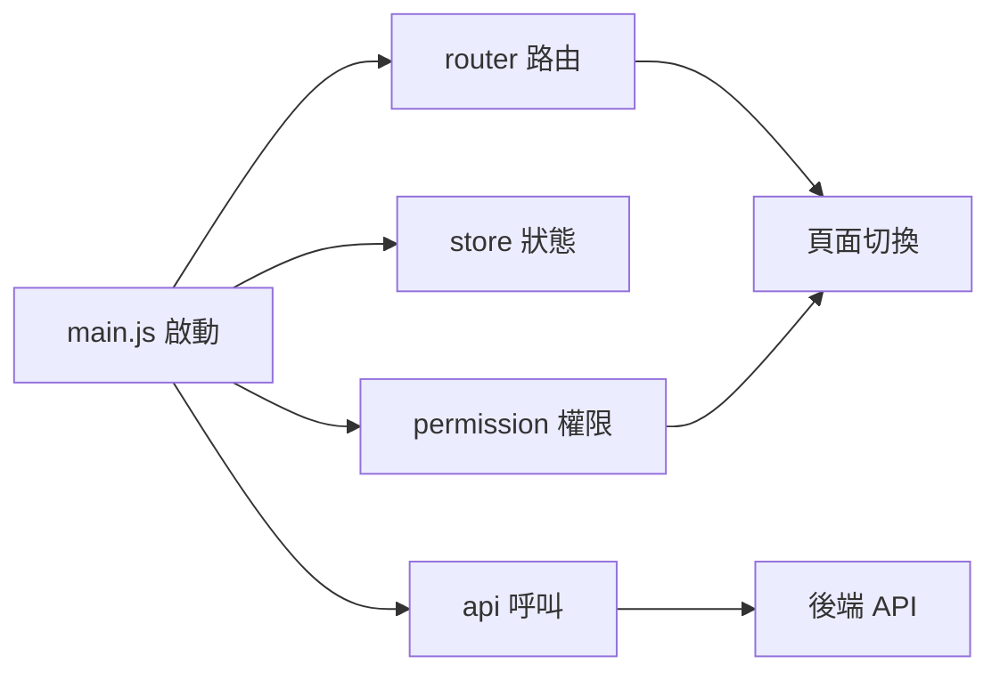

# Chapter 2: 前端介面與 API 對接


接續上一章的 [基礎平台與共用服務](01_基礎平台與共用服務_.md)，我們已經知道系統底層會幫你處理登入、權限、錯誤、快取、共用工具等事情。  
這一章要往上一層，看「使用者真正看得到的畫面」是怎麼和後端 API 接起來的。

你可以先把這一章想成：

> **前端是櫃台，API 是送餐通道，後端是廚房。**  
> 使用者先在畫面上點按鈕、填表單、查列表，前端再把需求送到後端，拿到資料後再顯示回來。

---

## 本章先回答一個最重要的問題

當你在畫面上按下「查詢」、「新增」、「送出」、「核准」時，系統到底發生了什麼事？

舉一個最常見的例子：

1. 使用者打開一個列表頁
2. 前端顯示查詢條件與表格
3. 使用者輸入條件後按下「查詢」
4. 前端呼叫某個 API
5. 後端回傳資料
6. 前端把資料畫到表格上

如果你是新手，你先不要急著背所有元件。  
你只要先建立一個核心觀念：

> **畫面上的每個動作，通常都會對應到一支 API。**

這就是本章最重要的學習目標。

---

## 這一章你會學到什麼？

你會先認識前端專案如何啟動，接著看：

- Vue 3 專案怎麼組起來
- 路由怎麼控制頁面跳轉
- 權限怎麼決定你能不能進某個頁面
- `src/api` 裡的檔案怎麼對應後端 API
- 按鈕、表單、列表如何把資料送到後端
- 為什麼登入後要先載入使用者資訊與選單

---

## 一、先從整體流程看起

如果把整個前端想成一間店，流程大概像這樣：



你可以先記住這句話：

> **前端的責任，是把使用者動作翻譯成 API 請求。**

---

## 二、前端專案是怎麼啟動的？

前端專案不是一打開就有畫面，通常會先經過一個入口檔案。  
在這個專案裡，最核心的入口是 [`src/main.js`](fpg-v3/src/main.js)。

它做的事情很像「把店開門前的準備工作做完」：

- 建立 Vue 應用
- 載入路由
- 載入狀態管理
- 載入國際化
- 載入元件
- 設定全域方法與全域元件
- 掛上權限控制
- 最後把畫面掛到頁面上

你可以用一句話理解它：

> **`main.js` 是前端的總開關。**

---

### 1. 建立 Vue 應用

先看最基本的部分：

```javascript
import { createApp } from 'vue'
import App from './App'

const app = createApp(App)
```

這段的意思是：

- 從 Vue 建立一個應用
- 以 `App` 作為整個網站的根元件

你可以把 `App` 想成整棟房子的主結構，其他頁面和元件都會圍繞它展開。

---

### 2. 掛上路由與狀態

再看這種寫法：

```javascript
app.use(router)
app.use(store)
app.use(i18n)
```

意思是：

- `router` 負責頁面切換
- `store` 負責共用狀態
- `i18n` 負責多語系

這就像是：

- 路由＝樓層導覽圖
- 狀態管理＝全店共用資訊板
- 多語系＝不同語言版本的菜單

---

### 3. 掛上全域方法與元件

你會看到類似這樣的設定：

```javascript
app.config.globalProperties.parseTime = parseTime
app.component('Pagination', Pagination)
```

意思是：

- `parseTime` 這種工具可以全站共用
- `Pagination` 這種分頁元件也能全站重複使用

這樣做的好處是：

- 少寫重複程式
- 每個頁面都能用同一套工具
- 畫面風格比較一致

---

## 三、開發時怎麼跑起來？

前端專案的開發設定在 [`fpg-v3/vite.config.js`](fpg-v3/vite.config.js) 與 [`fpg-v3/playwright.config.ts`](fpg-v3/playwright.config.ts)。

你現在不需要死背設定，只要知道它們主要在做三件事：

1. 設定開發伺服器
2. 設定前端的基底路徑
3. 設定 API 代理轉發

---

### 1. 開發伺服器與基底路徑

在 [`vite.config.js`](fpg-v3/vite.config.js) 裡，有一段很重要的概念：

```javascript
base: VITE_APP_ENV === 'production' ? '/vcpseos/' : '/vcpseosTest/'
```

意思是：

- 正式環境和測試環境使用不同的網站根路徑
- 這樣部署時不容易混淆

你可以把它想成：

> 正式店面和試營運店面，門牌不一樣。

---

### 2. API 代理轉發

同一個設定檔裡，還有這段概念：

```javascript
proxy: {
  '/dev-api': {
    target: 'http://localhost:8090',
    rewrite: (p) => p.replace(/^\/dev-api/, '')
  }
}
```

意思是：

- 前端先呼叫 `/dev-api`
- 開發伺服器幫你轉送到後端 `8090`
- 讓前端看起來像是在同網域呼叫

這樣的好處是：

- 開發時不用一直處理跨域問題
- 前後端分開開發更方便

你可以把它想成：

> 前台先把單子交給內部轉接員，再由轉接員送到廚房。

---

## 四、路由是怎麼控制頁面的？

路由就是「網址對應到哪個畫面」。  
這個專案在 [`src/permission.js`](fpg-v3/src/permission.js) 裡做了很重要的權限與路由控制。

你可以把路由理解成：

> **每個網址都像一扇門，路由決定你能不能進。**

---

### 1. 沒有登入時，先去登入頁

當使用者沒有 token 時，系統會先檢查目前要去的頁面是不是白名單。  
如果不是，就會導去登入頁。

概念像這樣：

```javascript
if (getToken()) {
  next()
} else {
  next('/login')
}
```

這段的意思是：

- 有登入憑證就可以繼續
- 沒有登入憑證就先去登入頁

你可以把 token 想成：

> 進門的會員卡。

---

### 2. 有登入時，還要看權限

有 token 不代表你能看所有頁面。  
系統還會載入你的角色與可訪問路由。

`src/permission.js` 裡的流程大致是：

- 先抓使用者資訊
- 再根據角色產生可用路由
- 動態把可進入的頁面加到路由表

這樣做的好處是：

- 不同角色看到的功能不同
- 不能亂進別人的功能頁

這很像公司門禁：

> 你有工牌，不代表你能進每一層樓；  
> 你還要看部門與權限。

---

### 3. 動態加入路由

這段概念很重要：

```javascript
router.addRoute(route)
```

意思是：

- 系統不是一開始就把所有功能頁都放好
- 而是登入後，根據權限再把能看的頁面加進來

這樣的設計更安全，也更靈活。

---

## 五、前端怎麼呼叫後端 API？

前端的 API 都放在 `src/api` 底下。  
這是整個章節最重要的地方。

你可以先把 `src/api` 想成：

> **前端和後端之間的「聯絡簿」。**

每一個檔案通常對應一個功能模組，例如：

- `src/api/login.js`：登入相關
- `src/api/menu.js`：路由與選單相關
- `src/api/f/faa3.js`：假日建檔
- `src/api/f/fab2.js`：經辦確認
- `src/api/a/eoa1.js`：承攬廠商
- `src/api/q/qaa1.js`：欄位對照
- `src/api/sd/sdaa.js`：關鍵字建檔

---

## 六、最基本的 API 寫法長什麼樣？

幾乎每一個 API 檔都長得很像。  
先看一個很簡單的例子：

```javascript
import request from '@/utils/request'

export function getRouters() {
  return request({ url: '/getRouters', method: 'get' })
}
```

這段的意思是：

- 使用共用的 `request`
- 發送 `GET /getRouters`
- 把結果回傳給呼叫者

你可以把它想成：

> 前端先寫好「這個功能要去哪裡送單」，  
> 真正送出的動作交給共用的請求工具處理。

---

## 七、登入頁怎麼對接？

登入相關的 API 在 [`src/api/login.js`](fpg-v3/src/api/login.js)。

這個檔案有幾個常見功能：

- 登入
- 登出
- 取得使用者資訊
- 取得驗證碼
- 變更語系
- 取得公告

---

### 1. 登入 API

```javascript
export function login(username, password, code, uuid) {
  return request({
    url: '/login',
    headers: { isToken: false },
    method: 'post',
    data: { username, password, code, uuid }
  })
}
```

這段的意思是：

- 把帳號、密碼、驗證碼、驗證碼編號一起送給後端
- 因為還沒登入，所以這支 API 不需要 token

如果使用者輸入：

- 帳號：`demo`
- 密碼：`123456`
- 驗證碼：`abcd`
- `uuid`：驗證碼識別碼

後端就會檢查這些資料是否正確。  
如果成功，就回傳登入成功與 token。

---

### 2. 取得驗證碼

```javascript
export function getCodeImg() {
  return request({
    url: '/captchaImage',
    headers: { isToken: false },
    method: 'get'
  })
}
```

這段的意思是：

- 登入頁需要先抓驗證碼圖片
- 因為還沒登入，所以也不需要 token

你可以把它想成：

> 先拿一張「進門前的小考題」，確認不是機器人。

---

### 3. 取得使用者資訊

```javascript
export function getInfo() {
  return request({
    url: '/getInfo',
    method: 'get'
  })
}
```

這支 API 會在登入後使用。  
它的用途是：

- 取得你的角色
- 取得你的權限
- 取得你的基本資訊

這些資訊會影響你能看到哪些選單與頁面。

---

## 八、列表頁怎麼對接？

列表頁是最常見的畫面類型。  
例如假日建檔、欄位對照、廠商資料，很多都會有「查詢列表」、「新增」、「修改」、「刪除」。

這種 API 通常都長得很像。  
以 [`src/api/f/faa3.js`](fpg-v3/src/api/f/faa3.js) 為例：

```javascript
export function listFaa3(query) {
  return request({ url: '/f/faa3/list', method: 'get', params: query })
}
```

這段的意思是：

- 從 `/f/faa3/list` 查詢資料
- 查詢條件放在 `query`
- 後端回傳一批列表資料

如果 `query` 裡有：

- 年份
- 月份
- 假日名稱

那前端就會把這些條件送出去，後端再回傳符合條件的資料。

---

### 1. 查單筆資料

```javascript
export function getFaa3(xuid) {
  return request({ url: '/f/faa3/' + xuid, method: 'get' })
}
```

這段的意思是：

- 用某筆資料的識別碼查詳細內容
- 常用在「編輯前先打開資料」或「看明細」

---

### 2. 新增資料

```javascript
export function addFaa3(data) {
  return request({ url: '/f/faa3', method: 'post', data: data })
}
```

這段的意思是：

- 把表單資料送到後端
- 請後端新增一筆假日資料

---

### 3. 修改資料

```javascript
export function updateFaa3(data) {
  return request({ url: '/f/faa3', method: 'put', data: data })
}
```

這段的意思是：

- 編輯完後把新的資料送回去
- 請後端更新原本那筆資料

---

### 4. 刪除資料

```javascript
export function delFaa3(xuid) {
  return request({ url: '/f/faa3/' + xuid, method: 'delete' })
}
```

這段的意思是：

- 用識別碼刪掉某筆資料
- 通常會搭配刪除確認視窗

---

## 九、前端頁面通常怎麼用這些 API？

你可以把一個頁面想成這樣的流程：

1. 進入頁面時先載入列表
2. 使用者輸入查詢條件
3. 按下查詢後重新抓資料
4. 按下新增打開表單
5. 送出表單時呼叫新增或修改 API
6. 按下刪除時呼叫刪除 API

下面用一個非常簡單的範例看概念：

```javascript
import { listFaa3 } from '@/api/f/faa3'

listFaa3({ year: 2026 }).then(res => {
  console.log(res)
})
```

這段的意思是：

- 呼叫假日列表 API
- 查詢條件是年份 2026
- 拿到結果後印出來

在實際畫面中，通常不會只是 `console.log`，而是會把資料放進表格。

---

## 十、表單送出時的概念是什麼？

表單通常會先做兩件事：

1. 驗證資料有沒有填對
2. 決定要呼叫新增還是修改 API

例如：

```javascript
if (form.id) {
  updateFaa3(form)
} else {
  addFaa3(form)
}
```

這段的意思是：

- 如果有 `id`，表示這是一筆已存在資料的修改
- 如果沒有 `id`，表示這是新增

這個判斷在很多頁面都會出現。

你可以把它想成：

> 有訂單編號＝改舊單；沒有訂單編號＝開新單。

---

## 十一、這個專案裡有哪些常見功能模組？

下面挑幾個來看，幫你建立整體印象。

---

### 1. 參考資料與欄位對照

相關檔案：

- [`src/api/q/qaa1.js`](fpg-v3/src/api/q/qaa1.js)
- [`src/api/q/qaa2.js`](fpg-v3/src/api/q/qaa2.js)

這類頁面通常是：

- 管理欄位對照資料
- 管理畫面顯示欄位
- 支援查詢、新增、修改、刪除、匯出

這就像：

> 系統字典表，讓前端知道每個欄位要怎麼顯示。

---

### 2. 多語係與關鍵字

相關檔案：

- [`src/api/sd/sdaa.js`](fpg-v3/src/api/sd/sdaa.js)
- [`src/api/sd/sdab.js`](fpg-v3/src/api/sd/sdab.js)
- [`src/api/sd/sdad.js`](fpg-v3/src/api/sd/sdad.js)

這類頁面通常是：

- 管理顯示文字
- 管理翻譯內容
- 管理關鍵字對照

你可以把它想成：

> 同一句話，在不同語言中有不同版本。

---

### 3. 單據參數與假日設定

相關檔案：

- [`src/api/f/faa1.js`](fpg-v3/src/api/f/faa1.js)
- [`src/api/f/faa2.js`](fpg-v3/src/api/f/faa2.js)
- [`src/api/f/faa3.js`](fpg-v3/src/api/f/faa3.js)
- [`src/api/f/faa4.js`](fpg-v3/src/api/f/faa4.js)

這些通常是主資料維護類型的頁面。  
例如：

- 單據金額
- 寬限天數
- 假日資料
- 通知名單

你可以把它想成：

> 先把規則和名單建好，後面的業務流程才有東西可用。

---

### 4. 廠商與報到資料

相關檔案：

- [`src/api/a/eoa1.js`](fpg-v3/src/api/a/eoa1.js)
- [`src/api/a/eoa3.js`](fpg-v3/src/api/a/eoa3.js)
- [`src/api/a/eoa4.js`](fpg-v3/src/api/a/eoa4.js)

這類頁面通常是：

- 建立廠商資料
- 維護人員與車輛
- 管理證照與複訓資料

這就像：

> 一家工廠要先確認廠商資料完整，後續流程才不會卡住。

---

### 5. 核簽與確認流程

相關檔案：

- [`src/api/f/fab2.js`](fpg-v3/src/api/f/fab2.js)
- [`src/api/f/fab3.js`](fpg-v3/src/api/f/fab3.js)
- [`src/api/f/fab4.js`](fpg-v3/src/api/f/fab4.js)

這些 API 跟流程動作有關，例如：

- 經辦確認
- 課長呈核
- 廠長核准
- 退回
- 查核簽歷程

這就像：

> 文件要一關一關蓋章，不能直接跳到最後一步。

---

## 十二、前端按鈕按下去後，為什麼會呼叫到某個後端功能？

這是很多新手最想知道的問題。

我們用最簡單的方式拆解：

1. 畫面上有一個按鈕
2. 按鈕綁定一個方法
3. 方法裡呼叫某個 API
4. API URL 對應到後端控制器
5. 控制器再呼叫服務層處理資料

可以用這張圖理解：



你可以把它想成：

> 你按的是「畫面上的按鈕」，  
> 真正動作是「前端方法 → API → 後端控制器」。

---

## 十三、來看一個很小的完整例子

假設你要做「查詢假日列表」。

### 第一步：前端先引用 API

```javascript
import { listFaa3 } from '@/api/f/faa3'
```

這表示你先把「查詢假日」這支 API 拿進來。

---

### 第二步：按查詢時呼叫它

```javascript
function handleQuery() {
  listFaa3(searchForm).then(res => {
    tableData.value = res.rows
  })
}
```

這表示：

- 使用搜尋表單作為查詢條件
- 把回來的資料放進表格

---

### 第三步：畫面更新

這時候使用者就會看到新的查詢結果。  
整個過程像是：

> 你把問題交給櫃台，櫃台幫你去查，  
> 查完再把結果端回來。

---

## 十四、這一章最常見的幾個名詞，你要先知道

### 1. 路由

網址與畫面的對應關係。  
簡單說，就是「這個網址要開哪一頁」。

---

### 2. 權限控制

不是每個人都能看每個功能。  
要看你的登入身分、角色、權限。

---

### 3. API

前端和後端溝通的接口。  
前端把需求送出去，後端把結果回來。

---

### 4. 請求

前端送出的動作。  
例如查詢、新增、修改、刪除。

---

### 5. 回應

後端回來的結果。  
通常會包含成功失敗、訊息、資料。

---

## 十五、如果你是新手，最該先記住什麼？

你不需要一開始就背完所有檔案。  
先記住這三件事就很好：

1. **畫面上的每個操作，通常都對應一支 API**
2. **`src/api` 是前端呼叫後端的集中地方**
3. **登入後還要看路由與權限，才能決定能看到哪些功能**

只要你有這三個概念，後面看任何模組都會容易很多。

---

## 十六、本章的小地圖：前端是怎麼組織的？

你可以把整個前端想成下面這樣：



這張圖要表達的是：

- `main.js` 是入口
- `router` 負責頁面
- `permission` 負責能不能看
- `api` 負責資料溝通

---

## 十七、和下一章的銜接

現在你已經知道：

- 前端畫面如何啟動
- 路由與權限怎麼控制頁面
- `src/api` 裡的函式怎麼對應後端
- 按鈕、查詢、表單如何把資料送出去

接下來，你就可以進一步理解「資料與欄位是怎麼被管理的」，也就是下一章的主題：  
[參考資料與欄位對照平台](03_參考資料與欄位對照平台_.md)

---

## 本章總結

這一章我們用最簡單的方式認識了前端介面與 API 對接：

- `main.js` 負責啟動前端
- `vite.config.js` 負責開發環境與代理設定
- `permission.js` 負責登入與權限控制
- `src/api` 底下的檔案負責定義每個功能的 API
- 畫面上的查詢、新增、修改、刪除，其實都是呼叫對應的 API

如果你現在還沒有完全記住所有細節，沒關係。  
新手最重要的是先建立一個清楚的流程感：

> **使用者操作畫面 → 前端呼叫 API → 後端處理資料 → 前端更新結果**

只要這條路徑懂了，後面很多章節都會越看越順。

---

Generated by [AI Codebase Knowledge Builder](https://github.com/The-Pocket/Tutorial-Codebase-Knowledge)