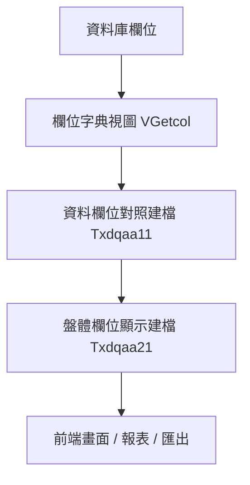
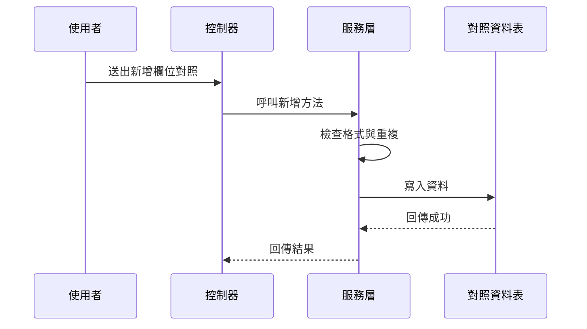
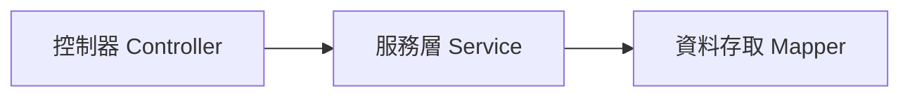

# Chapter 3：參考資料與欄位對照平台

接續上一章的 [前端介面與 API 對接](02_前端介面與_api_對接_.md)，你已經知道「畫面怎麼把資料送到後端」。  
這一章我們要往更深入一層，看一個很重要、但常被新手忽略的主題：

> **系統裡的欄位名稱、顯示名稱、資料型態、顯示格式，應該由誰來管理？**

如果沒有這一層，畫面就很容易出現：

- 同一個欄位，在不同頁面叫法不一樣
- 英文欄位名和中文顯示名對不起來
- 報表欄位寫死，改版時每個地方都要重改
- 不同角色、不同頁籤的欄位顯示邏輯分散在各處

所以這一章的核心，就是學會理解：

> **參考資料與欄位對照平台，就像系統的字典館與索引卡。**

你不用直接背每個欄位是什麼，  
而是先查字典、查對照表，讓系統知道「這個欄位是誰、要怎麼顯示、屬於哪一類」。

---

## 本章要解決的中心情境

先想像一個很實際的例子：

> 你要在畫面上顯示「使用者資料列表」，但這個列表有些欄位來自資料庫原始欄位，有些欄位要顯示中文名稱，有些欄位還要根據角色、頁籤、顯示區域來決定要不要出現。

如果你把這些規則都寫死在畫面裡，之後只要欄位一變，前端、後端、報表、匯出都要一起改。  
這會很痛苦。

所以這個平台的作用，就是把這些資訊集中起來：

- 系統欄位代碼
- 原始欄位名稱
- 中文顯示名稱
- 英文顯示名稱
- 資料型態
- 顯示格式
- 欄位分類
- 角色 / 頁籤 / 顯示區域 / 顯示順序
- 生效註記

簡單說：

> **它不是在存真正的業務資料，而是在存「資料怎麼被理解與顯示」的規則。**

---

## 先用白話認識這個平台

你可以把它想像成圖書館的索引卡：

- 你不一定一開始就去翻整本書
- 你先查索引卡
- 看書名、分類、位置、標籤
- 再去找真正的內容

這個平台也是一樣：

- 不直接處理業務內容
- 而是先整理欄位資訊
- 讓別的模組查得到正確欄位名稱與顯示方式

---

## 這一章會看到哪些資料表概念？

從程式碼來看，這一章主要有兩種資料：

### 1. `VGetcol`：欄位視圖

檔案位置：

- [`fpg-vcpseos/src/main/java/com/fpg/system/domain/VGetcol.java`](fpg-vcpseos/src/main/java/com/fpg/system/domain/VGetcol.java)
- [`fpg-vcpseos/src/main/java/com/fpg/system/controller/VGetcolController.java`](fpg-vcpseos/src/main/java/com/fpg/system/controller/VGetcolController.java)

它看起來像一個「欄位字典視圖」，主要整理：

- 欄位代號
- 欄位名稱
- 類型
- 長度
- 精度
- 小數位數

這很像是資料庫欄位的說明卡。

---

### 2. `Txdqaa11`：資料欄位對照建檔

檔案位置：

- [`fpg-vcpseos/src/main/java/com/fpg/q/domain/Txdqaa11.java`](fpg-vcpseos/src/main/java/com/fpg/q/domain/Txdqaa11.java)
- [`fpg-vcpseos/src/main/java/com/fpg/q/controller/Txdqaa11Controller.java`](fpg-vcpseos/src/main/java/com/fpg/q/controller/Txdqaa11Controller.java)

它是更進一步的對照建檔，會記錄：

- 系統欄位代碼
- 來源系統
- 原始欄位名稱
- 中文顯示名稱
- 英文顯示名稱
- 資料型態
- 顯示格式化
- 欄位分類

這表示它不只是「知道欄位叫什麼」，還知道「欄位要怎麼被解釋」。

---

### 3. `Txdqaa21`：盤體欄位顯示建檔

檔案位置：

- [`fpg-vcpseos/src/main/java/com/fpg/q/domain/Txdqaa21.java`](fpg-vcpseos/src/main/java/com/fpg/q/domain/Txdqaa21.java)
- [`fpg-vcpseos/src/main/java/com/fpg/q/controller/Txdqaa21Controller.java`](fpg-vcpseos/src/main/java/com/fpg/q/controller/Txdqaa21Controller.java)

這一份更偏向「畫面顯示規則」，會記錄：

- 角色類型
- 頁籤類型
- 顯示區域
- 顯示順序
- 系統欄位代碼
- 生效註記

它很像「這個人、在這個頁籤、這個區塊，應該看到哪些欄位，順序怎麼排」。

---

## 先抓住最重要的一句話

如果你今天只想記一句話，那就是：

> **`VGetcol` 管欄位字典，`Txdqaa11` 管欄位對照，`Txdqaa21` 管畫面顯示規則。**

這三個一起組成一個「參考資料與欄位對照平台」。

---

## 一、先看整體架構：它像一套字典系統

下面這張圖可以幫助你先建立整體感覺：



你可以這樣理解：

- `VGetcol`：先知道欄位原始資訊
- `Txdqaa11`：再把欄位對應成系統想要的名字
- `Txdqaa21`：最後決定畫面怎麼顯示

這很像：

- 第一層：書的索引
- 第二層：書的標題翻譯
- 第三層：書架擺放方式

---

## 二、`VGetcol` 是什麼？

先看 [`VGetcol`](fpg-vcpseos/src/main/java/com/fpg/system/domain/VGetcol.java)。

它的欄位很簡單：

- `columnName`：欄位代號
- `comments`：欄位名稱
- `dataType`：類型
- `dataLength`：長度
- `dataPrecision`：精度
- `dataScale`：小數位數

你可以把它想成「資料庫欄位的說明卡」。

---

### 1. `VGetcol` 的用途

當你要查某個欄位的基本資訊時，它可以告訴你：

- 這欄叫什麼
- 是字串還是數字
- 長度多少
- 小數點有幾位

這些資訊對於：

- 報表
- 匯出
- 欄位驗證
- 動態畫面

都很有幫助。

---

### 2. 簡單看欄位長相

```java
private String columnName;
private String comments;
private String dataType;
```

這三個欄位代表：

- 欄位代號
- 欄位名稱
- 資料型態

很像你在查字典時，先看到：

- 單字本身
- 中文解釋
- 詞性

---

## 三、`VGetcol` 的資料怎麼被查出來？

它有對應的 Mapper、Service、Controller：

- [`VGetcolMapper`](fpg-vcpseos/src/main/java/com/fpg/system/mapper/VGetcolMapper.java)
- [`IVGetcolService`](fpg-vcpseos/src/main/java/com/fpg/system/service/IVGetcolService.java)
- [`VGetcolServiceImpl`](fpg-vcpseos/src/main/java/com/fpg/system/service/impl/VGetcolServiceImpl.java)
- [`VGetcolController`](fpg-vcpseos/src/main/java/com/fpg/system/controller/VGetcolController.java)

這就是標準的「控制器 → 服務 → 資料存取」三層結構。

---

### `VGetcolController` 在做什麼？

它提供這些常見功能：

- 查詢列表
- 匯出 Excel
- 查單筆詳細
- 新增
- 修改
- 刪除

你可以把它想成一個「欄位字典管理櫃台」。

---

### 查詢列表的概念

```java
@PreAuthorize("@ss.hasPermi('system:getcol:list')")
@GetMapping("/list")
public TableDataInfo list(VGetcol vGetcol)
```

這段表示：

- 只有有權限的人能查
- 送出 `GET /system/getcol/list`
- 系統根據條件回傳列表

如果你輸入查詢條件，後端就會回傳符合條件的欄位資料。

---

### 匯出 Excel 的概念

```java
ExcelUtil<VGetcol> util = new ExcelUtil<VGetcol>(VGetcol.class);
util.exportExcel(response, list, "欄位視圖数据");
```

這表示：

- 把查到的欄位資料匯出成 Excel
- 每一列就是一筆欄位資訊

這對管理者很實用，因為可以直接把欄位清單帶走檢查。

---

## 四、`Txdqaa11`：資料欄位對照建檔

接下來看更重要的 [`Txdqaa11`](fpg-vcpseos/src/main/java/com/fpg/q/domain/Txdqaa11.java)。

它比 `VGetcol` 更像「正式建檔資料」，因為它不只看欄位本身，還看：

- 哪個系統來的
- 原始欄位怎麼叫
- 中文與英文顯示怎麼設
- 欄位分類是什麼
- 顯示格式要怎麼轉

---

### 1. 這個資料物件在記錄什麼？

你可以把它想成一張「欄位翻譯卡」。

例如，某個欄位在來源系統裡叫：

- `AMT`

但在前端要顯示成：

- 中文：金額
- 英文：Amount

而且它還可能是：

- 數字型態
- 顯示時要加千分位
- 屬於金額分類

這些資訊就很適合放在 `Txdqaa11`。

---

### 2. 重要欄位看一眼就懂

```java
private String sysfldcode;
private String srcsys;
private String orifldname;
```

這三個欄位分別是：

- 系統欄位代碼
- 來源系統
- 原始欄位名稱

意思就是：

> 「這個欄位從哪裡來、原本叫什麼、在系統中怎麼識別。」

---

### 3. 顯示名稱與格式

```java
private String chndispname;
private String engdispname;
private String dispformat;
```

這三個欄位分別是：

- 中文顯示名稱
- 英文顯示名稱
- 顯示格式化

這非常重要，因為同一個欄位可以在不同畫面有不同的呈現方式。

例如：

- 日期欄位可以顯示成 `2026-04-21`
- 金額欄位可以顯示成 `1,000,000`
- 狀態欄位可以顯示成 `啟用` 或 `停用`

---

## 五、`Txdqaa11` 的服務層在保護什麼？

看 [`Txdqaa11ServiceImpl`](fpg-vcpseos/src/main/java/com/fpg/q/service/impl/Txdqaa11ServiceImpl.java)。

這一層不只是單純轉呼叫 Mapper，  
它還會做資料檢查。

---

### 1. 為什麼新增前要檢查欄位代碼？

這段很重要：

```java
String normalizedSysfldcode = normalizeSysfldcode(txdqaa11.getSysfldcode());
if (!isValidSysfldcode(normalizedSysfldcode))
{
    throw new ServiceException("系統欄位代碼需為20碼內英數字");
}
```

意思是：

- 先把欄位代碼整理成標準格式
- 再檢查是不是合法
- 不合法就丟出錯誤

這就像你在建檔前先檢查身分證號格式，不對就不能送出。

---

### 2. 為什麼還要檢查重複？

```java
if (txdqaa11Mapper.selectTxdqaa11ByUk(txdqaa11) != null)
{
    throw new ServiceException("新增失敗，系統欄位代碼「" + normalizedSysfldcode + "」已存在");
}
```

意思是：

- 同一個系統欄位代碼不能重複建檔
- 避免資料混亂

你可以把它想成：

> 書架上不能有兩本一模一樣索引碼的書，否則找書會亂掉。

---

### 3. 為什麼修改時不能改鍵值欄位？

```java
if (StringUtils.isEmpty(dbData.getSysfldcode()) || !dbData.getSysfldcode().equalsIgnoreCase(normalizedSysfldcode))
{
    throw new ServiceException("系統欄位代碼為鍵值欄位，建檔後不可修改");
}
```

這表示：

- 系統欄位代碼是關鍵識別碼
- 建檔後不能亂改
- 否則對照關係會壞掉

這就像：

> 你的身分證號不能改，因為很多資料都靠它認人。

---

## 六、`Txdqaa11` 的流程長什麼樣子？

下面用一張很簡單的流程圖看新增時發生什麼事：



你可以這樣理解：

- 使用者送出資料
- 控制器收資料
- 服務層先做規則檢查
- 通過後才寫資料庫

這樣比較安全。

---

## 七、`Txdqaa21`：盤體欄位顯示建檔

接下來看 [`Txdqaa21`](fpg-vcpseos/src/main/java/com/fpg/q/domain/Txdqaa21.java)。

這一份資料更偏向「畫面怎麼顯示」。

它主要記錄：

- 角色類型
- 頁籤類型
- 顯示區域
- 顯示順序
- 系統欄位代碼
- 生效註記

你可以把它想成：

> 同一套資料，給不同角色看到的欄位排列順序不一樣。

---

### 1. 角色與頁籤的重要性

```java
private String roletype;
private String tabtype;
private String disparea;
```

這三個欄位代表：

- 哪一種角色
- 哪一個頁籤
- 顯示在哪個區域

例如：

- 經辦看到一套欄位
- 審核者看到另一套欄位
- 同一欄位在不同頁籤也可能顯示位置不同

---

### 2. 顯示順序很重要

```java
private Long dispseq;
private String sysfldcode;
private String activeflg;
```

這些欄位代表：

- 第幾個顯示
- 要顯示哪個欄位
- 是否生效

就像排隊一樣，  
就算都是同一批資料，順序不同，使用者感受就不同。

---

## 八、`Txdqaa21ServiceImpl` 在幫你做哪些檢查？

看 [`Txdqaa21ServiceImpl`](fpg-vcpseos/src/main/java/com/fpg/q/service/impl/Txdqaa21ServiceImpl.java)。

它的重點不只是存資料，還會檢查「顯示區域」是否合理。

---

### 1. 當頁籤類型是特定值時，顯示區域不能空白

```java
if ("MAINT".equals(txdqaa21.getTabtype()) || "CHECK".equals(txdqaa21.getTabtype()))
{
    if (StringUtils.isBlank(txdqaa21.getDisparea()))
    {
        throw new ServiceException("MAINT/CHECK tab type requires disparea");
    }
}
```

這段的意思是：

- 如果頁籤類型是 `MAINT` 或 `CHECK`
- 就必須填顯示區域
- 不然就丟錯

這就像：

> 某些房間一定要填樓層與位置，不然找不到。

---

### 2. 其他頁籤時，顯示區域會被清空

```java
else
{
    txdqaa21.setDisparea(null);
}
```

這表示：

- 不是特定頁籤時
- 顯示區域不需要保留
- 系統自動幫你清掉

這種做法可以避免資料混亂。

---

## 九、`Txdqaa21Controller` 如何避免重複資料？

看 [`Txdqaa21Controller`](fpg-vcpseos/src/main/java/com/fpg/q/controller/Txdqaa21Controller.java)。

它在新增前會先查一次是否已存在同樣的組合：

- 角色類型
- 頁籤類型
- 顯示區域
- 系統欄位代碼

如果重複，就直接回傳錯誤：

```java
if (dbTxdqaa21 != null)
{
    return error("重複資料，請確認角色/頁籤/顯示區域/系統欄位代碼組合");
}
```

這很重要，因為欄位顯示規則不能重複，不然畫面會不知道要套哪一筆。

---

## 十、三個資料物件怎麼分工？

你可以這樣記：

| 名稱 | 作用 | 類比 |
|---|---|---|
| `VGetcol` | 看欄位基本資訊 | 字典索引卡 |
| `Txdqaa11` | 管欄位對照與顯示名稱 | 翻譯字典 |
| `Txdqaa21` | 管角色與頁籤的顯示規則 | 座位表 |

---

## 十一、實際使用時，怎麼幫助前端？

前端常常會遇到這些問題：

- 欄位名稱從哪裡來？
- 表格標題要顯示中文還是英文？
- 某個角色看到哪些欄位？
- 某些欄位要不要顯示？
- 顯示順序如何調整？

這些問題如果都硬寫在前端，會很難維護。  
但如果資料都先放在這個平台，前端就可以先查對照表再畫畫面。

---

### 一個很簡單的想像

假設前端要顯示一個表格：

- 欄位 1：系統欄位代碼
- 欄位 2：中文顯示名稱
- 欄位 3：英文顯示名稱
- 欄位 4：顯示格式

如果管理者把某個欄位名稱改了，  
前端不用重新寫死，只要重新查這個平台的資料就行。

這就像：

> 不是每張地圖都重畫道路，而是更新路名資料。

---

## 十二、這個平台和上一章有什麼關係？

上一章我們講的是前端怎麼呼叫 API。  
這一章則是告訴你：

> **API 之後拿到的欄位資訊，常常不是直接寫死，而是來自這些對照資料。**

所以它們是上下相扣的：

- 前端負責發出請求
- 參考資料與欄位對照平台負責提供正確欄位規則
- 後端業務模組負責依規則運作

---

## 十三、你可以先記住的使用步驟

如果今天你要理解這個平台，可以用下面這個順序：

1. 先看 `VGetcol`，知道欄位基本資訊
2. 再看 `Txdqaa11`，知道欄位怎麼對照與命名
3. 再看 `Txdqaa21`，知道欄位在畫面怎麼顯示
4. 最後看 Controller、Service、Mapper，了解資料怎麼被管理

---

## 十四、三層式結構怎麼串起來？

這一章的程式碼很適合用「三層式」理解：



### 你可以這樣想：

- `Controller`：接收前端請求
- `Service`：檢查規則、處理邏輯
- `Mapper`：真正跟資料庫溝通

例如：

- 使用者按「新增」
- `Controller` 收到表單
- `Service` 檢查欄位是否合法、是否重複
- `Mapper` 寫入資料庫

---

## 十五、看一個最小的新增概念

下面是一個非常簡化的概念示意：

```java
Txdqaa11 data = new Txdqaa11();
data.setSysfldcode("AMT");
data.setChndispname("金額");
service.insertTxdqaa11(data);
```

這段的意思是：

- 建立一筆欄位對照資料
- 設定系統欄位代碼
- 設定中文顯示名稱
- 送進服務層新增

如果資料正確，系統就會把它存起來。  
如果格式錯誤或重複，就會回傳錯誤。

---

## 十六、再看一個很小的查詢概念

```java
Txdqaa21 query = new Txdqaa21();
query.setRoletype("A");
query.setTabtype("MAINT");
service.selectTxdqaa21List(query);
```

這段的意思是：

- 查某個角色、某個頁籤的欄位顯示規則
- 後端會回傳符合條件的顯示設定

這很像在問系統：

> 「這位使用者在這個頁籤裡，應該看到什麼？」

---

## 十七、初學者最容易搞混的地方

### 1. `VGetcol` 不是業務資料

它只是欄位資訊，不是某個功能的內容資料。

---

### 2. `Txdqaa11` 與 `Txdqaa21` 分工不同

- `Txdqaa11` 偏向欄位本身的對照與命名
- `Txdqaa21` 偏向不同角色與頁籤的顯示規則

---

### 3. `Service` 不只是轉呼叫

它還會做格式檢查、重複檢查、鍵值保護，這些都很重要。

---

### 4. `ExcelUtil` 只是輸出工具，不是資料來源

它負責把資料匯出成 Excel，資料還是來自這些對照表。

---

## 十八、本章小結

這一章我們認識了「參考資料與欄位對照平台」的核心概念：

- `VGetcol`：管理欄位字典資訊
- `Txdqaa11`：管理資料欄位對照與顯示名稱
- `Txdqaa21`：管理角色、頁籤與顯示區域的欄位規則
- `Controller`、`Service`、`Mapper` 三層結構如何合作
- 服務層如何做格式檢查、重複檢查、欄位保護

你可以把這一章記成一句話：

> **這個平台負責先把欄位的名字、型態、顯示方式、對照關係整理好，讓別的模組能安心查詢與顯示。**

---

下一章我們會接著看更貼近顯示層的內容：  
[多語係與關鍵字字典管理](04_多語係與關鍵字字典管理_.md)

---

Generated by [AI Codebase Knowledge Builder](https://github.com/The-Pocket/Tutorial-Codebase-Knowledge)