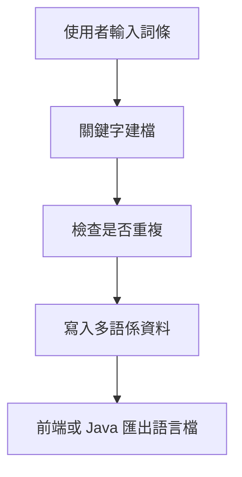
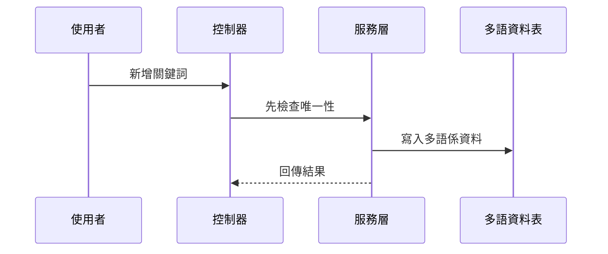
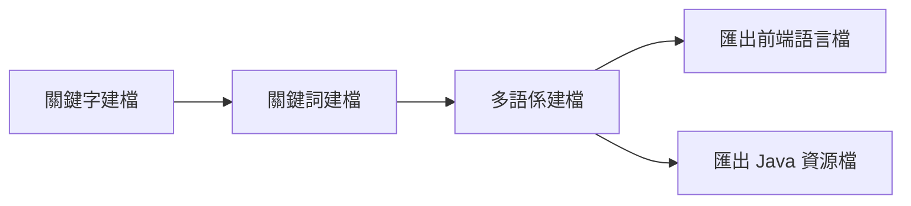

# Chapter 4：多語係與關鍵字字典管理

接續上一章的 [參考資料與欄位對照平台](03_參考資料與欄位對照平台_.md)，我們已經知道系統如何管理「欄位名稱」與「顯示規則」。  
這一章要再往前走一步，來看一個更貼近畫面與文案的主題：

> **同一個功能，在不同語言、不同專案、不同畫面裡，怎麼維持一致又好管理？**

你可以先把這一章想成：

> **系統的「翻譯字典」加上「詞彙管理中心」。**

它不是只有翻譯，還包含：

- 關鍵字唯一性
- 中文關鍵字對照
- 專案代碼
- 多語係內容
- 菜單名稱轉換
- 匯出成前端與 Java 可用的語言檔

---

## 這一章要先解決的中心情境

先想像一個最常見的情況：

你正在做一個系統畫面，上面有很多按鈕與標籤，例如：

- 新增
- 修改
- 刪除
- 查詢
- 送出
- 核准

如果這些文字都直接寫死在畫面裡，之後只要要改成：

- 簡體中文
- 繁體中文
- 英文

或是要讓不同專案共用同一組詞彙，事情就會變得很麻煩。

所以這一章的重點，就是學會理解：

> **關鍵字先建檔，中文名稱再對照，多語係再統一管理。**

這樣就能讓畫面文字、系統訊息、按鈕名稱、選單名稱都可以被集中管理。

---

## 先用最白話的方式理解

你可以把它想成一本大型詞典：

- `關鍵字`：像是詞條編號
- `關鍵字中文`：像是中文解釋
- `多語係`：像是同一詞條在不同語言下的版本
- `專案編號`：像是哪一套字典
- `類型`：像是這個詞是按鈕、標籤、訊息，還是選單

如果沒有這個平台，大家就會各寫各的：

- 前端一份
- 後端一份
- 報表一份
- 匯出檔一份

最後一定會亂掉。

---

## 這一章你會看到的核心角色

本章主要有四個資料主體：

| 名稱 | 作用 | 類比 |
|---|---|---|
| `Txdsdaa1` | 關鍵字建檔 | 詞條主檔 |
| `Txdsdab1` | 關鍵詞建檔 | 中文詞彙對照本 |
| `Txdsdac1` | 專案模組建檔 | 詞彙屬於哪個模組 |
| `Txdsdad1` | 多語係建檔 | 多語版本字典 |

其中最重要的是：

- `Txdsdaa1`：管理關鍵字與中文名稱
- `Txdsdab1`：管理關鍵詞與欄位型態、長度等資訊
- `Txdsdac1`：管理專案模組
- `Txdsdad1`：真正放多語內容

---

## 一、先看整體流程

如果把整個功能想成一間翻譯中心，流程大概是這樣：



你可以先記住一句話：

> **先建關鍵字，再產生多語內容，最後再匯出給前端使用。**

---

## 二、先從最簡單的資料結構開始

### 1. `Txdsdaa1`：關鍵字建檔

檔案位置：

- [`fpg-vcpseos/src/main/java/com/fpg/sd/domain/Txdsdaa1.java`](fpg-vcpseos/src/main/java/com/fpg/sd/domain/Txdsdaa1.java)

這個類別很像最基本的詞條主檔。  
它主要欄位有：

- `keywd`：關鍵字
- `keywdc`：關鍵字中文
- `xrem`：備註
- `txemp`：異動人員
- `txdat`：異動日期

你可以把它想像成：

- `keywd`：英文代碼
- `keywdc`：中文名字
- `xrem`：補充說明

---

### 2. `Txdsdab1`：關鍵詞建檔

檔案位置：

- [`fpg-vcpseos/src/main/java/com/fpg/sd/domain/Txdsdab1.java`](fpg-vcpseos/src/main/java/com/fpg/sd/domain/Txdsdab1.java)

這個類別比上一個多一點點資訊，除了詞彙外，還包含：

- `kywrdc`：關鍵詞中文
- `kywrd`：關鍵詞
- `fldplty`：欄位型態
- `fldpll`：欄位長度
- `fldpldeci`：欄位小數
- `comt`：說明
- `pjno`：專案編號

你可以把它理解成：

> 這不只是詞彙本身，還帶有「這個詞要怎麼用」的規則。

---

### 3. `Txdsdac1`：專案模組建檔

檔案位置：

- [`fpg-vcpseos/src/main/java/com/fpg/sd/domain/Txdsdac1.java`](fpg-vcpseos/src/main/java/com/fpg/sd/domain/Txdsdac1.java)

這個類別是用來記錄專案模組資訊，例如：

- `ulaymodid`：上層模組代號
- `modid`：模組代號
- `modnm`：模組名稱
- `modclass`：模組類別
- `prgid`：程式代號

它像什麼？

> 像一本字典的章節分類表，告訴你這些詞屬於哪個區塊。

---

### 4. `Txdsdad1`：多語係建檔

檔案位置：

- [`fpg-vcpseos/src/main/java/com/fpg/sd/domain/Txdsdad1.java`](fpg-vcpseos/src/main/java/com/fpg/sd/domain/Txdsdad1.java)

這個類別是真正的多語內容主體。  
它的欄位很多，但新手先抓重點就好：

- `pjno`：專案編號
- `lngid`：訊息代號
- `type`：類型
- `strghtbdymsg`：正體訊息
- `cnmsg`：簡體訊息
- `emsg`：英文訊息
- `lngmsgone`、`lngmsgtwo`、`lngmsgthree`：其他語係欄位
- `comt`：說明

它像一個「多版本翻譯卡」。

---

## 三、先用最簡單的例子理解它怎麼用

假設你想建立一個按鈕文字：

- 關鍵字：`save`
- 中文：`儲存`
- 英文：`Save`
- 專案：`XD`
- 類型：`button`

你可以先理解成三步：

1. 先建詞條
2. 再建多語內容
3. 最後匯出給前端

---

### 1. 先建立關鍵字資料

```java
Txdsdaa1 data = new Txdsdaa1();
data.setKeywd("save");
data.setKeywdc("儲存");
```

這段的意思是：

- 建立一筆關鍵字資料
- 關鍵字是 `save`
- 中文是 `儲存`

這就像詞典裡先放一筆詞條主記錄。

---

### 2. 再建立多語係資料

```java
Txdsdad1 lang = new Txdsdad1();
lang.setLngid("SAVE");
lang.setCnmsg("儲存");
lang.setEmsg("Save");
```

這段的意思是：

- 建立一筆多語內容
- 中文是 `儲存`
- 英文是 `Save`

這樣前端切換語言時，就能顯示對應文字。

---

### 3. 最後存進系統

實際上會交給服務層與控制器處理。  
你不需要自己手動一筆一筆寫資料庫。

你只要先知道概念：

> **資料先建檔，系統再幫你轉成不同語言版本。**

---

## 四、這些模組各自負責什麼？

---

### `Txdsdaa1`：關鍵字建檔

相關檔案：

- [`Txdsdaa1Mapper`](fpg-vcpseos/src/main/java/com/fpg/sd/mapper/Txdsdaa1Mapper.java)
- [`ITxdsdaa1Service`](fpg-vcpseos/src/main/java/com/fpg/sd/service/ITxdsdaa1Service.java)
- [`Txdsdaa1ServiceImpl`](fpg-vcpseos/src/main/java/com/fpg/sd/service/impl/Txdsdaa1ServiceImpl.java)
- [`Txdsdaa1Controller`](fpg-vcpseos/src/main/java/com/fpg/sd/controller/Txdsdaa1Controller.java)

這組主要負責：

- 關鍵字查詢
- 新增
- 修改
- 刪除
- 檢查唯一性
- 翻譯查詢

---

### `Txdsdab1`：關鍵詞建檔

相關檔案：

- [`Txdsdab1Mapper`](fpg-vcpseos/src/main/java/com/fpg/sd/mapper/Txdsdab1Mapper.java)
- [`ITxdsdab1Service`](fpg-vcpseos/src/main/java/com/fpg/sd/service/ITxdsdab1Service.java)
- [`Txdsdab1ServiceImpl`](fpg-vcpseos/src/main/java/com/fpg/sd/service/impl/Txdsdab1ServiceImpl.java)
- [`Txdsdab1Controller`](fpg-vcpseos/src/main/java/com/fpg/sd/controller/Txdsdab1Controller.java)

這組主要負責：

- 關鍵詞查詢
- 新增
- 修改
- 刪除
- 中文唯一性檢查

而且它還會同步寫入多語係資料。

---

### `Txdsdac1`：專案模組建檔

相關檔案：

- [`Txdsdac1Mapper`](fpg-vcpseos/src/main/java/com/fpg/sd/mapper/Txdsdac1Mapper.java)
- [`ITxdsdac1Service`](fpg-vcpseos/src/main/java/com/fpg/sd/service/ITxdsdac1Service.java)
- [`Txdsdac1ServiceImpl`](fpg-vcpseos/src/main/java/com/fpg/sd/service/impl/Txdsdac1ServiceImpl.java)
- [`Txdsdac1Controller`](fpg-vcpseos/src/main/java/com/fpg/sd/controller/Txdsdac1Controller.java)

這組主要負責：

- 專案模組資料維護
- 讓關鍵字或多語資料知道自己屬於哪個模組

---

### `Txdsdad1`：多語係建檔

相關檔案：

- [`Txdsdad1Mapper`](fpg-vcpseos/src/main/java/com/fpg/sd/mapper/Txdsdad1Mapper.java)
- [`ITxdsdad1Service`](fpg-vcpseos/src/main/java/com/fpg/sd/service/ITxdsdad1Service.java)
- [`Txdsdad1ServiceImpl`](fpg-vcpseos/src/main/java/com/fpg/sd/service/impl/Txdsdad1ServiceImpl.java)
- [`Txdsdad1Controller`](fpg-vcpseos/src/main/java/com/fpg/sd/controller/Txdsdad1Controller.java)

這組主要負責：

- 多語資料管理
- 生成前端語言檔
- 生成 Java properties 檔
- 匯出壓縮檔

---

## 五、先看最重要的：關鍵字唯一性

系統最怕什麼？  
最怕同一個關鍵字重複出現。

例如：

- `save` 已經存在
- 你又新增一筆 `save`
- 那系統就不知道該用哪個版本

所以這些模組會先做唯一性檢查。

---

### `Txdsdaa1ServiceImpl` 的唯一性檢查

檔案位置：

- [`fpg-vcpseos/src/main/java/com/fpg/sd/service/impl/Txdsdaa1ServiceImpl.java`](fpg-vcpseos/src/main/java/com/fpg/sd/service/impl/Txdsdaa1ServiceImpl.java)

它有兩個常見檢查：

- 關鍵字是否重複
- 關鍵字中文是否重複

簡化後可以看成這樣：

```java
Txdsdaa1 info = txdsdaa1Mapper.checkKeywdUnique(txdsdaa1);
if (info != null) {
    return false;
}
```

意思是：

- 先去資料庫查
- 如果查得到資料，表示重複
- 如果查不到，才可以新增

這就像：

> 書架上已經有一本叫「儲存」的字典條目，就不能再放第二本同名條目。

---

### `Txdsdab1Controller` 新增時也會先檢查

檔案位置：

- [`fpg-vcpseos/src/main/java/com/fpg/sd/controller/Txdsdab1Controller.java`](fpg-vcpseos/src/main/java/com/fpg/sd/controller/Txdsdab1Controller.java)

它在新增前先檢查中文是否唯一。  
如果已存在，就直接回錯誤。

簡化概念如下：

```java
if (!txdsdab1Service.checkKywrdcUnique(txdsdab1)) {
    return error("關鍵詞中文已存在");
}
```

意思是：

- 不能讓相同中文詞彙重複建檔
- 避免前端顯示與翻譯混亂

---

## 六、建立資料時，系統還會幫你做什麼？

這裡很重要，因為它不是只有「存資料」而已。

---

### `Txdsdaa1ServiceImpl` 會自動補欄位

```java
txdsdaa1.setId(IdUtils.randomUUID());
txdsdaa1.setTxdat(DateUtils.getNowDate());
```

這段代表：

- 系統自動產生主鍵
- 系統自動填入異動日期

你不用自己手動填這些欄位。  
這就像銀行櫃台幫你自動蓋章，不用每個人自己帶印章。

---

### `Txdsdab1ServiceImpl` 會順便寫入多語係資料

這是本章非常關鍵的一段。

檔案位置：

- [`fpg-vcpseos/src/main/java/com/fpg/sd/service/impl/Txdsdab1ServiceImpl.java`](fpg-vcpseos/src/main/java/com/fpg/sd/service/impl/Txdsdab1ServiceImpl.java)

它在新增關鍵詞時，會先建立 `Txdsdad1`：

```java
Txdsdad1 aTxdsdad1 = new Txdsdad1();
aTxdsdad1.setLngid(txdsdab1.getKywrd().toUpperCase());
aTxdsdad1.setCnmsg(txdsdab1.getKywrdc());
aTxdsdad1.setEmsg(txdsdab1.getKywrd());
```

這段的意思是：

- 把關鍵詞轉成多語主檔
- 讓中文、英文與代號一起存進去

它就像：

> 你在字典裡新增一個詞條，系統同時幫你建立翻譯卡。

---

### `Txdsdab1ServiceImpl` 還會更新多語資料

修改時也一樣，會先找到對應的多語係資料，再更新內容。

這表示：

- 關鍵詞改了
- 多語內容也要跟著改
- 不然前端顯示會不一致

這種同步更新的設計非常重要。

---

## 七、看看它們怎麼串在一起

下面用一張簡單的圖理解新增流程：



你可以把它理解成：

1. 使用者在畫面上輸入詞彙
2. 控制器接收資料
3. 服務層先檢查有沒有重複
4. 通過後寫入主檔與多語資料
5. 最後回傳結果

---

## 八、`Txdsdad1`：真正存多語內容的地方

現在來看最核心的多語資料。

---

### 多語資料長什麼樣？

`Txdsdad1` 的欄位很多，但新手先只要記住幾個：

- `pjno`：專案編號
- `lngid`：語言識別代號
- `type`：類型
- `strghtbdymsg`：正體訊息
- `cnmsg`：簡體訊息
- `emsg`：英文訊息

你可以把它想像成一筆字典的三語版本：

| 語言 | 內容 |
|---|---|
| 正體 | 儲存 |
| 簡體 | 保存 |
| 英文 | Save |

---

### 為什麼要有 `type`？

`type` 很像分類標籤。

例如：

- `label`：畫面標籤
- `button`：按鈕
- `message`：提示訊息
- `menu`：選單

這樣同一個詞彙就可以依照用途分類。  
就像書店會把書分成：

- 語言學
- 工具書
- 小說
- 教材

---

## 九、`Txdsdad1Controller` 做了什麼特別的事？

檔案位置：

- [`fpg-vcpseos/src/main/java/com/fpg/sd/controller/Txdsdad1Controller.java`](fpg-vcpseos/src/main/java/com/fpg/sd/controller/Txdsdad1Controller.java)

它除了基本的查詢、匯出、新增、修改、刪除外，還有兩個很重要的功能：

- `updateByMenu`：更新菜單名稱多語係
- `downloadForAll`：生成整包多語檔

---

### 1. `updateByMenu`

這支功能可以想成：

> 把系統菜單名稱重新套用多語資料。

簡單講就是，當菜單文字有調整時，系統可以批次更新。

---

### 2. `downloadForAll`

這支功能非常重要，因為它會把資料整理成前端和 Java 兩邊都能用的檔案。

它會產生：

- `zh-CN.js`
- `zh-TW.js`
- `en-US.js`
- `messages_zh_CN.properties`
- `messages_zh_TW.properties`
- `messages_en_US.properties`

這表示：

- 前端可以直接拿語言檔使用
- Java 端也可以拿 properties 使用

你可以把它想成：

> 系統把詞典整理成不同格式的複製本，方便不同程式直接拿去用。

---

## 十、`downloadForAll` 的運作方式

這個流程可以簡化成四步：

1. 從資料庫查出所有多語資料
2. 整理成前端要用的語言物件
3. 整理成 Java 要用的字串檔
4. 壓縮成 zip 讓使用者下載

---

### `convertMap`：先把資料轉成三種語言的 JSON

```java
Map<String, String> str = convertMap(list);
```

這段的意思是：

- 把資料清單轉成三份內容
- 分別對應簡體、繁體、英文

這就像：

> 同一份菜單，印三種語言版本。

---

### `createChildNodeZh`：把中文資料塞進 JSON

```java
String category = txdsdad1.getType();
String key = txdsdad1.getLngid().toLowerCase();
String value = txdsdad1.getCnmsg();
```

意思是：

- 依照 `type` 分類
- 用 `lngid` 當 key
- 用中文訊息當 value

這樣前端就能直接讀取。

---

### `string2Unicode`：轉成 Unicode 字串

```java
public static String string2Unicode(String string)
```

這個方法會把中文字轉成 Unicode 格式。  
它的用途是讓 `.properties` 檔更安全地保存中文。

你可以把它想成：

> 把中文翻成系統比較容易保存的格式。

---

## 十一、`Txdsdad1Controller` 為什麼要先建立臨時檔案？

在下載前，它會先把語言檔寫到暫存資料夾，再打包成 zip。

這樣做的原因很簡單：

- 方便先整理內容
- 方便打包
- 方便最後一次性下載

你可以把它想像成：

> 先把所有書整理到箱子裡，再整箱搬走。

---

## 十二、用一個超簡單的例子理解整體流程

假設你想讓系統支援「登入」這個詞：

### 第一步：建關鍵字

```java
data.setKeywd("login");
data.setKeywdc("登入");
```

這代表詞條主檔先建立。

---

### 第二步：建多語係資料

```java
lang.setLngid("LOGIN");
lang.setCnmsg("登入");
lang.setEmsg("Login");
```

這代表這個詞有三種語言版本。

---

### 第三步：前端下載語言檔

系統會把資料整理成：

- `zh-CN.js`
- `zh-TW.js`
- `en-US.js`

這樣前端畫面就可以直接顯示：

- 簡體：登录
- 繁體：登入
- 英文：Login

---

## 十三、為什麼這個設計很實用？

因為它把「文字」跟「畫面」分開了。

如果文字都直接寫在前端，會有這些問題：

- 改一個字，要改很多頁
- 多語系很難管理
- 報表與訊息容易不一致

但如果統一放在字典系統裡，就變成：

- 一處修改
- 多處同步
- 維護成本降低

這就像：

> 不是每個人都自己背整本詞典，而是共用一本標準詞典。

---

## 十四、這一章和上一章的關係

上一章的 [參考資料與欄位對照平台](03_參考資料與欄位對照平台_.md) 主要在管：

- 欄位叫什麼
- 欄位怎麼顯示
- 欄位順序如何安排

這一章的多語係管理則更進一步：

- 文字內容如何翻譯
- 不同語言如何共用
- 如何輸出給前端與後端

你可以這樣記：

> **上一章管欄位，這一章管文字。**

---

## 十五、從程式碼看內部實作

下面我們用很簡單的方式看幾個重點實作。

---

### 1. `Txdsdaa1Controller` 如何做新增與唯一檢查？

```java
if (!txdsdaa1Service.checkKeywdUnique(txdsdaa1)) {
    return error("關鍵字已存在");
}
txdsdaa1.setTxemp(getUsername());
```

這段意思是：

- 先檢查是否重複
- 不重複才繼續
- 再把操作人員記錄進去

這樣就不會出現兩筆一樣的資料。

---

### 2. `Txdsdab1ServiceImpl` 如何同步寫入多語資料？

```java
Txdsdad1 aTxdsdad1 = new Txdsdad1();
aTxdsdad1.setLngid(txdsdab1.getKywrd().toUpperCase());
aTxdsdad1.setCnmsg(txdsdab1.getKywrdc());
```

這段意思是：

- 建立對應的多語主檔
- 用關鍵詞當識別代號
- 存入中文內容

這樣主檔與翻譯資料就能連在一起。

---

### 3. `Txdsdad1Controller` 如何產出下載檔？

```java
Map<String,String> str = convertMap(list);
Writer writer_cn_json = new OutputStreamWriter(new FileOutputStream(file_cn_json), "UTF-8");
writer_cn_json.write(str.get("json_zh"));
```

這段意思是：

- 先整理成 JSON 字串
- 再寫入檔案
- 最後打包給使用者下載

這就像把整理好的詞典印成不同版本的小冊子。

---

## 十六、這個平台背後的關鍵觀念

你只要先抓住這三件事就好：

### 1. 關鍵字是主索引

`keywd`、`kywrd`、`lngid` 這些欄位都像索引號。  
它們負責把詞條定位出來。

---

### 2. 中文名稱是人類看得懂的內容

`keywdc`、`cnmsg`、`strghtbdymsg` 這些欄位，是給人看的。  
系統真正用的，常常是代號；人真正看的，是中文或其他語言。

---

### 3. 多語係是輸出成果

`Txdsdad1Controller` 最後匯出的語言檔，才是前端真正會用到的內容。  
也就是說：

> 先有資料主檔，再有多語資料，最後才有畫面顯示。

---

## 十七、初學者最容易混淆的地方

### 1. `Txdsdaa1` 和 `Txdsdab1` 都像關鍵字，但用途不同

- `Txdsdaa1` 偏向一般關鍵字建檔
- `Txdsdab1` 偏向關鍵詞與欄位資訊，還會帶多語同步

---

### 2. `Txdsdac1` 不是翻譯資料

它是專案模組資料，主要在說「這個詞屬於哪個模組」。

---

### 3. `Txdsdad1` 才是真正的多語內容主表

如果你要找簡體、繁體、英文對照，主要看它。

---

### 4. 匯出的 `js` 檔和 `properties` 檔用途不同

- `js`：給前端用
- `properties`：給 Java 用

---

## 十八、你可以怎麼記住整個流程？

最簡單的記法是：

1. **先建關鍵字**
2. **再建多語係**
3. **再匯出語言檔**
4. **前端依語系顯示文字**

如果你只記住這句話，就已經掌握本章大半內容了。

---

## 十九、整個流程的小地圖



這張圖想表達的是：

- 主檔與對照資料先建立
- 再轉成可供不同系統使用的檔案

---

## 二十、本章小結

這一章我們學到了「多語係與關鍵字字典管理」的基本概念：

- `Txdsdaa1`：關鍵字建檔，管理詞條主資料
- `Txdsdab1`：關鍵詞建檔，並同步建立多語資料
- `Txdsdac1`：專案模組建檔，管理詞彙所屬模組
- `Txdsdad1`：多語係建檔，真正存放不同語言內容
- 控制器、服務層、資料存取層如何合作
- 如何檢查唯一性、同步更新、匯出語言檔

你可以把這一章記成一句很簡單的話：

> **先把詞條建好，再把不同語言版本整理好，最後讓前端與系統共用同一套字典。**

下一章我們會開始進入更偏向業務主資料的內容：  
[單據參數建檔主資料](05_單據參數建檔主資料_.md)

---

Generated by [AI Codebase Knowledge Builder](https://github.com/The-Pocket/Tutorial-Codebase-Knowledge)