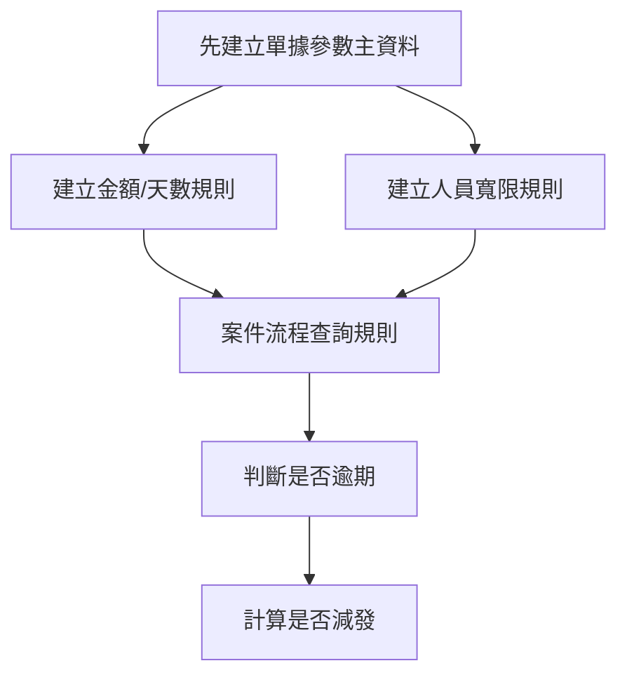
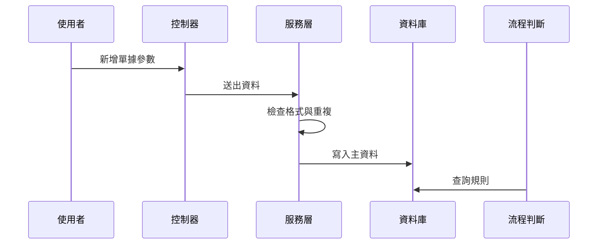

# Chapter 5：單據參數建檔主資料

接續上一章的 [多語係與關鍵字字典管理](04_多語係與關鍵字字典管理_.md)，我們已經知道系統如何把畫面文字與詞彙集中管理。  
這一章要進入更偏「業務規則」的核心：**單據參數建檔主資料**。

你可以先把它想成：

> **先把火車班表寫好，後面列車才知道什麼時候開、開到哪裡、超過幾天算逾期、要扣多少金額。**

---

## 這一章先解決什麼問題？

先想像一個很實際的情境：

某個流程需要設定：

- 哪一種單別要套用規則
- 哪一個表單要套用規則
- 生效日期從哪一天開始
- 逾期幾天才算有問題
- 超過後要減發多少金額
- 某些人員可以有幾天寬限期

如果這些規則都散落在各個功能裡，後面維護會很痛苦。  
所以系統會把這些共通規則先建成主資料，之後所有案件流程都直接引用。

這就是本章的重點：

> **把單據規則、逾期規則、金額規則先建檔，讓後續流程一致又好維護。**

---

## 你可以先把它想像成什麼？

把它想成一份「規則字典」：

- 規則不是每次臨時猜
- 而是先集中建檔
- 後面流程只要來查就好

這樣的好處是：

- 不容易重複設定
- 格式比較一致
- 方便查詢和比對
- 後續流程可以直接拿來判斷

---

## 本章會看到兩個主角

這一章主要看兩個主資料：

| 名稱 | 用途 | 類比 |
|---|---|---|
| `Txdfaa11` | 單逾期效獎減發金額建檔 | 規則班表 |
| `Txdfaa21` | 人員逾期天數寬限建檔 | 個人特例表 |

它們都屬於「單據參數」這一群資料。  
差別是：

- `Txdfaa11` 偏向**整體規則**
- `Txdfaa21` 偏向**某個人員的寬限規則**

---

## 一、先看最核心的使用情境

假設你今天要設定一條規則：

- 單別代號：`F001`
- 表單代號：`R001`
- 逾期天數：`30`
- 減發金額：`1000`
- 生效日期：`2026/04/01`

這代表：

> 從 2026/04/01 開始，只要這個單別、這個表單超過 30 天，就要減發 1000 元。

如果再補一條人員規則：

- 人員代號：`A1001`
- 單別代號：`F001`
- 表單代號：`R001`
- 寬限逾期天數：`5`
- 生效日期：`2026/04/01`

這代表：

> 這位人員比一般規則多 5 天寬限期。

---

## 二、整體流程先看一眼

先用一張圖看這兩種資料怎麼被使用：



你可以這樣理解：

- 先建規則
- 後面流程來查
- 查到後再決定要不要扣款、要不要放寬

---

## 三、先認識 `Txdfaa11`：單逾期效獎減發金額建檔

### 它在管什麼？

檔案位置：

- [`Txdfaa11`](fpg-vcpseos/src/main/java/com/fpg/f/domain/Txdfaa11.java)
- [`Txdfaa11Controller`](fpg-vcpseos/src/main/java/com/fpg/f/controller/Txdfaa11Controller.java)
- [`Txdfaa11ServiceImpl`](fpg-vcpseos/src/main/java/com/fpg/f/service/impl/Txdfaa11ServiceImpl.java)
- [`Txdfaa11Mapper`](fpg-vcpseos/src/main/java/com/fpg/f/mapper/Txdfaa11Mapper.java)

這個主資料用來設定：

- 單別代號
- 表單代號
- 逾期天數
- 減發金額
- 生效日期

你可以把它當成「一筆規則設定」。

---

### `Txdfaa11` 的欄位長什麼樣？

```java
private String slptypid;
private String frmid;
private Long ovddys;
```

這三個欄位分別代表：

- `slptypid`：單別代號
- `frmid`：表單代號
- `ovddys`：逾期天數

如果再加上金額與日期，就是完整規則：

```java
private Long dedamt;
private String efdat;
```

意思是：

- `dedamt`：要減發多少金額
- `efdat`：從哪一天開始生效

---

### 這筆資料怎麼讀？

假設資料是這樣：

- 單別代號：`F001`
- 表單代號：`R001`
- 逾期天數：`30`
- 減發金額：`1000`
- 生效日期：`2026/04/01`

你可以直接把它翻成白話：

> 如果 `F001` + `R001` 這組單據超過 30 天，就套用 1000 元減發規則，從 2026/04/01 開始生效。

---

## 四、`Txdfaa21`：人員逾期天數寬限建檔

### 它在管什麼？

檔案位置：

- [`Txdfaa21`](fpg-vcpseos/src/main/java/com/fpg/f/domain/Txdfaa21.java)
- [`Txdfaa21Controller`](fpg-vcpseos/src/main/java/com/fpg/f/controller/Txdfaa21Controller.java)
- [`Txdfaa21ServiceImpl`](fpg-vcpseos/src/main/java/com/fpg/f/service/impl/Txdfaa21ServiceImpl.java)
- [`Txdfaa21Mapper`](fpg-vcpseos/src/main/java/com/fpg/f/mapper/Txdfaa21Mapper.java)

這個主資料是給「人員」用的。  
它可以讓某個人有額外寬限天數。

主要欄位包括：

- 人員代號
- 人員姓名
- 單別代號
- 表單代號
- 寬限逾期天數
- 生效日期

---

### 它和 `Txdfaa11` 的差別是什麼？

可以這樣記：

- `Txdfaa11`：整體規則
- `Txdfaa21`：個人特例

例如：

- 一般規則：超過 30 天要減發
- 某位人員：可以多寬限 5 天

這很像學校的規定：

- 全校都要交作業
- 某些同學因特殊原因可延後幾天

---

## 五、先用最小範例理解資料長相

### `Txdfaa11` 的最小資料

```java
Txdfaa11 data = new Txdfaa11();
data.setSlptypid("F001");
data.setFrmid("R001");
```

這段的意思是：

- 建立一筆單據規則
- 指定單別與表單

再補上數字與日期：

```java
data.setOvddys(30L);
data.setDedamt(1000L);
data.setEfdat("2026/04/01");
```

這段的意思是：

- 逾期 30 天
- 減發 1000
- 2026/04/01 生效

---

### `Txdfaa21` 的最小資料

```java
Txdfaa21 data = new Txdfaa21();
data.setEmpid("A1001");
data.setSlptypid("F001");
data.setFrmid("R001");
```

這段的意思是：

- 指定某位人員
- 指定單別與表單

再補上寬限資訊：

```java
data.setOvddys(5L);
data.setEfdat("2026/04/01");
```

這段的意思是：

- 這位人員多 5 天寬限
- 從 2026/04/01 開始生效

---

## 六、這一章最重要的觀念：先建檔，再判斷

當案件流程開始跑時，不會自己亂猜規則。  
它會先去查這些主資料。

你可以把流程想成這樣：

1. 先查 `Txdfaa11`
2. 如果查到規則，就知道逾期幾天、扣多少錢
3. 再查 `Txdfaa21`
4. 如果查到人員寬限，就可以多給幾天
5. 最後再決定流程結果

這樣整個系統才會一致。

---

## 七、Controller 層：畫面送進來，先交給它

### `Txdfaa11Controller`

它負責：

- 查詢列表
- 匯出 Excel
- 查單筆
- 新增
- 修改
- 刪除

簡化後長得像這樣：

```java
@GetMapping("/list")
public TableDataInfo list(Txdfaa11 txdfaa11)
```

這表示：

- 前端送出查詢條件
- 後端回傳列表資料

再看新增：

```java
@PostMapping
public AjaxResult add(@RequestBody Txdfaa11 txdfaa11)
```

這表示：

- 前端送表單資料過來
- 後端新增一筆主資料

---

### `Txdfaa21Controller`

它負責的事情和 `Txdfaa11Controller` 類似，但多了一個人員 LOV 查詢。

```java
@GetMapping("/empLov/list")
public TableDataInfo empLovList(Txdfaa21 txdfaa21)
```

這代表：

- 除了主資料列表
- 還可以查人員下拉清單

這很像畫面上有一個人員選擇器，讓你從清單挑人。

---

## 八、Service 層：真正幫你檢查規則的地方

這一層很重要，因為它不只是轉呼叫資料庫，  
還會幫你做格式檢查、重複檢查、範圍檢查。

---

### `Txdfaa11ServiceImpl` 做了什麼？

檔案位置：

- [`Txdfaa11ServiceImpl`](fpg-vcpseos/src/main/java/com/fpg/f/service/impl/Txdfaa11ServiceImpl.java)

它在新增前會先做三件事：

1. 整理資料格式
2. 檢查欄位是否合法
3. 檢查是否重複

---

### 1. 先整理資料

```java
private void normalizeData(Txdfaa11 txdfaa11)
```

它會把資料做基本整理，例如：

- 單別代號轉大寫
- 表單代號轉大寫
- 生效日期去掉多餘空白

這樣能避免使用者輸入 `f001`、` F001 ` 這種不一致資料。

---

### 2. 再檢查資料是否合法

```java
if (txdfaa11.getOvddys() == null || txdfaa11.getOvddys() < 1)
```

意思是：

- 逾期天數不能空白
- 也不能小於 1

再看金額：

```java
if (txdfaa11.getDedamt() == null || txdfaa11.getDedamt() < 0)
```

意思是：

- 減發金額不能空白
- 不能小於 0

再看日期：

```java
LocalDate.parse(txdfaa11.getEfdat(), EFDAT_FORMATTER);
```

意思是：

- 生效日期必須符合 `YYYY/MM/DD`

---

### 3. 最後檢查是否重複

```java
if (txdfaa11Mapper.selectTxdfaa11ByUk(txdfaa11) != null)
```

這表示：

- 同一組單別、表單、生效日期不能重複
- 避免同一規則被建兩次

這很像資料字典裡不能有兩筆一模一樣的班表，不然大家會不知道該用哪筆。

---

## 九、`Txdfaa21ServiceImpl` 做了什麼？

檔案位置：

- [`Txdfaa21ServiceImpl`](fpg-vcpseos/src/main/java/com/fpg/f/service/impl/Txdfaa21ServiceImpl.java)

它跟 `Txdfaa11ServiceImpl` 很像，但多了人員代號。

新增前它會檢查：

- 人員代號不能空白
- 單別代號不能空白
- 表單代號不能空白
- 逾期天數要在合理範圍
- 生效日期格式要正確
- 同一組人員 + 單別 + 表單 + 生效日期不能重複

---

### 看一個簡單的驗證片段

```java
if (StringUtils.isBlank(txdfaa21.getEmpid()))
{
    throw new ServiceException("人員代號不可空白");
}
```

這段的意思是：

- 如果人員代號沒填
- 系統就直接擋下來

這樣可以避免錯誤資料進資料庫。

---

### 再看日期格式檢查

```java
LocalDate.parse(txdfaa21.getEfdat(), EFDAT_FORMATTER);
```

這代表：

- 系統會嘗試把字串轉成日期
- 如果格式不對，就丟出錯誤

所以使用者必須輸入像 `2026/04/01` 這樣的格式。

---

## 十、為什麼一定要做「唯一性檢查」？

這是單據參數建檔很重要的設計。

如果不檢查重複，可能會出現：

- 同一個單別有兩條規則
- 同一位人員有兩筆不同寬限
- 同一生效日期出現多個版本

這樣後續流程就不知道要用哪一筆。

所以系統會要求：

- `Txdfaa11`：單別 + 表單 + 生效日期唯一
- `Txdfaa21`：人員 + 單別 + 表單 + 生效日期唯一

你可以把它想成：

> 一張車票只能對應一個班次，不然乘客會搭錯車。

---

## 十一、資料存進去之後，後面怎麼用？

當主資料建好後，其他流程就可以查它。

例如某個案件流程要判斷：

1. 先找對應的單別與表單
2. 查 `Txdfaa11`
3. 看是否超過逾期天數
4. 再查 `Txdfaa21`
5. 看這個人是否有寬限
6. 最後計算是不是要減發

這代表這些主資料是後續判斷的地基。

---

## 十二、簡單看一個完整流程

下面這張圖可以幫你把整個概念串起來：



你可以把它理解成：

- 使用者先建規則
- 系統檢查後存起來
- 後面的業務流程再拿來判斷

---

## 十三、看看資料結構如何對應到 Excel 匯出

這兩個主資料都有加上 `@Excel` 註解：

```java
@Excel(name = "單別代號")
private String slptypid;
```

意思是：

- 匯出 Excel 時，欄位名稱會顯示成「單別代號」

這對管理者很方便，因為可以直接把資料匯出成表格檢查。

`Txdfaa11` 和 `Txdfaa21` 都可以這樣匯出，差別只是欄位不同。

---

## 十四、用最小的使用方式理解 API

### 查詢列表

```java
Txdfaa11 query = new Txdfaa11();
query.setSlptypid("F001");
```

這段的意思是：

- 要查單別 `F001` 的規則

查回來後，前端就可以把列表顯示出來。

---

### 新增資料

```java
Txdfaa11 data = new Txdfaa11();
data.setSlptypid("F001");
data.setFrmid("R001");
```

再送出：

- 系統會檢查欄位
- 檢查日期格式
- 檢查是否重複
- 通過後才新增

---

### 修改資料

```java
Txdfaa11 data = new Txdfaa11();
data.setXuid("A1B2C3");
data.setDedamt(1200L);
```

這表示：

- 找到原本那筆規則
- 把減發金額改成 1200

---

## 十五、這一章的兩個實體怎麼分工？

你可以用這個表來記：

| 實體 | 主要內容 | 使用情境 |
|---|---|---|
| `Txdfaa11` | 單別、表單、逾期天數、減發金額、生效日期 | 整體規則 |
| `Txdfaa21` | 人員、單別、表單、寬限天數、生效日期 | 個人特例 |

---

## 十六、內部實作怎麼想？先用白話講

當使用者按下「新增」時，系統大致會做這些事：

1. 前端送出表單
2. 控制器收到資料
3. 服務層先把字串整理乾淨
4. 服務層檢查欄位有沒有空白
5. 服務層檢查數字範圍是否合理
6. 服務層檢查日期格式
7. 服務層查重複
8. 沒問題才寫入資料庫

你可以把它想成：

> 先檢查通行證，再開門放人進去。

---

## 十七、看一點點程式內部

### `Txdfaa11ServiceImpl` 的新增流程

```java
normalizeData(txdfaa11);
validateData(txdfaa11);
if (txdfaa11Mapper.selectTxdfaa11ByUk(txdfaa11) != null)
{
    throw new ServiceException("新增失敗，相同單別/表單/生效日期資料已存在");
}
```

這段的意思是：

- 先整理格式
- 再驗證內容
- 再檢查是否重複

只要有一步不通過，就不會寫入資料庫。

---

### `Txdfaa21ServiceImpl` 的新增流程

```java
normalizeData(txdfaa21);
validateData(txdfaa21);
if (txdfaa21Mapper.selectTxdfaa21ByUk(txdfaa21) != null)
{
    throw new ServiceException("新增失敗，相同人員/單別/表單/生效日期資料已存在");
}
```

這段意思也一樣：

- 先整理
- 再檢查
- 最後才新增

只是這次多了「人員」這個維度。

---

## 十八、你最需要記住的幾個規則

### 1. 單據參數不是臨時寫死的

它是可建檔、可查詢、可維護的主資料。

---

### 2. `Txdfaa11` 是整體規則

它決定單別、表單、逾期天數、減發金額與生效日期。

---

### 3. `Txdfaa21` 是個人寬限規則

它讓某位人員可以有額外寬限天數。

---

### 4. 服務層會先檢查

格式、範圍、日期、重複性都會先檢查。

---

### 5. 後續流程會引用這些主資料

這些不是孤立資料，而是流程判斷的地基。

---

## 十九、本章小結

這一章我們學到了「單據參數建檔主資料」的核心概念：

- `Txdfaa11`：設定單別、表單、逾期天數、減發金額、生效日期
- `Txdfaa21`：設定人員的逾期天數寬限
- 控制器負責接收前端請求
- 服務層負責格式整理、驗證與重複檢查
- 資料建立後，後續案件流程就會引用這些規則來判斷

你可以把這一章記成一句話：

> **先把規則建好，後面的流程才知道要怎麼算、怎麼判斷、怎麼減發。**

下一章我們會繼續看更貼近節日與期限管理的內容：  
[假日與寬限設定管理](06_假日與寬限設定管理_.md)

---

Generated by [AI Codebase Knowledge Builder](https://github.com/The-Pocket/Tutorial-Codebase-Knowledge)