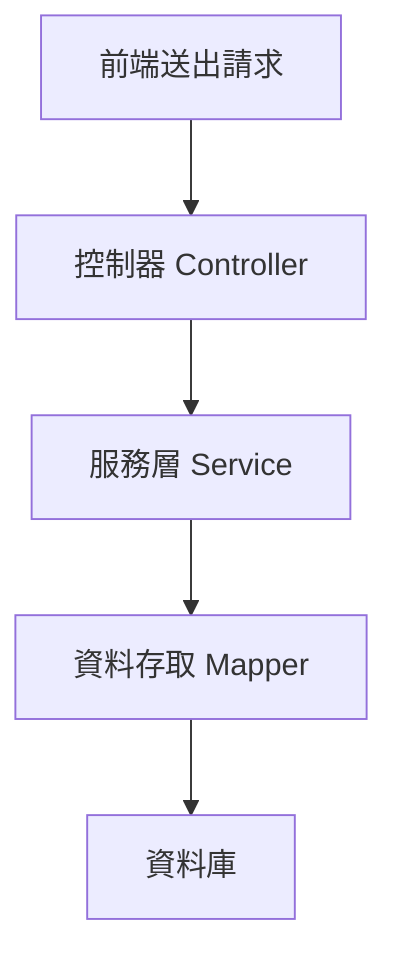
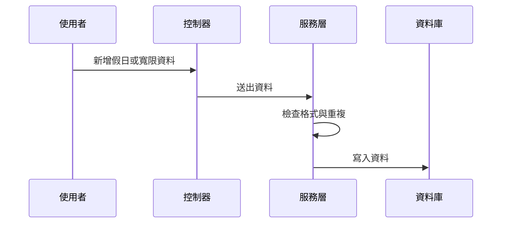

# Chapter 6：假日與寬限設定管理

接續上一章的 [單據參數建檔主資料](05_單據參數建檔主資料_.md)，我們已經知道系統會先把「逾期幾天、減發多少」這類規則建好。  
這一章要再往前一步，處理一個更細、也更容易出錯的問題：

> **時間到底怎麼算？哪些日子不算工作日？哪些人可以多寬限幾天？查詢時又要怎麼依年份或日期篩選？**

---

## 先用一個最常見的情境理解

假設有一份單據：

- 預計要在 2026/04/10 前完成
- 但 2026/04/10 是星期六
- 系統還有一份假日名單，列出哪些日期是假日
- 某位人員又被允許多 5 天寬限期

那系統就不能只用「今天減去到期日」這麼簡單去算。  
它還要先判斷：

1. 這一天是不是假日
2. 週末要不要算
3. 這個人有沒有額外寬限天數
4. 生效日期是不是已經開始
5. 查詢時要不要限定年份

所以這一章的重點可以記成一句話：

> **假日與寬限設定管理，就是把「時間怎麼算」先定好，後面的逾期天數才會算對。**

---

## 這一章你要先抓住的核心概念

這章主要有兩個資料主角：

| 名稱 | 作用 | 白話理解 |
|---|---|---|
| `Txdfaa31` | 假日建檔 | 哪些日期是假日 |
| `Txdfaa21` | 人員逾期天數寬限建檔 | 哪些人可以多幾天 |

它們都屬於「時間規則」的一部分。  
一個管日曆，一個管例外。

你可以把它們想成：

- `Txdfaa31`：行事曆上的紅字
- `Txdfaa21`：某些人的特別通融名單

---

## 本章要解決的中心問題

我們先把故事講清楚：

### 假設你要做一個逾期判斷功能

系統要知道：

- 某一天是不是假日
- 一整年週六、週日要不要先建成假日資料
- 某個人是否有寬限天數
- 查資料時是否只看某一年

如果沒有這些設定，系統可能會：

- 把週末也當工作日
- 把本來不該扣款的單據算成逾期
- 把某些人該有的寬限漏掉
- 查詢時把不同年份混在一起

這就是為什麼這一章非常重要。  
它不是在做花俏畫面，而是在打系統的時間地基。

---

## 一、整體架構先看一眼

這兩個功能雖然看起來簡單，但其實都有標準的三層式設計：



你可以先記住：

- `Controller`：接收畫面送來的資料
- `Service`：檢查規則、處理邏輯
- `Mapper`：真正跟資料庫溝通

這跟前面章節看到的模式是一樣的。  
如果你還記得 [前端介面與 API 對接](02_前端介面與_api_對接_.md)，這裡的 API 只是更偏向「時間與規則」的資料管理。

---

## 二、先看 `Txdfaa31`：假日建檔

### 1. 它在做什麼？

[`Txdfaa31`](fpg-vcpseos/src/main/java/com/fpg/f/domain/Txdfaa31.java) 是假日資料主檔。  
它主要記錄：

- 假日日期
- 備註
- 異動人員
- 異動時間
- 查詢年份

你可以把它想成一張假日卡片：

- 日期：2026/04/04
- 備註：清明連假
- 記錄是誰建的
- 什麼時候建的

---

### 2. `Txdfaa31` 的欄位很簡單

```java
private String hlddat;
private String xrem;
private String year;
```

這三個欄位的意思是：

- `hlddat`：假日日期
- `xrem`：備註
- `year`：查詢年份

這表示它不只是存單一日期，還可以依年份做查詢。

---

### 3. 為什麼要有年份欄位？

因為假日建檔通常是以「年度」來管理。  
例如你可能一次建立 2026 年整年的週六、週日，再補上國定假日。  
這樣查詢和維護都比較方便。

---

## 三、再看 `Txdfaa21`：人員逾期天數寬限建檔

### 1. 它在做什麼？

[`Txdfaa21`](fpg-vcpseos/src/main/java/com/fpg/f/domain/Txdfaa21.java) 是人員寬限資料主檔。  
它主要記錄：

- 人員代號
- 人員姓名
- 單別代號
- 表單代號
- 寬限逾期天數
- 生效日期

你可以把它想成一張「個人通融表」。

例如：

- 人員 `A1001`
- 單別 `F001`
- 表單 `R001`
- 寬限 5 天
- 2026/04/01 起生效

這表示這個人比一般規則多 5 天。

---

### 2. `Txdfaa21` 的欄位很直白

```java
private String empid;
private String slptypid;
private String frmid;
private Long ovddys;
private String efdat;
```

這幾個欄位的意思是：

- `empid`：人員代號
- `slptypid`：單別代號
- `frmid`：表單代號
- `ovddys`：寬限逾期天數
- `efdat`：生效日期

它的邏輯很簡單：

> 「這個人，針對這種單據，可以多等幾天。」

---

## 四、先用超簡單範例理解資料長相

### 例子 1：新增一筆假日

```java
Txdfaa31 data = new Txdfaa31();
data.setHlddat("2026/04/04");
data.setXrem("清明連假");
```

這段意思是：

- 建立一筆假日資料
- 日期是 2026/04/04
- 備註是清明連假

如果系統收到這筆資料，就會把它當成假日來處理。

---

### 例子 2：新增一筆人員寬限

```java
Txdfaa21 data = new Txdfaa21();
data.setEmpid("A1001");
data.setOvddys(5L);
```

這段意思是：

- 指定某位人員
- 這位人員多 5 天寬限

如果後面在算逾期天數時遇到這位人員，就要多給他 5 天。

---

## 五、這兩個資料怎麼幫你解決問題？

我們回到一開始的情境：

- 今天是 2026/04/10
- 到期日是 2026/04/08
- 2026/04/10 是週末
- 某位人員多 5 天寬限

系統可以先查：

1. `Txdfaa31`：2026/04/10 是否是假日
2. `Txdfaa21`：這位人員是否有寬限設定
3. 再根據查到的資料計算逾期天數

這樣就不會把週末或特例算錯。

---

## 六、先看 `Txdfaa31Controller`：假日功能怎麼被呼叫？

[`Txdfaa31Controller`](fpg-vcpseos/src/main/java/com/fpg/f/controller/Txdfaa31Controller.java) 提供了幾個常見功能：

- 查詢列表
- 匯出 Excel
- 查單筆
- 新增
- 修改
- 批次新增指定年份六、日
- 刪除

這裡最特別的是「批次新增指定年份六、日」，因為它能幫你一次把整年週六、週日建成假日資料。

---

### 1. 查詢列表

```java
@GetMapping("/list")
public TableDataInfo list(Txdfaa31 txdfaa31)
```

意思是：

- 前端把查詢條件送進來
- 後端回傳假日列表

如果你帶入年份 2026，系統就會查 2026 年的假日資料。

---

### 2. 匯出 Excel

```java
@PostMapping("/export")
public void export(HttpServletResponse response, Txdfaa31 txdfaa31)
```

意思是：

- 前端按下匯出
- 後端把查到的假日資料輸出成 Excel

這對管理者很實用，因為可以直接看整年的假日清單。

---

### 3. 批次新增週六、週日

```java
@PostMapping("/batchAdd/{year}")
public AjaxResult batchAdd(@PathVariable("year") String year)
```

這個功能非常重要。  
它可以一次建立某一年所有週六和週日的假日資料。

你可以把它想像成：

> 系統幫你先把整年度的週末都標好紅字。

---

## 七、`Txdfaa31ServiceImpl`：假日規則真正怎麼做？

現在來看真正的內部邏輯。  
[`Txdfaa31ServiceImpl`](fpg-vcpseos/src/main/java/com/fpg/f/service/impl/Txdfaa31ServiceImpl.java) 是這個功能的核心。

它做的事情可以分成三類：

1. 查詢時先整理條件
2. 新增或修改時先檢查格式
3. 批次新增時自動產生整年的週六、週日

---

### 1. 查詢前先整理年份

```java
private void normalizeQueryData(Txdfaa31 txdfaa31)
```

它會把年份去掉多餘空白。  
例如使用者輸入 ` 2026 `，系統會先整理成 `2026`。

這種小動作很重要，因為可以避免查詢條件不一致。

---

### 2. 新增前先檢查日期格式

```java
if (StringUtils.isBlank(txdfaa31.getHlddat()))
{
    throw new ServiceException("日期不可空白");
}
```

這表示：

- 假日日期不能空白
- 沒填就不能存

再看日期格式檢查：

```java
LocalDate.parse(txdfaa31.getHlddat(), HLDDAT_FORMATTER);
```

這表示：

- 日期必須是 `YYYY/MM/DD`
- 格式錯就會報錯

---

### 3. 避免重複假日資料

```java
if (txdfaa31Mapper.selectTxdfaa31ByUk(txdfaa31) != null)
{
    throw new ServiceException("新增失敗，相同日期資料已存在");
}
```

意思是：

- 同一天不能重複建兩筆假日
- 避免資料混亂

這很像日曆上同一天不能貼兩張不同紅紙，否則會看不懂。

---

## 八、批次新增週六、週日是怎麼做的？

這是本章最有趣的部分。  
[`Txdfaa31ServiceImpl`](fpg-vcpseos/src/main/java/com/fpg/f/service/impl/Txdfaa31ServiceImpl.java) 裡有一個 `batchAddByYear` 方法，專門負責這件事。

它的邏輯可以白話理解成：

1. 先檢查年份格式
2. 先刪掉這一年原本的假日資料
3. 從 1 月 1 日一路跑到 12 月 31 日
4. 每一天都檢查是不是星期六或星期日
5. 如果是，就加入假日清單
6. 最後一次批次寫入資料庫

---

### 1. 先檢查年份格式

```java
if (!normalizedYear.matches("^\\d{4}$"))
{
    throw new ServiceException("年份格式需為 4 碼數字");
}
```

意思是：

- 年份只能是 4 碼數字
- 例如 `2026` 可以
- `26` 不行
- `2026年` 也不行

---

### 2. 先刪掉原本該年的資料

```java
txdfaa31Mapper.deleteTxdfaa31ByYear(normalizedYear);
```

這一步很重要。  
因為如果你要重新產生整年的週末資料，就要先把舊資料刪掉，避免重複。

---

### 3. 逐日檢查是不是週末

```java
if (date.getDayOfWeek() == DayOfWeek.SATURDAY || date.getDayOfWeek() == DayOfWeek.SUNDAY)
```

這句的意思是：

- 如果是星期六或星期日
- 就把它當成假日

這就像日曆自動幫你把週末畫成紅色。

---

### 4. 批次寫入資料庫

```java
txdfaa31Mapper.batchInsertTxdfaa31(holidayList);
```

意思是：

- 一次把全部週末資料寫進去
- 比一筆一筆新增快很多

---

## 九、`Txdfaa21Controller`：人員寬限功能怎麼被呼叫？

[`Txdfaa21Controller`](fpg-vcpseos/src/main/java/com/fpg/f/controller/Txdfaa21Controller.java) 是人員逾期天數寬限的入口。

它提供：

- 查詢列表
- 人員 LOV 列表
- 匯出 Excel
- 查單筆
- 新增
- 修改
- 刪除

其中「人員 LOV 列表」是給畫面上拉選單用的。  
你可以把它想成一份可供挑選的人員清單。

---

### 1. 查詢列表

```java
@GetMapping("/list")
public TableDataInfo list(Txdfaa21 txdfaa21)
```

意思是：

- 查人員寬限資料
- 可以依條件篩選

---

### 2. 人員 LOV 列表

```java
@GetMapping("/empLov/list")
public TableDataInfo empLovList(Txdfaa21 txdfaa21)
```

這表示：

- 畫面可以拿這份清單做下拉選擇
- 方便快速選人員

---

### 3. 新增與修改時自動帶入異動人員

```java
txdfaa21.setTxemp(getUsername());
```

意思是：

- 系統會自動記錄是誰操作的
- 不需要使用者手動輸入

這就像管理系統自動幫你蓋章。

---

## 十、`Txdfaa21ServiceImpl`：人員寬限怎麼驗證？

[`Txdfaa21ServiceImpl`](fpg-vcpseos/src/main/java/com/fpg/f/service/impl/Txdfaa21ServiceImpl.java) 會在新增與修改前做很多檢查。

---

### 1. 先整理資料

```java
private void normalizeData(Txdfaa21 txdfaa21)
```

它會把：

- 人員代號
- 單別代號
- 表單代號

轉成標準格式。  
例如去空白、轉大寫。

這樣可以避免輸入 ` a1001 ` 這種不一致資料。

---

### 2. 檢查人員代號、單別、表單是否空白

```java
if (StringUtils.isBlank(txdfaa21.getEmpid()))
{
    throw new ServiceException("人員代號不可空白");
}
```

這代表：

- 沒有填人員代號就不能存

同理，單別與表單也都不能空白。

---

### 3. 檢查寬限天數範圍

```java
if (txdfaa21.getOvddys() == null || txdfaa21.getOvddys() < 0 || txdfaa21.getOvddys() > 999)
```

這表示：

- 寬限天數不能空白
- 不能小於 0
- 不能大於 999

這樣可以避免輸入不合理的數字。

---

### 4. 檢查生效日期格式

```java
LocalDate.parse(txdfaa21.getEfdat(), EFDAT_FORMATTER);
```

意思是：

- 生效日期要符合 `YYYY/MM/DD`

如果輸入格式錯，系統就會直接擋下來。

---

### 5. 檢查是否重複

```java
if (txdfaa21Mapper.selectTxdfaa21ByUk(txdfaa21) != null)
```

這表示：

- 同一個人員、單別、表單、生效日期不能重複
- 避免同一個特例被建兩次

---

## 十一、這兩個功能怎麼一起工作？

現在把它們放在一起看：

- `Txdfaa31` 管「哪一天是假日」
- `Txdfaa21` 管「某些人可以多等幾天」

當系統在算逾期時，就會先查假日，再查寬限。

你可以把它想像成：

> 日曆先告訴你今天是不是休假，再由主管名單告訴你某些人是不是可以晚一點交。

---

## 十二、用一個完整的小例子看整個流程

### 情境

- 到期日：2026/04/08
- 今天：2026/04/10
- 今天是週六
- 人員 `A1001` 有 5 天寬限

### 系統會怎麼想？

1. 先查 `Txdfaa31`
   - 2026/04/10 是不是假日？
   - 如果是，今天可能不算逾期日
2. 再查 `Txdfaa21`
   - `A1001` 是否有寬限？
   - 如果有，再多給 5 天
3. 最後再決定是否真的逾期

這樣算出來的結果就會比單純看日期準很多。

---

## 十三、內部流程先用簡單序列圖看



這張圖的意思很簡單：

- 使用者送資料
- 控制器收資料
- 服務層先檢查
- 通過才寫入資料庫

這樣可以減少錯誤資料進系統。

---

## 十四、看一點點內部實作

### `Txdfaa31ServiceImpl`：批次新增週末

```java
for (LocalDate date = start; !date.isAfter(end); date = date.plusDays(1))
{
    if (date.getDayOfWeek() == DayOfWeek.SATURDAY || date.getDayOfWeek() == DayOfWeek.SUNDAY)
```

這段意思是：

- 從年初走到年尾
- 每一天都檢查是不是週末

這就像你一頁一頁翻整年行事曆，看到週六、週日就畫紅。

---

### `Txdfaa21ServiceImpl`：檢查生效日期

```java
try
{
    LocalDate.parse(txdfaa21.getEfdat(), EFDAT_FORMATTER);
}
catch (DateTimeParseException e)
{
    throw new ServiceException("生效日期格式需為 YYYY/MM/DD");
}
```

這段意思是：

- 先試著把字串轉日期
- 失敗就代表格式錯誤

這可以避免使用者輸入奇怪的日期格式。

---

## 十五、這些資料和前一章有什麼關係？

上一章的 [單據參數建檔主資料](05_單據參數建檔主資料_.md) 是在定大規則：  
逾期幾天、減發多少。

這一章則是在補「時間面」的細節：

- 哪些日子不算工作日
- 哪些人可以延後幾天
- 查詢時如何限定年份

你可以這樣理解：

> 前一章定「算什麼」，這一章定「怎麼算」。

---

## 十六、初學者最容易搞混的地方

### 1. 假日建檔不是只存國定假日

它也可以批次產生週六、週日。

---

### 2. 人員寬限不是全系統通用

它通常是針對某個人、某個單別、某個表單的特例。

---

### 3. `Service` 層不只是存資料

它會先檢查格式、範圍、重複性，這很重要。

---

### 4. 年份查詢不是日期查詢

年份是用來快速整理整年度資料。  
日期則是實際的假日日期。

---

## 十七、你可以怎麼記住這一章？

最簡單的記法是：

1. **`Txdfaa31` 管假日**
2. **`Txdfaa21` 管寬限**
3. **假日先建好，後面算逾期才不會錯**
4. **人員特例先建好，後面判斷才會準**

---

## 十八、本章小結

這一章我們認識了「假日與寬限設定管理」的核心概念：

- `Txdfaa31`：管理假日日期，還能批次建立整年週末資料
- `Txdfaa21`：管理人員的逾期天數寬限
- 控制器負責接收請求與回傳結果
- 服務層負責日期格式、重複資料、範圍與生效日檢查
- 這些設定會直接影響後面逾期天數與扣款判斷

你可以把這一章記成一句話：

> **先把假日和寬限規則建好，系統在算逾期時才會知道哪些天要跳過、哪些人可以多等。**

下一章我們會繼續往下看通知與名單設定，了解當系統算完規則後，要怎麼把消息送給對的人：  
[通知名單與收件部門設定](07_通知名單與收件部門設定_.md)

---

Generated by [AI Codebase Knowledge Builder](https://github.com/The-Pocket/Tutorial-Codebase-Knowledge)