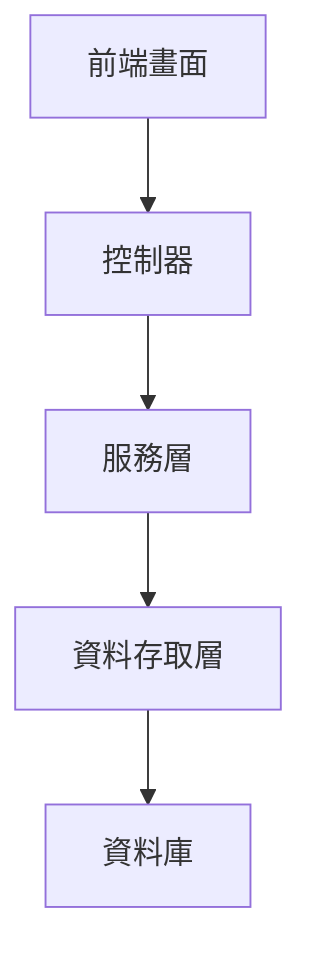
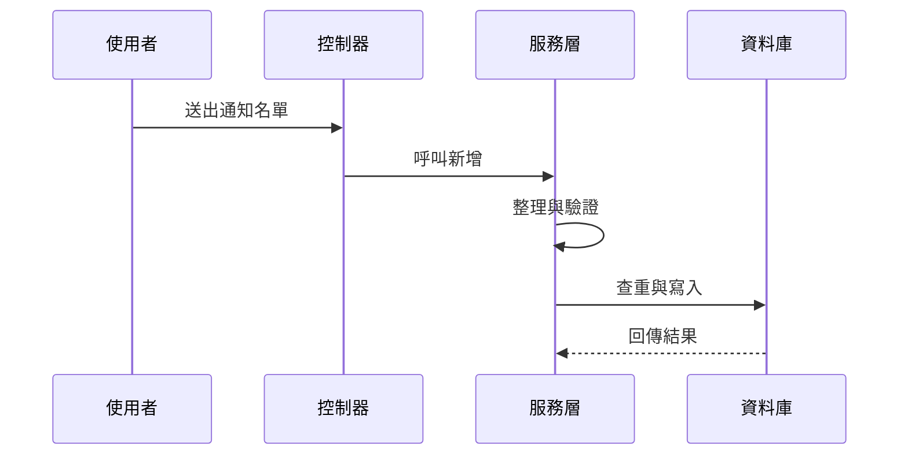

# Chapter 7：通知名單與收件部門設定

接續上一章的 [假日與寬限設定管理](06_假日與寬限設定管理_.md)，我們已經知道系統會先把時間與逾期規則算好。  
這一章要進一步處理一個很實際、也很關鍵的問題：

> **當案件真的發生時，要通知誰？要通知哪個部門？前端下拉選單又要怎麼讓使用者選得準？**

你可以把這一章想成一份「系統通訊錄」：

- 有哪些人要收通知
- 哪些部門要收通知
- 前端怎麼用下拉清單快速選人、選部門
- 系統怎麼避免重複設定
- 建檔後如何讓後續流程穩定使用

---

## 這一章先從最常見的情境開始

假設某個案件建立後，系統要寄通知信或推送提醒。  
如果通知名單沒設定好，就可能發生這些問題：

- 該收到的人沒收到
- 不該收到的人一直收到
- 部門對應錯誤
- 前端手打代碼打錯
- 後續案件流轉卡住

所以這一章的核心就是：

> **先把通知人員與收件部門建檔好，讓案件一發生時，系統知道該通知誰、發給哪個部門。**

---

## 先用白話理解這個功能

你可以把它想成活動主辦方的聯絡名單：

- 哪幾位主要聯絡人要收到消息
- 哪些部門需要同步知會
- 名單不能亂填，最好用下拉選單挑選
- 同一個人和部門的組合不能重複

這樣活動一開始，大家才知道簡訊要發給誰、郵件要抄送誰。

---

## 這一章的主角是什麼？

本章主要看這幾個類別：

| 名稱 | 作用 | 白話理解 |
|---|---|---|
| `Txdfaa41` | 案件資料通知人員建檔 | 通知名單主檔 |
| `Txdfaa41EmpLov` | 人員下拉清單 | 可選通知人員名單 |
| `Txdfaa41DeptLov` | 部門下拉清單 | 可選收件部門名單 |
| `Txdfaa41Controller` | 畫面入口 | 收送資料的櫃台 |
| `Txdfaa41ServiceImpl` | 規則處理 | 驗證、整理、存檔 |
| `Txdfaa41Mapper` | 資料存取 | 跟資料庫溝通 |

---

## 一、先看整體架構

這個功能和前面章節一樣，也是標準的三層式設計：



你可以先記住：

- **前端畫面**：讓使用者選人、選部門、輸入備註
- **控制器**：接收請求
- **服務層**：檢查資料、避免重複
- **資料存取層**：真正讀寫資料庫

---

## 二、這個功能到底在管什麼？

[`Txdfaa41`](fpg-vcpseos/src/main/java/com/fpg/f/domain/Txdfaa41.java) 是本章最重要的資料物件。

它記錄的不是案件本身，而是：

- 哪個人要收到通知
- 哪個部門要收到通知
- 是否有備註
- 異動人員與異動時間

你可以把它看成一張通知通訊錄卡片。

---

### `Txdfaa41` 的資料長什麼樣？

```java
private String xuid;
private String empid;
private String rcvdept;
private String xrem;
```

這四個欄位的意思是：

- `xuid`：這筆資料的唯一識別碼
- `empid`：人員代號
- `rcvdept`：收件部門
- `xrem`：備註

如果翻成白話，就是：

> 這一筆設定，指定某個人、某個部門來接收案件通知。

---

## 三、先從最簡單的使用情境理解

假設你要新增一筆通知設定：

- 人員代號：`A1001`
- 收件部門：`D001`
- 備註：`主要聯絡人`

那系統就會把它存成一筆通知名單資料。

你可以先用這種最小概念理解：

```java
Txdfaa41 data = new Txdfaa41();
data.setEmpid("A1001");
data.setRcvdept("D001");
```

這段意思是：

- 建立一筆通知資料
- 指定通知人員為 `A1001`
- 指定收件部門為 `D001`

接下來服務層會幫你做檢查與存檔。  
你不用自己直接碰資料庫。

---

## 四、為什麼還要有 `LOV`？

`LOV` 可以先理解成「可選清單」。  
它的用途是讓前端不用手打代碼，而是直接選。

如果沒有 `LOV`，使用者可能會輸入：

- 人員代號打錯
- 部門代號少一碼
- 名稱和代號不一致

有了 `LOV`，前端就可以下拉選擇，減少錯誤。

---

### 1. 人員下拉清單：`Txdfaa41EmpLov`

這個類別很簡單：

```java
private String empid;
private String empnm;
```

意思是：

- `empid`：人員代號
- `empnm`：人員姓名

這就是前端下拉選單常用的資料格式。  
畫面可以顯示姓名，實際送出代號。

例如：

- 顯示：王小明
- 實際值：`A1001`

---

### 2. 部門下拉清單：`Txdfaa41DeptLov`

這個類別也一樣簡單：

```java
private String rcvdept;
private String rcvdeptnm;
```

意思是：

- `rcvdept`：收件部門代號
- `rcvdeptnm`：收件部門名稱

例如：

- 顯示：資訊部
- 實際值：`D001`

---

## 五、前端使用時會看到什麼？

前端通常會有這些元件：

- 人員下拉選單
- 部門下拉選單
- 備註欄位
- 查詢列表
- 新增與修改按鈕

使用者在畫面上通常會做這些事：

1. 從人員清單選一個人
2. 從部門清單選一個部門
3. 輸入備註
4. 按下新增
5. 系統檢查是否重複
6. 通過後存檔

這整個過程就像填通訊錄。

---

## 六、控制器 `Txdfaa41Controller` 負責什麼？

[`Txdfaa41Controller`](fpg-vcpseos/src/main/java/com/fpg/f/controller/Txdfaa41Controller.java) 是前端和後端之間的入口。

它提供幾個很常見的功能：

- 查詢通知名單列表
- 查詢人員 LOV
- 查詢部門 LOV
- 匯出 Excel
- 查單筆
- 新增
- 修改
- 刪除

---

### 1. 查詢列表

```java
@GetMapping("/list")
public TableDataInfo list(Txdfaa41 txdfaa41)
```

這表示：

- 前端送查詢條件過來
- 後端回傳通知名單列表

例如查某個人或某個部門的設定，就會用這支 API。

---

### 2. 查人員下拉清單

```java
@GetMapping("/empLov/list")
public TableDataInfo empLovList(Txdfaa41 txdfaa41)
```

這表示：

- 前端要拿人員選單資料
- 後端回傳可選人員清單

---

### 3. 查部門下拉清單

```java
@GetMapping("/deptLov/list")
public TableDataInfo deptLovList(Txdfaa41 txdfaa41)
```

這表示：

- 前端要拿部門選單資料
- 後端回傳可選部門清單

---

### 4. 新增資料

```java
@PostMapping
public AjaxResult add(@RequestBody Txdfaa41 txdfaa41)
```

這表示：

- 前端送出新增表單
- 後端新增一筆通知名單

---

## 七、服務層 `Txdfaa41ServiceImpl` 才是真正的重點

控制器只是接資料，真正幫你判斷資料可不可以存的是服務層。  
[`Txdfaa41ServiceImpl`](fpg-vcpseos/src/main/java/com/fpg/f/service/impl/Txdfaa41ServiceImpl.java) 會做三件重要的事：

1. 整理資料格式
2. 驗證資料長度與必填欄位
3. 檢查是否重複

---

### 1. 先整理資料

```java
private void normalizeData(Txdfaa41 txdfaa41)
```

它會把資料整理成比較乾淨的格式，例如：

- 人員代號轉大寫
- 部門代號轉大寫
- 備註去除前後空白

這樣就不會因為輸入格式不一致而造成問題。

---

### 2. 再檢查必填欄位

```java
if (StringUtils.isBlank(txdfaa41.getEmpid()))
{
    throw new ServiceException("人員代號不可空白");
}
```

意思是：

- 人員代號一定要填
- 沒填就不能存

同樣地，部門代號也一定要填。

---

### 3. 再檢查長度

```java
if (txdfaa41.getEmpid().length() > 10)
{
    throw new ServiceException("人員代號長度不可超過 10 碼");
}
```

這表示：

- 人員代號不能太長
- 系統會先幫你擋掉不合理的資料

備註也是一樣，不能超過 50 碼。

---

### 4. 最後檢查重複

```java
if (txdfaa41Mapper.selectTxdfaa41ByUk(txdfaa41) != null)
{
    throw new ServiceException("新增失敗，相同人員/收件部門資料已存在");
}
```

這是很重要的規則。

意思是：

- 同一個人員和同一個收件部門，不可以重複建兩次
- 不然通知設定會亂掉

你可以把它想成：

> 同一張聯絡卡，不需要重複存兩份。

---

## 八、為什麼要做這些檢查？

因為通知名單不是一般備忘錄，而是會真的影響流程的資料。

如果資料錯了，可能會導致：

- 該通知的人沒收到
- 同一個人收到兩次
- 部門寫錯，通知發不到正確單位
- 後續審核或流轉延誤

所以服務層一定要嚴格把關。

---

## 九、資料庫層 `Txdfaa41Mapper` 在做什麼？

[`Txdfaa41Mapper`](fpg-vcpseos/src/main/java/com/fpg/f/mapper/Txdfaa41Mapper.java) 負責真正跟資料庫互動。

它提供這些方法：

- 查單筆
- 查唯一性
- 查列表
- 查人員 LOV
- 查部門 LOV
- 新增
- 修改
- 刪除

---

### 1. 查唯一性

```java
public Txdfaa41 selectTxdfaa41ByUk(Txdfaa41 txdfaa41);
```

這個方法就是拿來檢查：

- 這個人員和部門組合是不是已經存在

---

### 2. 查人員 LOV

```java
public List<Txdfaa41EmpLov> selectEmpLovList(Txdfaa41 txdfaa41);
```

這個方法就是回傳：

- 可供前端下拉選擇的人員清單

---

### 3. 查部門 LOV

```java
public List<Txdfaa41DeptLov> selectDeptLovList(Txdfaa41 txdfaa41);
```

這個方法就是回傳：

- 可供前端下拉選擇的部門清單

---

## 十、整個新增流程長什麼樣子？

你可以把它想成一個簡單的門診掛號流程：

1. 使用者在畫面上選人員和部門
2. 按下新增
3. 控制器接到資料
4. 服務層先整理、驗證
5. 服務層查重
6. 沒問題就寫入資料庫
7. 回傳成功訊息

下面用簡單的流程圖看：



這個流程的重點是：

> **先檢查，再存檔。**

---

## 十一、看一個最小的實際使用例子

假設你要建立一筆通知資料：

- 人員代號：`A1001`
- 收件部門：`D001`
- 備註：`主要聯絡人`

你可以想像成這樣：

```java
Txdfaa41 data = new Txdfaa41();
data.setEmpid("A1001");
data.setRcvdept("D001");
data.setXrem("主要聯絡人");
```

這段的意思是：

- 建立通知名單
- 指定這位人員
- 指定這個部門
- 加上一點備註

接下來送到服務層後，系統會：

- 檢查格式
- 檢查長度
- 檢查是否重複
- 再決定能不能存

---

## 十二、如果是修改資料呢？

修改流程也很像新增，只是多了一個主鍵 `xuid`。

```java
Txdfaa41 data = new Txdfaa41();
data.setXuid("A1B2C3");
data.setEmpid("A1001");
data.setRcvdept("D002");
```

這表示：

- 你要修改 `A1B2C3` 這筆資料
- 把收件部門改成 `D002`

服務層會先確認：

- 主鍵是否存在
- 修改後是否和別筆資料重複

如果沒問題，才會更新。

---

## 十三、前端為什麼很需要 `LOV`？

因為通知名單這種資料很適合用選單選，不適合讓使用者自由亂打。

例如：

- 人員代號可能很長
- 部門代號容易打錯
- 中文名稱與代號容易不一致

有了 `LOV` 後，畫面可以：

- 顯示姓名或部門名稱
- 實際送出代碼
- 減少錯誤

這就像你在超商結帳時，掃條碼比手打商品編號快很多，也不容易錯。

---

## 十四、和前面章節的關係

這一章其實和前面幾章關係很密切：

- [前端介面與 API 對接](02_前端介面與_api_對接_.md)：前端怎麼呼叫 `/f/faa4` 的 API
- [參考資料與欄位對照平台](03_參考資料與欄位對照平台_.md)：欄位名稱、顯示名稱怎麼規劃
- [多語係與關鍵字字典管理](04_多語係與關鍵字字典管理_.md)：若通知訊息要多語顯示，也會用到文字字典
- [單據參數建檔主資料](05_單據參數建檔主資料_.md)：案件規則建好後，通知資料才知道怎麼搭配
- [假日與寬限設定管理](06_假日與寬限設定管理_.md)：時間算完後，通知才知道何時發出

你可以把這一章想成：

> **案件規則算完之後，終於輪到通知名單登場。**

---

## 十五、內部實作是怎麼跑的？

先用非常簡單的步驟看：

1. 前端打開通知名單畫面
2. 前端呼叫 `/f/faa4/list` 或 LOV API
3. 後端回傳人員或部門清單
4. 使用者挑好資料送出
5. 服務層整理格式
6. 驗證必填欄位與長度
7. 查重
8. 寫入資料庫

這整個流程很像在整理通訊錄：

- 先拿到可選名單
- 再選人選部門
- 最後確認不能重複

---

## 十六、再看一點點內部程式

### `insertTxdfaa41` 的核心邏輯

```java
normalizeData(txdfaa41);
validateData(txdfaa41);
if (txdfaa41Mapper.selectTxdfaa41ByUk(txdfaa41) != null)
{
    throw new ServiceException("新增失敗，相同人員/收件部門資料已存在");
}
```

這段的意思是：

- 先整理
- 再驗證
- 再查重
- 沒問題才新增

---

### `validateData` 的基本檢查

```java
if (StringUtils.isBlank(txdfaa41.getRcvdept()))
{
    throw new ServiceException("收件部門不可空白");
}
```

意思是：

- 收件部門一定要填
- 不然就不能存

這樣可以避免通知發錯地方。

---

## 十七、初學者最容易搞混的地方

### 1. `Txdfaa41` 不是案件本身

它只是通知名單設定，不是案件資料。

---

### 2. `Txdfaa41EmpLov` 和 `Txdfaa41DeptLov` 不是主檔

它們只是下拉清單資料，方便前端選擇。

---

### 3. `xuid` 是主鍵，不是人員代號

它是這筆通知資料本身的唯一識別碼。

---

### 4. 重複檢查是看人員 + 部門組合

不是只看人員，也不是只看部門，而是兩者一起看。

---

## 十八、你可以怎麼記住這一章？

最簡單的記法是：

1. **`Txdfaa41` 是通知名單主檔**
2. **`Txdfaa41EmpLov` 是人員下拉清單**
3. **`Txdfaa41DeptLov` 是部門下拉清單**
4. **新增前一定要查重**
5. **前端用下拉選單，避免手打錯誤**

---

## 十九、本章小結

這一章我們學到了「通知名單與收件部門設定」的核心概念：

- `Txdfaa41`：管理案件通知的人員與收件部門
- `Txdfaa41EmpLov`：提供前端人員下拉選單
- `Txdfaa41DeptLov`：提供前端部門下拉選單
- `Controller`：負責接收前端請求與回傳結果
- `Service`：負責格式整理、必填檢查、長度限制與重複檢查
- `Mapper`：負責查詢、寫入與刪除資料

你可以把這一章記成一句話：

> **先把通知的人和部門建好，案件發生時系統才知道該通知誰、送到哪裡。**

下一章我們會繼續看更貼近實際業務資料的內容：  
[廠商與報到資料維護](08_廠商與報到資料維護_.md)

---

Generated by [AI Codebase Knowledge Builder](https://github.com/The-Pocket/Tutorial-Codebase-Knowledge)