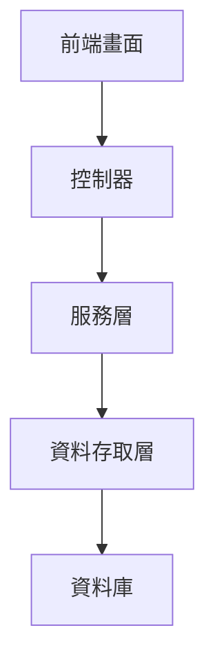
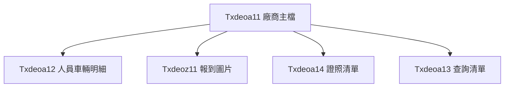
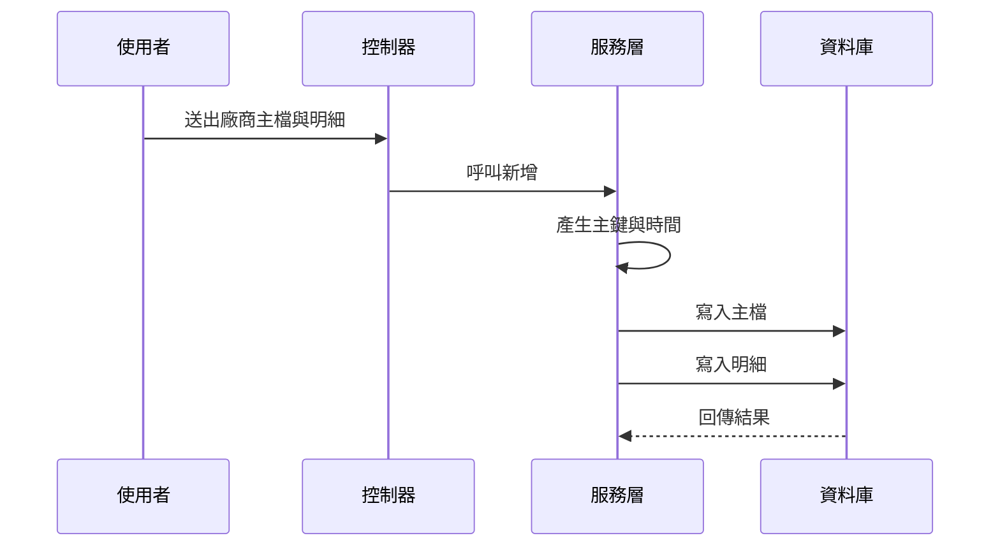
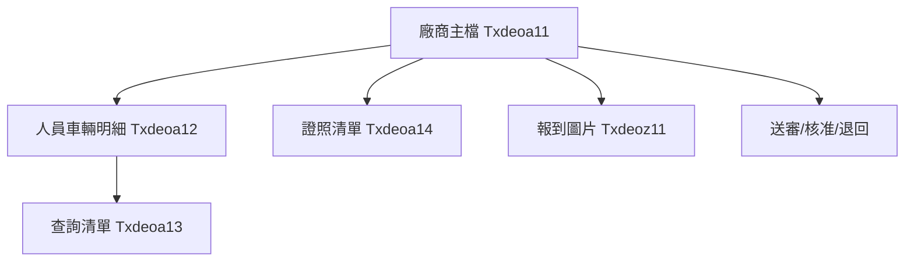

# Chapter 8：廠商與報到資料維護

接續上一章的 [通知名單與收件部門設定](07_通知名單與收件部門設定_.md)，我們已經知道系統怎麼把消息送給對的人。  
這一章要回到更貼近現場作業的主題：**廠商與報到資料維護**。

你可以先把這一章想成工程現場的「承包商管理櫃檯」：

- 先建廠商主檔
- 再掛上人員、車輛、證照
- 需要時上傳報到圖片
- 最後進行審核與送審

這一章要解決的中心問題是：

> **當一個外部廠商要進場時，系統要怎麼把他們的基本資料、聯絡人、車輛、證照、報到圖片和審核狀態整理好，讓現場人員查得到、審核流程跑得動？**

---

## 這一章先用一個最常見的情境來理解

假設有一家外部廠商要到現場施工。  
現場管理人員需要知道：

1. 這家廠商叫什麼名字
2. 聯絡人是誰
3. 來了哪些人、開了哪些車
4. 人員和車輛有沒有證照
5. 到場時有沒有拍照報到
6. 這筆資料現在是草稿、送審中、核准，還是退回

如果沒有這套維護功能，現場就會變成：

- 資料散在紙本
- 人員和車輛對不起來
- 證照過期也不知道
- 報到圖片找不到
- 審核進度無法追蹤

所以這一章的核心就是：

> **把廠商資料做成「主子表結構」：主檔像總戶口，底下的明細像成員清單，主檔一動，明細也要跟著對齊。**

---

## 你可以先把它想像成什麼？

把它想成一個「現場報到櫃檯」：

- **廠商主檔**：這家公司是誰
- **人員車輛明細**：今天來了哪些人、哪些車
- **證照明細**：人或車是否具備合法證明
- **報到圖片**：現場實際到場的證據
- **審核狀態**：這筆報到資料是不是已被核准

這樣一來，現場人員不用到處翻資料，只要查一筆，就能看到完整內容。

---

## 本章會看到哪些核心資料？

本章主要會看到這幾個資料物件：

| 名稱 | 用途 | 白話理解 |
|---|---|---|
| `Txdeoa11` | 承攬廠商建檔及審核 | 廠商主檔 |
| `Txdeoa12` | 承攬廠商人員車輛建檔 | 明細：人員與車輛 |
| `Txdeoa13` | 廠商人員車輛清單 | 查詢用清單 |
| `Txdeoa14` | 證照與複訓證明清單 | 證照清單 |
| `Txdeoz11` | 廠商報到圖片上傳檔 | 報到照片 |

你可以先用一句話記住：

> **`Txdeoa11` 是主檔，`Txdeoa12`、`Txdeoa13`、`Txdeoa14`、`Txdeoz11` 都是在幫它補完整個現場報到故事。**

---

## 一、整體架構先看一眼

這一章的功能還是很標準的三層式設計：



你可以把它理解成：

- **前端畫面**：讓使用者輸入廠商資料、上傳圖片、按下送審
- **控制器**：接收請求
- **服務層**：處理主子表邏輯、資料補值、狀態流轉
- **資料存取層**：真正把資料寫進資料庫

---

## 二、先認識主角：`Txdeoa11` 廠商主檔

[`Txdeoa11`](fpg-vcpseos/src/main/java/com/fpg/a/domain/Txdeoa11.java) 是這一章最重要的資料物件。  
它代表一筆廠商主資料，也可以搭配審核流程使用。

### 它主要記錄什麼？

- 廠商編號
- 廠商名稱
- 聯絡人
- 電話
- Email
- Logo 圖片路徑
- 異動人員
- 異動時間
- 底下的明細清單

---

### `Txdeoa11` 的核心欄位

```java
private String xuid;
private String vndno;
private String vndnm;
private String ctm;
```

這幾個欄位意思是：

- `xuid`：這筆主檔的唯一識別碼
- `vndno`：廠商編號
- `vndnm`：廠商名稱
- `ctm`：聯絡人

白話來說就是：

> 這家公司是誰、編號多少、名稱是什麼、聯絡人是誰。

---

### 再補幾個常見欄位

```java
private String tel;
private String email;
private String logourl;
```

這表示：

- `tel`：電話
- `email`：信箱
- `logourl`：Logo 圖片位置

這些資訊有助於現場聯絡與資料識別。

---

### 為什麼 `Txdeoa11` 這麼重要？

因為它是主檔。  
底下很多明細都要靠它的 `xuid` 去對應。

你可以把 `xuid` 想成：

> 一個家庭戶口的戶號。  
> 所有家庭成員的資料，都要掛在這個戶號底下。

---

## 三、`Txdeoa11` 底下還掛著一串明細

主檔最大特色就是下面可以掛子資料。  
在 `Txdeoa11` 裡，最重要的子表是：

```java
private List<Txdeoa12> txdeoa12List;
```

這表示：

- 一筆廠商主檔
- 可以有多筆人員或車輛明細

這就是典型的**主子表結構**。

---

## 四、`Txdeoa12`：承攬廠商人員車輛建檔

[`Txdeoa12`](fpg-vcpseos/src/main/java/com/fpg/a/domain/Txdeoa12.java) 是廠商底下的明細資料。  
它可以用來記錄：

- 這個廠商帶來哪個人
- 開來哪輛車
- 車或人屬於哪一類
- 證照是否存在
- 有效日期到哪天
- 目前狀態是什麼

---

### `Txdeoa12` 常見欄位

```java
private String fxuid;
private String dtclass;
private String nmbrnd;
private String idnocarn;
```

這幾個欄位分別代表：

- `fxuid`：對應主檔的識別碼
- `dtclass`：類別
- `nmbrnd`：名稱或廠牌
- `idnocarn`：身份證號或車號

你可以把它想成：

> 這筆明細是在說「這家廠商底下，哪一個人或哪一輛車」。  

---

### 再看幾個實務上常用的欄位

```java
private String cartype;
private String licnid;
private String licnnm;
private String efffrdat;
private String efftodat;
```

意思是：

- `cartype`：車型
- `licnid`：證照代號
- `licnnm`：證照名稱
- `efffrdat`：有效起日
- `efftodat`：有效迄日

這些欄位很像現場通行證的基本資料。  
不只要知道是誰，還要知道有沒有合法證照、證照什麼時候到期。

---

### 狀態欄位也很重要

```java
private String stas;
```

它通常代表：

- 草稿
- 待審
- 核准
- 退回
- 註銷

這樣管理者才知道這筆資料目前跑到哪一步。

---

## 五、`Txdeoa13`：廠商人員車輛清單

[`Txdeoa13`](fpg-vcpseos/src/main/java/com/fpg/a/domain/Txdeoa13.java) 是一個偏查詢用的清單物件。  
它的欄位和 `Txdeoa12` 很像，但更適合拿來顯示列表。

### 常見欄位

```java
private String vndno;
private String vndnm;
private String dtclass;
private String nmbrnd;
```

意思是：

- 廠商編號
- 廠商名稱
- 類別
- 名稱或廠牌

這個清單很像是把現場所有人車資料整理成一張表，方便快速查詢。

---

### 其他常見欄位

```java
private String licnid;
private String licnnm;
private String efffrdat;
private String efftodat;
private String stas;
```

意思是：

- 證照代號
- 證照名稱
- 有效起日
- 有效迄日
- 狀態

這些欄位可以幫管理者快速判斷：

- 這個人或這台車能不能進場
- 證照還有沒有過期
- 當前狀態是不是正常

---

## 六、`Txdeoa14`：證照與複訓證明清單

[`Txdeoa14`](fpg-vcpseos/src/main/java/com/fpg/a/domain/Txdeoa14.java) 是證照資料的清單。

### 它記錄什麼？

```java
private String vndno;
private String vndnm;
private String cname;
private String idno;
```

意思是：

- 廠商編號
- 廠商名稱
- 姓名
- 身份證號

再加上：

```java
private String licnid;
private String licnnm;
private String efffrdat;
private String efftodat;
```

意思是：

- 證照代號
- 證照名稱
- 有效起日
- 有效迄日

這樣就可以知道某個人是否具備合法證照，或複訓證明是否還有效。

---

## 七、`Txdeoz11`：廠商報到圖片上傳檔

[`Txdeoz11`](fpg-vcpseos/src/main/java/com/fpg/a/domain/Txdeoz11.java) 是報到照片資料。

### 它記錄什麼？

```java
private String fxuid;
private String picloc;
private String picnm;
```

意思是：

- `fxuid`：對應主檔識別碼
- `picloc`：圖片位置
- `picnm`：圖片名稱

這很像：

> 廠商報到時拍了一張照片，系統把照片路徑和名稱記下來。

---

### 再看幾個常見欄位

```java
private String gfemp;
private Date gftm;
private String ulmk;
private Date ultm;
```

意思是：

- `gfemp`：建檔人員
- `gftm`：建檔時間
- `ulmk`：上傳標記
- `ultm`：上傳時間

這些資訊可以幫助系統知道：

- 是誰上傳的
- 什麼時候上傳的
- 有沒有真的完成上傳

---

## 八、這些資料之間怎麼連？

這一章最重要的概念，就是**主子表關係**。

你可以把它畫成這樣：



這表示：

- 一家廠商底下可以有很多人員車輛資料
- 可以有多張報到圖片
- 可以有多筆證照資料
- 查詢時可整理成清單畫面

---

## 九、先看整個新增流程

以廠商主檔為例，新增流程很像這樣：

1. 前端輸入廠商基本資料
2. 同時輸入人員或車輛明細
3. 按下儲存
4. 後端先建立主檔
5. 再把明細逐筆補上主檔識別碼
6. 明細一起寫入資料庫
7. 回傳新增成功

這樣主檔和明細才會綁在一起。

---

### 用一張圖看流程



---

## 十、`Txdeoa11Controller`：廠商資料怎麼對外提供？

[`Txdeoa11Controller`](fpg-vcpseos/src/main/java/com/fpg/a/controller/Txdeoa11Controller.java) 是這一整塊功能的入口。

它提供很多常見功能：

- 查詢列表
- 匯出 Excel
- 查單筆
- 新增
- 修改
- 刪除
- 送審
- 核准退回
- 查詢全部廠商

---

### 1. 查詢列表

```java
@GetMapping("/list")
public TableDataInfo list(Txdeoa11 txdeoa11)
```

意思是：

- 前端送出查詢條件
- 後端回傳廠商列表
- 並且把子表明細一併補上

這裡很重要，因為列表不是只有主檔，還要把子明細一起顯示。

---

### 2. 新增主檔

```java
@PostMapping
public AjaxResult add(@RequestBody Txdeoa11 txdeoa11)
```

意思是：

- 使用者按下新增
- 前端把整包資料送進來
- 後端新增主檔與明細

---

### 3. 修改資料

```java
@PutMapping
public AjaxResult edit(@RequestBody Txdeoa11 txdeoa11)
```

意思是：

- 使用者修改廠商資料
- 後端更新主檔與明細

---

### 4. 送審與核准相關功能

這一塊比較像流程控制：

```java
@PutMapping(value = "/checkBackEoa2")
public AjaxResult checkBackEoa2(@RequestBody Map<String, Object> data)
```

```java
@PutMapping(value = "/sendToCheck")
public AjaxResult sendToCheck(@RequestBody Map<String, Object> data)
```

意思是：

- 一筆廠商資料送去審核
- 或被退回、核准
- 系統會記錄操作人與時間

你可以把它想像成：

> 文件從「草稿」一路送到「審核中」、「核准」或「退回」的流程。

---

## 十一、`Txdeoa11ServiceImpl` 才是真正處理主子表的地方

[`Txdeoa11ServiceImpl`](fpg-vcpseos/src/main/java/com/fpg/a/service/impl/Txdeoa11ServiceImpl.java) 是這一章最值得注意的內部實作。

它做了幾件很關鍵的事：

1. 新增主檔時自動產生識別碼和時間
2. 修改時先刪掉舊明細，再重建新明細
3. 刪除主檔時，也會刪掉對應明細
4. 批次處理子資料時，會自動補上主檔識別碼與狀態

---

### 1. 新增主檔時自動補資料

```java
txdeoa11.setXuid(IdUtils.randomUUID());
txdeoa11.setTxtm(DateUtils.getNowDate());
```

這表示：

- 系統自動產生主鍵
- 系統自動記錄異動時間

使用者不用自己填，系統會幫你處理。

---

### 2. 明細會自動綁定主檔

```java
txdeoa12.setFxuid(xuid);
```

這很重要。  
意思是：

- 這筆人員車輛資料屬於哪一筆廠商主檔
- 系統會自動塞入對應識別碼

這就是主子表最核心的地方。

---

### 3. 新增明細時，還會補狀態

```java
if(StringUtils.isEmpty(txdeoa12.getXuid())) {
    txdeoa12.setXuid(IdUtils.randomUUID());
    txdeoa12.setStas("A000");
}
```

意思是：

- 如果這筆明細還沒有自己的主鍵
- 系統就幫它產生
- 並把狀態設成預設值

這樣明細一建立就有完整識別資訊。

---

### 4. 明細也會記錄操作者與時間

```java
txdeoa12.setTxemp(SecurityUtils.getUsername());
txdeoa12.setTxtm(DateUtils.getNowDate());
```

意思是：

- 誰改的
- 什麼時候改的

都會被記錄下來。

---

## 十二、修改資料時為什麼要先刪明細再重建？

這是初學者很容易好奇的地方。

`Txdeoa11ServiceImpl` 在修改時會：

1. 刪掉舊的明細
2. 再把新的明細全部重新寫入

這樣做的原因是：

- 避免舊資料殘留
- 確保主檔和明細一致
- 簡化資料同步邏輯

你可以把它想成：

> 舊的清單先收掉，再發新名單。  
> 比起一條一條改，重新整理更不容易出錯。

---

## 十三、刪除主檔時，為什麼要連明細一起刪？

這也是主子表很重要的規則。

如果只刪主檔，不刪明細，會發生：

- 明細變成孤兒資料
- 查詢時資料對不起來
- 系統看起來像壞掉

所以刪除主檔時，會先刪明細，再刪主檔。

---

## 十四、`Txdeoz11ServiceImpl`：報到圖片怎麼處理？

[`Txdeoz11ServiceImpl`](fpg-vcpseos/src/main/java/com/fpg/a/service/impl/Txdeoz11ServiceImpl.java) 主要負責報到圖片資料的查詢、新增、修改、刪除。

它的角色比較單純，像是圖片資料的資料層服務。

---

### 它提供什麼功能？

- 查單筆
- 查列表
- 新增
- 修改
- 批次刪除
- 依主檔刪除

這表示：

> 每一家廠商都可以有多張報到圖片，  
> 當主檔刪掉或重建時，圖片資料也要能一起整理。

---

## 十五、`Txdeoa13ServiceImpl` 與 `Txdeoa14ServiceImpl`：清單查詢

[`Txdeoa13ServiceImpl`](fpg-vcpseos/src/main/java/com/fpg/a/service/impl/Txdeoa13ServiceImpl.java) 和 [`Txdeoa14ServiceImpl`](fpg-vcpseos/src/main/java/com/fpg/a/service/impl/Txdeoa14ServiceImpl.java) 都比較簡單，主要是做列表查詢。

它們的作用是：

- 讓前端可以快速顯示人員車輛清單
- 讓前端可以快速顯示證照與複訓證明清單

這種設計很常見，因為有些頁面只需要查，不一定要做複雜維護。

---

## 十六、`Txdeoa13Controller` 與 `Txdeoa14Controller`：清單與匯出

這兩個控制器都很像，功能也很單純：

- 查列表
- 匯出 Excel

例如：

```java
@GetMapping("/list")
public TableDataInfo list(Txdeoa13 txdeoa13)
```

意思是：

- 根據廠商條件查人員車輛資料

又例如：

```java
@PostMapping("/export")
public void export(HttpServletResponse response, Txdeoa14 txdeoa14)
```

意思是：

- 把證照清單匯出成 Excel

這對現場管理來說很實用，因為可以直接拿去比對資料。

---

## 十七、整個流程怎麼串在一起？

你可以把整個功能想成一個現場報到箱：

1. 先建立廠商主檔 `Txdeoa11`
2. 再加上人員車輛明細 `Txdeoa12`
3. 如果有證照，就掛上 `Txdeoa14`
4. 到場時上傳報到照片 `Txdeoz11`
5. 最後送審、核准、退回

整體流程如下：



---

## 十八、用一個超簡單範例理解主子表

假設今天有一家廠商：

- 廠商編號：`V001`
- 廠商名稱：`宏達工程`
- 聯絡人：`王小明`

這是主檔：

```java
Txdeoa11 vendor = new Txdeoa11();
vendor.setVndno("V001");
vendor.setVndnm("宏達工程");
vendor.setCtm("王小明");
```

再加一筆人員車輛明細：

```java
Txdeoa12 item = new Txdeoa12();
item.setDtclass("人員");
item.setNmbrnd("林大志");
```

意思是：

- 這家廠商底下有一位人員
- 系統會把這筆明細綁到主檔底下

如果再加一張報到照片：

```java
Txdeoz11 pic = new Txdeoz11();
pic.setPicnm("到場照片01");
```

這樣整個報到資料就完整了。

---

## 十九、初學者最容易搞混的地方

### 1. `Txdeoa11` 是主檔，不是明細

它是整個廠商資料的根。

---

### 2. `Txdeoa12` 才是主子表中的明細

人員與車輛通常會放在這裡。

---

### 3. `Txdeoa13`、`Txdeoa14` 比較像清單或查詢資料

它們不是最核心的主檔，但很適合給畫面顯示和匯出。

---

### 4. `Txdeoz11` 是圖片資料，不是廠商基本資料

它只是用來存報到圖片資訊。

---

### 5. 修改主檔時，明細常常要一起重新對齊

這是主子表最容易出錯的地方，所以服務層通常會特別處理。

---

## 二十、你可以怎麼記住這一章？

最簡單的記法是：

1. **`Txdeoa11` 是廠商主檔**
2. **`Txdeoa12` 是人員車輛明細**
3. **`Txdeoa13` 是人員車輛清單**
4. **`Txdeoa14` 是證照與複訓清單**
5. **`Txdeoz11` 是報到圖片**
6. **主檔一變，明細也要一起對齊**

---

## 二十一、本章小結

這一章我們學到了「廠商與報到資料維護」的核心概念：

- `Txdeoa11`：承攬廠商主檔，負責基本資料與審核流程
- `Txdeoa12`：廠商底下的人員車輛明細
- `Txdeoa13`：人員車輛查詢清單
- `Txdeoa14`：證照與複訓證明清單
- `Txdeoz11`：報到圖片上傳檔
- 主子表如何建立、更新、刪除與對齊
- 服務層如何自動補主鍵、時間、狀態與明細綁定

你可以把這一章記成一句話：

> **這套功能就是把外部廠商的主檔、明細、證照、圖片和審核資料全部整理好，讓現場報到與審核流程可以準確運作。**

下一章我們會進入更完整的業務核心，看看案件如何從建立一路跑到逾期判斷與獎懲規則：  
[智慧立案與逾期效獎業務核心](09_智慧立案與逾期效獎業務核心_.md)

---

Generated by [AI Codebase Knowledge Builder](https://github.com/The-Pocket/Tutorial-Codebase-Knowledge)