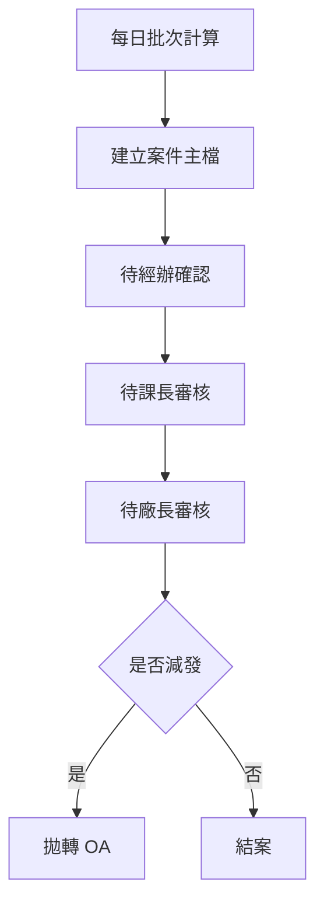
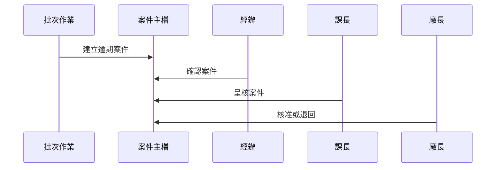

# Chapter 9：智慧立案與逾期效獎業務核心

接續上一章 [廠商與報到資料維護](08_廠商與報到資料維護_.md)，我們已經知道系統可以把基本資料整理好。  
這一章要正式進入整個專案最核心的地方：**智慧立案與逾期效獎業務核心**。

你可以先把這一章想成工廠裡最重要的「生產線中控台」：

- 每一張案件單據什麼時候開始算
- 哪些日子要扣掉
- 哪些人可以多給寬限
- 算出逾期後要不要減發
- 逾期案件要怎麼送去經辦、課長、廠長逐層簽核

如果前面章節是在準備原料、工具、名單和規則，  
那這一章就是：

> **真正開始讓案件跑流程、算天數、判斷獎扣、送審核的地方。**

---

## 先用一個最核心的情境來理解

假設系統每天都會自動抓案件，然後判斷：

- 這張單是不是已經超過規定天數
- 中間有沒有假日要扣掉
- 這個人有沒有多一點寬限天數
- 如果真的逾期，要不要減發金額
- 最後要送給誰確認、誰核准

如果沒有這一層核心邏輯，整個系統就會像：

- 班表算錯
- 假日沒扣
- 人員寬限漏掉
- 逾期判斷失準
- 後續簽核與獎扣都一起出錯

所以本章的重點只有一句話：

> **把案件從「原始資料」變成「可判斷、可簽核、可追蹤」的業務流程。**

---

## 這一章你要先抓住的三件事

本章其實可以拆成三個超重要的概念：

1. **案件主檔**：一筆案件到底是誰、哪一張表、哪一個人、哪一個關卡
2. **狀態流轉**：案件現在是待經辦、待課長、待廠長，還是已審核
3. **核簽歷程**：每一次確認、呈核、退回、核准，都要留下紀錄

你可以先把它們想成：

- **案件主檔**＝這張單子的身分證
- **狀態流轉**＝這張單子現在走到哪一站
- **核簽歷程**＝這張單子一路蓋了哪些章

---

## 這一章的主角有哪些？

本章主要有兩個核心資料物件：

| 名稱 | 作用 | 白話理解 |
|---|---|---|
| `Txdfab11` | 逾期效獎減發確認主檔 | 案件主檔 |
| `Txdfab12` | 核簽歷程 | 每一步簽核紀錄 |

這兩個是整個核心流程最重要的資料。

---

## 一、先看整體流程

這個流程很像郵局分件：

1. 每天系統自動算案件
2. 算出逾期案件後建立主檔
3. 先送給經辦確認
4. 經辦確認後送課長
5. 課長簽核後送廠長
6. 廠長核准或退回
7. 若需要減發，再拋轉到 OA

下面這張圖可以幫你先建立整體感覺：



你可以先記住：

> **先產生案件，再依照狀態一步一步往下走。**

---

## 二、案件主檔 `Txdfab11` 是什麼？

[`Txdfab11`](fpg-vcpseos/src/main/java/com/fpg/f/domain/Txdfab11.java) 是這一章最重要的資料物件。  
它是一筆「逾期效獎減發確認案件」。

你可以把它想成：

> 一張完整的案件卡片，上面會記錄這筆案件的來源、目前狀態、金額、誰在處理、要不要罰扣。

---

### 1. 它會記哪些資料？

`Txdfab11` 裡面有很多欄位，新手先看最重要的幾個就好：

- `xuid`：這筆案件的唯一識別碼
- `plmAaId`：PLM 指派唯一碼
- `empid`：人員代號
- `slptypid`：單別代號
- `slptypnm`：單別名稱
- `deptid`：課別代號
- `deptnm`：課別名稱
- `assignTo`：簽審人
- `frmName`：表單名稱
- `actLabel`：關卡名稱
- `docNo`：表單編號
- `activeTime`：啟動時間
- `baseDat`：判斷基準日
- `calcDat`：計算日期
- `ovddys`：文到天數
- `dedamt`：罰扣金額
- `adjDedamt`：主管調整後金額
- `status`：簽核狀態
- `xrem`：主管備註或不扣款理由
- `prwcomt`：經辦說明

這些欄位一起組成一張完整案件。

---

### 2. 你可以怎麼讀它？

例如有一筆案件：

- 表單編號：`DOC-001`
- 簽審人：`王小明`
- 啟動時間：`2026/04/10 09:00`
- 文到天數：`15`
- 罰扣金額：`1000`
- 狀態：`A000`

你可以直接翻成白話：

> 這是一筆從 PLM 來的案件，已經停留 15 天，預設要罰扣 1000 元，目前還在待經辦確認。

---

### 3. `Txdfab11` 裡最容易看懂的欄位

下面這幾個欄位幾乎一定會在畫面上出現：

```java
private String status;
private Long ovddys;
private Long dedamt;
private String deductFlag;
```

意思是：

- `status`：現在流程走到哪
- `ovddys`：已經停了幾天
- `dedamt`：原本要扣多少
- `deductFlag`：是否要罰扣

你可以把它想成：

> 一張單子的「現在狀態」、「逾期天數」、「金額」、「要不要扣」四個重點。

---

## 三、核簽歷程 `Txdfab12` 是什麼？

[`Txdfab12`](fpg-vcpseos/src/main/java/com/fpg/f/domain/Txdfab12.java) 是每一次核簽動作的紀錄。

如果 `Txdfab11` 是主檔，那 `Txdfab12` 就像日記本。  
每次經辦、課長、廠長有動作，系統都會寫一筆歷程。

---

### 1. 它記錄哪些東西？

`Txdfab12` 主要欄位有：

- `xuid`：歷程識別碼
- `fab1Xuid`：對應主檔識別碼
- `status`：核簽後狀態
- `act`：動作
- `xrem`：簽核備註
- `txemp`：異動人員
- `txempName`：異動人員姓名
- `txtm`：異動時間

你可以把它想成：

> 「誰在什麼時候做了什麼事，結果變成什麼狀態。」

---

### 2. 例子怎麼看？

假設一筆歷程是：

- 動作：經辦確認
- 狀態：`A010`
- 備註：空白
- 操作人：`A1001`

那就代表：

> 經辦已經確認這筆案件，案件往下一關走了。

如果另一筆歷程是：

- 動作：課長簽核
- 狀態：`A020`
- 備註：`請依規定辦理`

那就代表：

> 課長已經看過，並留下意見，案件再送廠長。

---

## 四、狀態流轉是整個流程的骨架

這一章最重要的核心之一，就是案件狀態。

常見狀態有：

- `A000`：待經辦確認
- `A010`：待課長審核
- `A020`：待廠長審核
- `A030`：已審核

你可以把它想成一張地鐵路線圖，每一站只能依序前進：


這表示：

- 不可以直接跳站
- 每一站都有對應的人處理
- 每次動作都要寫歷程

---

## 五、這一章和前面章節有什麼關係？

這一章不是憑空出現的。  
它會直接用到前面很多章節建好的規則：

- [單據參數建檔主資料](05_單據參數建檔主資料_.md)：決定逾期天數與減發金額
- [假日與寬限設定管理](06_假日與寬限設定管理_.md)：決定哪些日子要扣掉、哪些人可以寬限
- [通知名單與收件部門設定](07_通知名單與收件部門設定_.md)：決定通知要送給誰
- [前端介面與 API 對接](02_前端介面與_api_對接_.md)：前端怎麼呼叫列表、確認、呈核、核准 API

所以這一章可以理解成：

> **前面都是規則與資料，這一章開始把規則真的用在案件上。**

---

## 六、先看整個系統是怎麼跑的

這個流程很適合用「先算、再送、再簽」來理解。



你可以把它想成：

- 批次作業先把案件生出來
- 經辦先看是不是事實
- 課長再決定要不要罰扣
- 廠長最後拍板

---

## 七、從使用者角度看，這個流程在做什麼？

### 經辦看到的是什麼？

經辦看到的是「待確認」案件。  
他要做的事情很簡單：

- 看看案件是不是確實逾期
- 填寫經辦說明
- 勾選是否罰扣
- 按下確認

這一步的重點是：

> **先確認事實，不做最後裁決。**

---

### 課長看到的是什麼？

課長看到的是經辦確認後的案件。  
他要做的事情是：

- 決定要不要罰扣
- 必要時填寫簽核意見
- 按下呈核

這一步的重點是：

> **做初步裁決。**

---

### 廠長看到的是什麼？

廠長看到的是課長送上來的案件。  
他要做的事情是：

- 最後核准
- 或者退回
- 並留下意見

這一步的重點是：

> **做最終決定。**

---

## 八、API 的入口大概會怎麼長？

這一章的畫面通常會有幾種常見操作：

- 查詢列表
- 進入明細
- 確認
- 呈核
- 核准
- 退回
- 查看核簽歷程

你可以先想像它們都會對應到後端 API。  
例如前端可能先送查詢條件，再拿回案件列表。

---

## 九、案件查詢時會看到什麼？

案件清單通常會顯示：

- 狀態
- 單別名稱
- 課別名稱
- 簽審人
- 表單名稱
- 關卡名稱
- 表單編號
- 啟動時間
- 文到天數
- 罰扣金額
- 是否罰扣

這些欄位其實就是讓使用者一眼看懂：

> 這張單是誰的、卡在哪一關、停了多久、金額多少、要不要扣。

---

## 十、經辦流程：先確認，再往下送

當案件還在 `A000` 時，經辦可以按「確認」。  
這表示案件進入下一步。

### 你可以把它想成：

- 案件送到經辦桌上
- 經辦看完，覺得是正確的
- 按下確認
- 系統把狀態改成 `A010`
- 同時寫一筆 `Txdfab12` 歷程

這就像蓋第一個章。

---

## 十一、課長流程：決定要不要罰扣

當案件進入 `A010`，課長就可以處理。

課長通常會做兩件事：

1. 看經辦的說明
2. 決定是否要罰扣

如果要罰扣，就可以往下一關送。  
如果不罰扣，通常要寫清楚原因。

---

## 十二、廠長流程：最終核准或退回

當案件到 `A020`，就是廠長最終決定。

廠長有兩個選擇：

- **核准**：案件變成 `A030`
- **退回**：案件回到 `A010`

你可以把它想成最後總裁決：

- 有問題就退回重做
- 沒問題就結案

---

## 十三、最後如果要減發，會發生什麼事？

如果廠長核准後，系統判斷這筆案件需要減發，  
就會把資料拋轉到 OA。

這代表：

- 案件不是只有在系統裡看而已
- 還要進一步送到外部作業流程
- 產生實際的效率獎金獎懲通知

這一步是整個業務的最終輸出。

---

## 十四、內部邏輯先用簡單步驟看

當批次作業跑起來時，大致會做這些事：

1. 先抓到逾期案件
2. 用假日與寬限規則計算實際天數
3. 比對單別與表單的減發規則
4. 建立 `Txdfab11`
5. 初始化狀態為待經辦確認
6. 後續由三層簽核依序處理
7. 每次動作都寫入 `Txdfab12`

這就是整個核心流程。

---

## 十五、看一個超簡單的案件例子

假設有一筆案件：

- 人員代號：`A1001`
- 單別：`F001`
- 表單：`R001`
- 啟動時間：`2026/04/01`
- 文到天數：`12`
- 罰扣金額：`1000`
- 狀態：`A000`

你可以把它想成：

> 系統發現這筆案件停了 12 天，先建成逾期案件，等經辦確認。

如果經辦按下確認，  
狀態就變成 `A010`，並留下第一筆歷程。

---

## 十六、用超簡單程式看資料長相

### 建立案件主檔

```java
Txdfab11 data = new Txdfab11();
data.setEmpid("A1001");
data.setStatus("A000");
```

這段意思是：

- 建立一筆案件
- 指定人員代號
- 狀態先設為待經辦確認

---

### 建立核簽歷程

```java
Txdfab12 log = new Txdfab12();
log.setFab1Xuid(data.getXuid());
log.setAct("經辦確認");
```

這段意思是：

- 建立一筆核簽歷程
- 綁定案件主檔
- 記錄這次的動作是經辦確認

---

### 表示是否罰扣

```java
data.setDeduct(true);
data.setDeductFlag("Y");
```

這段意思是：

- 前端勾選要罰扣
- 系統轉成可儲存的旗標

這種設計很常見，因為畫面通常是勾選框，資料庫通常是文字旗標。

---

## 十七、這一章的資料欄位為什麼這麼多？

因為它不只是存結果，還要存流程。

你不只要知道：

- 是否逾期
- 是否罰扣

你還要知道：

- 誰處理的
- 哪個關卡
- 什麼時候啟動
- 哪一天計算
- 有沒有備註
- 有沒有調整金額

這些資訊都是為了讓整個流程可追蹤、可稽核、可回溯。

---

## 十八、初學者最容易混淆的地方

### 1. `Txdfab11` 是主檔，不是歷程

它記的是案件本體與目前狀態。

---

### 2. `Txdfab12` 才是歷程

它記的是每一步簽核動作。

---

### 3. `status` 是流程的關鍵

狀態不同，能操作的人和按鈕也不同。

---

### 4. `dedamt` 和 `adjDedamt` 不一樣

- `dedamt`：原始罰扣金額
- `adjDedamt`：主管調整後金額

---

### 5. 這一章不是單獨運作

它一定會依賴前面章節的規則資料。

---

## 十九、把整章濃縮成一句話

> **智慧立案與逾期效獎業務核心，就是把案件依照假日、寬限、單據規則算出逾期結果，再依狀態把案件送經辦、課長、廠長逐層簽核，最後決定是否減發並完成拋轉。**

---

## 二十、本章小結

這一章我們學到了整個系統最核心的業務流程：

- `Txdfab11`：案件主檔，負責保存案件本體、狀態、金額與顯示資訊
- `Txdfab12`：核簽歷程，負責記錄每一次確認、呈核、退回、核准
- 狀態流轉：`A000 → A010 → A020 → A030`
- 前面章節建立的規則會在這裡真正派上用場
- 最終目標是讓案件能夠被正確立案、正確簽核、正確減發、正確拋轉

你可以把這一章記成一句最簡單的話：

> **前面是在建規則，這一章是在讓規則真的跑起來。**

下一章我們會延續這個流程，進入最後的確認與減發決策：  
[逾期效獎減發確認流程](10_逾期效獎減發確認流程_.md)

---

Generated by [AI Codebase Knowledge Builder](https://github.com/The-Pocket/Tutorial-Codebase-Knowledge)