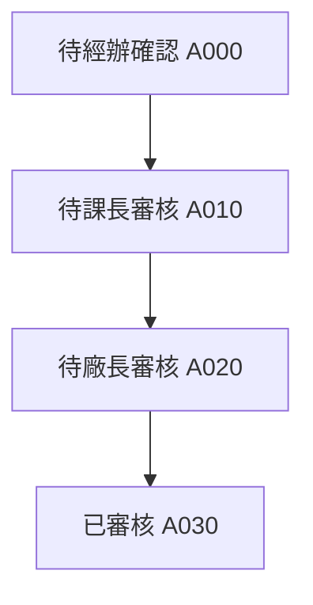
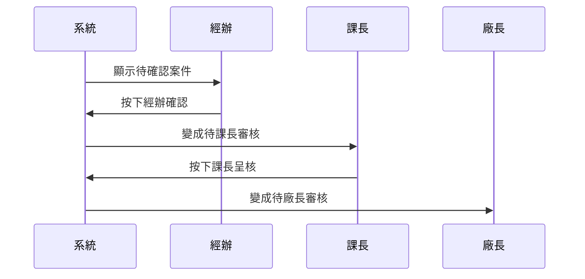

# Chapter 10: 逾期效獎減發確認流程


接續上一章的 [智慧立案與逾期效獎業務核心](09_智慧立案與逾期效獎業務核心_.md)，我們已經知道案件可以先被算出來、建立成主檔，接下來就要進入真正的「確認」階段。  

這一章的重點很簡單：

> **當案件已經被系統判定為逾期後，要不要減發、減多少、誰來確認，會經過經辦、課長、廠長三層流程。**

你可以先把它想成餐廳出餐前的三道蓋章：

1. 經辦先檢查食材和單據
2. 課長再看要不要真的扣
3. 廠長最後拍板

這樣做的好處是：

- 不會亂扣
- 每一步都有紀錄
- 事後可以追查誰在什麼時間做了什麼決定

---

## 這一章要先解決什麼問題？

假設有一筆案件被系統抓到「逾期」了，接下來就會遇到這些問題：

- 這筆案件是不是確實該扣？
- 要扣多少？
- 經辦有沒有確認？
- 課長有沒有看過？
- 廠長有沒有核准？
- 如果退回，會退到哪一關？
- 每一步動作有沒有留下歷程？

如果沒有這套流程，系統就會變成：

- 只知道逾期
- 不知道誰確認
- 不知道是否已核准
- 不知道歷程在哪裡

所以這一章就是要學會：

> **如何用案件主檔與核簽歷程，把逾期效獎減發流程完整跑完。**

---

## 先看整體角色分工

這個流程裡有三個角色：

| 角色 | 做什麼 | 白話理解 |
|---|---|---|
| 經辦 | 先確認案件內容 | 第一關整理資料的人 |
| 課長 | 決定是否呈核 | 第二關審查的人 |
| 廠長 | 最終核准或退回 | 最後拍板的人 |

你可以把它想成：

- 經辦：先檢查包裹有沒有送錯
- 課長：決定要不要放行
- 廠長：最後批准是否出貨

---

## 本章會看到的兩個主角

這一章的核心資料物件只有兩個：

| 名稱 | 作用 |
|---|---|
| `Txdfab11` | 逾期效獎減發確認案件主檔 |
| `Txdfab12` | 核簽歷程 |

這兩個搭配起來，就能完成整個確認流程。

---

## 一、先用最簡單的方式理解整體流程

你可以把整個流程想成一張流程單：

1. 系統先建立案件主檔
2. 案件先進到經辦待確認
3. 經辦確認後，狀態變成待課長審核
4. 課長呈核後，狀態變成待廠長審核
5. 廠長核准後，狀態變成已審核
6. 每一步都寫入歷程

下面這張圖可以先幫你建立印象：



你只要先記住：

> **案件會依照狀態一步一步往前走，而且每一步都會留下紀錄。**

---

## 二、案件主檔 `Txdfab11` 是什麼？

[`Txdfab11`](fpg-vcpseos/src/main/java/com/fpg/f/domain/Txdfab11.java) 是整個流程的主資料。  
它可以想成一張案件卡，裡面會記錄：

- 這是誰的案件
- 這張單是哪一個表單
- 現在卡在哪一關
- 要不要罰扣
- 要扣多少
- 有沒有經辦或主管備註

---

### 1. 最重要的幾個欄位

你先認識這幾個欄位就夠了：

```java
private String xuid;
private String empid;
private String status;
```

這三個欄位的意思是：

- `xuid`：案件唯一編號
- `empid`：人員代號
- `status`：目前狀態

白話來說就是：

> 「這張單是誰的、這張單是什麼、現在走到哪裡了。」

---

### 2. 跟金額有關的欄位

```java
private Long ovddys;
private Long dedamt;
private Long adjDedamt;
```

這三個欄位代表：

- `ovddys`：文到天數
- `dedamt`：原始罰扣金額
- `adjDedamt`：主管調整後金額

你可以把它想成：

> 系統先算出原本應該扣多少，主管之後還可以再調整。

---

### 3. 跟簽核有關的欄位

```java
private String deductFlag;
private String xrem;
private String prwcomt;
```

這三個欄位代表：

- `deductFlag`：是否罰扣
- `xrem`：主管備註或不扣款理由
- `prwcomt`：經辦說明

這就像一張表單上的註記欄：

- 經辦先寫說明
- 主管再寫判斷理由
- 系統保存是否扣款的結果

---

## 三、核簽歷程 `Txdfab12` 是什麼？

[`Txdfab12`](fpg-vcpseos/src/main/java/com/fpg/f/domain/Txdfab12.java) 是每一步操作的紀錄。  
如果 `Txdfab11` 是案件本體，那 `Txdfab12` 就像日記本。

每次有人做動作，例如：

- 經辦確認
- 課長簽核
- 廠長核准
- 廠長退回

系統都會寫一筆歷程。

---

### 1. 歷程會記什麼？

```java
private String fab1Xuid;
private String status;
private String act;
```

這三個欄位的意思是：

- `fab1Xuid`：對應的案件主檔編號
- `status`：當時變成什麼狀態
- `act`：做了什麼動作

白話就是：

> 「哪一筆案件、誰做了什麼、結果變成什麼狀態。」

---

### 2. 誰做的、什麼時候做的

```java
private String txemp;
private String txempName;
private Date txtm;
```

這三個欄位代表：

- `txemp`：操作人員
- `txempName`：操作人姓名
- `txtm`：操作時間

這些就是稽核時最重要的資訊。  
事後如果要追查，就看這裡。

---

## 四、先從使用者角度看流程

你可以先把整個流程想成一筆案件從左到右走過三個關卡：

1. 經辦看到案件
2. 經辦確認後送課長
3. 課長再送廠長
4. 廠長核准或退回



這張圖的重點是：

> **每一關都不是直接改資料而已，而是會改狀態、寫歷程。**

---

## 五、經辦流程：先確認案件

經辦的入口對應到 [`Txdfab21Controller`](fpg-vcpseos/src/main/java/com/fpg/f/controller/Txdfab21Controller.java)。

它負責：

- 查詢待經辦案件
- 看單筆明細
- 看核簽歷程
- 按下經辦確認

---

### 1. 查詢列表

```java
@GetMapping("/list")
public TableDataInfo list(Txdfab11 txdfab11)
```

意思是：

- 前端送查詢條件
- 後端回傳待經辦案件列表

例如你可以查：

- 某個人
- 某個單別
- 某個狀態

---

### 2. 看明細

```java
@GetMapping(value = "/{xuid}")
public AjaxResult getInfo(@PathVariable("xuid") String xuid)
```

意思是：

- 點進某筆案件
- 看這筆案件完整內容

---

### 3. 看歷程

```java
@GetMapping(value = "/history/{xuid}")
public AjaxResult history(@PathVariable("xuid") String xuid)
```

意思是：

- 看這筆案件以前走過哪些步驟
- 每一步是誰做的

---

### 4. 經辦確認

```java
@PutMapping("/confirm")
public AjaxResult confirm(@RequestBody Txdfab11 txdfab11)
```

意思是：

- 經辦按下確認
- 系統把案件往下一步推

---

## 六、經辦確認時，系統到底做了什麼？

真正的邏輯在 [`Txdfab11ServiceImpl`](fpg-vcpseos/src/main/java/com/fpg/f/service/impl/Txdfab11ServiceImpl.java)。

你可以先把它想成一個守門員：

> 不是誰來按都可以確認，系統會先檢查案件是不是對的、狀態是不是對的、操作人是不是對的。

---

### 1. 先檢查主鍵有沒有帶

```java
if (StringUtils.isBlank(txdfab11.getXuid()))
{
    throw new ServiceException("確認失敗，缺少主鍵資料");
}
```

意思是：

- 沒有案件編號就不能確認
- 系統要先知道你在處理哪一筆

---

### 2. 先確認是不是本人可操作

```java
boolean adminUser = isAdminUser(txdfab11.getEmpid()) || isAdminUser(txdfab11.getTxemp());
```

意思是：

- 如果是管理者，可以看更廣
- 一般使用者只能確認自己的案件

這樣可以避免別人亂按別人的案件。

---

### 3. 只能在待經辦狀態確認

```java
if (!STATUS_A000.equals(dbData.getStatus()))
{
    throw new ServiceException("僅待經辦確認(A000)狀態可執行確認");
}
```

意思是：

- 只有 `A000` 才能確認
- 其他狀態不能亂改

這就像包裹只有在「待收件」時才能簽收，已經簽收過的不能再簽一次。

---

### 4. 寫入新的狀態

```java
updateData.setStatus(STATUS_A010);
updateData.setPrwcomt(txdfab11.getPrwcomt());
```

意思是：

- 經辦確認後狀態變成 `A010`
- 經辦說明也一起存起來

---

### 5. 寫入歷程

```java
history.setAct("經辦確認");
history.setStatus(STATUS_A010);
```

意思是：

- 系統新增一筆歷程
- 記錄這次動作是經辦確認

---

## 七、課長流程：呈核與是否罰扣

課長的入口對應到 [`Txdfab31Controller`](fpg-vcpseos/src/main/java/com/fpg/f/controller/Txdfab31Controller.java)。

它負責：

- 查詢待課長審核案件
- 看案件明細
- 看歷程
- 按下課長呈核

---

### 1. 查詢列表

```java
@GetMapping("/list")
public TableDataInfo list(Txdfab11 txdfab11)
```

意思是：

- 只看課長能處理的案件
- 前端拿到列表後顯示

---

### 2. 看明細與歷程

```java
@GetMapping(value = "/{xuid}")
public AjaxResult getInfo(@PathVariable("xuid") String xuid)
```

```java
@GetMapping(value = "/history/{xuid}")
public AjaxResult history(@PathVariable("xuid") String xuid)
```

意思是：

- 課長可以先看案件內容
- 也可以看這筆案件一路走來的歷程

---

### 3. 課長呈核

```java
@PutMapping("/submit")
public AjaxResult submit(@RequestBody Txdfab11 txdfab11)
```

意思是：

- 課長按下呈核
- 案件往廠長關卡前進

---

## 八、課長呈核時，系統會檢查什麼？

課長流程在 `Txdfab11ServiceImpl.sectionChiefSubmit()`。

---

### 1. 先確認案件屬於目前課別

```java
dbData = txdfab11Mapper.selectTxdfab11ByXuidAndDeptid(txdfab11.getXuid(), txdfab11.getDeptid());
```

意思是：

- 課長只能處理自己課別的案件
- 不能看別的課的案件

這樣權限才合理。

---

### 2. 只能在待課長審核狀態呈核

```java
if (!STATUS_A010.equals(dbData.getStatus()))
{
    throw new ServiceException("僅待課長審核(A010)狀態可執行呈核");
}
```

意思是：

- 只有 `A010` 才能送下一關
- 狀態不對就不能按

---

### 3. 如果不罰扣，簽核意見不能空白

```java
if (!deduct && StringUtils.isBlank(txdfab11.getXrem()))
{
    throw new ServiceException("不罰扣時，簽核意見不可空白");
}
```

意思是：

- 如果課長決定不罰扣
- 就一定要寫理由

這很像做決策時要留下書面說明，避免事後沒有依據。

---

### 4. 寫入調整後金額

```java
updateData.setAdjDedamt(deduct ? dbData.getDedamt() : 0L);
```

意思是：

- 如果要罰扣，就保留原始金額
- 如果不罰扣，就改成 0

這一步很重要，因為它會影響最後結果。

---

### 5. 寫入歷程

```java
history.setAct("課長簽核");
history.setStatus(STATUS_A020);
```

意思是：

- 系統記錄這次動作是課長簽核
- 狀態變成 `A020`

---

## 九、廠長流程：最後核准或退回

廠長的入口對應到 [`Txdfab41Controller`](fpg-vcpseos/src/main/java/com/fpg/f/controller/Txdfab41Controller.java)。

它負責：

- 查詢待廠長審核案件
- 看明細
- 看歷程
- 核准
- 退回

---

### 1. 查詢列表

```java
@GetMapping("/list")
public TableDataInfo list(Txdfab11 txdfab11)
```

意思是：

- 只顯示廠長能看到的案件

---

### 2. 核准或退回

```java
@PutMapping("/approve")
public AjaxResult approve(@RequestBody Txdfab11 txdfab11)
```

```java
@PutMapping("/reject")
public AjaxResult reject(@RequestBody Txdfab11 txdfab11)
```

意思是：

- 廠長可以按核准
- 也可以按退回

---

## 十、廠長核准時，系統做了什麼？

廠長核准的邏輯在 `Txdfab11ServiceImpl.factoryManagerApprove()`。

---

### 1. 只能在待廠長審核時核准

```java
if (!STATUS_A020.equals(dbData.getStatus()))
{
    throw new ServiceException("僅待廠長審核(A020)狀態可執行核准");
}
```

意思是：

- 只有 `A020` 才能核准
- 其他狀態不能核准

---

### 2. 寫成已審核

```java
updateData.setStatus("A030");
```

意思是：

- 廠長核准後，案件狀態變成 `A030`
- 代表這筆案件已完成審核

---

### 3. 寫入歷程

```java
history.setAct("廠長核准");
history.setStatus("A030");
```

意思是：

- 系統記錄最後一關動作
- 留下核准歷程

---

## 十一、廠長退回時，系統做了什麼？

退回的邏輯在 `Txdfab11ServiceImpl.factoryManagerReject()`。

---

### 1. 退回時意見不能空白

```java
if (StringUtils.isBlank(txdfab11.getXrem()))
{
    throw new ServiceException("退回時，簽核意見不可空白");
}
```

意思是：

- 如果要退回，一定要寫原因

---

### 2. 狀態會退回到課長關卡

```java
updateData.setStatus(STATUS_A010);
```

意思是：

- 退回不是直接刪掉
- 而是回到課長再處理

這樣流程比較完整。

---

### 3. 寫入歷程

```java
history.setAct("廠長退回");
history.setStatus(STATUS_A010);
```

意思是：

- 系統記錄這次是退回
- 狀態回到課長階段

---

## 十二、為什麼每一步都要寫歷程？

這是這個流程最重要的精神之一。

因為未來可能會問：

- 是誰確認的？
- 誰說要扣？
- 誰核准？
- 為什麼退回？
- 什麼時間做的？

如果沒有歷程，就無法追查。  
所以每一次動作都會新增 `Txdfab12`。

你可以把它想成：

> 文件上每一個章都要留影本，不能只看最後結果。

---

## 十三、這一章如何跟前面章節串起來？

這一章其實是前面很多章節的總結應用：

- [單據參數建檔主資料](05_單據參數建檔主資料_.md)：決定逾期天數與減發金額
- [假日與寬限設定管理](06_假日與寬限設定管理_.md)：幫忙算出真實逾期天數
- [通知名單與收件部門設定](07_通知名單與收件部門設定_.md)：若要通知相關人員，可以用到名單
- [前端介面與 API 對接](02_前端介面與_api_對接_.md)：前端按鈕會對應到這些 API

所以你可以把這一章理解成：

> **前面是在準備規則，這一章是規則真正開始工作。**

---

## 十四、從實際輸入到輸出，整個流程會怎麼走？

### 輸入

使用者會在畫面上看到：

- 案件清單
- 案件明細
- 經辦說明
- 簽核意見
- 是否罰扣

### 輸出

系統會產生：

- 狀態變更
- 金額調整
- 核簽歷程
- 成功或失敗訊息

---

## 十五、看一個超簡單的例子

假設案件資料如下：

- 案件編號：`X001`
- 狀態：`A000`
- 原始罰扣：`1000`

經辦確認後：

- 狀態變成 `A010`
- 歷程新增「經辦確認」

課長呈核後：

- 狀態變成 `A020`
- 若不罰扣，調整後金額變 `0`

廠長核准後：

- 狀態變成 `A030`
- 歷程新增「廠長核准」

這樣整筆案件就完成了。

---

## 十六、這一章最容易混淆的地方

### 1. `Txdfab11` 是案件主檔

它不是歷程。  
它是案件本體與目前狀態。

---

### 2. `Txdfab12` 才是歷程

它只記每次的動作與時間。

---

### 3. `A000、A010、A020、A030` 是流程狀態

不是隨便的代碼，而是一步一步的關卡。

---

### 4. 經辦、課長、廠長有不同權限

不是每個人都能操作每一步。

---

### 5. 每次動作都要先檢查狀態

避免重複按、亂按、跳關卡。

---

## 十七、你可以怎麼記住這一章？

最簡單的記法是：

1. **先由經辦確認**
2. **再由課長呈核**
3. **最後由廠長核准或退回**
4. **每一步都寫入核簽歷程**
5. **狀態會一路從 A000 走到 A030**

---

## 十八、本章小結

這一章我們學到了「逾期效獎減發確認流程」的核心概念：

- `Txdfab11`：案件主檔，保存案件資料、狀態、金額與簽核資訊
- `Txdfab12`：核簽歷程，保存每一步的動作、狀態、時間與操作者
- 經辦、課長、廠長三層流程如何依序運作
- 狀態如何從 `A000` 一路流轉到 `A030`
- 為什麼每一步都必須寫歷程，方便追蹤與稽核

你可以把這一章記成一句最簡單的話：

> **這不是單純的按鈕流程，而是一套會留下紀錄、會逐層簽核、會決定要不要減發的完整案件確認流程。**

如果你想把這整套流程從頭到尾再連一次，可以回去複習前面的 [智慧立案與逾期效獎業務核心](09_智慧立案與逾期效獎業務核心_.md)。

---

Generated by [AI Codebase Knowledge Builder](https://github.com/The-Pocket/Tutorial-Codebase-Knowledge)