# Tutorial: code_to_analyze

這個專案是用來做 **配電盤智慧立案與逾期效獎減發管理** 的系統，核心目標是把原本靠人工追蹤的案件流程，改成由系統自動判斷、通知與簽核。
它會先依照 *單據規則、假日、寬限天數* 計算案件是否逾期，再把逾期案件送進經辦、課長、廠長的分層確認流程，最後視結果決定是否要減發獎金或拋轉到外部系統。
同時系統也提供 **基礎資料維護**、**參考欄位對照**、**多語係管理** 與 **前端 API 串接**，讓整體功能可以穩定運作並方便使用者操作。


**Source Repository:** [None](None)

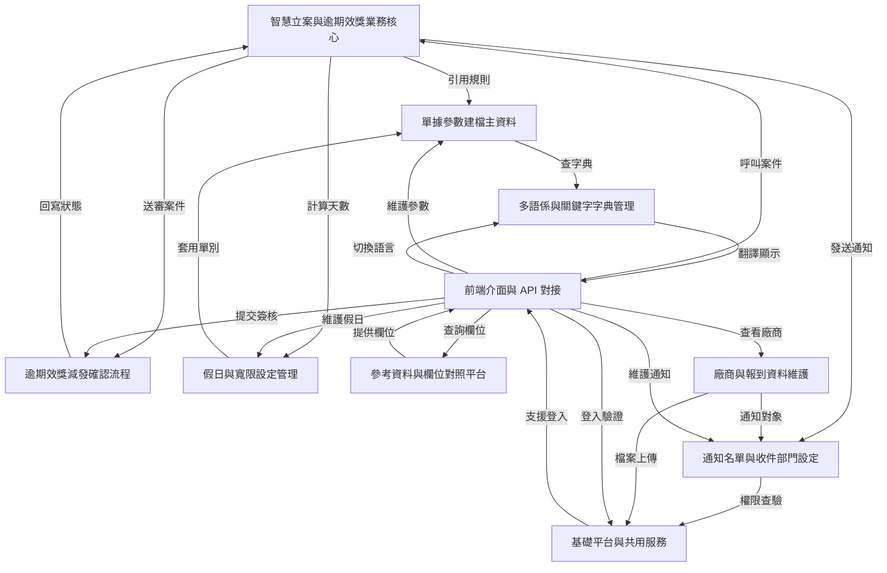


# Chapter 1：基礎平台與共用服務

在進入真正的業務功能之前，先來認識整個專案最底層、但也最重要的「地基」。

你可以把它想成一棟大樓的水電、電梯、消防、門禁系統：  
平常大家不會一直提到它，但只要少了其中一個，整棟樓就很難正常運作。

這一章的中心情境是：

> **當使用者登入系統、送出表單、查詢資料、匯出 Excel、或遇到錯誤時，系統是怎麼穩穩地把事情處理好？**

如果你是新手，這一章不用死背每個類別。  
你只要先建立一個概念：

- 前台畫面負責「輸入」
- 業務模組負責「規則」
- **基礎平台與共用服務**負責「安全、流程、共用能力、錯誤處理、資料工具」

---

## 這一層到底在做什麼？

這一層不是直接處理「申請單」、「通知」、「廠商」這些業務，而是提供所有模組都會用到的共通能力，例如：

- 登入與權限驗證
- JWT 令牌驗證
- 全域例外處理
- 多資料來源切換
- 防止重複提交
- Redis 快取
- 排程與背景工作
- Excel 匯入匯出
- 通用字串、日期、ID、回應物件等工具

你可以把它理解成：

> **業務模組像是店員，基礎平台像是櫃檯、保全、收銀系統、倉儲系統。**

店員負責賣東西，  
但如果沒有這些共用系統，店根本無法正常營運。

---

## 先用一個最常見的使用情境理解它

假設你做了一個「新增資料」的功能：

1. 使用者登入系統
2. 前端送出新增表單
3. 系統先確認使用者有沒有登入
4. 檢查這次提交是不是重複送出
5. 若資料格式錯誤，就回傳友善的錯誤訊息
6. 若資料要寫入主庫或從庫，就切換資料來源
7. 若新增成功，就記錄操作日誌
8. 若要匯出資料，就交給 Excel 工具處理

你會發現：  
**真正的業務只佔一小部分，很多事情都在共用層先幫你準備好了。**

---

## 本章你要先認識的幾個核心概念

我們用最簡單的方式一個一個看。

### 1. 登入與權限驗證

使用者進來系統，不是直接就能做所有事。  
系統要先知道：

- 你是誰
- 你有沒有登入
- 你能不能看這個功能

這部分主要靠：

- [`JwtAuthenticationTokenFilter`](fpg-framework/src/main/java/com/fpg/framework/security/filter/JwtAuthenticationTokenFilter.java)
- [`SecurityConfig`](fpg-framework/src/main/java/com/fpg/framework/config/SecurityConfig.java)
- [`SysLoginService`](fpg-framework/src/main/java/com/fpg/framework/web/service/SysLoginService.java)

你可以把它想像成門口保全：

- 沒帶證件：不能進
- 證件過期：要重新辦
- 證件有效：才能進入辦公區

---

### 2. 全域例外處理

如果系統中某個地方出錯，不希望每個頁面都自己寫一套錯誤畫面。  
所以會有一個統一的地方負責接住錯誤，轉成一致的回應格式。

這個角色是：

- [`GlobalExceptionHandler`](fpg-framework/src/main/java/com/fpg/framework/web/exception/GlobalExceptionHandler.java)

它像是大樓的總機：

- 收到不同類型的問題
- 再用統一方式回答使用者
- 讓前端比較好處理

---

### 3. 多資料來源切換

有些查詢要走主資料庫，有些要走從資料庫。  
有時候同一個系統裡還可能有不同資料庫。

這時候就需要「切換資料來源」。

相關類別：

- [`DruidConfig`](fpg-framework/src/main/java/com/fpg/framework/config/DruidConfig.java)
- [`DataSourceAspect`](fpg-framework/src/main/java/com/fpg/framework/aspectj/DataSourceAspect.java)

你可以把它想成：

> 同一張會員卡，可以決定你今天要走哪個入口。

---

### 4. 防止重複提交

使用者可能因為網路慢、連點按鈕、重整頁面，導致同一筆資料被送出兩次。  
這很容易造成重複新增、重複審核、重複匯款等問題。

相關類別：

- [`RepeatSubmitInterceptor`](fpg-framework/src/main/java/com/fpg/framework/interceptor/RepeatSubmitInterceptor.java)

像是超商收銀：  
你不能同一個商品掃兩次卻以為是不同商品。

---

### 5. Redis 與快取

有些資料很常查，但不需要每次都去資料庫。  
例如驗證碼、登入資訊、常用設定、限流資訊。

相關類別：

- [`RedisConfig`](fpg-framework/src/main/java/com/fpg/framework/config/RedisConfig.java)

你可以把 Redis 想成：

> 放在櫃台旁邊的快速抽屜，拿東西比去倉庫快很多。

---

### 6. Excel 匯入匯出

很多系統都需要把資料匯出成 Excel，或從 Excel 匯入資料。

相關類別：

- [`ExcelUtil`](fpg-common/src/main/java/com/fpg/common/utils/poi/ExcelUtil.java)

這就像：

> 你把資料整理成表格交給別人，或從別人整理好的表格再讀回來。

---

### 7. 通用工具類

專案中有很多很常用的小工具：

- [`StringUtils`](fpg-common/src/main/java/com/fpg/common/utils/StringUtils.java)
- [`DateUtils`](fpg-common/src/main/java/com/fpg/common/utils/DateUtils.java)
- [`IdUtils`](fpg-common/src/main/java/com/fpg/common/utils/uuid/IdUtils.java)
- [`BaseController`](fpg-common/src/main/java/com/fpg/common/core/controller/BaseController.java)
- [`AjaxResult`](fpg-common/src/main/java/com/fpg/common/core/domain/AjaxResult.java)
- [`BaseEntity`](fpg-common/src/main/java/com/fpg/common/core/domain/BaseEntity.java)

它們像是工具箱裡的螺絲起子、尺、剪刀、標籤紙。  
單獨看很小，但到處都會用到。

---

## 先看一個最簡單的回傳格式

很多介面最後都會回傳一種統一結果，像這樣：

```java
AjaxResult result = AjaxResult.success("新增成功");
return result;
```

這段的意思是：

- 系統回傳一個成功結果
- 訊息是「新增成功」

如果失敗，也可以這樣：

```java
AjaxResult result = AjaxResult.error("資料格式錯誤");
return result;
```

這段的意思是：

- 系統回傳一個失敗結果
- 訊息是「資料格式錯誤」

這種設計很適合前端，因為前端只要看：

- `code`：成功還是失敗
- `msg`：顯示什麼訊息
- `data`：有沒有資料

---

## `AjaxResult`：統一的回應包裝

[`AjaxResult`](fpg-common/src/main/java/com/fpg/common/core/domain/AjaxResult.java) 是很常見的共用回傳格式。

你可以把它想成一個「包裹盒」：

- 外面貼標籤：成功、失敗、警告
- 裡面放訊息與資料

它的優點是：

- 所有 API 回傳格式一致
- 前端容易判斷
- 錯誤處理更整齊

---

## `BaseEntity`：資料表共同欄位的基底

很多資料表都會有這些欄位：

- 建立者
- 建立時間
- 更新者
- 更新時間
- 備註

[`BaseEntity`](fpg-common/src/main/java/com/fpg/common/core/domain/BaseEntity.java) 就是把這些共用欄位整理起來。

你可以把它看成：

> 每個資料物件都會繼承的「基本身分證」。

這樣每個業務資料類別就不用重複寫一樣的欄位。

---

## `BaseController`：控制器的共用功能

[`BaseController`](fpg-common/src/main/java/com/fpg/common/core/controller/BaseController.java) 是很多控制器都會繼承的基底。

它幫你做幾件常見事：

- 自動處理日期格式
- 分頁
- 排序
- 回傳成功或失敗結果
- 取得目前登入使用者資訊

例如：

```java
protected AjaxResult toAjax(int rows)
{
    return rows > 0 ? AjaxResult.success() : AjaxResult.error();
}
```

意思很簡單：

- 如果受影響筆數大於 0，就回傳成功
- 否則回傳失敗

這可以讓你少寫很多重複判斷。

---

## 登入流程：系統怎麼知道你是誰？

登入是整個平台最重要的入口之一。  
我們看 [`SysLoginService`](fpg-framework/src/main/java/com/fpg/framework/web/service/SysLoginService.java) 的概念。

它大致做這些事：

1. 檢查驗證碼
2. 檢查帳密是否符合基本規則
3. 檢查黑名單 IP
4. 驗證密碼或 AD 網域
5. 成功後產生 token
6. 把登入資訊寫回系統

可以用這個流程理解：

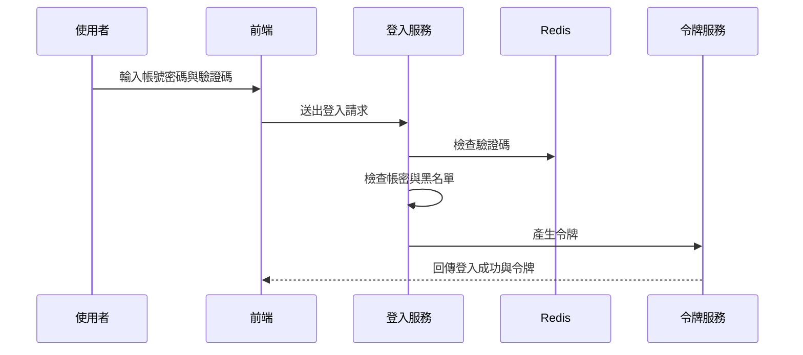

你只要先記住：

> **登入不是只有驗密碼，還包含驗證碼、風險檢查、令牌發放。**

---

## `JwtAuthenticationTokenFilter`：每次請求先驗證令牌

登入成功後，前端通常會帶著 token 呼叫其他 API。  
這時候 [`JwtAuthenticationTokenFilter`](fpg-framework/src/main/java/com/fpg/framework/security/filter/JwtAuthenticationTokenFilter.java) 會先檢查 token。

它的流程很像：

- 從請求中拿 token
- 找到對應的登入使用者
- 檢查 token 是否有效
- 若有效，就把使用者資訊放進安全上下文
- 後面程式就知道「你已登入」

最簡單的理解是：

> 每次進門都要再刷一次卡，確定你還在有效身分內。

---

## `SecurityConfig`：哪些路可以不用登入，哪些一定要登入？

[`SecurityConfig`](fpg-framework/src/main/java/com/fpg/framework/config/SecurityConfig.java) 負責設定整個安全規則。

它會定義：

- 哪些網址可以匿名訪問
- 哪些網址必須登入
- 失敗時怎麼回應
- 登出怎麼處理
- token 過濾器何時執行

例如，登入頁、驗證碼、靜態資源通常可以匿名訪問；  
其他業務 API 則通常必須登入。

你可以把它想成：

> 大樓的門禁規則表。

---

## `GlobalExceptionHandler`：錯誤不要亂飛，統一接住

當系統發生錯誤時，如果沒有統一處理，前端可能看到一堆不規則的訊息。  
[`GlobalExceptionHandler`](fpg-framework/src/main/java/com/fpg/framework/web/exception/GlobalExceptionHandler.java) 就是負責把不同錯誤整理成一致格式。

例如它會分別處理：

- 權限不足
- 請求方式不對
- 參數格式錯誤
- 服務層自訂錯誤
- 系統錯誤
- 驗證失敗

你可以把它看成：

> 接線生把不同房間打來的故障電話，統一整理後再回報。

---

## `DataSourceAspect`：方法一進來就切換資料來源

有些方法執行前，系統要先決定要連哪個資料庫。  
[`DataSourceAspect`](fpg-framework/src/main/java/com/fpg/framework/aspectj/DataSourceAspect.java) 就是做這件事。

流程很簡單：

1. 檢查方法上有沒有資料來源註解
2. 如果有，就把當前資料來源設成指定值
3. 執行方法
4. 方法結束後清掉資料來源設定

它像什麼？

> 像是在進不同倉庫前，先告訴門禁系統你今天要去的是主倉庫還是分倉庫。

---

## `DruidConfig`：主庫、從庫、多資料源的設定入口

[`DruidConfig`](fpg-framework/src/main/java/com/fpg/framework/config/DruidConfig.java) 負責建立資料庫連線與多資料來源。

它主要做三件事：

- 建立主資料來源
- 建立從資料來源
- 把它們交給動態資料來源管理

你可以簡單理解成：

> 先準備好幾條水管，再由系統決定現在要打開哪一條。

---

## `RepeatSubmitInterceptor`：避免同一筆資料被送兩次

有些操作最怕重複按鈕，例如：

- 新增資料
- 送出審核
- 匯款
- 申請流程

[`RepeatSubmitInterceptor`](fpg-framework/src/main/java/com/fpg/framework/interceptor/RepeatSubmitInterceptor.java) 會在請求到達前先檢查：

- 這個方法有沒有標記「防重複提交」
- 如果有，就判斷是不是重複送出
- 若重複，直接回錯誤，不讓它進業務邏輯

簡單說：

> 按鈕雖然按下去了，但保全會先幫你擋住第二次。

---

## `LogAspect`：操作日誌自動記錄

業務系統通常要知道：

- 是誰操作的
- 什麼時間操作的
- 對哪個 URL 操作
- 內容是什麼
- 成功還是失敗

[`LogAspect`](fpg-framework/src/main/java/com/fpg/framework/aspectj/LogAspect.java) 就是幫你自動記錄這些資料。

你不需要每個方法都手動寫「記錄日誌」；  
只要標上註解，它就會在方法前後自動收集資訊。

這非常像：

> 監視器自動錄影，不需要每個人自己拿手機拍。

---

## `RedisConfig`：快取與限流的基礎

[`RedisConfig`](fpg-framework/src/main/java/com/fpg/framework/config/RedisConfig.java) 的核心任務是建立 Redis 操作模板，讓系統可以：

- 存取快取
- 保存暫時資料
- 做限流控制

例如驗證碼就很適合放 Redis：

- 產生後先存起來
- 使用者登入時拿來比對
- 用完即刪

這種資料不適合一直寫資料庫。  
Redis 速度快，很適合做這件事。

---

## `StringUtils`、`DateUtils`、`IdUtils`：小工具，大幫手

### `StringUtils`

[`StringUtils`](fpg-common/src/main/java/com/fpg/common/utils/StringUtils.java) 提供很多字串處理方法，例如：

- 判斷空值
- 擷取子字串
- 轉駝峰
- 分隔字串
- 比對路徑

你可以把它當成「字串專用小工具包」。

---

### `DateUtils`

[`DateUtils`](fpg-common/src/main/java/com/fpg/common/utils/DateUtils.java) 負責日期處理，例如：

- 取得現在時間
- 格式化日期
- 解析字串成日期
- 計算時間差

例如：

```java
String now = DateUtils.getTime();
```

這會取得目前時間字串，像 `2026-04-21 10:30:00` 這樣的格式。

---

### `IdUtils`

[`IdUtils`](fpg-common/src/main/java/com/fpg/common/utils/uuid/IdUtils.java) 用來產生 UUID。

例如：

```java
String id = IdUtils.simpleUUID();
```

這會得到一組沒有連字號的唯一識別碼。

你可以把它想像成：

> 幫每個資料打上一個幾乎不會重複的編號。

---

## `ExcelUtil`：匯入匯出的重頭戲

[`ExcelUtil`](fpg-common/src/main/java/com/fpg/common/utils/poi/ExcelUtil.java) 是很大的工具類，但新手先抓住重點就好：

它主要負責：

- 匯出 Excel
- 匯入 Excel
- 標題樣式
- 欄位對應
- 下拉選單
- 日期與數字格式
- 圖片欄位
- 合計列

你可以把它想成：

> 一台很強的表格工廠，輸入資料後，幫你變成 Excel；  
> 或者把 Excel 資料拆回 Java 物件。

---

## 一個很小的匯出例子

假設你有一批資料，要匯出成 Excel：

```java
ExcelUtil<User> excelUtil = new ExcelUtil<>(User.class);
AjaxResult result = excelUtil.exportExcel(userList, "使用者資料");
```

這段的意思是：

- 建立一個對應 `User` 類別的 Excel 工具
- 把 `userList` 匯出成名為「使用者資料」的 Excel

如果成功，系統會產生檔案。  
前端通常可以拿到下載連結或檔案名稱。

---

## 一個很小的匯入例子

如果你要把 Excel 檔讀回來：

```java
ExcelUtil<User> excelUtil = new ExcelUtil<>(User.class);
List<User> users = excelUtil.importExcel(inputStream);
```

這段的意思是：

- 用 `User` 類別作為對照
- 把 Excel 每一列轉成一個 `User` 物件
- 最後得到 `users` 清單

這就是「表格和物件互轉」的概念。

---

## 背後是怎麼運作的？先看整體流程

如果把整個基礎平台想像成一個自動處理系統，大致會長這樣：

1. 使用者送出請求
2. 安全過濾器先檢查 token
3. 若方法有防重複註解，攔截器先檢查是否重送
4. 若方法有資料來源註解，切面先切換資料庫
5. 進入控制器與業務邏輯
6. 若出錯，統一交給全域例外處理器
7. 成功或失敗都回傳 `AjaxResult`
8. 若有標註日誌註解，操作資料會被自動記錄

可以用這張圖來理解：

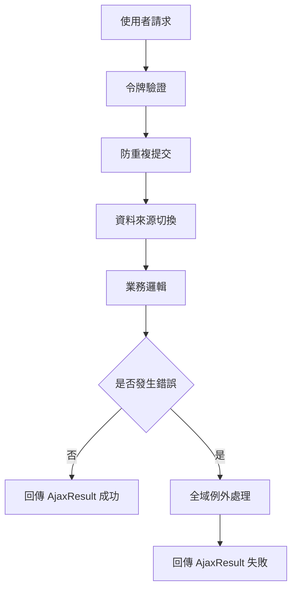

---

## 進一步看幾個核心實作

下面挑幾個最代表性的類別，用非常簡單的方式看它們怎麼做。

---

### 1. 令牌驗證是怎麼被放進每次請求的？

看 [`JwtAuthenticationTokenFilter`](fpg-framework/src/main/java/com/fpg/framework/security/filter/JwtAuthenticationTokenFilter.java)。

它的核心概念是：

- 先從請求中找登入使用者
- 如果使用者存在，而且目前尚未建立驗證資訊
- 就把登入資訊放進安全上下文
- 後面的程式就能直接取得使用者身分

簡化後可以理解成：

```java
LoginUser loginUser = tokenService.getLoginUser(request);
if (loginUser != null) {
    tokenService.verifyToken(loginUser);
    SecurityContextHolder.getContext().setAuthentication(authenticationToken);
}
```

這表示：

- token 能找到人
- token 還有效
- 系統就承認這個人已登入

---

### 2. 登入時為什麼先驗證驗證碼？

看 [`SysLoginService`](fpg-framework/src/main/java/com/fpg/framework/web/service/SysLoginService.java)。

它在登入流程中先做驗證碼檢查，因為：

- 防止機器人亂試密碼
- 防止大量暴力登入
- 保護系統安全

簡化概念如下：

```java
String captcha = redisCache.getCacheObject(verifyKey);
if (captcha == null) {
    throw new CaptchaExpireException();
}
if (!code.equalsIgnoreCase(captcha)) {
    throw new CaptchaException();
}
```

意思是：

- Redis 裡找不到驗證碼，代表過期
- 找得到但不一樣，代表輸入錯誤

---

### 3. 全域例外怎麼統一處理？

看 [`GlobalExceptionHandler`](fpg-framework/src/main/java/com/fpg/framework/web/exception/GlobalExceptionHandler.java)。

它用很多個 `@ExceptionHandler` 分別接不同錯誤。  
例如權限不足時：

```java
@ExceptionHandler(AccessDeniedException.class)
public AjaxResult handleAccessDeniedException(AccessDeniedException e, HttpServletRequest request)
```

這表示：

- 只要丟出 `AccessDeniedException`
- 就會進這個方法
- 然後回傳固定格式的錯誤訊息

你可以把它想成：

> 不管哪裡報錯，最後都交給同一個客服窗口。

---

### 4. 多資料來源怎麼自動切換？

看 [`DataSourceAspect`](fpg-framework/src/main/java/com/fpg/framework/aspectj/DataSourceAspect.java)。

它在方法執行前先找註解，再決定資料來源：

```java
DataSource dataSource = getDataSource(point);
DynamicDataSourceContextHolder.setDataSourceType(dataSource.value().name());
return point.proceed();
```

你可以這樣理解：

- 先看這次工作要用哪個資料庫
- 設定好之後再執行
- 執行完記得清掉設定

這樣下一個方法才不會沿用錯誤的資料來源。

---

### 5. Excel 匯出為什麼能自動對欄位？

看 [`ExcelUtil`](fpg-common/src/main/java/com/fpg/common/utils/poi/ExcelUtil.java)。

它會：

1. 掃描類別欄位
2. 找出有 Excel 註解的欄位
3. 根據註解決定欄位名稱、格式、寬度
4. 將每筆資料寫進表格

簡化理解：

```java
List<Object[]> fields = getFields();
for (Object[] os : fields) {
    Excel excel = (Excel) os[1];
    createHeadCell(excel, row, column++);
}
```

這代表：

- 不是手動一欄欄寫死
- 而是靠註解驅動
- 所以同一套工具可重複用在很多資料類別上

---

## 這一層和後面業務章節的關係

之後你會看到很多業務功能，例如：

- [前端介面與 API 對接](02_前端介面與_api_對接_.md)
- [參考資料與欄位對照平台](03_參考資料與欄位對照平台_.md)
- [多語係與關鍵字字典管理](04_多語係與關鍵字字典管理_.md)

這些章節講的是「業務怎麼做」。  
但它們都建立在今天這些共用能力上：

- 登入與權限
- 回傳格式
- 錯誤處理
- 資料來源
- Redis
- Excel
- 通用工具

所以你可以把今天這章當成：

> 之後所有章節的地基。

---

## 新手最容易混淆的地方

### 1. `AjaxResult` 不是業務資料本身

它只是回傳格式，不是某個實體資料。  
例如：

- 成功
- 失敗
- 提示
- 帶資料的成功結果

---

### 2. `BaseEntity` 是共用欄位，不是完整業務模型

它只是每個資料物件的底層共通欄位。  
真正的業務欄位要看各模組自己的資料類別。

---

### 3. `SecurityConfig` 和 `JwtAuthenticationTokenFilter` 分工不同

- `SecurityConfig`：定規則，哪些路能走
- `JwtAuthenticationTokenFilter`：每次請求都先驗證你是不是合法登入者

---

### 4. `DataSourceAspect` 不負責資料庫本身，只負責切換時機

它不是建立資料庫，而是告訴系統這次用哪個資料來源。

---

## 你可以怎麼記住這一章？

如果你現在只想記住一句話：

> **基礎平台與共用服務，就是把登入、權限、錯誤、資料庫、快取、Excel、工具這些共通能力先做好，讓後面的業務模組專心處理自己的事情。**

這樣就夠了。

---

## 本章小結

這一章我們先建立了整個專案的「底層概念」：

- 使用者怎麼登入、怎麼驗證 token
- 系統怎麼統一處理錯誤
- 怎麼切換資料來源
- 怎麼防止重複提交
- 怎麼使用 Redis、Excel 與共用工具
- 為什麼 `AjaxResult`、`BaseEntity`、`BaseController` 這些基礎類別很重要

你現在不需要把每個類別背下來，  
但你應該知道：**它們是所有業務模組背後的支撐系統。**

下一章我們會開始看真正的前端互動流程，也就是如何把畫面與後端 API 接起來。  
請繼續閱讀：[前端介面與 API 對接](02_前端介面與_api_對接_.md)


# Chapter 2: 前端介面與 API 對接


接續上一章的 [基礎平台與共用服務](01_基礎平台與共用服務_.md)，我們已經知道系統底層會幫你處理登入、權限、錯誤、快取、共用工具等事情。  
這一章要往上一層，看「使用者真正看得到的畫面」是怎麼和後端 API 接起來的。

你可以先把這一章想成：

> **前端是櫃台，API 是送餐通道，後端是廚房。**  
> 使用者先在畫面上點按鈕、填表單、查列表，前端再把需求送到後端，拿到資料後再顯示回來。

---

## 本章先回答一個最重要的問題

當你在畫面上按下「查詢」、「新增」、「送出」、「核准」時，系統到底發生了什麼事？

舉一個最常見的例子：

1. 使用者打開一個列表頁
2. 前端顯示查詢條件與表格
3. 使用者輸入條件後按下「查詢」
4. 前端呼叫某個 API
5. 後端回傳資料
6. 前端把資料畫到表格上

如果你是新手，你先不要急著背所有元件。  
你只要先建立一個核心觀念：

> **畫面上的每個動作，通常都會對應到一支 API。**

這就是本章最重要的學習目標。

---

## 這一章你會學到什麼？

你會先認識前端專案如何啟動，接著看：

- Vue 3 專案怎麼組起來
- 路由怎麼控制頁面跳轉
- 權限怎麼決定你能不能進某個頁面
- `src/api` 裡的檔案怎麼對應後端 API
- 按鈕、表單、列表如何把資料送到後端
- 為什麼登入後要先載入使用者資訊與選單

---

## 一、先從整體流程看起

如果把整個前端想成一間店，流程大概像這樣：

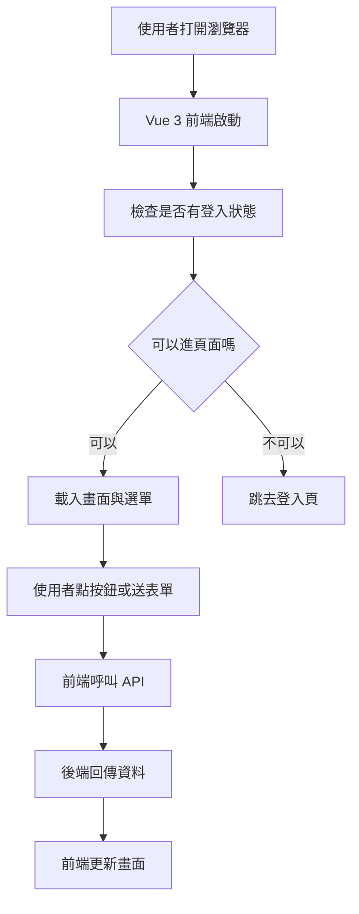

你可以先記住這句話：

> **前端的責任，是把使用者動作翻譯成 API 請求。**

---

## 二、前端專案是怎麼啟動的？

前端專案不是一打開就有畫面，通常會先經過一個入口檔案。  
在這個專案裡，最核心的入口是 [`src/main.js`](fpg-v3/src/main.js)。

它做的事情很像「把店開門前的準備工作做完」：

- 建立 Vue 應用
- 載入路由
- 載入狀態管理
- 載入國際化
- 載入元件
- 設定全域方法與全域元件
- 掛上權限控制
- 最後把畫面掛到頁面上

你可以用一句話理解它：

> **`main.js` 是前端的總開關。**

---

### 1. 建立 Vue 應用

先看最基本的部分：

```javascript
import { createApp } from 'vue'
import App from './App'

const app = createApp(App)
```

這段的意思是：

- 從 Vue 建立一個應用
- 以 `App` 作為整個網站的根元件

你可以把 `App` 想成整棟房子的主結構，其他頁面和元件都會圍繞它展開。

---

### 2. 掛上路由與狀態

再看這種寫法：

```javascript
app.use(router)
app.use(store)
app.use(i18n)
```

意思是：

- `router` 負責頁面切換
- `store` 負責共用狀態
- `i18n` 負責多語系

這就像是：

- 路由＝樓層導覽圖
- 狀態管理＝全店共用資訊板
- 多語系＝不同語言版本的菜單

---

### 3. 掛上全域方法與元件

你會看到類似這樣的設定：

```javascript
app.config.globalProperties.parseTime = parseTime
app.component('Pagination', Pagination)
```

意思是：

- `parseTime` 這種工具可以全站共用
- `Pagination` 這種分頁元件也能全站重複使用

這樣做的好處是：

- 少寫重複程式
- 每個頁面都能用同一套工具
- 畫面風格比較一致

---

## 三、開發時怎麼跑起來？

前端專案的開發設定在 [`fpg-v3/vite.config.js`](fpg-v3/vite.config.js) 與 [`fpg-v3/playwright.config.ts`](fpg-v3/playwright.config.ts)。

你現在不需要死背設定，只要知道它們主要在做三件事：

1. 設定開發伺服器
2. 設定前端的基底路徑
3. 設定 API 代理轉發

---

### 1. 開發伺服器與基底路徑

在 [`vite.config.js`](fpg-v3/vite.config.js) 裡，有一段很重要的概念：

```javascript
base: VITE_APP_ENV === 'production' ? '/vcpseos/' : '/vcpseosTest/'
```

意思是：

- 正式環境和測試環境使用不同的網站根路徑
- 這樣部署時不容易混淆

你可以把它想成：

> 正式店面和試營運店面，門牌不一樣。

---

### 2. API 代理轉發

同一個設定檔裡，還有這段概念：

```javascript
proxy: {
  '/dev-api': {
    target: 'http://localhost:8090',
    rewrite: (p) => p.replace(/^\/dev-api/, '')
  }
}
```

意思是：

- 前端先呼叫 `/dev-api`
- 開發伺服器幫你轉送到後端 `8090`
- 讓前端看起來像是在同網域呼叫

這樣的好處是：

- 開發時不用一直處理跨域問題
- 前後端分開開發更方便

你可以把它想成：

> 前台先把單子交給內部轉接員，再由轉接員送到廚房。

---

## 四、路由是怎麼控制頁面的？

路由就是「網址對應到哪個畫面」。  
這個專案在 [`src/permission.js`](fpg-v3/src/permission.js) 裡做了很重要的權限與路由控制。

你可以把路由理解成：

> **每個網址都像一扇門，路由決定你能不能進。**

---

### 1. 沒有登入時，先去登入頁

當使用者沒有 token 時，系統會先檢查目前要去的頁面是不是白名單。  
如果不是，就會導去登入頁。

概念像這樣：

```javascript
if (getToken()) {
  next()
} else {
  next('/login')
}
```

這段的意思是：

- 有登入憑證就可以繼續
- 沒有登入憑證就先去登入頁

你可以把 token 想成：

> 進門的會員卡。

---

### 2. 有登入時，還要看權限

有 token 不代表你能看所有頁面。  
系統還會載入你的角色與可訪問路由。

`src/permission.js` 裡的流程大致是：

- 先抓使用者資訊
- 再根據角色產生可用路由
- 動態把可進入的頁面加到路由表

這樣做的好處是：

- 不同角色看到的功能不同
- 不能亂進別人的功能頁

這很像公司門禁：

> 你有工牌，不代表你能進每一層樓；  
> 你還要看部門與權限。

---

### 3. 動態加入路由

這段概念很重要：

```javascript
router.addRoute(route)
```

意思是：

- 系統不是一開始就把所有功能頁都放好
- 而是登入後，根據權限再把能看的頁面加進來

這樣的設計更安全，也更靈活。

---

## 五、前端怎麼呼叫後端 API？

前端的 API 都放在 `src/api` 底下。  
這是整個章節最重要的地方。

你可以先把 `src/api` 想成：

> **前端和後端之間的「聯絡簿」。**

每一個檔案通常對應一個功能模組，例如：

- `src/api/login.js`：登入相關
- `src/api/menu.js`：路由與選單相關
- `src/api/f/faa3.js`：假日建檔
- `src/api/f/fab2.js`：經辦確認
- `src/api/a/eoa1.js`：承攬廠商
- `src/api/q/qaa1.js`：欄位對照
- `src/api/sd/sdaa.js`：關鍵字建檔

---

## 六、最基本的 API 寫法長什麼樣？

幾乎每一個 API 檔都長得很像。  
先看一個很簡單的例子：

```javascript
import request from '@/utils/request'

export function getRouters() {
  return request({ url: '/getRouters', method: 'get' })
}
```

這段的意思是：

- 使用共用的 `request`
- 發送 `GET /getRouters`
- 把結果回傳給呼叫者

你可以把它想成：

> 前端先寫好「這個功能要去哪裡送單」，  
> 真正送出的動作交給共用的請求工具處理。

---

## 七、登入頁怎麼對接？

登入相關的 API 在 [`src/api/login.js`](fpg-v3/src/api/login.js)。

這個檔案有幾個常見功能：

- 登入
- 登出
- 取得使用者資訊
- 取得驗證碼
- 變更語系
- 取得公告

---

### 1. 登入 API

```javascript
export function login(username, password, code, uuid) {
  return request({
    url: '/login',
    headers: { isToken: false },
    method: 'post',
    data: { username, password, code, uuid }
  })
}
```

這段的意思是：

- 把帳號、密碼、驗證碼、驗證碼編號一起送給後端
- 因為還沒登入，所以這支 API 不需要 token

如果使用者輸入：

- 帳號：`demo`
- 密碼：`123456`
- 驗證碼：`abcd`
- `uuid`：驗證碼識別碼

後端就會檢查這些資料是否正確。  
如果成功，就回傳登入成功與 token。

---

### 2. 取得驗證碼

```javascript
export function getCodeImg() {
  return request({
    url: '/captchaImage',
    headers: { isToken: false },
    method: 'get'
  })
}
```

這段的意思是：

- 登入頁需要先抓驗證碼圖片
- 因為還沒登入，所以也不需要 token

你可以把它想成：

> 先拿一張「進門前的小考題」，確認不是機器人。

---

### 3. 取得使用者資訊

```javascript
export function getInfo() {
  return request({
    url: '/getInfo',
    method: 'get'
  })
}
```

這支 API 會在登入後使用。  
它的用途是：

- 取得你的角色
- 取得你的權限
- 取得你的基本資訊

這些資訊會影響你能看到哪些選單與頁面。

---

## 八、列表頁怎麼對接？

列表頁是最常見的畫面類型。  
例如假日建檔、欄位對照、廠商資料，很多都會有「查詢列表」、「新增」、「修改」、「刪除」。

這種 API 通常都長得很像。  
以 [`src/api/f/faa3.js`](fpg-v3/src/api/f/faa3.js) 為例：

```javascript
export function listFaa3(query) {
  return request({ url: '/f/faa3/list', method: 'get', params: query })
}
```

這段的意思是：

- 從 `/f/faa3/list` 查詢資料
- 查詢條件放在 `query`
- 後端回傳一批列表資料

如果 `query` 裡有：

- 年份
- 月份
- 假日名稱

那前端就會把這些條件送出去，後端再回傳符合條件的資料。

---

### 1. 查單筆資料

```javascript
export function getFaa3(xuid) {
  return request({ url: '/f/faa3/' + xuid, method: 'get' })
}
```

這段的意思是：

- 用某筆資料的識別碼查詳細內容
- 常用在「編輯前先打開資料」或「看明細」

---

### 2. 新增資料

```javascript
export function addFaa3(data) {
  return request({ url: '/f/faa3', method: 'post', data: data })
}
```

這段的意思是：

- 把表單資料送到後端
- 請後端新增一筆假日資料

---

### 3. 修改資料

```javascript
export function updateFaa3(data) {
  return request({ url: '/f/faa3', method: 'put', data: data })
}
```

這段的意思是：

- 編輯完後把新的資料送回去
- 請後端更新原本那筆資料

---

### 4. 刪除資料

```javascript
export function delFaa3(xuid) {
  return request({ url: '/f/faa3/' + xuid, method: 'delete' })
}
```

這段的意思是：

- 用識別碼刪掉某筆資料
- 通常會搭配刪除確認視窗

---

## 九、前端頁面通常怎麼用這些 API？

你可以把一個頁面想成這樣的流程：

1. 進入頁面時先載入列表
2. 使用者輸入查詢條件
3. 按下查詢後重新抓資料
4. 按下新增打開表單
5. 送出表單時呼叫新增或修改 API
6. 按下刪除時呼叫刪除 API

下面用一個非常簡單的範例看概念：

```javascript
import { listFaa3 } from '@/api/f/faa3'

listFaa3({ year: 2026 }).then(res => {
  console.log(res)
})
```

這段的意思是：

- 呼叫假日列表 API
- 查詢條件是年份 2026
- 拿到結果後印出來

在實際畫面中，通常不會只是 `console.log`，而是會把資料放進表格。

---

## 十、表單送出時的概念是什麼？

表單通常會先做兩件事：

1. 驗證資料有沒有填對
2. 決定要呼叫新增還是修改 API

例如：

```javascript
if (form.id) {
  updateFaa3(form)
} else {
  addFaa3(form)
}
```

這段的意思是：

- 如果有 `id`，表示這是一筆已存在資料的修改
- 如果沒有 `id`，表示這是新增

這個判斷在很多頁面都會出現。

你可以把它想成：

> 有訂單編號＝改舊單；沒有訂單編號＝開新單。

---

## 十一、這個專案裡有哪些常見功能模組？

下面挑幾個來看，幫你建立整體印象。

---

### 1. 參考資料與欄位對照

相關檔案：

- [`src/api/q/qaa1.js`](fpg-v3/src/api/q/qaa1.js)
- [`src/api/q/qaa2.js`](fpg-v3/src/api/q/qaa2.js)

這類頁面通常是：

- 管理欄位對照資料
- 管理畫面顯示欄位
- 支援查詢、新增、修改、刪除、匯出

這就像：

> 系統字典表，讓前端知道每個欄位要怎麼顯示。

---

### 2. 多語係與關鍵字

相關檔案：

- [`src/api/sd/sdaa.js`](fpg-v3/src/api/sd/sdaa.js)
- [`src/api/sd/sdab.js`](fpg-v3/src/api/sd/sdab.js)
- [`src/api/sd/sdad.js`](fpg-v3/src/api/sd/sdad.js)

這類頁面通常是：

- 管理顯示文字
- 管理翻譯內容
- 管理關鍵字對照

你可以把它想成：

> 同一句話，在不同語言中有不同版本。

---

### 3. 單據參數與假日設定

相關檔案：

- [`src/api/f/faa1.js`](fpg-v3/src/api/f/faa1.js)
- [`src/api/f/faa2.js`](fpg-v3/src/api/f/faa2.js)
- [`src/api/f/faa3.js`](fpg-v3/src/api/f/faa3.js)
- [`src/api/f/faa4.js`](fpg-v3/src/api/f/faa4.js)

這些通常是主資料維護類型的頁面。  
例如：

- 單據金額
- 寬限天數
- 假日資料
- 通知名單

你可以把它想成：

> 先把規則和名單建好，後面的業務流程才有東西可用。

---

### 4. 廠商與報到資料

相關檔案：

- [`src/api/a/eoa1.js`](fpg-v3/src/api/a/eoa1.js)
- [`src/api/a/eoa3.js`](fpg-v3/src/api/a/eoa3.js)
- [`src/api/a/eoa4.js`](fpg-v3/src/api/a/eoa4.js)

這類頁面通常是：

- 建立廠商資料
- 維護人員與車輛
- 管理證照與複訓資料

這就像：

> 一家工廠要先確認廠商資料完整，後續流程才不會卡住。

---

### 5. 核簽與確認流程

相關檔案：

- [`src/api/f/fab2.js`](fpg-v3/src/api/f/fab2.js)
- [`src/api/f/fab3.js`](fpg-v3/src/api/f/fab3.js)
- [`src/api/f/fab4.js`](fpg-v3/src/api/f/fab4.js)

這些 API 跟流程動作有關，例如：

- 經辦確認
- 課長呈核
- 廠長核准
- 退回
- 查核簽歷程

這就像：

> 文件要一關一關蓋章，不能直接跳到最後一步。

---

## 十二、前端按鈕按下去後，為什麼會呼叫到某個後端功能？

這是很多新手最想知道的問題。

我們用最簡單的方式拆解：

1. 畫面上有一個按鈕
2. 按鈕綁定一個方法
3. 方法裡呼叫某個 API
4. API URL 對應到後端控制器
5. 控制器再呼叫服務層處理資料

可以用這張圖理解：

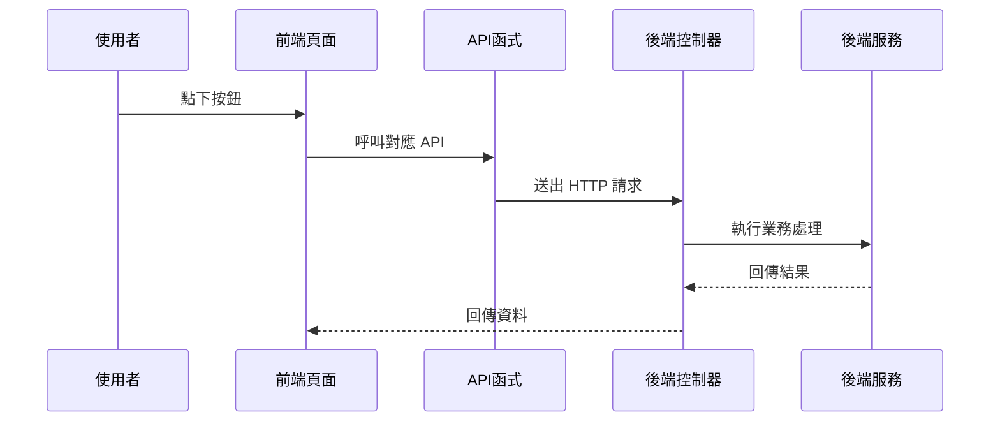

你可以把它想成：

> 你按的是「畫面上的按鈕」，  
> 真正動作是「前端方法 → API → 後端控制器」。

---

## 十三、來看一個很小的完整例子

假設你要做「查詢假日列表」。

### 第一步：前端先引用 API

```javascript
import { listFaa3 } from '@/api/f/faa3'
```

這表示你先把「查詢假日」這支 API 拿進來。

---

### 第二步：按查詢時呼叫它

```javascript
function handleQuery() {
  listFaa3(searchForm).then(res => {
    tableData.value = res.rows
  })
}
```

這表示：

- 使用搜尋表單作為查詢條件
- 把回來的資料放進表格

---

### 第三步：畫面更新

這時候使用者就會看到新的查詢結果。  
整個過程像是：

> 你把問題交給櫃台，櫃台幫你去查，  
> 查完再把結果端回來。

---

## 十四、這一章最常見的幾個名詞，你要先知道

### 1. 路由

網址與畫面的對應關係。  
簡單說，就是「這個網址要開哪一頁」。

---

### 2. 權限控制

不是每個人都能看每個功能。  
要看你的登入身分、角色、權限。

---

### 3. API

前端和後端溝通的接口。  
前端把需求送出去，後端把結果回來。

---

### 4. 請求

前端送出的動作。  
例如查詢、新增、修改、刪除。

---

### 5. 回應

後端回來的結果。  
通常會包含成功失敗、訊息、資料。

---

## 十五、如果你是新手，最該先記住什麼？

你不需要一開始就背完所有檔案。  
先記住這三件事就很好：

1. **畫面上的每個操作，通常都對應一支 API**
2. **`src/api` 是前端呼叫後端的集中地方**
3. **登入後還要看路由與權限，才能決定能看到哪些功能**

只要你有這三個概念，後面看任何模組都會容易很多。

---

## 十六、本章的小地圖：前端是怎麼組織的？

你可以把整個前端想成下面這樣：

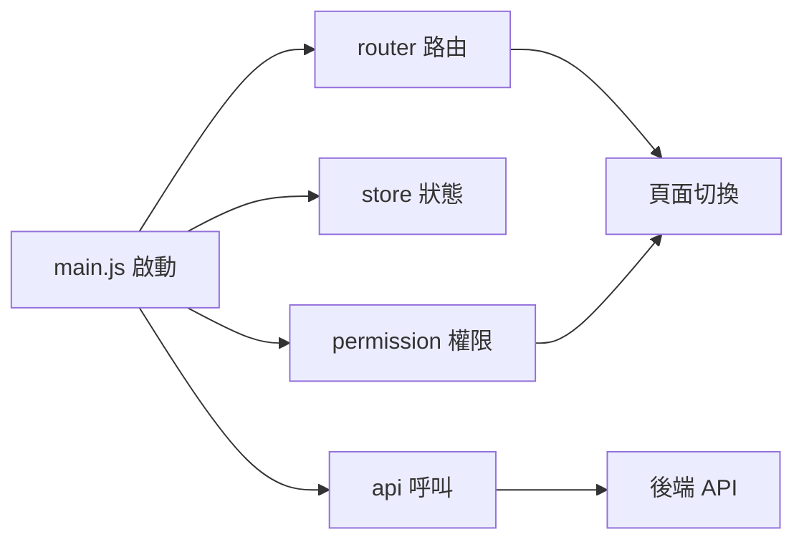

這張圖要表達的是：

- `main.js` 是入口
- `router` 負責頁面
- `permission` 負責能不能看
- `api` 負責資料溝通

---

## 十七、和下一章的銜接

現在你已經知道：

- 前端畫面如何啟動
- 路由與權限怎麼控制頁面
- `src/api` 裡的函式怎麼對應後端
- 按鈕、查詢、表單如何把資料送出去

接下來，你就可以進一步理解「資料與欄位是怎麼被管理的」，也就是下一章的主題：  
[參考資料與欄位對照平台](03_參考資料與欄位對照平台_.md)

---

## 本章總結

這一章我們用最簡單的方式認識了前端介面與 API 對接：

- `main.js` 負責啟動前端
- `vite.config.js` 負責開發環境與代理設定
- `permission.js` 負責登入與權限控制
- `src/api` 底下的檔案負責定義每個功能的 API
- 畫面上的查詢、新增、修改、刪除，其實都是呼叫對應的 API

如果你現在還沒有完全記住所有細節，沒關係。  
新手最重要的是先建立一個清楚的流程感：

> **使用者操作畫面 → 前端呼叫 API → 後端處理資料 → 前端更新結果**

只要這條路徑懂了，後面很多章節都會越看越順。


# Chapter 3：參考資料與欄位對照平台

接續上一章的 [前端介面與 API 對接](02_前端介面與_api_對接_.md)，你已經知道「畫面怎麼把資料送到後端」。  
這一章我們要往更深入一層，看一個很重要、但常被新手忽略的主題：

> **系統裡的欄位名稱、顯示名稱、資料型態、顯示格式，應該由誰來管理？**

如果沒有這一層，畫面就很容易出現：

- 同一個欄位，在不同頁面叫法不一樣
- 英文欄位名和中文顯示名對不起來
- 報表欄位寫死，改版時每個地方都要重改
- 不同角色、不同頁籤的欄位顯示邏輯分散在各處

所以這一章的核心，就是學會理解：

> **參考資料與欄位對照平台，就像系統的字典館與索引卡。**

你不用直接背每個欄位是什麼，  
而是先查字典、查對照表，讓系統知道「這個欄位是誰、要怎麼顯示、屬於哪一類」。

---

## 本章要解決的中心情境

先想像一個很實際的例子：

> 你要在畫面上顯示「使用者資料列表」，但這個列表有些欄位來自資料庫原始欄位，有些欄位要顯示中文名稱，有些欄位還要根據角色、頁籤、顯示區域來決定要不要出現。

如果你把這些規則都寫死在畫面裡，之後只要欄位一變，前端、後端、報表、匯出都要一起改。  
這會很痛苦。

所以這個平台的作用，就是把這些資訊集中起來：

- 系統欄位代碼
- 原始欄位名稱
- 中文顯示名稱
- 英文顯示名稱
- 資料型態
- 顯示格式
- 欄位分類
- 角色 / 頁籤 / 顯示區域 / 顯示順序
- 生效註記

簡單說：

> **它不是在存真正的業務資料，而是在存「資料怎麼被理解與顯示」的規則。**

---

## 先用白話認識這個平台

你可以把它想像成圖書館的索引卡：

- 你不一定一開始就去翻整本書
- 你先查索引卡
- 看書名、分類、位置、標籤
- 再去找真正的內容

這個平台也是一樣：

- 不直接處理業務內容
- 而是先整理欄位資訊
- 讓別的模組查得到正確欄位名稱與顯示方式

---

## 這一章會看到哪些資料表概念？

從程式碼來看，這一章主要有兩種資料：

### 1. `VGetcol`：欄位視圖

檔案位置：

- [`fpg-vcpseos/src/main/java/com/fpg/system/domain/VGetcol.java`](fpg-vcpseos/src/main/java/com/fpg/system/domain/VGetcol.java)
- [`fpg-vcpseos/src/main/java/com/fpg/system/controller/VGetcolController.java`](fpg-vcpseos/src/main/java/com/fpg/system/controller/VGetcolController.java)

它看起來像一個「欄位字典視圖」，主要整理：

- 欄位代號
- 欄位名稱
- 類型
- 長度
- 精度
- 小數位數

這很像是資料庫欄位的說明卡。

---

### 2. `Txdqaa11`：資料欄位對照建檔

檔案位置：

- [`fpg-vcpseos/src/main/java/com/fpg/q/domain/Txdqaa11.java`](fpg-vcpseos/src/main/java/com/fpg/q/domain/Txdqaa11.java)
- [`fpg-vcpseos/src/main/java/com/fpg/q/controller/Txdqaa11Controller.java`](fpg-vcpseos/src/main/java/com/fpg/q/controller/Txdqaa11Controller.java)

它是更進一步的對照建檔，會記錄：

- 系統欄位代碼
- 來源系統
- 原始欄位名稱
- 中文顯示名稱
- 英文顯示名稱
- 資料型態
- 顯示格式化
- 欄位分類

這表示它不只是「知道欄位叫什麼」，還知道「欄位要怎麼被解釋」。

---

### 3. `Txdqaa21`：盤體欄位顯示建檔

檔案位置：

- [`fpg-vcpseos/src/main/java/com/fpg/q/domain/Txdqaa21.java`](fpg-vcpseos/src/main/java/com/fpg/q/domain/Txdqaa21.java)
- [`fpg-vcpseos/src/main/java/com/fpg/q/controller/Txdqaa21Controller.java`](fpg-vcpseos/src/main/java/com/fpg/q/controller/Txdqaa21Controller.java)

這一份更偏向「畫面顯示規則」，會記錄：

- 角色類型
- 頁籤類型
- 顯示區域
- 顯示順序
- 系統欄位代碼
- 生效註記

它很像「這個人、在這個頁籤、這個區塊，應該看到哪些欄位，順序怎麼排」。

---

## 先抓住最重要的一句話

如果你今天只想記一句話，那就是：

> **`VGetcol` 管欄位字典，`Txdqaa11` 管欄位對照，`Txdqaa21` 管畫面顯示規則。**

這三個一起組成一個「參考資料與欄位對照平台」。

---

## 一、先看整體架構：它像一套字典系統

下面這張圖可以幫助你先建立整體感覺：

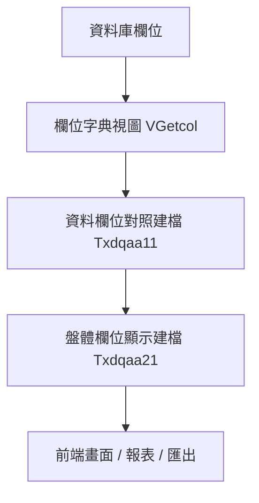

你可以這樣理解：

- `VGetcol`：先知道欄位原始資訊
- `Txdqaa11`：再把欄位對應成系統想要的名字
- `Txdqaa21`：最後決定畫面怎麼顯示

這很像：

- 第一層：書的索引
- 第二層：書的標題翻譯
- 第三層：書架擺放方式

---

## 二、`VGetcol` 是什麼？

先看 [`VGetcol`](fpg-vcpseos/src/main/java/com/fpg/system/domain/VGetcol.java)。

它的欄位很簡單：

- `columnName`：欄位代號
- `comments`：欄位名稱
- `dataType`：類型
- `dataLength`：長度
- `dataPrecision`：精度
- `dataScale`：小數位數

你可以把它想成「資料庫欄位的說明卡」。

---

### 1. `VGetcol` 的用途

當你要查某個欄位的基本資訊時，它可以告訴你：

- 這欄叫什麼
- 是字串還是數字
- 長度多少
- 小數點有幾位

這些資訊對於：

- 報表
- 匯出
- 欄位驗證
- 動態畫面

都很有幫助。

---

### 2. 簡單看欄位長相

```java
private String columnName;
private String comments;
private String dataType;
```

這三個欄位代表：

- 欄位代號
- 欄位名稱
- 資料型態

很像你在查字典時，先看到：

- 單字本身
- 中文解釋
- 詞性

---

## 三、`VGetcol` 的資料怎麼被查出來？

它有對應的 Mapper、Service、Controller：

- [`VGetcolMapper`](fpg-vcpseos/src/main/java/com/fpg/system/mapper/VGetcolMapper.java)
- [`IVGetcolService`](fpg-vcpseos/src/main/java/com/fpg/system/service/IVGetcolService.java)
- [`VGetcolServiceImpl`](fpg-vcpseos/src/main/java/com/fpg/system/service/impl/VGetcolServiceImpl.java)
- [`VGetcolController`](fpg-vcpseos/src/main/java/com/fpg/system/controller/VGetcolController.java)

這就是標準的「控制器 → 服務 → 資料存取」三層結構。

---

### `VGetcolController` 在做什麼？

它提供這些常見功能：

- 查詢列表
- 匯出 Excel
- 查單筆詳細
- 新增
- 修改
- 刪除

你可以把它想成一個「欄位字典管理櫃台」。

---

### 查詢列表的概念

```java
@PreAuthorize("@ss.hasPermi('system:getcol:list')")
@GetMapping("/list")
public TableDataInfo list(VGetcol vGetcol)
```

這段表示：

- 只有有權限的人能查
- 送出 `GET /system/getcol/list`
- 系統根據條件回傳列表

如果你輸入查詢條件，後端就會回傳符合條件的欄位資料。

---

### 匯出 Excel 的概念

```java
ExcelUtil<VGetcol> util = new ExcelUtil<VGetcol>(VGetcol.class);
util.exportExcel(response, list, "欄位視圖数据");
```

這表示：

- 把查到的欄位資料匯出成 Excel
- 每一列就是一筆欄位資訊

這對管理者很實用，因為可以直接把欄位清單帶走檢查。

---

## 四、`Txdqaa11`：資料欄位對照建檔

接下來看更重要的 [`Txdqaa11`](fpg-vcpseos/src/main/java/com/fpg/q/domain/Txdqaa11.java)。

它比 `VGetcol` 更像「正式建檔資料」，因為它不只看欄位本身，還看：

- 哪個系統來的
- 原始欄位怎麼叫
- 中文與英文顯示怎麼設
- 欄位分類是什麼
- 顯示格式要怎麼轉

---

### 1. 這個資料物件在記錄什麼？

你可以把它想成一張「欄位翻譯卡」。

例如，某個欄位在來源系統裡叫：

- `AMT`

但在前端要顯示成：

- 中文：金額
- 英文：Amount

而且它還可能是：

- 數字型態
- 顯示時要加千分位
- 屬於金額分類

這些資訊就很適合放在 `Txdqaa11`。

---

### 2. 重要欄位看一眼就懂

```java
private String sysfldcode;
private String srcsys;
private String orifldname;
```

這三個欄位分別是：

- 系統欄位代碼
- 來源系統
- 原始欄位名稱

意思就是：

> 「這個欄位從哪裡來、原本叫什麼、在系統中怎麼識別。」

---

### 3. 顯示名稱與格式

```java
private String chndispname;
private String engdispname;
private String dispformat;
```

這三個欄位分別是：

- 中文顯示名稱
- 英文顯示名稱
- 顯示格式化

這非常重要，因為同一個欄位可以在不同畫面有不同的呈現方式。

例如：

- 日期欄位可以顯示成 `2026-04-21`
- 金額欄位可以顯示成 `1,000,000`
- 狀態欄位可以顯示成 `啟用` 或 `停用`

---

## 五、`Txdqaa11` 的服務層在保護什麼？

看 [`Txdqaa11ServiceImpl`](fpg-vcpseos/src/main/java/com/fpg/q/service/impl/Txdqaa11ServiceImpl.java)。

這一層不只是單純轉呼叫 Mapper，  
它還會做資料檢查。

---

### 1. 為什麼新增前要檢查欄位代碼？

這段很重要：

```java
String normalizedSysfldcode = normalizeSysfldcode(txdqaa11.getSysfldcode());
if (!isValidSysfldcode(normalizedSysfldcode))
{
    throw new ServiceException("系統欄位代碼需為20碼內英數字");
}
```

意思是：

- 先把欄位代碼整理成標準格式
- 再檢查是不是合法
- 不合法就丟出錯誤

這就像你在建檔前先檢查身分證號格式，不對就不能送出。

---

### 2. 為什麼還要檢查重複？

```java
if (txdqaa11Mapper.selectTxdqaa11ByUk(txdqaa11) != null)
{
    throw new ServiceException("新增失敗，系統欄位代碼「" + normalizedSysfldcode + "」已存在");
}
```

意思是：

- 同一個系統欄位代碼不能重複建檔
- 避免資料混亂

你可以把它想成：

> 書架上不能有兩本一模一樣索引碼的書，否則找書會亂掉。

---

### 3. 為什麼修改時不能改鍵值欄位？

```java
if (StringUtils.isEmpty(dbData.getSysfldcode()) || !dbData.getSysfldcode().equalsIgnoreCase(normalizedSysfldcode))
{
    throw new ServiceException("系統欄位代碼為鍵值欄位，建檔後不可修改");
}
```

這表示：

- 系統欄位代碼是關鍵識別碼
- 建檔後不能亂改
- 否則對照關係會壞掉

這就像：

> 你的身分證號不能改，因為很多資料都靠它認人。

---

## 六、`Txdqaa11` 的流程長什麼樣子？

下面用一張很簡單的流程圖看新增時發生什麼事：

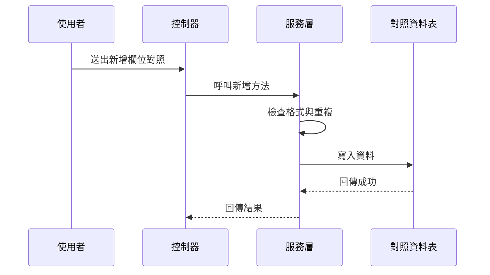

你可以這樣理解：

- 使用者送出資料
- 控制器收資料
- 服務層先做規則檢查
- 通過後才寫資料庫

這樣比較安全。

---

## 七、`Txdqaa21`：盤體欄位顯示建檔

接下來看 [`Txdqaa21`](fpg-vcpseos/src/main/java/com/fpg/q/domain/Txdqaa21.java)。

這一份資料更偏向「畫面怎麼顯示」。

它主要記錄：

- 角色類型
- 頁籤類型
- 顯示區域
- 顯示順序
- 系統欄位代碼
- 生效註記

你可以把它想成：

> 同一套資料，給不同角色看到的欄位排列順序不一樣。

---

### 1. 角色與頁籤的重要性

```java
private String roletype;
private String tabtype;
private String disparea;
```

這三個欄位代表：

- 哪一種角色
- 哪一個頁籤
- 顯示在哪個區域

例如：

- 經辦看到一套欄位
- 審核者看到另一套欄位
- 同一欄位在不同頁籤也可能顯示位置不同

---

### 2. 顯示順序很重要

```java
private Long dispseq;
private String sysfldcode;
private String activeflg;
```

這些欄位代表：

- 第幾個顯示
- 要顯示哪個欄位
- 是否生效

就像排隊一樣，  
就算都是同一批資料，順序不同，使用者感受就不同。

---

## 八、`Txdqaa21ServiceImpl` 在幫你做哪些檢查？

看 [`Txdqaa21ServiceImpl`](fpg-vcpseos/src/main/java/com/fpg/q/service/impl/Txdqaa21ServiceImpl.java)。

它的重點不只是存資料，還會檢查「顯示區域」是否合理。

---

### 1. 當頁籤類型是特定值時，顯示區域不能空白

```java
if ("MAINT".equals(txdqaa21.getTabtype()) || "CHECK".equals(txdqaa21.getTabtype()))
{
    if (StringUtils.isBlank(txdqaa21.getDisparea()))
    {
        throw new ServiceException("MAINT/CHECK tab type requires disparea");
    }
}
```

這段的意思是：

- 如果頁籤類型是 `MAINT` 或 `CHECK`
- 就必須填顯示區域
- 不然就丟錯

這就像：

> 某些房間一定要填樓層與位置，不然找不到。

---

### 2. 其他頁籤時，顯示區域會被清空

```java
else
{
    txdqaa21.setDisparea(null);
}
```

這表示：

- 不是特定頁籤時
- 顯示區域不需要保留
- 系統自動幫你清掉

這種做法可以避免資料混亂。

---

## 九、`Txdqaa21Controller` 如何避免重複資料？

看 [`Txdqaa21Controller`](fpg-vcpseos/src/main/java/com/fpg/q/controller/Txdqaa21Controller.java)。

它在新增前會先查一次是否已存在同樣的組合：

- 角色類型
- 頁籤類型
- 顯示區域
- 系統欄位代碼

如果重複，就直接回傳錯誤：

```java
if (dbTxdqaa21 != null)
{
    return error("重複資料，請確認角色/頁籤/顯示區域/系統欄位代碼組合");
}
```

這很重要，因為欄位顯示規則不能重複，不然畫面會不知道要套哪一筆。

---

## 十、三個資料物件怎麼分工？

你可以這樣記：

| 名稱 | 作用 | 類比 |
|---|---|---|
| `VGetcol` | 看欄位基本資訊 | 字典索引卡 |
| `Txdqaa11` | 管欄位對照與顯示名稱 | 翻譯字典 |
| `Txdqaa21` | 管角色與頁籤的顯示規則 | 座位表 |

---

## 十一、實際使用時，怎麼幫助前端？

前端常常會遇到這些問題：

- 欄位名稱從哪裡來？
- 表格標題要顯示中文還是英文？
- 某個角色看到哪些欄位？
- 某些欄位要不要顯示？
- 顯示順序如何調整？

這些問題如果都硬寫在前端，會很難維護。  
但如果資料都先放在這個平台，前端就可以先查對照表再畫畫面。

---

### 一個很簡單的想像

假設前端要顯示一個表格：

- 欄位 1：系統欄位代碼
- 欄位 2：中文顯示名稱
- 欄位 3：英文顯示名稱
- 欄位 4：顯示格式

如果管理者把某個欄位名稱改了，  
前端不用重新寫死，只要重新查這個平台的資料就行。

這就像：

> 不是每張地圖都重畫道路，而是更新路名資料。

---

## 十二、這個平台和上一章有什麼關係？

上一章我們講的是前端怎麼呼叫 API。  
這一章則是告訴你：

> **API 之後拿到的欄位資訊，常常不是直接寫死，而是來自這些對照資料。**

所以它們是上下相扣的：

- 前端負責發出請求
- 參考資料與欄位對照平台負責提供正確欄位規則
- 後端業務模組負責依規則運作

---

## 十三、你可以先記住的使用步驟

如果今天你要理解這個平台，可以用下面這個順序：

1. 先看 `VGetcol`，知道欄位基本資訊
2. 再看 `Txdqaa11`，知道欄位怎麼對照與命名
3. 再看 `Txdqaa21`，知道欄位在畫面怎麼顯示
4. 最後看 Controller、Service、Mapper，了解資料怎麼被管理

---

## 十四、三層式結構怎麼串起來？

這一章的程式碼很適合用「三層式」理解：

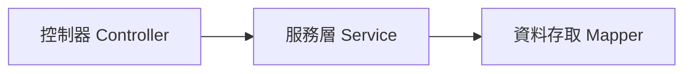

### 你可以這樣想：

- `Controller`：接收前端請求
- `Service`：檢查規則、處理邏輯
- `Mapper`：真正跟資料庫溝通

例如：

- 使用者按「新增」
- `Controller` 收到表單
- `Service` 檢查欄位是否合法、是否重複
- `Mapper` 寫入資料庫

---

## 十五、看一個最小的新增概念

下面是一個非常簡化的概念示意：

```java
Txdqaa11 data = new Txdqaa11();
data.setSysfldcode("AMT");
data.setChndispname("金額");
service.insertTxdqaa11(data);
```

這段的意思是：

- 建立一筆欄位對照資料
- 設定系統欄位代碼
- 設定中文顯示名稱
- 送進服務層新增

如果資料正確，系統就會把它存起來。  
如果格式錯誤或重複，就會回傳錯誤。

---

## 十六、再看一個很小的查詢概念

```java
Txdqaa21 query = new Txdqaa21();
query.setRoletype("A");
query.setTabtype("MAINT");
service.selectTxdqaa21List(query);
```

這段的意思是：

- 查某個角色、某個頁籤的欄位顯示規則
- 後端會回傳符合條件的顯示設定

這很像在問系統：

> 「這位使用者在這個頁籤裡，應該看到什麼？」

---

## 十七、初學者最容易搞混的地方

### 1. `VGetcol` 不是業務資料

它只是欄位資訊，不是某個功能的內容資料。

---

### 2. `Txdqaa11` 與 `Txdqaa21` 分工不同

- `Txdqaa11` 偏向欄位本身的對照與命名
- `Txdqaa21` 偏向不同角色與頁籤的顯示規則

---

### 3. `Service` 不只是轉呼叫

它還會做格式檢查、重複檢查、鍵值保護，這些都很重要。

---

### 4. `ExcelUtil` 只是輸出工具，不是資料來源

它負責把資料匯出成 Excel，資料還是來自這些對照表。

---

## 十八、本章小結

這一章我們認識了「參考資料與欄位對照平台」的核心概念：

- `VGetcol`：管理欄位字典資訊
- `Txdqaa11`：管理資料欄位對照與顯示名稱
- `Txdqaa21`：管理角色、頁籤與顯示區域的欄位規則
- `Controller`、`Service`、`Mapper` 三層結構如何合作
- 服務層如何做格式檢查、重複檢查、欄位保護

你可以把這一章記成一句話：

> **這個平台負責先把欄位的名字、型態、顯示方式、對照關係整理好，讓別的模組能安心查詢與顯示。**

---

下一章我們會接著看更貼近顯示層的內容：  
[多語係與關鍵字字典管理](04_多語係與關鍵字字典管理_.md)


# Chapter 4：多語係與關鍵字字典管理

接續上一章的 [參考資料與欄位對照平台](03_參考資料與欄位對照平台_.md)，我們已經知道系統如何管理「欄位名稱」與「顯示規則」。  
這一章要再往前走一步，來看一個更貼近畫面與文案的主題：

> **同一個功能，在不同語言、不同專案、不同畫面裡，怎麼維持一致又好管理？**

你可以先把這一章想成：

> **系統的「翻譯字典」加上「詞彙管理中心」。**

它不是只有翻譯，還包含：

- 關鍵字唯一性
- 中文關鍵字對照
- 專案代碼
- 多語係內容
- 菜單名稱轉換
- 匯出成前端與 Java 可用的語言檔

---

## 這一章要先解決的中心情境

先想像一個最常見的情況：

你正在做一個系統畫面，上面有很多按鈕與標籤，例如：

- 新增
- 修改
- 刪除
- 查詢
- 送出
- 核准

如果這些文字都直接寫死在畫面裡，之後只要要改成：

- 簡體中文
- 繁體中文
- 英文

或是要讓不同專案共用同一組詞彙，事情就會變得很麻煩。

所以這一章的重點，就是學會理解：

> **關鍵字先建檔，中文名稱再對照，多語係再統一管理。**

這樣就能讓畫面文字、系統訊息、按鈕名稱、選單名稱都可以被集中管理。

---

## 先用最白話的方式理解

你可以把它想成一本大型詞典：

- `關鍵字`：像是詞條編號
- `關鍵字中文`：像是中文解釋
- `多語係`：像是同一詞條在不同語言下的版本
- `專案編號`：像是哪一套字典
- `類型`：像是這個詞是按鈕、標籤、訊息，還是選單

如果沒有這個平台，大家就會各寫各的：

- 前端一份
- 後端一份
- 報表一份
- 匯出檔一份

最後一定會亂掉。

---

## 這一章你會看到的核心角色

本章主要有四個資料主體：

| 名稱 | 作用 | 類比 |
|---|---|---|
| `Txdsdaa1` | 關鍵字建檔 | 詞條主檔 |
| `Txdsdab1` | 關鍵詞建檔 | 中文詞彙對照本 |
| `Txdsdac1` | 專案模組建檔 | 詞彙屬於哪個模組 |
| `Txdsdad1` | 多語係建檔 | 多語版本字典 |

其中最重要的是：

- `Txdsdaa1`：管理關鍵字與中文名稱
- `Txdsdab1`：管理關鍵詞與欄位型態、長度等資訊
- `Txdsdac1`：管理專案模組
- `Txdsdad1`：真正放多語內容

---

## 一、先看整體流程

如果把整個功能想成一間翻譯中心，流程大概是這樣：

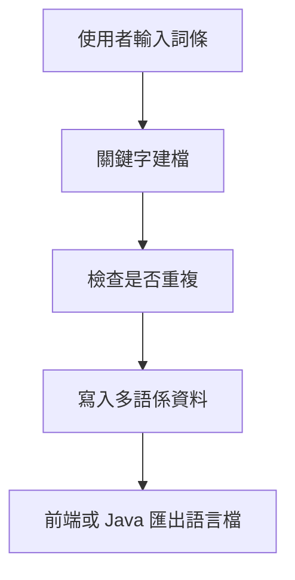

你可以先記住一句話：

> **先建關鍵字，再產生多語內容，最後再匯出給前端使用。**

---

## 二、先從最簡單的資料結構開始

### 1. `Txdsdaa1`：關鍵字建檔

檔案位置：

- [`fpg-vcpseos/src/main/java/com/fpg/sd/domain/Txdsdaa1.java`](fpg-vcpseos/src/main/java/com/fpg/sd/domain/Txdsdaa1.java)

這個類別很像最基本的詞條主檔。  
它主要欄位有：

- `keywd`：關鍵字
- `keywdc`：關鍵字中文
- `xrem`：備註
- `txemp`：異動人員
- `txdat`：異動日期

你可以把它想像成：

- `keywd`：英文代碼
- `keywdc`：中文名字
- `xrem`：補充說明

---

### 2. `Txdsdab1`：關鍵詞建檔

檔案位置：

- [`fpg-vcpseos/src/main/java/com/fpg/sd/domain/Txdsdab1.java`](fpg-vcpseos/src/main/java/com/fpg/sd/domain/Txdsdab1.java)

這個類別比上一個多一點點資訊，除了詞彙外，還包含：

- `kywrdc`：關鍵詞中文
- `kywrd`：關鍵詞
- `fldplty`：欄位型態
- `fldpll`：欄位長度
- `fldpldeci`：欄位小數
- `comt`：說明
- `pjno`：專案編號

你可以把它理解成：

> 這不只是詞彙本身，還帶有「這個詞要怎麼用」的規則。

---

### 3. `Txdsdac1`：專案模組建檔

檔案位置：

- [`fpg-vcpseos/src/main/java/com/fpg/sd/domain/Txdsdac1.java`](fpg-vcpseos/src/main/java/com/fpg/sd/domain/Txdsdac1.java)

這個類別是用來記錄專案模組資訊，例如：

- `ulaymodid`：上層模組代號
- `modid`：模組代號
- `modnm`：模組名稱
- `modclass`：模組類別
- `prgid`：程式代號

它像什麼？

> 像一本字典的章節分類表，告訴你這些詞屬於哪個區塊。

---

### 4. `Txdsdad1`：多語係建檔

檔案位置：

- [`fpg-vcpseos/src/main/java/com/fpg/sd/domain/Txdsdad1.java`](fpg-vcpseos/src/main/java/com/fpg/sd/domain/Txdsdad1.java)

這個類別是真正的多語內容主體。  
它的欄位很多，但新手先抓重點就好：

- `pjno`：專案編號
- `lngid`：訊息代號
- `type`：類型
- `strghtbdymsg`：正體訊息
- `cnmsg`：簡體訊息
- `emsg`：英文訊息
- `lngmsgone`、`lngmsgtwo`、`lngmsgthree`：其他語係欄位
- `comt`：說明

它像一個「多版本翻譯卡」。

---

## 三、先用最簡單的例子理解它怎麼用

假設你想建立一個按鈕文字：

- 關鍵字：`save`
- 中文：`儲存`
- 英文：`Save`
- 專案：`XD`
- 類型：`button`

你可以先理解成三步：

1. 先建詞條
2. 再建多語內容
3. 最後匯出給前端

---

### 1. 先建立關鍵字資料

```java
Txdsdaa1 data = new Txdsdaa1();
data.setKeywd("save");
data.setKeywdc("儲存");
```

這段的意思是：

- 建立一筆關鍵字資料
- 關鍵字是 `save`
- 中文是 `儲存`

這就像詞典裡先放一筆詞條主記錄。

---

### 2. 再建立多語係資料

```java
Txdsdad1 lang = new Txdsdad1();
lang.setLngid("SAVE");
lang.setCnmsg("儲存");
lang.setEmsg("Save");
```

這段的意思是：

- 建立一筆多語內容
- 中文是 `儲存`
- 英文是 `Save`

這樣前端切換語言時，就能顯示對應文字。

---

### 3. 最後存進系統

實際上會交給服務層與控制器處理。  
你不需要自己手動一筆一筆寫資料庫。

你只要先知道概念：

> **資料先建檔，系統再幫你轉成不同語言版本。**

---

## 四、這些模組各自負責什麼？

---

### `Txdsdaa1`：關鍵字建檔

相關檔案：

- [`Txdsdaa1Mapper`](fpg-vcpseos/src/main/java/com/fpg/sd/mapper/Txdsdaa1Mapper.java)
- [`ITxdsdaa1Service`](fpg-vcpseos/src/main/java/com/fpg/sd/service/ITxdsdaa1Service.java)
- [`Txdsdaa1ServiceImpl`](fpg-vcpseos/src/main/java/com/fpg/sd/service/impl/Txdsdaa1ServiceImpl.java)
- [`Txdsdaa1Controller`](fpg-vcpseos/src/main/java/com/fpg/sd/controller/Txdsdaa1Controller.java)

這組主要負責：

- 關鍵字查詢
- 新增
- 修改
- 刪除
- 檢查唯一性
- 翻譯查詢

---

### `Txdsdab1`：關鍵詞建檔

相關檔案：

- [`Txdsdab1Mapper`](fpg-vcpseos/src/main/java/com/fpg/sd/mapper/Txdsdab1Mapper.java)
- [`ITxdsdab1Service`](fpg-vcpseos/src/main/java/com/fpg/sd/service/ITxdsdab1Service.java)
- [`Txdsdab1ServiceImpl`](fpg-vcpseos/src/main/java/com/fpg/sd/service/impl/Txdsdab1ServiceImpl.java)
- [`Txdsdab1Controller`](fpg-vcpseos/src/main/java/com/fpg/sd/controller/Txdsdab1Controller.java)

這組主要負責：

- 關鍵詞查詢
- 新增
- 修改
- 刪除
- 中文唯一性檢查

而且它還會同步寫入多語係資料。

---

### `Txdsdac1`：專案模組建檔

相關檔案：

- [`Txdsdac1Mapper`](fpg-vcpseos/src/main/java/com/fpg/sd/mapper/Txdsdac1Mapper.java)
- [`ITxdsdac1Service`](fpg-vcpseos/src/main/java/com/fpg/sd/service/ITxdsdac1Service.java)
- [`Txdsdac1ServiceImpl`](fpg-vcpseos/src/main/java/com/fpg/sd/service/impl/Txdsdac1ServiceImpl.java)
- [`Txdsdac1Controller`](fpg-vcpseos/src/main/java/com/fpg/sd/controller/Txdsdac1Controller.java)

這組主要負責：

- 專案模組資料維護
- 讓關鍵字或多語資料知道自己屬於哪個模組

---

### `Txdsdad1`：多語係建檔

相關檔案：

- [`Txdsdad1Mapper`](fpg-vcpseos/src/main/java/com/fpg/sd/mapper/Txdsdad1Mapper.java)
- [`ITxdsdad1Service`](fpg-vcpseos/src/main/java/com/fpg/sd/service/ITxdsdad1Service.java)
- [`Txdsdad1ServiceImpl`](fpg-vcpseos/src/main/java/com/fpg/sd/service/impl/Txdsdad1ServiceImpl.java)
- [`Txdsdad1Controller`](fpg-vcpseos/src/main/java/com/fpg/sd/controller/Txdsdad1Controller.java)

這組主要負責：

- 多語資料管理
- 生成前端語言檔
- 生成 Java properties 檔
- 匯出壓縮檔

---

## 五、先看最重要的：關鍵字唯一性

系統最怕什麼？  
最怕同一個關鍵字重複出現。

例如：

- `save` 已經存在
- 你又新增一筆 `save`
- 那系統就不知道該用哪個版本

所以這些模組會先做唯一性檢查。

---

### `Txdsdaa1ServiceImpl` 的唯一性檢查

檔案位置：

- [`fpg-vcpseos/src/main/java/com/fpg/sd/service/impl/Txdsdaa1ServiceImpl.java`](fpg-vcpseos/src/main/java/com/fpg/sd/service/impl/Txdsdaa1ServiceImpl.java)

它有兩個常見檢查：

- 關鍵字是否重複
- 關鍵字中文是否重複

簡化後可以看成這樣：

```java
Txdsdaa1 info = txdsdaa1Mapper.checkKeywdUnique(txdsdaa1);
if (info != null) {
    return false;
}
```

意思是：

- 先去資料庫查
- 如果查得到資料，表示重複
- 如果查不到，才可以新增

這就像：

> 書架上已經有一本叫「儲存」的字典條目，就不能再放第二本同名條目。

---

### `Txdsdab1Controller` 新增時也會先檢查

檔案位置：

- [`fpg-vcpseos/src/main/java/com/fpg/sd/controller/Txdsdab1Controller.java`](fpg-vcpseos/src/main/java/com/fpg/sd/controller/Txdsdab1Controller.java)

它在新增前先檢查中文是否唯一。  
如果已存在，就直接回錯誤。

簡化概念如下：

```java
if (!txdsdab1Service.checkKywrdcUnique(txdsdab1)) {
    return error("關鍵詞中文已存在");
}
```

意思是：

- 不能讓相同中文詞彙重複建檔
- 避免前端顯示與翻譯混亂

---

## 六、建立資料時，系統還會幫你做什麼？

這裡很重要，因為它不是只有「存資料」而已。

---

### `Txdsdaa1ServiceImpl` 會自動補欄位

```java
txdsdaa1.setId(IdUtils.randomUUID());
txdsdaa1.setTxdat(DateUtils.getNowDate());
```

這段代表：

- 系統自動產生主鍵
- 系統自動填入異動日期

你不用自己手動填這些欄位。  
這就像銀行櫃台幫你自動蓋章，不用每個人自己帶印章。

---

### `Txdsdab1ServiceImpl` 會順便寫入多語係資料

這是本章非常關鍵的一段。

檔案位置：

- [`fpg-vcpseos/src/main/java/com/fpg/sd/service/impl/Txdsdab1ServiceImpl.java`](fpg-vcpseos/src/main/java/com/fpg/sd/service/impl/Txdsdab1ServiceImpl.java)

它在新增關鍵詞時，會先建立 `Txdsdad1`：

```java
Txdsdad1 aTxdsdad1 = new Txdsdad1();
aTxdsdad1.setLngid(txdsdab1.getKywrd().toUpperCase());
aTxdsdad1.setCnmsg(txdsdab1.getKywrdc());
aTxdsdad1.setEmsg(txdsdab1.getKywrd());
```

這段的意思是：

- 把關鍵詞轉成多語主檔
- 讓中文、英文與代號一起存進去

它就像：

> 你在字典裡新增一個詞條，系統同時幫你建立翻譯卡。

---

### `Txdsdab1ServiceImpl` 還會更新多語資料

修改時也一樣，會先找到對應的多語係資料，再更新內容。

這表示：

- 關鍵詞改了
- 多語內容也要跟著改
- 不然前端顯示會不一致

這種同步更新的設計非常重要。

---

## 七、看看它們怎麼串在一起

下面用一張簡單的圖理解新增流程：

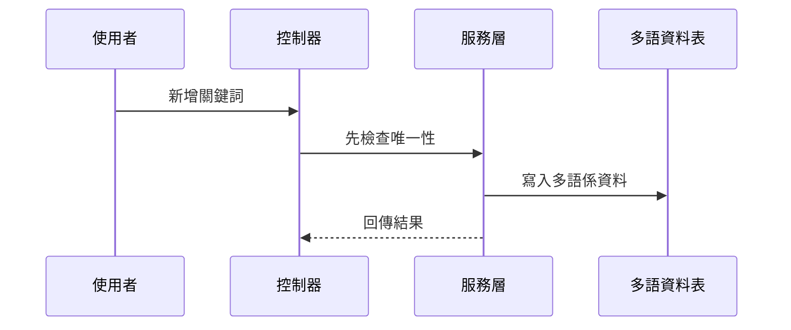

你可以把它理解成：

1. 使用者在畫面上輸入詞彙
2. 控制器接收資料
3. 服務層先檢查有沒有重複
4. 通過後寫入主檔與多語資料
5. 最後回傳結果

---

## 八、`Txdsdad1`：真正存多語內容的地方

現在來看最核心的多語資料。

---

### 多語資料長什麼樣？

`Txdsdad1` 的欄位很多，但新手先只要記住幾個：

- `pjno`：專案編號
- `lngid`：語言識別代號
- `type`：類型
- `strghtbdymsg`：正體訊息
- `cnmsg`：簡體訊息
- `emsg`：英文訊息

你可以把它想像成一筆字典的三語版本：

| 語言 | 內容 |
|---|---|
| 正體 | 儲存 |
| 簡體 | 保存 |
| 英文 | Save |

---

### 為什麼要有 `type`？

`type` 很像分類標籤。

例如：

- `label`：畫面標籤
- `button`：按鈕
- `message`：提示訊息
- `menu`：選單

這樣同一個詞彙就可以依照用途分類。  
就像書店會把書分成：

- 語言學
- 工具書
- 小說
- 教材

---

## 九、`Txdsdad1Controller` 做了什麼特別的事？

檔案位置：

- [`fpg-vcpseos/src/main/java/com/fpg/sd/controller/Txdsdad1Controller.java`](fpg-vcpseos/src/main/java/com/fpg/sd/controller/Txdsdad1Controller.java)

它除了基本的查詢、匯出、新增、修改、刪除外，還有兩個很重要的功能：

- `updateByMenu`：更新菜單名稱多語係
- `downloadForAll`：生成整包多語檔

---

### 1. `updateByMenu`

這支功能可以想成：

> 把系統菜單名稱重新套用多語資料。

簡單講就是，當菜單文字有調整時，系統可以批次更新。

---

### 2. `downloadForAll`

這支功能非常重要，因為它會把資料整理成前端和 Java 兩邊都能用的檔案。

它會產生：

- `zh-CN.js`
- `zh-TW.js`
- `en-US.js`
- `messages_zh_CN.properties`
- `messages_zh_TW.properties`
- `messages_en_US.properties`

這表示：

- 前端可以直接拿語言檔使用
- Java 端也可以拿 properties 使用

你可以把它想成：

> 系統把詞典整理成不同格式的複製本，方便不同程式直接拿去用。

---

## 十、`downloadForAll` 的運作方式

這個流程可以簡化成四步：

1. 從資料庫查出所有多語資料
2. 整理成前端要用的語言物件
3. 整理成 Java 要用的字串檔
4. 壓縮成 zip 讓使用者下載

---

### `convertMap`：先把資料轉成三種語言的 JSON

```java
Map<String, String> str = convertMap(list);
```

這段的意思是：

- 把資料清單轉成三份內容
- 分別對應簡體、繁體、英文

這就像：

> 同一份菜單，印三種語言版本。

---

### `createChildNodeZh`：把中文資料塞進 JSON

```java
String category = txdsdad1.getType();
String key = txdsdad1.getLngid().toLowerCase();
String value = txdsdad1.getCnmsg();
```

意思是：

- 依照 `type` 分類
- 用 `lngid` 當 key
- 用中文訊息當 value

這樣前端就能直接讀取。

---

### `string2Unicode`：轉成 Unicode 字串

```java
public static String string2Unicode(String string)
```

這個方法會把中文字轉成 Unicode 格式。  
它的用途是讓 `.properties` 檔更安全地保存中文。

你可以把它想成：

> 把中文翻成系統比較容易保存的格式。

---

## 十一、`Txdsdad1Controller` 為什麼要先建立臨時檔案？

在下載前，它會先把語言檔寫到暫存資料夾，再打包成 zip。

這樣做的原因很簡單：

- 方便先整理內容
- 方便打包
- 方便最後一次性下載

你可以把它想像成：

> 先把所有書整理到箱子裡，再整箱搬走。

---

## 十二、用一個超簡單的例子理解整體流程

假設你想讓系統支援「登入」這個詞：

### 第一步：建關鍵字

```java
data.setKeywd("login");
data.setKeywdc("登入");
```

這代表詞條主檔先建立。

---

### 第二步：建多語係資料

```java
lang.setLngid("LOGIN");
lang.setCnmsg("登入");
lang.setEmsg("Login");
```

這代表這個詞有三種語言版本。

---

### 第三步：前端下載語言檔

系統會把資料整理成：

- `zh-CN.js`
- `zh-TW.js`
- `en-US.js`

這樣前端畫面就可以直接顯示：

- 簡體：登录
- 繁體：登入
- 英文：Login

---

## 十三、為什麼這個設計很實用？

因為它把「文字」跟「畫面」分開了。

如果文字都直接寫在前端，會有這些問題：

- 改一個字，要改很多頁
- 多語系很難管理
- 報表與訊息容易不一致

但如果統一放在字典系統裡，就變成：

- 一處修改
- 多處同步
- 維護成本降低

這就像：

> 不是每個人都自己背整本詞典，而是共用一本標準詞典。

---

## 十四、這一章和上一章的關係

上一章的 [參考資料與欄位對照平台](03_參考資料與欄位對照平台_.md) 主要在管：

- 欄位叫什麼
- 欄位怎麼顯示
- 欄位順序如何安排

這一章的多語係管理則更進一步：

- 文字內容如何翻譯
- 不同語言如何共用
- 如何輸出給前端與後端

你可以這樣記：

> **上一章管欄位，這一章管文字。**

---

## 十五、從程式碼看內部實作

下面我們用很簡單的方式看幾個重點實作。

---

### 1. `Txdsdaa1Controller` 如何做新增與唯一檢查？

```java
if (!txdsdaa1Service.checkKeywdUnique(txdsdaa1)) {
    return error("關鍵字已存在");
}
txdsdaa1.setTxemp(getUsername());
```

這段意思是：

- 先檢查是否重複
- 不重複才繼續
- 再把操作人員記錄進去

這樣就不會出現兩筆一樣的資料。

---

### 2. `Txdsdab1ServiceImpl` 如何同步寫入多語資料？

```java
Txdsdad1 aTxdsdad1 = new Txdsdad1();
aTxdsdad1.setLngid(txdsdab1.getKywrd().toUpperCase());
aTxdsdad1.setCnmsg(txdsdab1.getKywrdc());
```

這段意思是：

- 建立對應的多語主檔
- 用關鍵詞當識別代號
- 存入中文內容

這樣主檔與翻譯資料就能連在一起。

---

### 3. `Txdsdad1Controller` 如何產出下載檔？

```java
Map<String,String> str = convertMap(list);
Writer writer_cn_json = new OutputStreamWriter(new FileOutputStream(file_cn_json), "UTF-8");
writer_cn_json.write(str.get("json_zh"));
```

這段意思是：

- 先整理成 JSON 字串
- 再寫入檔案
- 最後打包給使用者下載

這就像把整理好的詞典印成不同版本的小冊子。

---

## 十六、這個平台背後的關鍵觀念

你只要先抓住這三件事就好：

### 1. 關鍵字是主索引

`keywd`、`kywrd`、`lngid` 這些欄位都像索引號。  
它們負責把詞條定位出來。

---

### 2. 中文名稱是人類看得懂的內容

`keywdc`、`cnmsg`、`strghtbdymsg` 這些欄位，是給人看的。  
系統真正用的，常常是代號；人真正看的，是中文或其他語言。

---

### 3. 多語係是輸出成果

`Txdsdad1Controller` 最後匯出的語言檔，才是前端真正會用到的內容。  
也就是說：

> 先有資料主檔，再有多語資料，最後才有畫面顯示。

---

## 十七、初學者最容易混淆的地方

### 1. `Txdsdaa1` 和 `Txdsdab1` 都像關鍵字，但用途不同

- `Txdsdaa1` 偏向一般關鍵字建檔
- `Txdsdab1` 偏向關鍵詞與欄位資訊，還會帶多語同步

---

### 2. `Txdsdac1` 不是翻譯資料

它是專案模組資料，主要在說「這個詞屬於哪個模組」。

---

### 3. `Txdsdad1` 才是真正的多語內容主表

如果你要找簡體、繁體、英文對照，主要看它。

---

### 4. 匯出的 `js` 檔和 `properties` 檔用途不同

- `js`：給前端用
- `properties`：給 Java 用

---

## 十八、你可以怎麼記住整個流程？

最簡單的記法是：

1. **先建關鍵字**
2. **再建多語係**
3. **再匯出語言檔**
4. **前端依語系顯示文字**

如果你只記住這句話，就已經掌握本章大半內容了。

---

## 十九、整個流程的小地圖

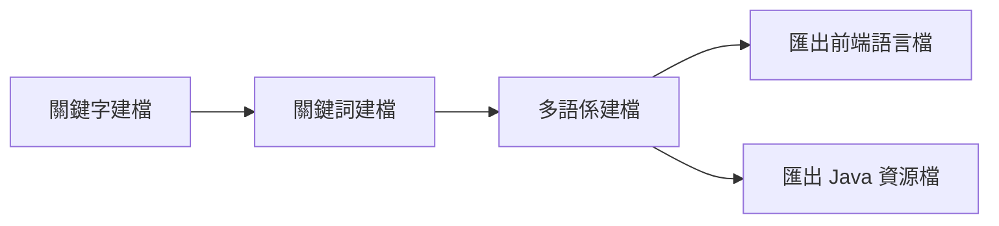

這張圖想表達的是：

- 主檔與對照資料先建立
- 再轉成可供不同系統使用的檔案

---

## 二十、本章小結

這一章我們學到了「多語係與關鍵字字典管理」的基本概念：

- `Txdsdaa1`：關鍵字建檔，管理詞條主資料
- `Txdsdab1`：關鍵詞建檔，並同步建立多語資料
- `Txdsdac1`：專案模組建檔，管理詞彙所屬模組
- `Txdsdad1`：多語係建檔，真正存放不同語言內容
- 控制器、服務層、資料存取層如何合作
- 如何檢查唯一性、同步更新、匯出語言檔

你可以把這一章記成一句很簡單的話：

> **先把詞條建好，再把不同語言版本整理好，最後讓前端與系統共用同一套字典。**

下一章我們會開始進入更偏向業務主資料的內容：  
[單據參數建檔主資料](05_單據參數建檔主資料_.md)


# Chapter 5：單據參數建檔主資料

接續上一章的 [多語係與關鍵字字典管理](04_多語係與關鍵字字典管理_.md)，我們已經知道系統如何把畫面文字與詞彙集中管理。  
這一章要進入更偏「業務規則」的核心：**單據參數建檔主資料**。

你可以先把它想成：

> **先把火車班表寫好，後面列車才知道什麼時候開、開到哪裡、超過幾天算逾期、要扣多少金額。**

---

## 這一章先解決什麼問題？

先想像一個很實際的情境：

某個流程需要設定：

- 哪一種單別要套用規則
- 哪一個表單要套用規則
- 生效日期從哪一天開始
- 逾期幾天才算有問題
- 超過後要減發多少金額
- 某些人員可以有幾天寬限期

如果這些規則都散落在各個功能裡，後面維護會很痛苦。  
所以系統會把這些共通規則先建成主資料，之後所有案件流程都直接引用。

這就是本章的重點：

> **把單據規則、逾期規則、金額規則先建檔，讓後續流程一致又好維護。**

---

## 你可以先把它想像成什麼？

把它想成一份「規則字典」：

- 規則不是每次臨時猜
- 而是先集中建檔
- 後面流程只要來查就好

這樣的好處是：

- 不容易重複設定
- 格式比較一致
- 方便查詢和比對
- 後續流程可以直接拿來判斷

---

## 本章會看到兩個主角

這一章主要看兩個主資料：

| 名稱 | 用途 | 類比 |
|---|---|---|
| `Txdfaa11` | 單逾期效獎減發金額建檔 | 規則班表 |
| `Txdfaa21` | 人員逾期天數寬限建檔 | 個人特例表 |

它們都屬於「單據參數」這一群資料。  
差別是：

- `Txdfaa11` 偏向**整體規則**
- `Txdfaa21` 偏向**某個人員的寬限規則**

---

## 一、先看最核心的使用情境

假設你今天要設定一條規則：

- 單別代號：`F001`
- 表單代號：`R001`
- 逾期天數：`30`
- 減發金額：`1000`
- 生效日期：`2026/04/01`

這代表：

> 從 2026/04/01 開始，只要這個單別、這個表單超過 30 天，就要減發 1000 元。

如果再補一條人員規則：

- 人員代號：`A1001`
- 單別代號：`F001`
- 表單代號：`R001`
- 寬限逾期天數：`5`
- 生效日期：`2026/04/01`

這代表：

> 這位人員比一般規則多 5 天寬限期。

---

## 二、整體流程先看一眼

先用一張圖看這兩種資料怎麼被使用：

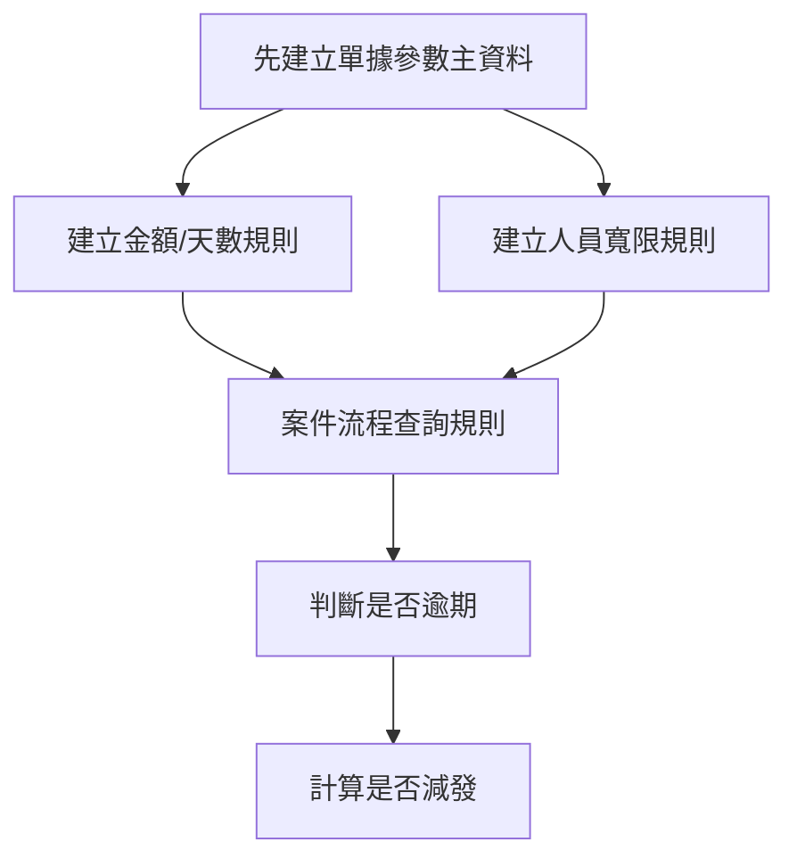

你可以這樣理解：

- 先建規則
- 後面流程來查
- 查到後再決定要不要扣款、要不要放寬

---

## 三、先認識 `Txdfaa11`：單逾期效獎減發金額建檔

### 它在管什麼？

檔案位置：

- [`Txdfaa11`](fpg-vcpseos/src/main/java/com/fpg/f/domain/Txdfaa11.java)
- [`Txdfaa11Controller`](fpg-vcpseos/src/main/java/com/fpg/f/controller/Txdfaa11Controller.java)
- [`Txdfaa11ServiceImpl`](fpg-vcpseos/src/main/java/com/fpg/f/service/impl/Txdfaa11ServiceImpl.java)
- [`Txdfaa11Mapper`](fpg-vcpseos/src/main/java/com/fpg/f/mapper/Txdfaa11Mapper.java)

這個主資料用來設定：

- 單別代號
- 表單代號
- 逾期天數
- 減發金額
- 生效日期

你可以把它當成「一筆規則設定」。

---

### `Txdfaa11` 的欄位長什麼樣？

```java
private String slptypid;
private String frmid;
private Long ovddys;
```

這三個欄位分別代表：

- `slptypid`：單別代號
- `frmid`：表單代號
- `ovddys`：逾期天數

如果再加上金額與日期，就是完整規則：

```java
private Long dedamt;
private String efdat;
```

意思是：

- `dedamt`：要減發多少金額
- `efdat`：從哪一天開始生效

---

### 這筆資料怎麼讀？

假設資料是這樣：

- 單別代號：`F001`
- 表單代號：`R001`
- 逾期天數：`30`
- 減發金額：`1000`
- 生效日期：`2026/04/01`

你可以直接把它翻成白話：

> 如果 `F001` + `R001` 這組單據超過 30 天，就套用 1000 元減發規則，從 2026/04/01 開始生效。

---

## 四、`Txdfaa21`：人員逾期天數寬限建檔

### 它在管什麼？

檔案位置：

- [`Txdfaa21`](fpg-vcpseos/src/main/java/com/fpg/f/domain/Txdfaa21.java)
- [`Txdfaa21Controller`](fpg-vcpseos/src/main/java/com/fpg/f/controller/Txdfaa21Controller.java)
- [`Txdfaa21ServiceImpl`](fpg-vcpseos/src/main/java/com/fpg/f/service/impl/Txdfaa21ServiceImpl.java)
- [`Txdfaa21Mapper`](fpg-vcpseos/src/main/java/com/fpg/f/mapper/Txdfaa21Mapper.java)

這個主資料是給「人員」用的。  
它可以讓某個人有額外寬限天數。

主要欄位包括：

- 人員代號
- 人員姓名
- 單別代號
- 表單代號
- 寬限逾期天數
- 生效日期

---

### 它和 `Txdfaa11` 的差別是什麼？

可以這樣記：

- `Txdfaa11`：整體規則
- `Txdfaa21`：個人特例

例如：

- 一般規則：超過 30 天要減發
- 某位人員：可以多寬限 5 天

這很像學校的規定：

- 全校都要交作業
- 某些同學因特殊原因可延後幾天

---

## 五、先用最小範例理解資料長相

### `Txdfaa11` 的最小資料

```java
Txdfaa11 data = new Txdfaa11();
data.setSlptypid("F001");
data.setFrmid("R001");
```

這段的意思是：

- 建立一筆單據規則
- 指定單別與表單

再補上數字與日期：

```java
data.setOvddys(30L);
data.setDedamt(1000L);
data.setEfdat("2026/04/01");
```

這段的意思是：

- 逾期 30 天
- 減發 1000
- 2026/04/01 生效

---

### `Txdfaa21` 的最小資料

```java
Txdfaa21 data = new Txdfaa21();
data.setEmpid("A1001");
data.setSlptypid("F001");
data.setFrmid("R001");
```

這段的意思是：

- 指定某位人員
- 指定單別與表單

再補上寬限資訊：

```java
data.setOvddys(5L);
data.setEfdat("2026/04/01");
```

這段的意思是：

- 這位人員多 5 天寬限
- 從 2026/04/01 開始生效

---

## 六、這一章最重要的觀念：先建檔，再判斷

當案件流程開始跑時，不會自己亂猜規則。  
它會先去查這些主資料。

你可以把流程想成這樣：

1. 先查 `Txdfaa11`
2. 如果查到規則，就知道逾期幾天、扣多少錢
3. 再查 `Txdfaa21`
4. 如果查到人員寬限，就可以多給幾天
5. 最後再決定流程結果

這樣整個系統才會一致。

---

## 七、Controller 層：畫面送進來，先交給它

### `Txdfaa11Controller`

它負責：

- 查詢列表
- 匯出 Excel
- 查單筆
- 新增
- 修改
- 刪除

簡化後長得像這樣：

```java
@GetMapping("/list")
public TableDataInfo list(Txdfaa11 txdfaa11)
```

這表示：

- 前端送出查詢條件
- 後端回傳列表資料

再看新增：

```java
@PostMapping
public AjaxResult add(@RequestBody Txdfaa11 txdfaa11)
```

這表示：

- 前端送表單資料過來
- 後端新增一筆主資料

---

### `Txdfaa21Controller`

它負責的事情和 `Txdfaa11Controller` 類似，但多了一個人員 LOV 查詢。

```java
@GetMapping("/empLov/list")
public TableDataInfo empLovList(Txdfaa21 txdfaa21)
```

這代表：

- 除了主資料列表
- 還可以查人員下拉清單

這很像畫面上有一個人員選擇器，讓你從清單挑人。

---

## 八、Service 層：真正幫你檢查規則的地方

這一層很重要，因為它不只是轉呼叫資料庫，  
還會幫你做格式檢查、重複檢查、範圍檢查。

---

### `Txdfaa11ServiceImpl` 做了什麼？

檔案位置：

- [`Txdfaa11ServiceImpl`](fpg-vcpseos/src/main/java/com/fpg/f/service/impl/Txdfaa11ServiceImpl.java)

它在新增前會先做三件事：

1. 整理資料格式
2. 檢查欄位是否合法
3. 檢查是否重複

---

### 1. 先整理資料

```java
private void normalizeData(Txdfaa11 txdfaa11)
```

它會把資料做基本整理，例如：

- 單別代號轉大寫
- 表單代號轉大寫
- 生效日期去掉多餘空白

這樣能避免使用者輸入 `f001`、` F001 ` 這種不一致資料。

---

### 2. 再檢查資料是否合法

```java
if (txdfaa11.getOvddys() == null || txdfaa11.getOvddys() < 1)
```

意思是：

- 逾期天數不能空白
- 也不能小於 1

再看金額：

```java
if (txdfaa11.getDedamt() == null || txdfaa11.getDedamt() < 0)
```

意思是：

- 減發金額不能空白
- 不能小於 0

再看日期：

```java
LocalDate.parse(txdfaa11.getEfdat(), EFDAT_FORMATTER);
```

意思是：

- 生效日期必須符合 `YYYY/MM/DD`

---

### 3. 最後檢查是否重複

```java
if (txdfaa11Mapper.selectTxdfaa11ByUk(txdfaa11) != null)
```

這表示：

- 同一組單別、表單、生效日期不能重複
- 避免同一規則被建兩次

這很像資料字典裡不能有兩筆一模一樣的班表，不然大家會不知道該用哪筆。

---

## 九、`Txdfaa21ServiceImpl` 做了什麼？

檔案位置：

- [`Txdfaa21ServiceImpl`](fpg-vcpseos/src/main/java/com/fpg/f/service/impl/Txdfaa21ServiceImpl.java)

它跟 `Txdfaa11ServiceImpl` 很像，但多了人員代號。

新增前它會檢查：

- 人員代號不能空白
- 單別代號不能空白
- 表單代號不能空白
- 逾期天數要在合理範圍
- 生效日期格式要正確
- 同一組人員 + 單別 + 表單 + 生效日期不能重複

---

### 看一個簡單的驗證片段

```java
if (StringUtils.isBlank(txdfaa21.getEmpid()))
{
    throw new ServiceException("人員代號不可空白");
}
```

這段的意思是：

- 如果人員代號沒填
- 系統就直接擋下來

這樣可以避免錯誤資料進資料庫。

---

### 再看日期格式檢查

```java
LocalDate.parse(txdfaa21.getEfdat(), EFDAT_FORMATTER);
```

這代表：

- 系統會嘗試把字串轉成日期
- 如果格式不對，就丟出錯誤

所以使用者必須輸入像 `2026/04/01` 這樣的格式。

---

## 十、為什麼一定要做「唯一性檢查」？

這是單據參數建檔很重要的設計。

如果不檢查重複，可能會出現：

- 同一個單別有兩條規則
- 同一位人員有兩筆不同寬限
- 同一生效日期出現多個版本

這樣後續流程就不知道要用哪一筆。

所以系統會要求：

- `Txdfaa11`：單別 + 表單 + 生效日期唯一
- `Txdfaa21`：人員 + 單別 + 表單 + 生效日期唯一

你可以把它想成：

> 一張車票只能對應一個班次，不然乘客會搭錯車。

---

## 十一、資料存進去之後，後面怎麼用？

當主資料建好後，其他流程就可以查它。

例如某個案件流程要判斷：

1. 先找對應的單別與表單
2. 查 `Txdfaa11`
3. 看是否超過逾期天數
4. 再查 `Txdfaa21`
5. 看這個人是否有寬限
6. 最後計算是不是要減發

這代表這些主資料是後續判斷的地基。

---

## 十二、簡單看一個完整流程

下面這張圖可以幫你把整個概念串起來：

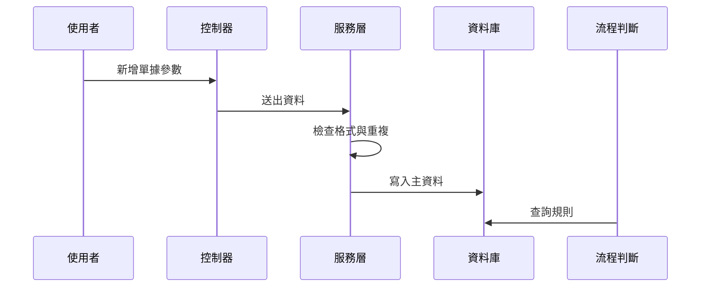

你可以把它理解成：

- 使用者先建規則
- 系統檢查後存起來
- 後面的業務流程再拿來判斷

---

## 十三、看看資料結構如何對應到 Excel 匯出

這兩個主資料都有加上 `@Excel` 註解：

```java
@Excel(name = "單別代號")
private String slptypid;
```

意思是：

- 匯出 Excel 時，欄位名稱會顯示成「單別代號」

這對管理者很方便，因為可以直接把資料匯出成表格檢查。

`Txdfaa11` 和 `Txdfaa21` 都可以這樣匯出，差別只是欄位不同。

---

## 十四、用最小的使用方式理解 API

### 查詢列表

```java
Txdfaa11 query = new Txdfaa11();
query.setSlptypid("F001");
```

這段的意思是：

- 要查單別 `F001` 的規則

查回來後，前端就可以把列表顯示出來。

---

### 新增資料

```java
Txdfaa11 data = new Txdfaa11();
data.setSlptypid("F001");
data.setFrmid("R001");
```

再送出：

- 系統會檢查欄位
- 檢查日期格式
- 檢查是否重複
- 通過後才新增

---

### 修改資料

```java
Txdfaa11 data = new Txdfaa11();
data.setXuid("A1B2C3");
data.setDedamt(1200L);
```

這表示：

- 找到原本那筆規則
- 把減發金額改成 1200

---

## 十五、這一章的兩個實體怎麼分工？

你可以用這個表來記：

| 實體 | 主要內容 | 使用情境 |
|---|---|---|
| `Txdfaa11` | 單別、表單、逾期天數、減發金額、生效日期 | 整體規則 |
| `Txdfaa21` | 人員、單別、表單、寬限天數、生效日期 | 個人特例 |

---

## 十六、內部實作怎麼想？先用白話講

當使用者按下「新增」時，系統大致會做這些事：

1. 前端送出表單
2. 控制器收到資料
3. 服務層先把字串整理乾淨
4. 服務層檢查欄位有沒有空白
5. 服務層檢查數字範圍是否合理
6. 服務層檢查日期格式
7. 服務層查重複
8. 沒問題才寫入資料庫

你可以把它想成：

> 先檢查通行證，再開門放人進去。

---

## 十七、看一點點程式內部

### `Txdfaa11ServiceImpl` 的新增流程

```java
normalizeData(txdfaa11);
validateData(txdfaa11);
if (txdfaa11Mapper.selectTxdfaa11ByUk(txdfaa11) != null)
{
    throw new ServiceException("新增失敗，相同單別/表單/生效日期資料已存在");
}
```

這段的意思是：

- 先整理格式
- 再驗證內容
- 再檢查是否重複

只要有一步不通過，就不會寫入資料庫。

---

### `Txdfaa21ServiceImpl` 的新增流程

```java
normalizeData(txdfaa21);
validateData(txdfaa21);
if (txdfaa21Mapper.selectTxdfaa21ByUk(txdfaa21) != null)
{
    throw new ServiceException("新增失敗，相同人員/單別/表單/生效日期資料已存在");
}
```

這段意思也一樣：

- 先整理
- 再檢查
- 最後才新增

只是這次多了「人員」這個維度。

---

## 十八、你最需要記住的幾個規則

### 1. 單據參數不是臨時寫死的

它是可建檔、可查詢、可維護的主資料。

---

### 2. `Txdfaa11` 是整體規則

它決定單別、表單、逾期天數、減發金額與生效日期。

---

### 3. `Txdfaa21` 是個人寬限規則

它讓某位人員可以有額外寬限天數。

---

### 4. 服務層會先檢查

格式、範圍、日期、重複性都會先檢查。

---

### 5. 後續流程會引用這些主資料

這些不是孤立資料，而是流程判斷的地基。

---

## 十九、本章小結

這一章我們學到了「單據參數建檔主資料」的核心概念：

- `Txdfaa11`：設定單別、表單、逾期天數、減發金額、生效日期
- `Txdfaa21`：設定人員的逾期天數寬限
- 控制器負責接收前端請求
- 服務層負責格式整理、驗證與重複檢查
- 資料建立後，後續案件流程就會引用這些規則來判斷

你可以把這一章記成一句話：

> **先把規則建好，後面的流程才知道要怎麼算、怎麼判斷、怎麼減發。**

下一章我們會繼續看更貼近節日與期限管理的內容：  
[假日與寬限設定管理](06_假日與寬限設定管理_.md)


# Chapter 6：假日與寬限設定管理

接續上一章的 [單據參數建檔主資料](05_單據參數建檔主資料_.md)，我們已經知道系統會先把「逾期幾天、減發多少」這類規則建好。  
這一章要再往前一步，處理一個更細、也更容易出錯的問題：

> **時間到底怎麼算？哪些日子不算工作日？哪些人可以多寬限幾天？查詢時又要怎麼依年份或日期篩選？**

---

## 先用一個最常見的情境理解

假設有一份單據：

- 預計要在 2026/04/10 前完成
- 但 2026/04/10 是星期六
- 系統還有一份假日名單，列出哪些日期是假日
- 某位人員又被允許多 5 天寬限期

那系統就不能只用「今天減去到期日」這麼簡單去算。  
它還要先判斷：

1. 這一天是不是假日
2. 週末要不要算
3. 這個人有沒有額外寬限天數
4. 生效日期是不是已經開始
5. 查詢時要不要限定年份

所以這一章的重點可以記成一句話：

> **假日與寬限設定管理，就是把「時間怎麼算」先定好，後面的逾期天數才會算對。**

---

## 這一章你要先抓住的核心概念

這章主要有兩個資料主角：

| 名稱 | 作用 | 白話理解 |
|---|---|---|
| `Txdfaa31` | 假日建檔 | 哪些日期是假日 |
| `Txdfaa21` | 人員逾期天數寬限建檔 | 哪些人可以多幾天 |

它們都屬於「時間規則」的一部分。  
一個管日曆，一個管例外。

你可以把它們想成：

- `Txdfaa31`：行事曆上的紅字
- `Txdfaa21`：某些人的特別通融名單

---

## 本章要解決的中心問題

我們先把故事講清楚：

### 假設你要做一個逾期判斷功能

系統要知道：

- 某一天是不是假日
- 一整年週六、週日要不要先建成假日資料
- 某個人是否有寬限天數
- 查資料時是否只看某一年

如果沒有這些設定，系統可能會：

- 把週末也當工作日
- 把本來不該扣款的單據算成逾期
- 把某些人該有的寬限漏掉
- 查詢時把不同年份混在一起

這就是為什麼這一章非常重要。  
它不是在做花俏畫面，而是在打系統的時間地基。

---

## 一、整體架構先看一眼

這兩個功能雖然看起來簡單，但其實都有標準的三層式設計：

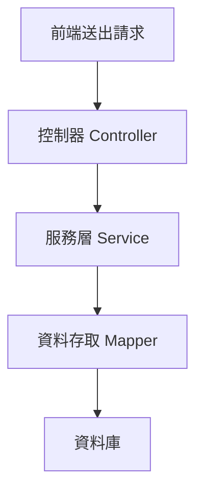

你可以先記住：

- `Controller`：接收畫面送來的資料
- `Service`：檢查規則、處理邏輯
- `Mapper`：真正跟資料庫溝通

這跟前面章節看到的模式是一樣的。  
如果你還記得 [前端介面與 API 對接](02_前端介面與_api_對接_.md)，這裡的 API 只是更偏向「時間與規則」的資料管理。

---

## 二、先看 `Txdfaa31`：假日建檔

### 1. 它在做什麼？

[`Txdfaa31`](fpg-vcpseos/src/main/java/com/fpg/f/domain/Txdfaa31.java) 是假日資料主檔。  
它主要記錄：

- 假日日期
- 備註
- 異動人員
- 異動時間
- 查詢年份

你可以把它想成一張假日卡片：

- 日期：2026/04/04
- 備註：清明連假
- 記錄是誰建的
- 什麼時候建的

---

### 2. `Txdfaa31` 的欄位很簡單

```java
private String hlddat;
private String xrem;
private String year;
```

這三個欄位的意思是：

- `hlddat`：假日日期
- `xrem`：備註
- `year`：查詢年份

這表示它不只是存單一日期，還可以依年份做查詢。

---

### 3. 為什麼要有年份欄位？

因為假日建檔通常是以「年度」來管理。  
例如你可能一次建立 2026 年整年的週六、週日，再補上國定假日。  
這樣查詢和維護都比較方便。

---

## 三、再看 `Txdfaa21`：人員逾期天數寬限建檔

### 1. 它在做什麼？

[`Txdfaa21`](fpg-vcpseos/src/main/java/com/fpg/f/domain/Txdfaa21.java) 是人員寬限資料主檔。  
它主要記錄：

- 人員代號
- 人員姓名
- 單別代號
- 表單代號
- 寬限逾期天數
- 生效日期

你可以把它想成一張「個人通融表」。

例如：

- 人員 `A1001`
- 單別 `F001`
- 表單 `R001`
- 寬限 5 天
- 2026/04/01 起生效

這表示這個人比一般規則多 5 天。

---

### 2. `Txdfaa21` 的欄位很直白

```java
private String empid;
private String slptypid;
private String frmid;
private Long ovddys;
private String efdat;
```

這幾個欄位的意思是：

- `empid`：人員代號
- `slptypid`：單別代號
- `frmid`：表單代號
- `ovddys`：寬限逾期天數
- `efdat`：生效日期

它的邏輯很簡單：

> 「這個人，針對這種單據，可以多等幾天。」

---

## 四、先用超簡單範例理解資料長相

### 例子 1：新增一筆假日

```java
Txdfaa31 data = new Txdfaa31();
data.setHlddat("2026/04/04");
data.setXrem("清明連假");
```

這段意思是：

- 建立一筆假日資料
- 日期是 2026/04/04
- 備註是清明連假

如果系統收到這筆資料，就會把它當成假日來處理。

---

### 例子 2：新增一筆人員寬限

```java
Txdfaa21 data = new Txdfaa21();
data.setEmpid("A1001");
data.setOvddys(5L);
```

這段意思是：

- 指定某位人員
- 這位人員多 5 天寬限

如果後面在算逾期天數時遇到這位人員，就要多給他 5 天。

---

## 五、這兩個資料怎麼幫你解決問題？

我們回到一開始的情境：

- 今天是 2026/04/10
- 到期日是 2026/04/08
- 2026/04/10 是週末
- 某位人員多 5 天寬限

系統可以先查：

1. `Txdfaa31`：2026/04/10 是否是假日
2. `Txdfaa21`：這位人員是否有寬限設定
3. 再根據查到的資料計算逾期天數

這樣就不會把週末或特例算錯。

---

## 六、先看 `Txdfaa31Controller`：假日功能怎麼被呼叫？

[`Txdfaa31Controller`](fpg-vcpseos/src/main/java/com/fpg/f/controller/Txdfaa31Controller.java) 提供了幾個常見功能：

- 查詢列表
- 匯出 Excel
- 查單筆
- 新增
- 修改
- 批次新增指定年份六、日
- 刪除

這裡最特別的是「批次新增指定年份六、日」，因為它能幫你一次把整年週六、週日建成假日資料。

---

### 1. 查詢列表

```java
@GetMapping("/list")
public TableDataInfo list(Txdfaa31 txdfaa31)
```

意思是：

- 前端把查詢條件送進來
- 後端回傳假日列表

如果你帶入年份 2026，系統就會查 2026 年的假日資料。

---

### 2. 匯出 Excel

```java
@PostMapping("/export")
public void export(HttpServletResponse response, Txdfaa31 txdfaa31)
```

意思是：

- 前端按下匯出
- 後端把查到的假日資料輸出成 Excel

這對管理者很實用，因為可以直接看整年的假日清單。

---

### 3. 批次新增週六、週日

```java
@PostMapping("/batchAdd/{year}")
public AjaxResult batchAdd(@PathVariable("year") String year)
```

這個功能非常重要。  
它可以一次建立某一年所有週六和週日的假日資料。

你可以把它想像成：

> 系統幫你先把整年度的週末都標好紅字。

---

## 七、`Txdfaa31ServiceImpl`：假日規則真正怎麼做？

現在來看真正的內部邏輯。  
[`Txdfaa31ServiceImpl`](fpg-vcpseos/src/main/java/com/fpg/f/service/impl/Txdfaa31ServiceImpl.java) 是這個功能的核心。

它做的事情可以分成三類：

1. 查詢時先整理條件
2. 新增或修改時先檢查格式
3. 批次新增時自動產生整年的週六、週日

---

### 1. 查詢前先整理年份

```java
private void normalizeQueryData(Txdfaa31 txdfaa31)
```

它會把年份去掉多餘空白。  
例如使用者輸入 ` 2026 `，系統會先整理成 `2026`。

這種小動作很重要，因為可以避免查詢條件不一致。

---

### 2. 新增前先檢查日期格式

```java
if (StringUtils.isBlank(txdfaa31.getHlddat()))
{
    throw new ServiceException("日期不可空白");
}
```

這表示：

- 假日日期不能空白
- 沒填就不能存

再看日期格式檢查：

```java
LocalDate.parse(txdfaa31.getHlddat(), HLDDAT_FORMATTER);
```

這表示：

- 日期必須是 `YYYY/MM/DD`
- 格式錯就會報錯

---

### 3. 避免重複假日資料

```java
if (txdfaa31Mapper.selectTxdfaa31ByUk(txdfaa31) != null)
{
    throw new ServiceException("新增失敗，相同日期資料已存在");
}
```

意思是：

- 同一天不能重複建兩筆假日
- 避免資料混亂

這很像日曆上同一天不能貼兩張不同紅紙，否則會看不懂。

---

## 八、批次新增週六、週日是怎麼做的？

這是本章最有趣的部分。  
[`Txdfaa31ServiceImpl`](fpg-vcpseos/src/main/java/com/fpg/f/service/impl/Txdfaa31ServiceImpl.java) 裡有一個 `batchAddByYear` 方法，專門負責這件事。

它的邏輯可以白話理解成：

1. 先檢查年份格式
2. 先刪掉這一年原本的假日資料
3. 從 1 月 1 日一路跑到 12 月 31 日
4. 每一天都檢查是不是星期六或星期日
5. 如果是，就加入假日清單
6. 最後一次批次寫入資料庫

---

### 1. 先檢查年份格式

```java
if (!normalizedYear.matches("^\\d{4}$"))
{
    throw new ServiceException("年份格式需為 4 碼數字");
}
```

意思是：

- 年份只能是 4 碼數字
- 例如 `2026` 可以
- `26` 不行
- `2026年` 也不行

---

### 2. 先刪掉原本該年的資料

```java
txdfaa31Mapper.deleteTxdfaa31ByYear(normalizedYear);
```

這一步很重要。  
因為如果你要重新產生整年的週末資料，就要先把舊資料刪掉，避免重複。

---

### 3. 逐日檢查是不是週末

```java
if (date.getDayOfWeek() == DayOfWeek.SATURDAY || date.getDayOfWeek() == DayOfWeek.SUNDAY)
```

這句的意思是：

- 如果是星期六或星期日
- 就把它當成假日

這就像日曆自動幫你把週末畫成紅色。

---

### 4. 批次寫入資料庫

```java
txdfaa31Mapper.batchInsertTxdfaa31(holidayList);
```

意思是：

- 一次把全部週末資料寫進去
- 比一筆一筆新增快很多

---

## 九、`Txdfaa21Controller`：人員寬限功能怎麼被呼叫？

[`Txdfaa21Controller`](fpg-vcpseos/src/main/java/com/fpg/f/controller/Txdfaa21Controller.java) 是人員逾期天數寬限的入口。

它提供：

- 查詢列表
- 人員 LOV 列表
- 匯出 Excel
- 查單筆
- 新增
- 修改
- 刪除

其中「人員 LOV 列表」是給畫面上拉選單用的。  
你可以把它想成一份可供挑選的人員清單。

---

### 1. 查詢列表

```java
@GetMapping("/list")
public TableDataInfo list(Txdfaa21 txdfaa21)
```

意思是：

- 查人員寬限資料
- 可以依條件篩選

---

### 2. 人員 LOV 列表

```java
@GetMapping("/empLov/list")
public TableDataInfo empLovList(Txdfaa21 txdfaa21)
```

這表示：

- 畫面可以拿這份清單做下拉選擇
- 方便快速選人員

---

### 3. 新增與修改時自動帶入異動人員

```java
txdfaa21.setTxemp(getUsername());
```

意思是：

- 系統會自動記錄是誰操作的
- 不需要使用者手動輸入

這就像管理系統自動幫你蓋章。

---

## 十、`Txdfaa21ServiceImpl`：人員寬限怎麼驗證？

[`Txdfaa21ServiceImpl`](fpg-vcpseos/src/main/java/com/fpg/f/service/impl/Txdfaa21ServiceImpl.java) 會在新增與修改前做很多檢查。

---

### 1. 先整理資料

```java
private void normalizeData(Txdfaa21 txdfaa21)
```

它會把：

- 人員代號
- 單別代號
- 表單代號

轉成標準格式。  
例如去空白、轉大寫。

這樣可以避免輸入 ` a1001 ` 這種不一致資料。

---

### 2. 檢查人員代號、單別、表單是否空白

```java
if (StringUtils.isBlank(txdfaa21.getEmpid()))
{
    throw new ServiceException("人員代號不可空白");
}
```

這代表：

- 沒有填人員代號就不能存

同理，單別與表單也都不能空白。

---

### 3. 檢查寬限天數範圍

```java
if (txdfaa21.getOvddys() == null || txdfaa21.getOvddys() < 0 || txdfaa21.getOvddys() > 999)
```

這表示：

- 寬限天數不能空白
- 不能小於 0
- 不能大於 999

這樣可以避免輸入不合理的數字。

---

### 4. 檢查生效日期格式

```java
LocalDate.parse(txdfaa21.getEfdat(), EFDAT_FORMATTER);
```

意思是：

- 生效日期要符合 `YYYY/MM/DD`

如果輸入格式錯，系統就會直接擋下來。

---

### 5. 檢查是否重複

```java
if (txdfaa21Mapper.selectTxdfaa21ByUk(txdfaa21) != null)
```

這表示：

- 同一個人員、單別、表單、生效日期不能重複
- 避免同一個特例被建兩次

---

## 十一、這兩個功能怎麼一起工作？

現在把它們放在一起看：

- `Txdfaa31` 管「哪一天是假日」
- `Txdfaa21` 管「某些人可以多等幾天」

當系統在算逾期時，就會先查假日，再查寬限。

你可以把它想像成：

> 日曆先告訴你今天是不是休假，再由主管名單告訴你某些人是不是可以晚一點交。

---

## 十二、用一個完整的小例子看整個流程

### 情境

- 到期日：2026/04/08
- 今天：2026/04/10
- 今天是週六
- 人員 `A1001` 有 5 天寬限

### 系統會怎麼想？

1. 先查 `Txdfaa31`
   - 2026/04/10 是不是假日？
   - 如果是，今天可能不算逾期日
2. 再查 `Txdfaa21`
   - `A1001` 是否有寬限？
   - 如果有，再多給 5 天
3. 最後再決定是否真的逾期

這樣算出來的結果就會比單純看日期準很多。

---

## 十三、內部流程先用簡單序列圖看

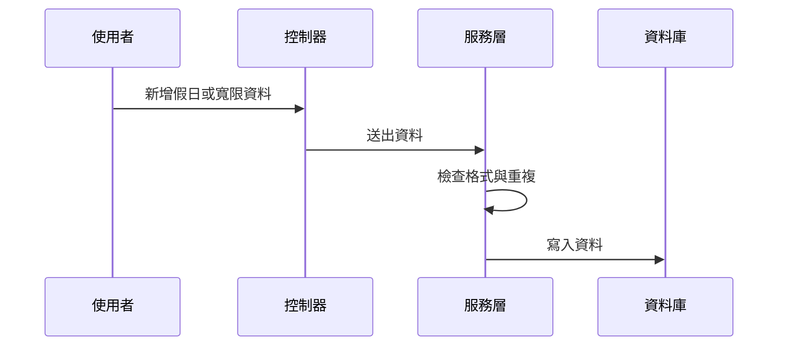

這張圖的意思很簡單：

- 使用者送資料
- 控制器收資料
- 服務層先檢查
- 通過才寫入資料庫

這樣可以減少錯誤資料進系統。

---

## 十四、看一點點內部實作

### `Txdfaa31ServiceImpl`：批次新增週末

```java
for (LocalDate date = start; !date.isAfter(end); date = date.plusDays(1))
{
    if (date.getDayOfWeek() == DayOfWeek.SATURDAY || date.getDayOfWeek() == DayOfWeek.SUNDAY)
```

這段意思是：

- 從年初走到年尾
- 每一天都檢查是不是週末

這就像你一頁一頁翻整年行事曆，看到週六、週日就畫紅。

---

### `Txdfaa21ServiceImpl`：檢查生效日期

```java
try
{
    LocalDate.parse(txdfaa21.getEfdat(), EFDAT_FORMATTER);
}
catch (DateTimeParseException e)
{
    throw new ServiceException("生效日期格式需為 YYYY/MM/DD");
}
```

這段意思是：

- 先試著把字串轉日期
- 失敗就代表格式錯誤

這可以避免使用者輸入奇怪的日期格式。

---

## 十五、這些資料和前一章有什麼關係？

上一章的 [單據參數建檔主資料](05_單據參數建檔主資料_.md) 是在定大規則：  
逾期幾天、減發多少。

這一章則是在補「時間面」的細節：

- 哪些日子不算工作日
- 哪些人可以延後幾天
- 查詢時如何限定年份

你可以這樣理解：

> 前一章定「算什麼」，這一章定「怎麼算」。

---

## 十六、初學者最容易搞混的地方

### 1. 假日建檔不是只存國定假日

它也可以批次產生週六、週日。

---

### 2. 人員寬限不是全系統通用

它通常是針對某個人、某個單別、某個表單的特例。

---

### 3. `Service` 層不只是存資料

它會先檢查格式、範圍、重複性，這很重要。

---

### 4. 年份查詢不是日期查詢

年份是用來快速整理整年度資料。  
日期則是實際的假日日期。

---

## 十七、你可以怎麼記住這一章？

最簡單的記法是：

1. **`Txdfaa31` 管假日**
2. **`Txdfaa21` 管寬限**
3. **假日先建好，後面算逾期才不會錯**
4. **人員特例先建好，後面判斷才會準**

---

## 十八、本章小結

這一章我們認識了「假日與寬限設定管理」的核心概念：

- `Txdfaa31`：管理假日日期，還能批次建立整年週末資料
- `Txdfaa21`：管理人員的逾期天數寬限
- 控制器負責接收請求與回傳結果
- 服務層負責日期格式、重複資料、範圍與生效日檢查
- 這些設定會直接影響後面逾期天數與扣款判斷

你可以把這一章記成一句話：

> **先把假日和寬限規則建好，系統在算逾期時才會知道哪些天要跳過、哪些人可以多等。**

下一章我們會繼續往下看通知與名單設定，了解當系統算完規則後，要怎麼把消息送給對的人：  
[通知名單與收件部門設定](07_通知名單與收件部門設定_.md)


# Chapter 7：通知名單與收件部門設定

接續上一章的 [假日與寬限設定管理](06_假日與寬限設定管理_.md)，我們已經知道系統會先把時間與逾期規則算好。  
這一章要進一步處理一個很實際、也很關鍵的問題：

> **當案件真的發生時，要通知誰？要通知哪個部門？前端下拉選單又要怎麼讓使用者選得準？**

你可以把這一章想成一份「系統通訊錄」：

- 有哪些人要收通知
- 哪些部門要收通知
- 前端怎麼用下拉清單快速選人、選部門
- 系統怎麼避免重複設定
- 建檔後如何讓後續流程穩定使用

---

## 這一章先從最常見的情境開始

假設某個案件建立後，系統要寄通知信或推送提醒。  
如果通知名單沒設定好，就可能發生這些問題：

- 該收到的人沒收到
- 不該收到的人一直收到
- 部門對應錯誤
- 前端手打代碼打錯
- 後續案件流轉卡住

所以這一章的核心就是：

> **先把通知人員與收件部門建檔好，讓案件一發生時，系統知道該通知誰、發給哪個部門。**

---

## 先用白話理解這個功能

你可以把它想成活動主辦方的聯絡名單：

- 哪幾位主要聯絡人要收到消息
- 哪些部門需要同步知會
- 名單不能亂填，最好用下拉選單挑選
- 同一個人和部門的組合不能重複

這樣活動一開始，大家才知道簡訊要發給誰、郵件要抄送誰。

---

## 這一章的主角是什麼？

本章主要看這幾個類別：

| 名稱 | 作用 | 白話理解 |
|---|---|---|
| `Txdfaa41` | 案件資料通知人員建檔 | 通知名單主檔 |
| `Txdfaa41EmpLov` | 人員下拉清單 | 可選通知人員名單 |
| `Txdfaa41DeptLov` | 部門下拉清單 | 可選收件部門名單 |
| `Txdfaa41Controller` | 畫面入口 | 收送資料的櫃台 |
| `Txdfaa41ServiceImpl` | 規則處理 | 驗證、整理、存檔 |
| `Txdfaa41Mapper` | 資料存取 | 跟資料庫溝通 |

---

## 一、先看整體架構

這個功能和前面章節一樣，也是標準的三層式設計：

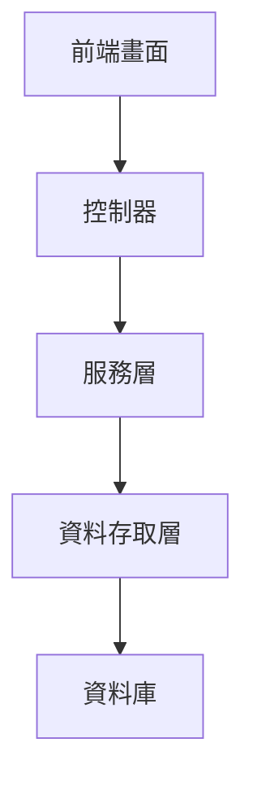

你可以先記住：

- **前端畫面**：讓使用者選人、選部門、輸入備註
- **控制器**：接收請求
- **服務層**：檢查資料、避免重複
- **資料存取層**：真正讀寫資料庫

---

## 二、這個功能到底在管什麼？

[`Txdfaa41`](fpg-vcpseos/src/main/java/com/fpg/f/domain/Txdfaa41.java) 是本章最重要的資料物件。

它記錄的不是案件本身，而是：

- 哪個人要收到通知
- 哪個部門要收到通知
- 是否有備註
- 異動人員與異動時間

你可以把它看成一張通知通訊錄卡片。

---

### `Txdfaa41` 的資料長什麼樣？

```java
private String xuid;
private String empid;
private String rcvdept;
private String xrem;
```

這四個欄位的意思是：

- `xuid`：這筆資料的唯一識別碼
- `empid`：人員代號
- `rcvdept`：收件部門
- `xrem`：備註

如果翻成白話，就是：

> 這一筆設定，指定某個人、某個部門來接收案件通知。

---

## 三、先從最簡單的使用情境理解

假設你要新增一筆通知設定：

- 人員代號：`A1001`
- 收件部門：`D001`
- 備註：`主要聯絡人`

那系統就會把它存成一筆通知名單資料。

你可以先用這種最小概念理解：

```java
Txdfaa41 data = new Txdfaa41();
data.setEmpid("A1001");
data.setRcvdept("D001");
```

這段意思是：

- 建立一筆通知資料
- 指定通知人員為 `A1001`
- 指定收件部門為 `D001`

接下來服務層會幫你做檢查與存檔。  
你不用自己直接碰資料庫。

---

## 四、為什麼還要有 `LOV`？

`LOV` 可以先理解成「可選清單」。  
它的用途是讓前端不用手打代碼，而是直接選。

如果沒有 `LOV`，使用者可能會輸入：

- 人員代號打錯
- 部門代號少一碼
- 名稱和代號不一致

有了 `LOV`，前端就可以下拉選擇，減少錯誤。

---

### 1. 人員下拉清單：`Txdfaa41EmpLov`

這個類別很簡單：

```java
private String empid;
private String empnm;
```

意思是：

- `empid`：人員代號
- `empnm`：人員姓名

這就是前端下拉選單常用的資料格式。  
畫面可以顯示姓名，實際送出代號。

例如：

- 顯示：王小明
- 實際值：`A1001`

---

### 2. 部門下拉清單：`Txdfaa41DeptLov`

這個類別也一樣簡單：

```java
private String rcvdept;
private String rcvdeptnm;
```

意思是：

- `rcvdept`：收件部門代號
- `rcvdeptnm`：收件部門名稱

例如：

- 顯示：資訊部
- 實際值：`D001`

---

## 五、前端使用時會看到什麼？

前端通常會有這些元件：

- 人員下拉選單
- 部門下拉選單
- 備註欄位
- 查詢列表
- 新增與修改按鈕

使用者在畫面上通常會做這些事：

1. 從人員清單選一個人
2. 從部門清單選一個部門
3. 輸入備註
4. 按下新增
5. 系統檢查是否重複
6. 通過後存檔

這整個過程就像填通訊錄。

---

## 六、控制器 `Txdfaa41Controller` 負責什麼？

[`Txdfaa41Controller`](fpg-vcpseos/src/main/java/com/fpg/f/controller/Txdfaa41Controller.java) 是前端和後端之間的入口。

它提供幾個很常見的功能：

- 查詢通知名單列表
- 查詢人員 LOV
- 查詢部門 LOV
- 匯出 Excel
- 查單筆
- 新增
- 修改
- 刪除

---

### 1. 查詢列表

```java
@GetMapping("/list")
public TableDataInfo list(Txdfaa41 txdfaa41)
```

這表示：

- 前端送查詢條件過來
- 後端回傳通知名單列表

例如查某個人或某個部門的設定，就會用這支 API。

---

### 2. 查人員下拉清單

```java
@GetMapping("/empLov/list")
public TableDataInfo empLovList(Txdfaa41 txdfaa41)
```

這表示：

- 前端要拿人員選單資料
- 後端回傳可選人員清單

---

### 3. 查部門下拉清單

```java
@GetMapping("/deptLov/list")
public TableDataInfo deptLovList(Txdfaa41 txdfaa41)
```

這表示：

- 前端要拿部門選單資料
- 後端回傳可選部門清單

---

### 4. 新增資料

```java
@PostMapping
public AjaxResult add(@RequestBody Txdfaa41 txdfaa41)
```

這表示：

- 前端送出新增表單
- 後端新增一筆通知名單

---

## 七、服務層 `Txdfaa41ServiceImpl` 才是真正的重點

控制器只是接資料，真正幫你判斷資料可不可以存的是服務層。  
[`Txdfaa41ServiceImpl`](fpg-vcpseos/src/main/java/com/fpg/f/service/impl/Txdfaa41ServiceImpl.java) 會做三件重要的事：

1. 整理資料格式
2. 驗證資料長度與必填欄位
3. 檢查是否重複

---

### 1. 先整理資料

```java
private void normalizeData(Txdfaa41 txdfaa41)
```

它會把資料整理成比較乾淨的格式，例如：

- 人員代號轉大寫
- 部門代號轉大寫
- 備註去除前後空白

這樣就不會因為輸入格式不一致而造成問題。

---

### 2. 再檢查必填欄位

```java
if (StringUtils.isBlank(txdfaa41.getEmpid()))
{
    throw new ServiceException("人員代號不可空白");
}
```

意思是：

- 人員代號一定要填
- 沒填就不能存

同樣地，部門代號也一定要填。

---

### 3. 再檢查長度

```java
if (txdfaa41.getEmpid().length() > 10)
{
    throw new ServiceException("人員代號長度不可超過 10 碼");
}
```

這表示：

- 人員代號不能太長
- 系統會先幫你擋掉不合理的資料

備註也是一樣，不能超過 50 碼。

---

### 4. 最後檢查重複

```java
if (txdfaa41Mapper.selectTxdfaa41ByUk(txdfaa41) != null)
{
    throw new ServiceException("新增失敗，相同人員/收件部門資料已存在");
}
```

這是很重要的規則。

意思是：

- 同一個人員和同一個收件部門，不可以重複建兩次
- 不然通知設定會亂掉

你可以把它想成：

> 同一張聯絡卡，不需要重複存兩份。

---

## 八、為什麼要做這些檢查？

因為通知名單不是一般備忘錄，而是會真的影響流程的資料。

如果資料錯了，可能會導致：

- 該通知的人沒收到
- 同一個人收到兩次
- 部門寫錯，通知發不到正確單位
- 後續審核或流轉延誤

所以服務層一定要嚴格把關。

---

## 九、資料庫層 `Txdfaa41Mapper` 在做什麼？

[`Txdfaa41Mapper`](fpg-vcpseos/src/main/java/com/fpg/f/mapper/Txdfaa41Mapper.java) 負責真正跟資料庫互動。

它提供這些方法：

- 查單筆
- 查唯一性
- 查列表
- 查人員 LOV
- 查部門 LOV
- 新增
- 修改
- 刪除

---

### 1. 查唯一性

```java
public Txdfaa41 selectTxdfaa41ByUk(Txdfaa41 txdfaa41);
```

這個方法就是拿來檢查：

- 這個人員和部門組合是不是已經存在

---

### 2. 查人員 LOV

```java
public List<Txdfaa41EmpLov> selectEmpLovList(Txdfaa41 txdfaa41);
```

這個方法就是回傳：

- 可供前端下拉選擇的人員清單

---

### 3. 查部門 LOV

```java
public List<Txdfaa41DeptLov> selectDeptLovList(Txdfaa41 txdfaa41);
```

這個方法就是回傳：

- 可供前端下拉選擇的部門清單

---

## 十、整個新增流程長什麼樣子？

你可以把它想成一個簡單的門診掛號流程：

1. 使用者在畫面上選人員和部門
2. 按下新增
3. 控制器接到資料
4. 服務層先整理、驗證
5. 服務層查重
6. 沒問題就寫入資料庫
7. 回傳成功訊息

下面用簡單的流程圖看：

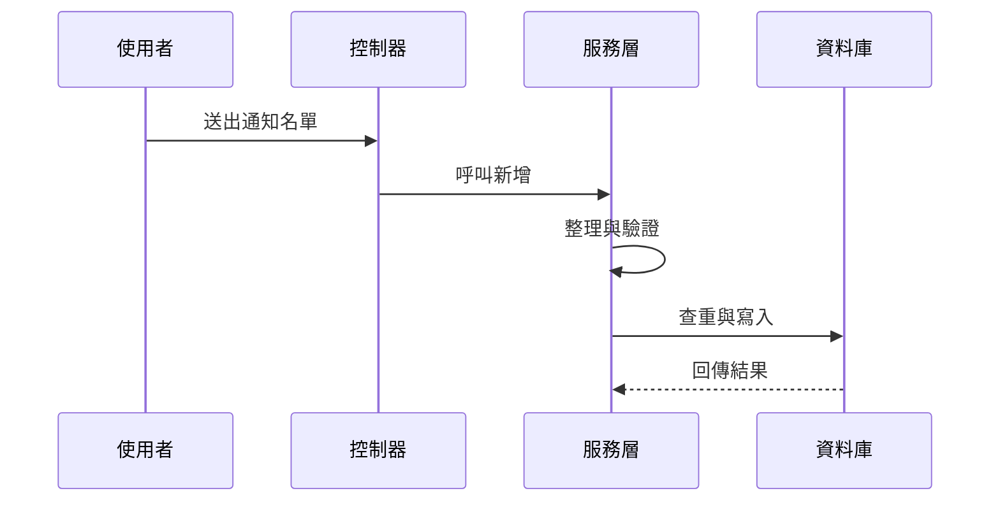

這個流程的重點是：

> **先檢查，再存檔。**

---

## 十一、看一個最小的實際使用例子

假設你要建立一筆通知資料：

- 人員代號：`A1001`
- 收件部門：`D001`
- 備註：`主要聯絡人`

你可以想像成這樣：

```java
Txdfaa41 data = new Txdfaa41();
data.setEmpid("A1001");
data.setRcvdept("D001");
data.setXrem("主要聯絡人");
```

這段的意思是：

- 建立通知名單
- 指定這位人員
- 指定這個部門
- 加上一點備註

接下來送到服務層後，系統會：

- 檢查格式
- 檢查長度
- 檢查是否重複
- 再決定能不能存

---

## 十二、如果是修改資料呢？

修改流程也很像新增，只是多了一個主鍵 `xuid`。

```java
Txdfaa41 data = new Txdfaa41();
data.setXuid("A1B2C3");
data.setEmpid("A1001");
data.setRcvdept("D002");
```

這表示：

- 你要修改 `A1B2C3` 這筆資料
- 把收件部門改成 `D002`

服務層會先確認：

- 主鍵是否存在
- 修改後是否和別筆資料重複

如果沒問題，才會更新。

---

## 十三、前端為什麼很需要 `LOV`？

因為通知名單這種資料很適合用選單選，不適合讓使用者自由亂打。

例如：

- 人員代號可能很長
- 部門代號容易打錯
- 中文名稱與代號容易不一致

有了 `LOV` 後，畫面可以：

- 顯示姓名或部門名稱
- 實際送出代碼
- 減少錯誤

這就像你在超商結帳時，掃條碼比手打商品編號快很多，也不容易錯。

---

## 十四、和前面章節的關係

這一章其實和前面幾章關係很密切：

- [前端介面與 API 對接](02_前端介面與_api_對接_.md)：前端怎麼呼叫 `/f/faa4` 的 API
- [參考資料與欄位對照平台](03_參考資料與欄位對照平台_.md)：欄位名稱、顯示名稱怎麼規劃
- [多語係與關鍵字字典管理](04_多語係與關鍵字字典管理_.md)：若通知訊息要多語顯示，也會用到文字字典
- [單據參數建檔主資料](05_單據參數建檔主資料_.md)：案件規則建好後，通知資料才知道怎麼搭配
- [假日與寬限設定管理](06_假日與寬限設定管理_.md)：時間算完後，通知才知道何時發出

你可以把這一章想成：

> **案件規則算完之後，終於輪到通知名單登場。**

---

## 十五、內部實作是怎麼跑的？

先用非常簡單的步驟看：

1. 前端打開通知名單畫面
2. 前端呼叫 `/f/faa4/list` 或 LOV API
3. 後端回傳人員或部門清單
4. 使用者挑好資料送出
5. 服務層整理格式
6. 驗證必填欄位與長度
7. 查重
8. 寫入資料庫

這整個流程很像在整理通訊錄：

- 先拿到可選名單
- 再選人選部門
- 最後確認不能重複

---

## 十六、再看一點點內部程式

### `insertTxdfaa41` 的核心邏輯

```java
normalizeData(txdfaa41);
validateData(txdfaa41);
if (txdfaa41Mapper.selectTxdfaa41ByUk(txdfaa41) != null)
{
    throw new ServiceException("新增失敗，相同人員/收件部門資料已存在");
}
```

這段的意思是：

- 先整理
- 再驗證
- 再查重
- 沒問題才新增

---

### `validateData` 的基本檢查

```java
if (StringUtils.isBlank(txdfaa41.getRcvdept()))
{
    throw new ServiceException("收件部門不可空白");
}
```

意思是：

- 收件部門一定要填
- 不然就不能存

這樣可以避免通知發錯地方。

---

## 十七、初學者最容易搞混的地方

### 1. `Txdfaa41` 不是案件本身

它只是通知名單設定，不是案件資料。

---

### 2. `Txdfaa41EmpLov` 和 `Txdfaa41DeptLov` 不是主檔

它們只是下拉清單資料，方便前端選擇。

---

### 3. `xuid` 是主鍵，不是人員代號

它是這筆通知資料本身的唯一識別碼。

---

### 4. 重複檢查是看人員 + 部門組合

不是只看人員，也不是只看部門，而是兩者一起看。

---

## 十八、你可以怎麼記住這一章？

最簡單的記法是：

1. **`Txdfaa41` 是通知名單主檔**
2. **`Txdfaa41EmpLov` 是人員下拉清單**
3. **`Txdfaa41DeptLov` 是部門下拉清單**
4. **新增前一定要查重**
5. **前端用下拉選單，避免手打錯誤**

---

## 十九、本章小結

這一章我們學到了「通知名單與收件部門設定」的核心概念：

- `Txdfaa41`：管理案件通知的人員與收件部門
- `Txdfaa41EmpLov`：提供前端人員下拉選單
- `Txdfaa41DeptLov`：提供前端部門下拉選單
- `Controller`：負責接收前端請求與回傳結果
- `Service`：負責格式整理、必填檢查、長度限制與重複檢查
- `Mapper`：負責查詢、寫入與刪除資料

你可以把這一章記成一句話：

> **先把通知的人和部門建好，案件發生時系統才知道該通知誰、送到哪裡。**

下一章我們會繼續看更貼近實際業務資料的內容：  
[廠商與報到資料維護](08_廠商與報到資料維護_.md)


# Chapter 8：廠商與報到資料維護

接續上一章的 [通知名單與收件部門設定](07_通知名單與收件部門設定_.md)，我們已經知道系統怎麼把消息送給對的人。  
這一章要回到更貼近現場作業的主題：**廠商與報到資料維護**。

你可以先把這一章想成工程現場的「承包商管理櫃檯」：

- 先建廠商主檔
- 再掛上人員、車輛、證照
- 需要時上傳報到圖片
- 最後進行審核與送審

這一章要解決的中心問題是：

> **當一個外部廠商要進場時，系統要怎麼把他們的基本資料、聯絡人、車輛、證照、報到圖片和審核狀態整理好，讓現場人員查得到、審核流程跑得動？**

---

## 這一章先用一個最常見的情境來理解

假設有一家外部廠商要到現場施工。  
現場管理人員需要知道：

1. 這家廠商叫什麼名字
2. 聯絡人是誰
3. 來了哪些人、開了哪些車
4. 人員和車輛有沒有證照
5. 到場時有沒有拍照報到
6. 這筆資料現在是草稿、送審中、核准，還是退回

如果沒有這套維護功能，現場就會變成：

- 資料散在紙本
- 人員和車輛對不起來
- 證照過期也不知道
- 報到圖片找不到
- 審核進度無法追蹤

所以這一章的核心就是：

> **把廠商資料做成「主子表結構」：主檔像總戶口，底下的明細像成員清單，主檔一動，明細也要跟著對齊。**

---

## 你可以先把它想像成什麼？

把它想成一個「現場報到櫃檯」：

- **廠商主檔**：這家公司是誰
- **人員車輛明細**：今天來了哪些人、哪些車
- **證照明細**：人或車是否具備合法證明
- **報到圖片**：現場實際到場的證據
- **審核狀態**：這筆報到資料是不是已被核准

這樣一來，現場人員不用到處翻資料，只要查一筆，就能看到完整內容。

---

## 本章會看到哪些核心資料？

本章主要會看到這幾個資料物件：

| 名稱 | 用途 | 白話理解 |
|---|---|---|
| `Txdeoa11` | 承攬廠商建檔及審核 | 廠商主檔 |
| `Txdeoa12` | 承攬廠商人員車輛建檔 | 明細：人員與車輛 |
| `Txdeoa13` | 廠商人員車輛清單 | 查詢用清單 |
| `Txdeoa14` | 證照與複訓證明清單 | 證照清單 |
| `Txdeoz11` | 廠商報到圖片上傳檔 | 報到照片 |

你可以先用一句話記住：

> **`Txdeoa11` 是主檔，`Txdeoa12`、`Txdeoa13`、`Txdeoa14`、`Txdeoz11` 都是在幫它補完整個現場報到故事。**

---

## 一、整體架構先看一眼

這一章的功能還是很標準的三層式設計：


你可以把它理解成：

- **前端畫面**：讓使用者輸入廠商資料、上傳圖片、按下送審
- **控制器**：接收請求
- **服務層**：處理主子表邏輯、資料補值、狀態流轉
- **資料存取層**：真正把資料寫進資料庫

---

## 二、先認識主角：`Txdeoa11` 廠商主檔

[`Txdeoa11`](fpg-vcpseos/src/main/java/com/fpg/a/domain/Txdeoa11.java) 是這一章最重要的資料物件。  
它代表一筆廠商主資料，也可以搭配審核流程使用。

### 它主要記錄什麼？

- 廠商編號
- 廠商名稱
- 聯絡人
- 電話
- Email
- Logo 圖片路徑
- 異動人員
- 異動時間
- 底下的明細清單

---

### `Txdeoa11` 的核心欄位

```java
private String xuid;
private String vndno;
private String vndnm;
private String ctm;
```

這幾個欄位意思是：

- `xuid`：這筆主檔的唯一識別碼
- `vndno`：廠商編號
- `vndnm`：廠商名稱
- `ctm`：聯絡人

白話來說就是：

> 這家公司是誰、編號多少、名稱是什麼、聯絡人是誰。

---

### 再補幾個常見欄位

```java
private String tel;
private String email;
private String logourl;
```

這表示：

- `tel`：電話
- `email`：信箱
- `logourl`：Logo 圖片位置

這些資訊有助於現場聯絡與資料識別。

---

### 為什麼 `Txdeoa11` 這麼重要？

因為它是主檔。  
底下很多明細都要靠它的 `xuid` 去對應。

你可以把 `xuid` 想成：

> 一個家庭戶口的戶號。  
> 所有家庭成員的資料，都要掛在這個戶號底下。

---

## 三、`Txdeoa11` 底下還掛著一串明細

主檔最大特色就是下面可以掛子資料。  
在 `Txdeoa11` 裡，最重要的子表是：

```java
private List<Txdeoa12> txdeoa12List;
```

這表示：

- 一筆廠商主檔
- 可以有多筆人員或車輛明細

這就是典型的**主子表結構**。

---

## 四、`Txdeoa12`：承攬廠商人員車輛建檔

[`Txdeoa12`](fpg-vcpseos/src/main/java/com/fpg/a/domain/Txdeoa12.java) 是廠商底下的明細資料。  
它可以用來記錄：

- 這個廠商帶來哪個人
- 開來哪輛車
- 車或人屬於哪一類
- 證照是否存在
- 有效日期到哪天
- 目前狀態是什麼

---

### `Txdeoa12` 常見欄位

```java
private String fxuid;
private String dtclass;
private String nmbrnd;
private String idnocarn;
```

這幾個欄位分別代表：

- `fxuid`：對應主檔的識別碼
- `dtclass`：類別
- `nmbrnd`：名稱或廠牌
- `idnocarn`：身份證號或車號

你可以把它想成：

> 這筆明細是在說「這家廠商底下，哪一個人或哪一輛車」。  

---

### 再看幾個實務上常用的欄位

```java
private String cartype;
private String licnid;
private String licnnm;
private String efffrdat;
private String efftodat;
```

意思是：

- `cartype`：車型
- `licnid`：證照代號
- `licnnm`：證照名稱
- `efffrdat`：有效起日
- `efftodat`：有效迄日

這些欄位很像現場通行證的基本資料。  
不只要知道是誰，還要知道有沒有合法證照、證照什麼時候到期。

---

### 狀態欄位也很重要

```java
private String stas;
```

它通常代表：

- 草稿
- 待審
- 核准
- 退回
- 註銷

這樣管理者才知道這筆資料目前跑到哪一步。

---

## 五、`Txdeoa13`：廠商人員車輛清單

[`Txdeoa13`](fpg-vcpseos/src/main/java/com/fpg/a/domain/Txdeoa13.java) 是一個偏查詢用的清單物件。  
它的欄位和 `Txdeoa12` 很像，但更適合拿來顯示列表。

### 常見欄位

```java
private String vndno;
private String vndnm;
private String dtclass;
private String nmbrnd;
```

意思是：

- 廠商編號
- 廠商名稱
- 類別
- 名稱或廠牌

這個清單很像是把現場所有人車資料整理成一張表，方便快速查詢。

---

### 其他常見欄位

```java
private String licnid;
private String licnnm;
private String efffrdat;
private String efftodat;
private String stas;
```

意思是：

- 證照代號
- 證照名稱
- 有效起日
- 有效迄日
- 狀態

這些欄位可以幫管理者快速判斷：

- 這個人或這台車能不能進場
- 證照還有沒有過期
- 當前狀態是不是正常

---

## 六、`Txdeoa14`：證照與複訓證明清單

[`Txdeoa14`](fpg-vcpseos/src/main/java/com/fpg/a/domain/Txdeoa14.java) 是證照資料的清單。

### 它記錄什麼？

```java
private String vndno;
private String vndnm;
private String cname;
private String idno;
```

意思是：

- 廠商編號
- 廠商名稱
- 姓名
- 身份證號

再加上：

```java
private String licnid;
private String licnnm;
private String efffrdat;
private String efftodat;
```

意思是：

- 證照代號
- 證照名稱
- 有效起日
- 有效迄日

這樣就可以知道某個人是否具備合法證照，或複訓證明是否還有效。

---

## 七、`Txdeoz11`：廠商報到圖片上傳檔

[`Txdeoz11`](fpg-vcpseos/src/main/java/com/fpg/a/domain/Txdeoz11.java) 是報到照片資料。

### 它記錄什麼？

```java
private String fxuid;
private String picloc;
private String picnm;
```

意思是：

- `fxuid`：對應主檔識別碼
- `picloc`：圖片位置
- `picnm`：圖片名稱

這很像：

> 廠商報到時拍了一張照片，系統把照片路徑和名稱記下來。

---

### 再看幾個常見欄位

```java
private String gfemp;
private Date gftm;
private String ulmk;
private Date ultm;
```

意思是：

- `gfemp`：建檔人員
- `gftm`：建檔時間
- `ulmk`：上傳標記
- `ultm`：上傳時間

這些資訊可以幫助系統知道：

- 是誰上傳的
- 什麼時候上傳的
- 有沒有真的完成上傳

---

## 八、這些資料之間怎麼連？

這一章最重要的概念，就是**主子表關係**。

你可以把它畫成這樣：

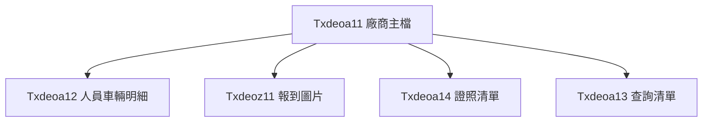

這表示：

- 一家廠商底下可以有很多人員車輛資料
- 可以有多張報到圖片
- 可以有多筆證照資料
- 查詢時可整理成清單畫面

---

## 九、先看整個新增流程

以廠商主檔為例，新增流程很像這樣：

1. 前端輸入廠商基本資料
2. 同時輸入人員或車輛明細
3. 按下儲存
4. 後端先建立主檔
5. 再把明細逐筆補上主檔識別碼
6. 明細一起寫入資料庫
7. 回傳新增成功

這樣主檔和明細才會綁在一起。

---

### 用一張圖看流程

```mermaid
sequenceDiagram
    participant U as 使用者
    participant C as 控制器
    participant S as 服務層
    participant M as 資料庫

    U->>C: 送出廠商主檔與明細
    C->>S: 呼叫新增
    S->>S: 產生主鍵與時間
    S->>M: 寫入主檔
    S->>M: 寫入明細
    M-->>S: 回傳結果
```

---

## 十、`Txdeoa11Controller`：廠商資料怎麼對外提供？

[`Txdeoa11Controller`](fpg-vcpseos/src/main/java/com/fpg/a/controller/Txdeoa11Controller.java) 是這一整塊功能的入口。

它提供很多常見功能：

- 查詢列表
- 匯出 Excel
- 查單筆
- 新增
- 修改
- 刪除
- 送審
- 核准退回
- 查詢全部廠商

---

### 1. 查詢列表

```java
@GetMapping("/list")
public TableDataInfo list(Txdeoa11 txdeoa11)
```

意思是：

- 前端送出查詢條件
- 後端回傳廠商列表
- 並且把子表明細一併補上

這裡很重要，因為列表不是只有主檔，還要把子明細一起顯示。

---

### 2. 新增主檔

```java
@PostMapping
public AjaxResult add(@RequestBody Txdeoa11 txdeoa11)
```

意思是：

- 使用者按下新增
- 前端把整包資料送進來
- 後端新增主檔與明細

---

### 3. 修改資料

```java
@PutMapping
public AjaxResult edit(@RequestBody Txdeoa11 txdeoa11)
```

意思是：

- 使用者修改廠商資料
- 後端更新主檔與明細

---

### 4. 送審與核准相關功能

這一塊比較像流程控制：

```java
@PutMapping(value = "/checkBackEoa2")
public AjaxResult checkBackEoa2(@RequestBody Map<String, Object> data)
```

```java
@PutMapping(value = "/sendToCheck")
public AjaxResult sendToCheck(@RequestBody Map<String, Object> data)
```

意思是：

- 一筆廠商資料送去審核
- 或被退回、核准
- 系統會記錄操作人與時間

你可以把它想像成：

> 文件從「草稿」一路送到「審核中」、「核准」或「退回」的流程。

---

## 十一、`Txdeoa11ServiceImpl` 才是真正處理主子表的地方

[`Txdeoa11ServiceImpl`](fpg-vcpseos/src/main/java/com/fpg/a/service/impl/Txdeoa11ServiceImpl.java) 是這一章最值得注意的內部實作。

它做了幾件很關鍵的事：

1. 新增主檔時自動產生識別碼和時間
2. 修改時先刪掉舊明細，再重建新明細
3. 刪除主檔時，也會刪掉對應明細
4. 批次處理子資料時，會自動補上主檔識別碼與狀態

---

### 1. 新增主檔時自動補資料

```java
txdeoa11.setXuid(IdUtils.randomUUID());
txdeoa11.setTxtm(DateUtils.getNowDate());
```

這表示：

- 系統自動產生主鍵
- 系統自動記錄異動時間

使用者不用自己填，系統會幫你處理。

---

### 2. 明細會自動綁定主檔

```java
txdeoa12.setFxuid(xuid);
```

這很重要。  
意思是：

- 這筆人員車輛資料屬於哪一筆廠商主檔
- 系統會自動塞入對應識別碼

這就是主子表最核心的地方。

---

### 3. 新增明細時，還會補狀態

```java
if(StringUtils.isEmpty(txdeoa12.getXuid())) {
    txdeoa12.setXuid(IdUtils.randomUUID());
    txdeoa12.setStas("A000");
}
```

意思是：

- 如果這筆明細還沒有自己的主鍵
- 系統就幫它產生
- 並把狀態設成預設值

這樣明細一建立就有完整識別資訊。

---

### 4. 明細也會記錄操作者與時間

```java
txdeoa12.setTxemp(SecurityUtils.getUsername());
txdeoa12.setTxtm(DateUtils.getNowDate());
```

意思是：

- 誰改的
- 什麼時候改的

都會被記錄下來。

---

## 十二、修改資料時為什麼要先刪明細再重建？

這是初學者很容易好奇的地方。

`Txdeoa11ServiceImpl` 在修改時會：

1. 刪掉舊的明細
2. 再把新的明細全部重新寫入

這樣做的原因是：

- 避免舊資料殘留
- 確保主檔和明細一致
- 簡化資料同步邏輯

你可以把它想成：

> 舊的清單先收掉，再發新名單。  
> 比起一條一條改，重新整理更不容易出錯。

---

## 十三、刪除主檔時，為什麼要連明細一起刪？

這也是主子表很重要的規則。

如果只刪主檔，不刪明細，會發生：

- 明細變成孤兒資料
- 查詢時資料對不起來
- 系統看起來像壞掉

所以刪除主檔時，會先刪明細，再刪主檔。

---

## 十四、`Txdeoz11ServiceImpl`：報到圖片怎麼處理？

[`Txdeoz11ServiceImpl`](fpg-vcpseos/src/main/java/com/fpg/a/service/impl/Txdeoz11ServiceImpl.java) 主要負責報到圖片資料的查詢、新增、修改、刪除。

它的角色比較單純，像是圖片資料的資料層服務。

---

### 它提供什麼功能？

- 查單筆
- 查列表
- 新增
- 修改
- 批次刪除
- 依主檔刪除

這表示：

> 每一家廠商都可以有多張報到圖片，  
> 當主檔刪掉或重建時，圖片資料也要能一起整理。

---

## 十五、`Txdeoa13ServiceImpl` 與 `Txdeoa14ServiceImpl`：清單查詢

[`Txdeoa13ServiceImpl`](fpg-vcpseos/src/main/java/com/fpg/a/service/impl/Txdeoa13ServiceImpl.java) 和 [`Txdeoa14ServiceImpl`](fpg-vcpseos/src/main/java/com/fpg/a/service/impl/Txdeoa14ServiceImpl.java) 都比較簡單，主要是做列表查詢。

它們的作用是：

- 讓前端可以快速顯示人員車輛清單
- 讓前端可以快速顯示證照與複訓證明清單

這種設計很常見，因為有些頁面只需要查，不一定要做複雜維護。

---

## 十六、`Txdeoa13Controller` 與 `Txdeoa14Controller`：清單與匯出

這兩個控制器都很像，功能也很單純：

- 查列表
- 匯出 Excel

例如：

```java
@GetMapping("/list")
public TableDataInfo list(Txdeoa13 txdeoa13)
```

意思是：

- 根據廠商條件查人員車輛資料

又例如：

```java
@PostMapping("/export")
public void export(HttpServletResponse response, Txdeoa14 txdeoa14)
```

意思是：

- 把證照清單匯出成 Excel

這對現場管理來說很實用，因為可以直接拿去比對資料。

---

## 十七、整個流程怎麼串在一起？

你可以把整個功能想成一個現場報到箱：

1. 先建立廠商主檔 `Txdeoa11`
2. 再加上人員車輛明細 `Txdeoa12`
3. 如果有證照，就掛上 `Txdeoa14`
4. 到場時上傳報到照片 `Txdeoz11`
5. 最後送審、核准、退回

整體流程如下：

```mermaid
flowchart TD
    A[廠商主檔 Txdeoa11] --> B[人員車輛明細 Txdeoa12]
    A --> C[證照清單 Txdeoa14]
    A --> D[報到圖片 Txdeoz11]
    B --> E[查詢清單 Txdeoa13]
    A --> F[送審/核准/退回]
```

---

## 十八、用一個超簡單範例理解主子表

假設今天有一家廠商：

- 廠商編號：`V001`
- 廠商名稱：`宏達工程`
- 聯絡人：`王小明`

這是主檔：

```java
Txdeoa11 vendor = new Txdeoa11();
vendor.setVndno("V001");
vendor.setVndnm("宏達工程");
vendor.setCtm("王小明");
```

再加一筆人員車輛明細：

```java
Txdeoa12 item = new Txdeoa12();
item.setDtclass("人員");
item.setNmbrnd("林大志");
```

意思是：

- 這家廠商底下有一位人員
- 系統會把這筆明細綁到主檔底下

如果再加一張報到照片：

```java
Txdeoz11 pic = new Txdeoz11();
pic.setPicnm("到場照片01");
```

這樣整個報到資料就完整了。

---

## 十九、初學者最容易搞混的地方

### 1. `Txdeoa11` 是主檔，不是明細

它是整個廠商資料的根。

---

### 2. `Txdeoa12` 才是主子表中的明細

人員與車輛通常會放在這裡。

---

### 3. `Txdeoa13`、`Txdeoa14` 比較像清單或查詢資料

它們不是最核心的主檔，但很適合給畫面顯示和匯出。

---

### 4. `Txdeoz11` 是圖片資料，不是廠商基本資料

它只是用來存報到圖片資訊。

---

### 5. 修改主檔時，明細常常要一起重新對齊

這是主子表最容易出錯的地方，所以服務層通常會特別處理。

---

## 二十、你可以怎麼記住這一章？

最簡單的記法是：

1. **`Txdeoa11` 是廠商主檔**
2. **`Txdeoa12` 是人員車輛明細**
3. **`Txdeoa13` 是人員車輛清單**
4. **`Txdeoa14` 是證照與複訓清單**
5. **`Txdeoz11` 是報到圖片**
6. **主檔一變，明細也要一起對齊**

---

## 二十一、本章小結

這一章我們學到了「廠商與報到資料維護」的核心概念：

- `Txdeoa11`：承攬廠商主檔，負責基本資料與審核流程
- `Txdeoa12`：廠商底下的人員車輛明細
- `Txdeoa13`：人員車輛查詢清單
- `Txdeoa14`：證照與複訓證明清單
- `Txdeoz11`：報到圖片上傳檔
- 主子表如何建立、更新、刪除與對齊
- 服務層如何自動補主鍵、時間、狀態與明細綁定

你可以把這一章記成一句話：

> **這套功能就是把外部廠商的主檔、明細、證照、圖片和審核資料全部整理好，讓現場報到與審核流程可以準確運作。**

下一章我們會進入更完整的業務核心，看看案件如何從建立一路跑到逾期判斷與獎懲規則：  
[智慧立案與逾期效獎業務核心](09_智慧立案與逾期效獎業務核心_.md)


# Chapter 9：智慧立案與逾期效獎業務核心

接續上一章 [廠商與報到資料維護](08_廠商與報到資料維護_.md)，我們已經知道系統可以把基本資料整理好。  
這一章要正式進入整個專案最核心的地方：**智慧立案與逾期效獎業務核心**。

你可以先把這一章想成工廠裡最重要的「生產線中控台」：

- 每一張案件單據什麼時候開始算
- 哪些日子要扣掉
- 哪些人可以多給寬限
- 算出逾期後要不要減發
- 逾期案件要怎麼送去經辦、課長、廠長逐層簽核

如果前面章節是在準備原料、工具、名單和規則，  
那這一章就是：

> **真正開始讓案件跑流程、算天數、判斷獎扣、送審核的地方。**

---

## 先用一個最核心的情境來理解

假設系統每天都會自動抓案件，然後判斷：

- 這張單是不是已經超過規定天數
- 中間有沒有假日要扣掉
- 這個人有沒有多一點寬限天數
- 如果真的逾期，要不要減發金額
- 最後要送給誰確認、誰核准

如果沒有這一層核心邏輯，整個系統就會像：

- 班表算錯
- 假日沒扣
- 人員寬限漏掉
- 逾期判斷失準
- 後續簽核與獎扣都一起出錯

所以本章的重點只有一句話：

> **把案件從「原始資料」變成「可判斷、可簽核、可追蹤」的業務流程。**

---

## 這一章你要先抓住的三件事

本章其實可以拆成三個超重要的概念：

1. **案件主檔**：一筆案件到底是誰、哪一張表、哪一個人、哪一個關卡
2. **狀態流轉**：案件現在是待經辦、待課長、待廠長，還是已審核
3. **核簽歷程**：每一次確認、呈核、退回、核准，都要留下紀錄

你可以先把它們想成：

- **案件主檔**＝這張單子的身分證
- **狀態流轉**＝這張單子現在走到哪一站
- **核簽歷程**＝這張單子一路蓋了哪些章

---

## 這一章的主角有哪些？

本章主要有兩個核心資料物件：

| 名稱 | 作用 | 白話理解 |
|---|---|---|
| `Txdfab11` | 逾期效獎減發確認主檔 | 案件主檔 |
| `Txdfab12` | 核簽歷程 | 每一步簽核紀錄 |

這兩個是整個核心流程最重要的資料。

---

## 一、先看整體流程

這個流程很像郵局分件：

1. 每天系統自動算案件
2. 算出逾期案件後建立主檔
3. 先送給經辦確認
4. 經辦確認後送課長
5. 課長簽核後送廠長
6. 廠長核准或退回
7. 若需要減發，再拋轉到 OA

下面這張圖可以幫你先建立整體感覺：

```mermaid
flowchart TD
    A[每日批次計算] --> B[建立案件主檔]
    B --> C[待經辦確認]
    C --> D[待課長審核]
    D --> E[待廠長審核]
    E --> F{是否減發}
    F -- 是 --> G[拋轉 OA]
    F -- 否 --> H[結案]
```

你可以先記住：

> **先產生案件，再依照狀態一步一步往下走。**

---

## 二、案件主檔 `Txdfab11` 是什麼？

[`Txdfab11`](fpg-vcpseos/src/main/java/com/fpg/f/domain/Txdfab11.java) 是這一章最重要的資料物件。  
它是一筆「逾期效獎減發確認案件」。

你可以把它想成：

> 一張完整的案件卡片，上面會記錄這筆案件的來源、目前狀態、金額、誰在處理、要不要罰扣。

---

### 1. 它會記哪些資料？

`Txdfab11` 裡面有很多欄位，新手先看最重要的幾個就好：

- `xuid`：這筆案件的唯一識別碼
- `plmAaId`：PLM 指派唯一碼
- `empid`：人員代號
- `slptypid`：單別代號
- `slptypnm`：單別名稱
- `deptid`：課別代號
- `deptnm`：課別名稱
- `assignTo`：簽審人
- `frmName`：表單名稱
- `actLabel`：關卡名稱
- `docNo`：表單編號
- `activeTime`：啟動時間
- `baseDat`：判斷基準日
- `calcDat`：計算日期
- `ovddys`：文到天數
- `dedamt`：罰扣金額
- `adjDedamt`：主管調整後金額
- `status`：簽核狀態
- `xrem`：主管備註或不扣款理由
- `prwcomt`：經辦說明

這些欄位一起組成一張完整案件。

---

### 2. 你可以怎麼讀它？

例如有一筆案件：

- 表單編號：`DOC-001`
- 簽審人：`王小明`
- 啟動時間：`2026/04/10 09:00`
- 文到天數：`15`
- 罰扣金額：`1000`
- 狀態：`A000`

你可以直接翻成白話：

> 這是一筆從 PLM 來的案件，已經停留 15 天，預設要罰扣 1000 元，目前還在待經辦確認。

---

### 3. `Txdfab11` 裡最容易看懂的欄位

下面這幾個欄位幾乎一定會在畫面上出現：

```java
private String status;
private Long ovddys;
private Long dedamt;
private String deductFlag;
```

意思是：

- `status`：現在流程走到哪
- `ovddys`：已經停了幾天
- `dedamt`：原本要扣多少
- `deductFlag`：是否要罰扣

你可以把它想成：

> 一張單子的「現在狀態」、「逾期天數」、「金額」、「要不要扣」四個重點。

---

## 三、核簽歷程 `Txdfab12` 是什麼？

[`Txdfab12`](fpg-vcpseos/src/main/java/com/fpg/f/domain/Txdfab12.java) 是每一次核簽動作的紀錄。

如果 `Txdfab11` 是主檔，那 `Txdfab12` 就像日記本。  
每次經辦、課長、廠長有動作，系統都會寫一筆歷程。

---

### 1. 它記錄哪些東西？

`Txdfab12` 主要欄位有：

- `xuid`：歷程識別碼
- `fab1Xuid`：對應主檔識別碼
- `status`：核簽後狀態
- `act`：動作
- `xrem`：簽核備註
- `txemp`：異動人員
- `txempName`：異動人員姓名
- `txtm`：異動時間

你可以把它想成：

> 「誰在什麼時候做了什麼事，結果變成什麼狀態。」

---

### 2. 例子怎麼看？

假設一筆歷程是：

- 動作：經辦確認
- 狀態：`A010`
- 備註：空白
- 操作人：`A1001`

那就代表：

> 經辦已經確認這筆案件，案件往下一關走了。

如果另一筆歷程是：

- 動作：課長簽核
- 狀態：`A020`
- 備註：`請依規定辦理`

那就代表：

> 課長已經看過，並留下意見，案件再送廠長。

---

## 四、狀態流轉是整個流程的骨架

這一章最重要的核心之一，就是案件狀態。

常見狀態有：

- `A000`：待經辦確認
- `A010`：待課長審核
- `A020`：待廠長審核
- `A030`：已審核

你可以把它想成一張地鐵路線圖，每一站只能依序前進：

```mermaid
flowchart LR
    A000[待經辦確認] --> A010[待課長審核]
    A010 --> A020[待廠長審核]
    A020 --> A030[已審核]
```

這表示：

- 不可以直接跳站
- 每一站都有對應的人處理
- 每次動作都要寫歷程

---

## 五、這一章和前面章節有什麼關係？

這一章不是憑空出現的。  
它會直接用到前面很多章節建好的規則：

- [單據參數建檔主資料](05_單據參數建檔主資料_.md)：決定逾期天數與減發金額
- [假日與寬限設定管理](06_假日與寬限設定管理_.md)：決定哪些日子要扣掉、哪些人可以寬限
- [通知名單與收件部門設定](07_通知名單與收件部門設定_.md)：決定通知要送給誰
- [前端介面與 API 對接](02_前端介面與_api_對接_.md)：前端怎麼呼叫列表、確認、呈核、核准 API

所以這一章可以理解成：

> **前面都是規則與資料，這一章開始把規則真的用在案件上。**

---

## 六、先看整個系統是怎麼跑的

這個流程很適合用「先算、再送、再簽」來理解。

```mermaid
sequenceDiagram
    participant B as 批次作業
    participant M as 案件主檔
    participant U as 經辦
    participant C as 課長
    participant F as 廠長

    B->>M: 建立逾期案件
    U->>M: 確認案件
    C->>M: 呈核案件
    F->>M: 核准或退回
```

你可以把它想成：

- 批次作業先把案件生出來
- 經辦先看是不是事實
- 課長再決定要不要罰扣
- 廠長最後拍板

---

## 七、從使用者角度看，這個流程在做什麼？

### 經辦看到的是什麼？

經辦看到的是「待確認」案件。  
他要做的事情很簡單：

- 看看案件是不是確實逾期
- 填寫經辦說明
- 勾選是否罰扣
- 按下確認

這一步的重點是：

> **先確認事實，不做最後裁決。**

---

### 課長看到的是什麼？

課長看到的是經辦確認後的案件。  
他要做的事情是：

- 決定要不要罰扣
- 必要時填寫簽核意見
- 按下呈核

這一步的重點是：

> **做初步裁決。**

---

### 廠長看到的是什麼？

廠長看到的是課長送上來的案件。  
他要做的事情是：

- 最後核准
- 或者退回
- 並留下意見

這一步的重點是：

> **做最終決定。**

---

## 八、API 的入口大概會怎麼長？

這一章的畫面通常會有幾種常見操作：

- 查詢列表
- 進入明細
- 確認
- 呈核
- 核准
- 退回
- 查看核簽歷程

你可以先想像它們都會對應到後端 API。  
例如前端可能先送查詢條件，再拿回案件列表。

---

## 九、案件查詢時會看到什麼？

案件清單通常會顯示：

- 狀態
- 單別名稱
- 課別名稱
- 簽審人
- 表單名稱
- 關卡名稱
- 表單編號
- 啟動時間
- 文到天數
- 罰扣金額
- 是否罰扣

這些欄位其實就是讓使用者一眼看懂：

> 這張單是誰的、卡在哪一關、停了多久、金額多少、要不要扣。

---

## 十、經辦流程：先確認，再往下送

當案件還在 `A000` 時，經辦可以按「確認」。  
這表示案件進入下一步。

### 你可以把它想成：

- 案件送到經辦桌上
- 經辦看完，覺得是正確的
- 按下確認
- 系統把狀態改成 `A010`
- 同時寫一筆 `Txdfab12` 歷程

這就像蓋第一個章。

---

## 十一、課長流程：決定要不要罰扣

當案件進入 `A010`，課長就可以處理。

課長通常會做兩件事：

1. 看經辦的說明
2. 決定是否要罰扣

如果要罰扣，就可以往下一關送。  
如果不罰扣，通常要寫清楚原因。

---

## 十二、廠長流程：最終核准或退回

當案件到 `A020`，就是廠長最終決定。

廠長有兩個選擇：

- **核准**：案件變成 `A030`
- **退回**：案件回到 `A010`

你可以把它想成最後總裁決：

- 有問題就退回重做
- 沒問題就結案

---

## 十三、最後如果要減發，會發生什麼事？

如果廠長核准後，系統判斷這筆案件需要減發，  
就會把資料拋轉到 OA。

這代表：

- 案件不是只有在系統裡看而已
- 還要進一步送到外部作業流程
- 產生實際的效率獎金獎懲通知

這一步是整個業務的最終輸出。

---

## 十四、內部邏輯先用簡單步驟看

當批次作業跑起來時，大致會做這些事：

1. 先抓到逾期案件
2. 用假日與寬限規則計算實際天數
3. 比對單別與表單的減發規則
4. 建立 `Txdfab11`
5. 初始化狀態為待經辦確認
6. 後續由三層簽核依序處理
7. 每次動作都寫入 `Txdfab12`

這就是整個核心流程。

---

## 十五、看一個超簡單的案件例子

假設有一筆案件：

- 人員代號：`A1001`
- 單別：`F001`
- 表單：`R001`
- 啟動時間：`2026/04/01`
- 文到天數：`12`
- 罰扣金額：`1000`
- 狀態：`A000`

你可以把它想成：

> 系統發現這筆案件停了 12 天，先建成逾期案件，等經辦確認。

如果經辦按下確認，  
狀態就變成 `A010`，並留下第一筆歷程。

---

## 十六、用超簡單程式看資料長相

### 建立案件主檔

```java
Txdfab11 data = new Txdfab11();
data.setEmpid("A1001");
data.setStatus("A000");
```

這段意思是：

- 建立一筆案件
- 指定人員代號
- 狀態先設為待經辦確認

---

### 建立核簽歷程

```java
Txdfab12 log = new Txdfab12();
log.setFab1Xuid(data.getXuid());
log.setAct("經辦確認");
```

這段意思是：

- 建立一筆核簽歷程
- 綁定案件主檔
- 記錄這次的動作是經辦確認

---

### 表示是否罰扣

```java
data.setDeduct(true);
data.setDeductFlag("Y");
```

這段意思是：

- 前端勾選要罰扣
- 系統轉成可儲存的旗標

這種設計很常見，因為畫面通常是勾選框，資料庫通常是文字旗標。

---

## 十七、這一章的資料欄位為什麼這麼多？

因為它不只是存結果，還要存流程。

你不只要知道：

- 是否逾期
- 是否罰扣

你還要知道：

- 誰處理的
- 哪個關卡
- 什麼時候啟動
- 哪一天計算
- 有沒有備註
- 有沒有調整金額

這些資訊都是為了讓整個流程可追蹤、可稽核、可回溯。

---

## 十八、初學者最容易混淆的地方

### 1. `Txdfab11` 是主檔，不是歷程

它記的是案件本體與目前狀態。

---

### 2. `Txdfab12` 才是歷程

它記的是每一步簽核動作。

---

### 3. `status` 是流程的關鍵

狀態不同，能操作的人和按鈕也不同。

---

### 4. `dedamt` 和 `adjDedamt` 不一樣

- `dedamt`：原始罰扣金額
- `adjDedamt`：主管調整後金額

---

### 5. 這一章不是單獨運作

它一定會依賴前面章節的規則資料。

---

## 十九、把整章濃縮成一句話

> **智慧立案與逾期效獎業務核心，就是把案件依照假日、寬限、單據規則算出逾期結果，再依狀態把案件送經辦、課長、廠長逐層簽核，最後決定是否減發並完成拋轉。**

---

## 二十、本章小結

這一章我們學到了整個系統最核心的業務流程：

- `Txdfab11`：案件主檔，負責保存案件本體、狀態、金額與顯示資訊
- `Txdfab12`：核簽歷程，負責記錄每一次確認、呈核、退回、核准
- 狀態流轉：`A000 → A010 → A020 → A030`
- 前面章節建立的規則會在這裡真正派上用場
- 最終目標是讓案件能夠被正確立案、正確簽核、正確減發、正確拋轉

你可以把這一章記成一句最簡單的話：

> **前面是在建規則，這一章是在讓規則真的跑起來。**

下一章我們會延續這個流程，進入最後的確認與減發決策：  
[逾期效獎減發確認流程](10_逾期效獎減發確認流程_.md)


# Chapter 10: 逾期效獎減發確認流程


接續上一章的 [智慧立案與逾期效獎業務核心](09_智慧立案與逾期效獎業務核心_.md)，我們已經知道案件可以先被算出來、建立成主檔，接下來就要進入真正的「確認」階段。  

這一章的重點很簡單：

> **當案件已經被系統判定為逾期後，要不要減發、減多少、誰來確認，會經過經辦、課長、廠長三層流程。**

你可以先把它想成餐廳出餐前的三道蓋章：

1. 經辦先檢查食材和單據
2. 課長再看要不要真的扣
3. 廠長最後拍板

這樣做的好處是：

- 不會亂扣
- 每一步都有紀錄
- 事後可以追查誰在什麼時間做了什麼決定

---

## 這一章要先解決什麼問題？

假設有一筆案件被系統抓到「逾期」了，接下來就會遇到這些問題：

- 這筆案件是不是確實該扣？
- 要扣多少？
- 經辦有沒有確認？
- 課長有沒有看過？
- 廠長有沒有核准？
- 如果退回，會退到哪一關？
- 每一步動作有沒有留下歷程？

如果沒有這套流程，系統就會變成：

- 只知道逾期
- 不知道誰確認
- 不知道是否已核准
- 不知道歷程在哪裡

所以這一章就是要學會：

> **如何用案件主檔與核簽歷程，把逾期效獎減發流程完整跑完。**

---

## 先看整體角色分工

這個流程裡有三個角色：

| 角色 | 做什麼 | 白話理解 |
|---|---|---|
| 經辦 | 先確認案件內容 | 第一關整理資料的人 |
| 課長 | 決定是否呈核 | 第二關審查的人 |
| 廠長 | 最終核准或退回 | 最後拍板的人 |

你可以把它想成：

- 經辦：先檢查包裹有沒有送錯
- 課長：決定要不要放行
- 廠長：最後批准是否出貨

---

## 本章會看到的兩個主角

這一章的核心資料物件只有兩個：

| 名稱 | 作用 |
|---|---|
| `Txdfab11` | 逾期效獎減發確認案件主檔 |
| `Txdfab12` | 核簽歷程 |

這兩個搭配起來，就能完成整個確認流程。

---

## 一、先用最簡單的方式理解整體流程

你可以把整個流程想成一張流程單：

1. 系統先建立案件主檔
2. 案件先進到經辦待確認
3. 經辦確認後，狀態變成待課長審核
4. 課長呈核後，狀態變成待廠長審核
5. 廠長核准後，狀態變成已審核
6. 每一步都寫入歷程

下面這張圖可以先幫你建立印象：

```mermaid
flowchart TD
    A[待經辦確認 A000] --> B[待課長審核 A010]
    B --> C[待廠長審核 A020]
    C --> D[已審核 A030]
```

你只要先記住：

> **案件會依照狀態一步一步往前走，而且每一步都會留下紀錄。**

---

## 二、案件主檔 `Txdfab11` 是什麼？

[`Txdfab11`](fpg-vcpseos/src/main/java/com/fpg/f/domain/Txdfab11.java) 是整個流程的主資料。  
它可以想成一張案件卡，裡面會記錄：

- 這是誰的案件
- 這張單是哪一個表單
- 現在卡在哪一關
- 要不要罰扣
- 要扣多少
- 有沒有經辦或主管備註

---

### 1. 最重要的幾個欄位

你先認識這幾個欄位就夠了：

```java
private String xuid;
private String empid;
private String status;
```

這三個欄位的意思是：

- `xuid`：案件唯一編號
- `empid`：人員代號
- `status`：目前狀態

白話來說就是：

> 「這張單是誰的、這張單是什麼、現在走到哪裡了。」

---

### 2. 跟金額有關的欄位

```java
private Long ovddys;
private Long dedamt;
private Long adjDedamt;
```

這三個欄位代表：

- `ovddys`：文到天數
- `dedamt`：原始罰扣金額
- `adjDedamt`：主管調整後金額

你可以把它想成：

> 系統先算出原本應該扣多少，主管之後還可以再調整。

---

### 3. 跟簽核有關的欄位

```java
private String deductFlag;
private String xrem;
private String prwcomt;
```

這三個欄位代表：

- `deductFlag`：是否罰扣
- `xrem`：主管備註或不扣款理由
- `prwcomt`：經辦說明

這就像一張表單上的註記欄：

- 經辦先寫說明
- 主管再寫判斷理由
- 系統保存是否扣款的結果

---

## 三、核簽歷程 `Txdfab12` 是什麼？

[`Txdfab12`](fpg-vcpseos/src/main/java/com/fpg/f/domain/Txdfab12.java) 是每一步操作的紀錄。  
如果 `Txdfab11` 是案件本體，那 `Txdfab12` 就像日記本。

每次有人做動作，例如：

- 經辦確認
- 課長簽核
- 廠長核准
- 廠長退回

系統都會寫一筆歷程。

---

### 1. 歷程會記什麼？

```java
private String fab1Xuid;
private String status;
private String act;
```

這三個欄位的意思是：

- `fab1Xuid`：對應的案件主檔編號
- `status`：當時變成什麼狀態
- `act`：做了什麼動作

白話就是：

> 「哪一筆案件、誰做了什麼、結果變成什麼狀態。」

---

### 2. 誰做的、什麼時候做的

```java
private String txemp;
private String txempName;
private Date txtm;
```

這三個欄位代表：

- `txemp`：操作人員
- `txempName`：操作人姓名
- `txtm`：操作時間

這些就是稽核時最重要的資訊。  
事後如果要追查，就看這裡。

---

## 四、先從使用者角度看流程

你可以先把整個流程想成一筆案件從左到右走過三個關卡：

1. 經辦看到案件
2. 經辦確認後送課長
3. 課長再送廠長
4. 廠長核准或退回

```mermaid
sequenceDiagram
    participant 系統 as 系統
    participant 經辦 as 經辦
    participant 課長 as 課長
    participant 廠長 as 廠長

    系統->>經辦: 顯示待確認案件
    經辦->>系統: 按下經辦確認
    系統->>課長: 變成待課長審核
    課長->>系統: 按下課長呈核
    系統->>廠長: 變成待廠長審核
```

這張圖的重點是：

> **每一關都不是直接改資料而已，而是會改狀態、寫歷程。**

---

## 五、經辦流程：先確認案件

經辦的入口對應到 [`Txdfab21Controller`](fpg-vcpseos/src/main/java/com/fpg/f/controller/Txdfab21Controller.java)。

它負責：

- 查詢待經辦案件
- 看單筆明細
- 看核簽歷程
- 按下經辦確認

---

### 1. 查詢列表

```java
@GetMapping("/list")
public TableDataInfo list(Txdfab11 txdfab11)
```

意思是：

- 前端送查詢條件
- 後端回傳待經辦案件列表

例如你可以查：

- 某個人
- 某個單別
- 某個狀態

---

### 2. 看明細

```java
@GetMapping(value = "/{xuid}")
public AjaxResult getInfo(@PathVariable("xuid") String xuid)
```

意思是：

- 點進某筆案件
- 看這筆案件完整內容

---

### 3. 看歷程

```java
@GetMapping(value = "/history/{xuid}")
public AjaxResult history(@PathVariable("xuid") String xuid)
```

意思是：

- 看這筆案件以前走過哪些步驟
- 每一步是誰做的

---

### 4. 經辦確認

```java
@PutMapping("/confirm")
public AjaxResult confirm(@RequestBody Txdfab11 txdfab11)
```

意思是：

- 經辦按下確認
- 系統把案件往下一步推

---

## 六、經辦確認時，系統到底做了什麼？

真正的邏輯在 [`Txdfab11ServiceImpl`](fpg-vcpseos/src/main/java/com/fpg/f/service/impl/Txdfab11ServiceImpl.java)。

你可以先把它想成一個守門員：

> 不是誰來按都可以確認，系統會先檢查案件是不是對的、狀態是不是對的、操作人是不是對的。

---

### 1. 先檢查主鍵有沒有帶

```java
if (StringUtils.isBlank(txdfab11.getXuid()))
{
    throw new ServiceException("確認失敗，缺少主鍵資料");
}
```

意思是：

- 沒有案件編號就不能確認
- 系統要先知道你在處理哪一筆

---

### 2. 先確認是不是本人可操作

```java
boolean adminUser = isAdminUser(txdfab11.getEmpid()) || isAdminUser(txdfab11.getTxemp());
```

意思是：

- 如果是管理者，可以看更廣
- 一般使用者只能確認自己的案件

這樣可以避免別人亂按別人的案件。

---

### 3. 只能在待經辦狀態確認

```java
if (!STATUS_A000.equals(dbData.getStatus()))
{
    throw new ServiceException("僅待經辦確認(A000)狀態可執行確認");
}
```

意思是：

- 只有 `A000` 才能確認
- 其他狀態不能亂改

這就像包裹只有在「待收件」時才能簽收，已經簽收過的不能再簽一次。

---

### 4. 寫入新的狀態

```java
updateData.setStatus(STATUS_A010);
updateData.setPrwcomt(txdfab11.getPrwcomt());
```

意思是：

- 經辦確認後狀態變成 `A010`
- 經辦說明也一起存起來

---

### 5. 寫入歷程

```java
history.setAct("經辦確認");
history.setStatus(STATUS_A010);
```

意思是：

- 系統新增一筆歷程
- 記錄這次動作是經辦確認

---

## 七、課長流程：呈核與是否罰扣

課長的入口對應到 [`Txdfab31Controller`](fpg-vcpseos/src/main/java/com/fpg/f/controller/Txdfab31Controller.java)。

它負責：

- 查詢待課長審核案件
- 看案件明細
- 看歷程
- 按下課長呈核

---

### 1. 查詢列表

```java
@GetMapping("/list")
public TableDataInfo list(Txdfab11 txdfab11)
```

意思是：

- 只看課長能處理的案件
- 前端拿到列表後顯示

---

### 2. 看明細與歷程

```java
@GetMapping(value = "/{xuid}")
public AjaxResult getInfo(@PathVariable("xuid") String xuid)
```

```java
@GetMapping(value = "/history/{xuid}")
public AjaxResult history(@PathVariable("xuid") String xuid)
```

意思是：

- 課長可以先看案件內容
- 也可以看這筆案件一路走來的歷程

---

### 3. 課長呈核

```java
@PutMapping("/submit")
public AjaxResult submit(@RequestBody Txdfab11 txdfab11)
```

意思是：

- 課長按下呈核
- 案件往廠長關卡前進

---

## 八、課長呈核時，系統會檢查什麼？

課長流程在 `Txdfab11ServiceImpl.sectionChiefSubmit()`。

---

### 1. 先確認案件屬於目前課別

```java
dbData = txdfab11Mapper.selectTxdfab11ByXuidAndDeptid(txdfab11.getXuid(), txdfab11.getDeptid());
```

意思是：

- 課長只能處理自己課別的案件
- 不能看別的課的案件

這樣權限才合理。

---

### 2. 只能在待課長審核狀態呈核

```java
if (!STATUS_A010.equals(dbData.getStatus()))
{
    throw new ServiceException("僅待課長審核(A010)狀態可執行呈核");
}
```

意思是：

- 只有 `A010` 才能送下一關
- 狀態不對就不能按

---

### 3. 如果不罰扣，簽核意見不能空白

```java
if (!deduct && StringUtils.isBlank(txdfab11.getXrem()))
{
    throw new ServiceException("不罰扣時，簽核意見不可空白");
}
```

意思是：

- 如果課長決定不罰扣
- 就一定要寫理由

這很像做決策時要留下書面說明，避免事後沒有依據。

---

### 4. 寫入調整後金額

```java
updateData.setAdjDedamt(deduct ? dbData.getDedamt() : 0L);
```

意思是：

- 如果要罰扣，就保留原始金額
- 如果不罰扣，就改成 0

這一步很重要，因為它會影響最後結果。

---

### 5. 寫入歷程

```java
history.setAct("課長簽核");
history.setStatus(STATUS_A020);
```

意思是：

- 系統記錄這次動作是課長簽核
- 狀態變成 `A020`

---

## 九、廠長流程：最後核准或退回

廠長的入口對應到 [`Txdfab41Controller`](fpg-vcpseos/src/main/java/com/fpg/f/controller/Txdfab41Controller.java)。

它負責：

- 查詢待廠長審核案件
- 看明細
- 看歷程
- 核准
- 退回

---

### 1. 查詢列表

```java
@GetMapping("/list")
public TableDataInfo list(Txdfab11 txdfab11)
```

意思是：

- 只顯示廠長能看到的案件

---

### 2. 核准或退回

```java
@PutMapping("/approve")
public AjaxResult approve(@RequestBody Txdfab11 txdfab11)
```

```java
@PutMapping("/reject")
public AjaxResult reject(@RequestBody Txdfab11 txdfab11)
```

意思是：

- 廠長可以按核准
- 也可以按退回

---

## 十、廠長核准時，系統做了什麼？

廠長核准的邏輯在 `Txdfab11ServiceImpl.factoryManagerApprove()`。

---

### 1. 只能在待廠長審核時核准

```java
if (!STATUS_A020.equals(dbData.getStatus()))
{
    throw new ServiceException("僅待廠長審核(A020)狀態可執行核准");
}
```

意思是：

- 只有 `A020` 才能核准
- 其他狀態不能核准

---

### 2. 寫成已審核

```java
updateData.setStatus("A030");
```

意思是：

- 廠長核准後，案件狀態變成 `A030`
- 代表這筆案件已完成審核

---

### 3. 寫入歷程

```java
history.setAct("廠長核准");
history.setStatus("A030");
```

意思是：

- 系統記錄最後一關動作
- 留下核准歷程

---

## 十一、廠長退回時，系統做了什麼？

退回的邏輯在 `Txdfab11ServiceImpl.factoryManagerReject()`。

---

### 1. 退回時意見不能空白

```java
if (StringUtils.isBlank(txdfab11.getXrem()))
{
    throw new ServiceException("退回時，簽核意見不可空白");
}
```

意思是：

- 如果要退回，一定要寫原因

---

### 2. 狀態會退回到課長關卡

```java
updateData.setStatus(STATUS_A010);
```

意思是：

- 退回不是直接刪掉
- 而是回到課長再處理

這樣流程比較完整。

---

### 3. 寫入歷程

```java
history.setAct("廠長退回");
history.setStatus(STATUS_A010);
```

意思是：

- 系統記錄這次是退回
- 狀態回到課長階段

---

## 十二、為什麼每一步都要寫歷程？

這是這個流程最重要的精神之一。

因為未來可能會問：

- 是誰確認的？
- 誰說要扣？
- 誰核准？
- 為什麼退回？
- 什麼時間做的？

如果沒有歷程，就無法追查。  
所以每一次動作都會新增 `Txdfab12`。

你可以把它想成：

> 文件上每一個章都要留影本，不能只看最後結果。

---

## 十三、這一章如何跟前面章節串起來？

這一章其實是前面很多章節的總結應用：

- [單據參數建檔主資料](05_單據參數建檔主資料_.md)：決定逾期天數與減發金額
- [假日與寬限設定管理](06_假日與寬限設定管理_.md)：幫忙算出真實逾期天數
- [通知名單與收件部門設定](07_通知名單與收件部門設定_.md)：若要通知相關人員，可以用到名單
- [前端介面與 API 對接](02_前端介面與_api_對接_.md)：前端按鈕會對應到這些 API

所以你可以把這一章理解成：

> **前面是在準備規則，這一章是規則真正開始工作。**

---

## 十四、從實際輸入到輸出，整個流程會怎麼走？

### 輸入

使用者會在畫面上看到：

- 案件清單
- 案件明細
- 經辦說明
- 簽核意見
- 是否罰扣

### 輸出

系統會產生：

- 狀態變更
- 金額調整
- 核簽歷程
- 成功或失敗訊息

---

## 十五、看一個超簡單的例子

假設案件資料如下：

- 案件編號：`X001`
- 狀態：`A000`
- 原始罰扣：`1000`

經辦確認後：

- 狀態變成 `A010`
- 歷程新增「經辦確認」

課長呈核後：

- 狀態變成 `A020`
- 若不罰扣，調整後金額變 `0`

廠長核准後：

- 狀態變成 `A030`
- 歷程新增「廠長核准」

這樣整筆案件就完成了。

---

## 十六、這一章最容易混淆的地方

### 1. `Txdfab11` 是案件主檔

它不是歷程。  
它是案件本體與目前狀態。

---

### 2. `Txdfab12` 才是歷程

它只記每次的動作與時間。

---

### 3. `A000、A010、A020、A030` 是流程狀態

不是隨便的代碼，而是一步一步的關卡。

---

### 4. 經辦、課長、廠長有不同權限

不是每個人都能操作每一步。

---

### 5. 每次動作都要先檢查狀態

避免重複按、亂按、跳關卡。

---

## 十七、你可以怎麼記住這一章？

最簡單的記法是：

1. **先由經辦確認**
2. **再由課長呈核**
3. **最後由廠長核准或退回**
4. **每一步都寫入核簽歷程**
5. **狀態會一路從 A000 走到 A030**

---

## 十八、本章小結

這一章我們學到了「逾期效獎減發確認流程」的核心概念：

- `Txdfab11`：案件主檔，保存案件資料、狀態、金額與簽核資訊
- `Txdfab12`：核簽歷程，保存每一步的動作、狀態、時間與操作者
- 經辦、課長、廠長三層流程如何依序運作
- 狀態如何從 `A000` 一路流轉到 `A030`
- 為什麼每一步都必須寫歷程，方便追蹤與稽核

你可以把這一章記成一句最簡單的話：

> **這不是單純的按鈕流程，而是一套會留下紀錄、會逐層簽核、會決定要不要減發的完整案件確認流程。**

如果你想把這整套流程從頭到尾再連一次，可以回去複習前面的 [智慧立案與逾期效獎業務核心](09_智慧立案與逾期效獎業務核心_.md)。


--- 

Generated by [AI Codebase Knowledge Builder](https://github.com/The-Pocket/Tutorial-Codebase-Knowledge)
