# Tutorial: code_to_analyze

這個專案是用來做 **配電盤智慧立案與逾期效獎減發管理** 的系統，核心目標是把原本靠人工追蹤的案件流程，改成由系統自動判斷、通知與簽核。
它會先依照 *單據規則、假日、寬限天數* 計算案件是否逾期，再把逾期案件送進經辦、課長、廠長的分層確認流程，最後視結果決定是否要減發獎金或拋轉到外部系統。
同時系統也提供 **基礎資料維護**、**參考欄位對照**、**多語係管理** 與 **前端 API 串接**，讓整體功能可以穩定運作並方便使用者操作。


**Source Repository:** [None](None)

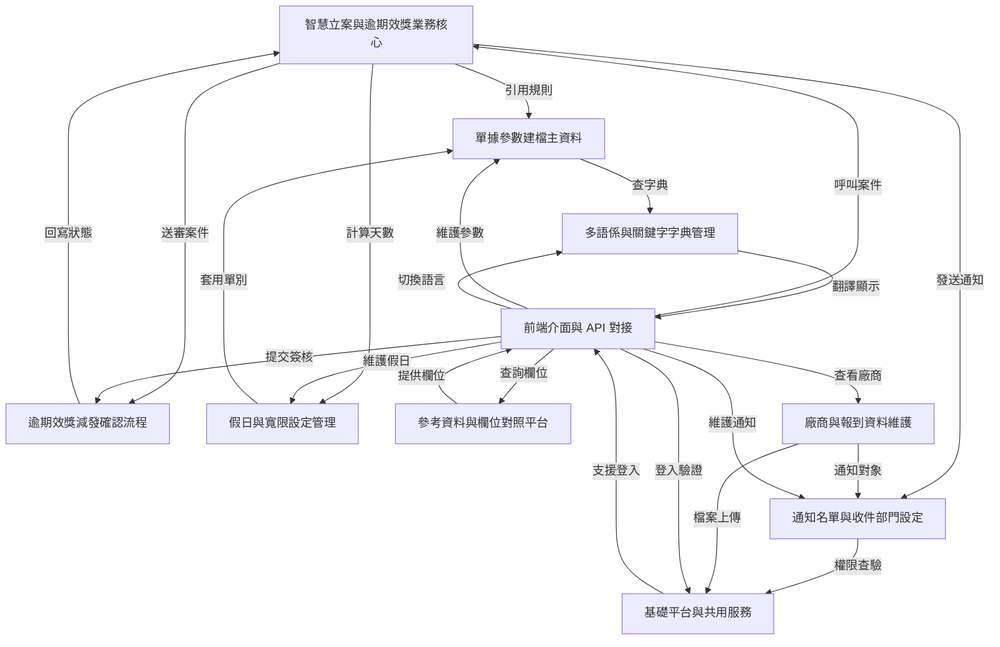


# Chapter 1：基礎平台與共用服務

在進入真正的業務功能之前，先來認識整個專案最底層、但也最重要的「地基」。

你可以把它想成一棟大樓的水電、電梯、消防、門禁系統：  
平常大家不會一直提到它，但只要少了其中一個，整棟樓就很難正常運作。

這一章的中心情境是：

> **當使用者登入系統、送出表單、查詢資料、匯出 Excel、或遇到錯誤時，系統是怎麼穩穩地把事情處理好？**

如果你是新手，這一章不用死背每個類別。  
你只要先建立一個概念：

- 前台畫面負責「輸入」
- 業務模組負責「規則」
- **基礎平台與共用服務**負責「安全、流程、共用能力、錯誤處理、資料工具」

---

## 這一層到底在做什麼？

這一層不是直接處理「申請單」、「通知」、「廠商」這些業務，而是提供所有模組都會用到的共通能力，例如：

- 登入與權限驗證
- JWT 令牌驗證
- 全域例外處理
- 多資料來源切換
- 防止重複提交
- Redis 快取
- 排程與背景工作
- Excel 匯入匯出
- 通用字串、日期、ID、回應物件等工具

你可以把它理解成：

> **業務模組像是店員，基礎平台像是櫃檯、保全、收銀系統、倉儲系統。**

店員負責賣東西，  
但如果沒有這些共用系統，店根本無法正常營運。

---

## 先用一個最常見的使用情境理解它

假設你做了一個「新增資料」的功能：

1. 使用者登入系統
2. 前端送出新增表單
3. 系統先確認使用者有沒有登入
4. 檢查這次提交是不是重複送出
5. 若資料格式錯誤，就回傳友善的錯誤訊息
6. 若資料要寫入主庫或從庫，就切換資料來源
7. 若新增成功，就記錄操作日誌
8. 若要匯出資料，就交給 Excel 工具處理

你會發現：  
**真正的業務只佔一小部分，很多事情都在共用層先幫你準備好了。**

---

## 本章你要先認識的幾個核心概念

我們用最簡單的方式一個一個看。

### 1. 登入與權限驗證

使用者進來系統，不是直接就能做所有事。  
系統要先知道：

- 你是誰
- 你有沒有登入
- 你能不能看這個功能

這部分主要靠：

- [`JwtAuthenticationTokenFilter`](fpg-framework/src/main/java/com/fpg/framework/security/filter/JwtAuthenticationTokenFilter.java)
- [`SecurityConfig`](fpg-framework/src/main/java/com/fpg/framework/config/SecurityConfig.java)
- [`SysLoginService`](fpg-framework/src/main/java/com/fpg/framework/web/service/SysLoginService.java)

你可以把它想像成門口保全：

- 沒帶證件：不能進
- 證件過期：要重新辦
- 證件有效：才能進入辦公區

---

### 2. 全域例外處理

如果系統中某個地方出錯，不希望每個頁面都自己寫一套錯誤畫面。  
所以會有一個統一的地方負責接住錯誤，轉成一致的回應格式。

這個角色是：

- [`GlobalExceptionHandler`](fpg-framework/src/main/java/com/fpg/framework/web/exception/GlobalExceptionHandler.java)

它像是大樓的總機：

- 收到不同類型的問題
- 再用統一方式回答使用者
- 讓前端比較好處理

---

### 3. 多資料來源切換

有些查詢要走主資料庫，有些要走從資料庫。  
有時候同一個系統裡還可能有不同資料庫。

這時候就需要「切換資料來源」。

相關類別：

- [`DruidConfig`](fpg-framework/src/main/java/com/fpg/framework/config/DruidConfig.java)
- [`DataSourceAspect`](fpg-framework/src/main/java/com/fpg/framework/aspectj/DataSourceAspect.java)

你可以把它想成：

> 同一張會員卡，可以決定你今天要走哪個入口。

---

### 4. 防止重複提交

使用者可能因為網路慢、連點按鈕、重整頁面，導致同一筆資料被送出兩次。  
這很容易造成重複新增、重複審核、重複匯款等問題。

相關類別：

- [`RepeatSubmitInterceptor`](fpg-framework/src/main/java/com/fpg/framework/interceptor/RepeatSubmitInterceptor.java)

像是超商收銀：  
你不能同一個商品掃兩次卻以為是不同商品。

---

### 5. Redis 與快取

有些資料很常查，但不需要每次都去資料庫。  
例如驗證碼、登入資訊、常用設定、限流資訊。

相關類別：

- [`RedisConfig`](fpg-framework/src/main/java/com/fpg/framework/config/RedisConfig.java)

你可以把 Redis 想成：

> 放在櫃台旁邊的快速抽屜，拿東西比去倉庫快很多。

---

### 6. Excel 匯入匯出

很多系統都需要把資料匯出成 Excel，或從 Excel 匯入資料。

相關類別：

- [`ExcelUtil`](fpg-common/src/main/java/com/fpg/common/utils/poi/ExcelUtil.java)

這就像：

> 你把資料整理成表格交給別人，或從別人整理好的表格再讀回來。

---

### 7. 通用工具類

專案中有很多很常用的小工具：

- [`StringUtils`](fpg-common/src/main/java/com/fpg/common/utils/StringUtils.java)
- [`DateUtils`](fpg-common/src/main/java/com/fpg/common/utils/DateUtils.java)
- [`IdUtils`](fpg-common/src/main/java/com/fpg/common/utils/uuid/IdUtils.java)
- [`BaseController`](fpg-common/src/main/java/com/fpg/common/core/controller/BaseController.java)
- [`AjaxResult`](fpg-common/src/main/java/com/fpg/common/core/domain/AjaxResult.java)
- [`BaseEntity`](fpg-common/src/main/java/com/fpg/common/core/domain/BaseEntity.java)

它們像是工具箱裡的螺絲起子、尺、剪刀、標籤紙。  
單獨看很小，但到處都會用到。

---

## 先看一個最簡單的回傳格式

很多介面最後都會回傳一種統一結果，像這樣：

```java
AjaxResult result = AjaxResult.success("新增成功");
return result;
```

這段的意思是：

- 系統回傳一個成功結果
- 訊息是「新增成功」

如果失敗，也可以這樣：

```java
AjaxResult result = AjaxResult.error("資料格式錯誤");
return result;
```

這段的意思是：

- 系統回傳一個失敗結果
- 訊息是「資料格式錯誤」

這種設計很適合前端，因為前端只要看：

- `code`：成功還是失敗
- `msg`：顯示什麼訊息
- `data`：有沒有資料

---

## `AjaxResult`：統一的回應包裝

[`AjaxResult`](fpg-common/src/main/java/com/fpg/common/core/domain/AjaxResult.java) 是很常見的共用回傳格式。

你可以把它想成一個「包裹盒」：

- 外面貼標籤：成功、失敗、警告
- 裡面放訊息與資料

它的優點是：

- 所有 API 回傳格式一致
- 前端容易判斷
- 錯誤處理更整齊

---

## `BaseEntity`：資料表共同欄位的基底

很多資料表都會有這些欄位：

- 建立者
- 建立時間
- 更新者
- 更新時間
- 備註

[`BaseEntity`](fpg-common/src/main/java/com/fpg/common/core/domain/BaseEntity.java) 就是把這些共用欄位整理起來。

你可以把它看成：

> 每個資料物件都會繼承的「基本身分證」。

這樣每個業務資料類別就不用重複寫一樣的欄位。

---

## `BaseController`：控制器的共用功能

[`BaseController`](fpg-common/src/main/java/com/fpg/common/core/controller/BaseController.java) 是很多控制器都會繼承的基底。

它幫你做幾件常見事：

- 自動處理日期格式
- 分頁
- 排序
- 回傳成功或失敗結果
- 取得目前登入使用者資訊

例如：

```java
protected AjaxResult toAjax(int rows)
{
    return rows > 0 ? AjaxResult.success() : AjaxResult.error();
}
```

意思很簡單：

- 如果受影響筆數大於 0，就回傳成功
- 否則回傳失敗

這可以讓你少寫很多重複判斷。

---

## 登入流程：系統怎麼知道你是誰？

登入是整個平台最重要的入口之一。  
我們看 [`SysLoginService`](fpg-framework/src/main/java/com/fpg/framework/web/service/SysLoginService.java) 的概念。

它大致做這些事：

1. 檢查驗證碼
2. 檢查帳密是否符合基本規則
3. 檢查黑名單 IP
4. 驗證密碼或 AD 網域
5. 成功後產生 token
6. 把登入資訊寫回系統

可以用這個流程理解：

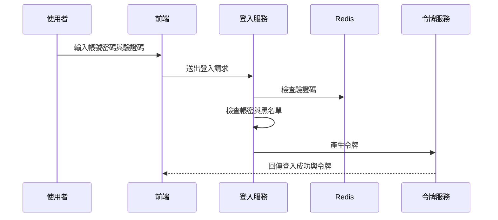

你只要先記住：

> **登入不是只有驗密碼，還包含驗證碼、風險檢查、令牌發放。**

---

## `JwtAuthenticationTokenFilter`：每次請求先驗證令牌

登入成功後，前端通常會帶著 token 呼叫其他 API。  
這時候 [`JwtAuthenticationTokenFilter`](fpg-framework/src/main/java/com/fpg/framework/security/filter/JwtAuthenticationTokenFilter.java) 會先檢查 token。

它的流程很像：

- 從請求中拿 token
- 找到對應的登入使用者
- 檢查 token 是否有效
- 若有效，就把使用者資訊放進安全上下文
- 後面程式就知道「你已登入」

最簡單的理解是：

> 每次進門都要再刷一次卡，確定你還在有效身分內。

---

## `SecurityConfig`：哪些路可以不用登入，哪些一定要登入？

[`SecurityConfig`](fpg-framework/src/main/java/com/fpg/framework/config/SecurityConfig.java) 負責設定整個安全規則。

它會定義：

- 哪些網址可以匿名訪問
- 哪些網址必須登入
- 失敗時怎麼回應
- 登出怎麼處理
- token 過濾器何時執行

例如，登入頁、驗證碼、靜態資源通常可以匿名訪問；  
其他業務 API 則通常必須登入。

你可以把它想成：

> 大樓的門禁規則表。

---

## `GlobalExceptionHandler`：錯誤不要亂飛，統一接住

當系統發生錯誤時，如果沒有統一處理，前端可能看到一堆不規則的訊息。  
[`GlobalExceptionHandler`](fpg-framework/src/main/java/com/fpg/framework/web/exception/GlobalExceptionHandler.java) 就是負責把不同錯誤整理成一致格式。

例如它會分別處理：

- 權限不足
- 請求方式不對
- 參數格式錯誤
- 服務層自訂錯誤
- 系統錯誤
- 驗證失敗

你可以把它看成：

> 接線生把不同房間打來的故障電話，統一整理後再回報。

---

## `DataSourceAspect`：方法一進來就切換資料來源

有些方法執行前，系統要先決定要連哪個資料庫。  
[`DataSourceAspect`](fpg-framework/src/main/java/com/fpg/framework/aspectj/DataSourceAspect.java) 就是做這件事。

流程很簡單：

1. 檢查方法上有沒有資料來源註解
2. 如果有，就把當前資料來源設成指定值
3. 執行方法
4. 方法結束後清掉資料來源設定

它像什麼？

> 像是在進不同倉庫前，先告訴門禁系統你今天要去的是主倉庫還是分倉庫。

---

## `DruidConfig`：主庫、從庫、多資料源的設定入口

[`DruidConfig`](fpg-framework/src/main/java/com/fpg/framework/config/DruidConfig.java) 負責建立資料庫連線與多資料來源。

它主要做三件事：

- 建立主資料來源
- 建立從資料來源
- 把它們交給動態資料來源管理

你可以簡單理解成：

> 先準備好幾條水管，再由系統決定現在要打開哪一條。

---

## `RepeatSubmitInterceptor`：避免同一筆資料被送兩次

有些操作最怕重複按鈕，例如：

- 新增資料
- 送出審核
- 匯款
- 申請流程

[`RepeatSubmitInterceptor`](fpg-framework/src/main/java/com/fpg/framework/interceptor/RepeatSubmitInterceptor.java) 會在請求到達前先檢查：

- 這個方法有沒有標記「防重複提交」
- 如果有，就判斷是不是重複送出
- 若重複，直接回錯誤，不讓它進業務邏輯

簡單說：

> 按鈕雖然按下去了，但保全會先幫你擋住第二次。

---

## `LogAspect`：操作日誌自動記錄

業務系統通常要知道：

- 是誰操作的
- 什麼時間操作的
- 對哪個 URL 操作
- 內容是什麼
- 成功還是失敗

[`LogAspect`](fpg-framework/src/main/java/com/fpg/framework/aspectj/LogAspect.java) 就是幫你自動記錄這些資料。

你不需要每個方法都手動寫「記錄日誌」；  
只要標上註解，它就會在方法前後自動收集資訊。

這非常像：

> 監視器自動錄影，不需要每個人自己拿手機拍。

---

## `RedisConfig`：快取與限流的基礎

[`RedisConfig`](fpg-framework/src/main/java/com/fpg/framework/config/RedisConfig.java) 的核心任務是建立 Redis 操作模板，讓系統可以：

- 存取快取
- 保存暫時資料
- 做限流控制

例如驗證碼就很適合放 Redis：

- 產生後先存起來
- 使用者登入時拿來比對
- 用完即刪

這種資料不適合一直寫資料庫。  
Redis 速度快，很適合做這件事。

---

## `StringUtils`、`DateUtils`、`IdUtils`：小工具，大幫手

### `StringUtils`

[`StringUtils`](fpg-common/src/main/java/com/fpg/common/utils/StringUtils.java) 提供很多字串處理方法，例如：

- 判斷空值
- 擷取子字串
- 轉駝峰
- 分隔字串
- 比對路徑

你可以把它當成「字串專用小工具包」。

---

### `DateUtils`

[`DateUtils`](fpg-common/src/main/java/com/fpg/common/utils/DateUtils.java) 負責日期處理，例如：

- 取得現在時間
- 格式化日期
- 解析字串成日期
- 計算時間差

例如：

```java
String now = DateUtils.getTime();
```

這會取得目前時間字串，像 `2026-04-21 10:30:00` 這樣的格式。

---

### `IdUtils`

[`IdUtils`](fpg-common/src/main/java/com/fpg/common/utils/uuid/IdUtils.java) 用來產生 UUID。

例如：

```java
String id = IdUtils.simpleUUID();
```

這會得到一組沒有連字號的唯一識別碼。

你可以把它想像成：

> 幫每個資料打上一個幾乎不會重複的編號。

---

## `ExcelUtil`：匯入匯出的重頭戲

[`ExcelUtil`](fpg-common/src/main/java/com/fpg/common/utils/poi/ExcelUtil.java) 是很大的工具類，但新手先抓住重點就好：

它主要負責：

- 匯出 Excel
- 匯入 Excel
- 標題樣式
- 欄位對應
- 下拉選單
- 日期與數字格式
- 圖片欄位
- 合計列

你可以把它想成：

> 一台很強的表格工廠，輸入資料後，幫你變成 Excel；  
> 或者把 Excel 資料拆回 Java 物件。

---

## 一個很小的匯出例子

假設你有一批資料，要匯出成 Excel：

```java
ExcelUtil<User> excelUtil = new ExcelUtil<>(User.class);
AjaxResult result = excelUtil.exportExcel(userList, "使用者資料");
```

這段的意思是：

- 建立一個對應 `User` 類別的 Excel 工具
- 把 `userList` 匯出成名為「使用者資料」的 Excel

如果成功，系統會產生檔案。  
前端通常可以拿到下載連結或檔案名稱。

---

## 一個很小的匯入例子

如果你要把 Excel 檔讀回來：

```java
ExcelUtil<User> excelUtil = new ExcelUtil<>(User.class);
List<User> users = excelUtil.importExcel(inputStream);
```

這段的意思是：

- 用 `User` 類別作為對照
- 把 Excel 每一列轉成一個 `User` 物件
- 最後得到 `users` 清單

這就是「表格和物件互轉」的概念。

---

## 背後是怎麼運作的？先看整體流程

如果把整個基礎平台想像成一個自動處理系統，大致會長這樣：

1. 使用者送出請求
2. 安全過濾器先檢查 token
3. 若方法有防重複註解，攔截器先檢查是否重送
4. 若方法有資料來源註解，切面先切換資料庫
5. 進入控制器與業務邏輯
6. 若出錯，統一交給全域例外處理器
7. 成功或失敗都回傳 `AjaxResult`
8. 若有標註日誌註解，操作資料會被自動記錄

可以用這張圖來理解：

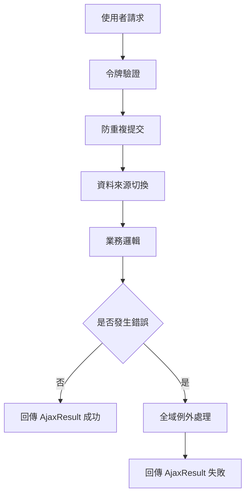

---

## 進一步看幾個核心實作

下面挑幾個最代表性的類別，用非常簡單的方式看它們怎麼做。

---

### 1. 令牌驗證是怎麼被放進每次請求的？

看 [`JwtAuthenticationTokenFilter`](fpg-framework/src/main/java/com/fpg/framework/security/filter/JwtAuthenticationTokenFilter.java)。

它的核心概念是：

- 先從請求中找登入使用者
- 如果使用者存在，而且目前尚未建立驗證資訊
- 就把登入資訊放進安全上下文
- 後面的程式就能直接取得使用者身分

簡化後可以理解成：

```java
LoginUser loginUser = tokenService.getLoginUser(request);
if (loginUser != null) {
    tokenService.verifyToken(loginUser);
    SecurityContextHolder.getContext().setAuthentication(authenticationToken);
}
```

這表示：

- token 能找到人
- token 還有效
- 系統就承認這個人已登入

---

### 2. 登入時為什麼先驗證驗證碼？

看 [`SysLoginService`](fpg-framework/src/main/java/com/fpg/framework/web/service/SysLoginService.java)。

它在登入流程中先做驗證碼檢查，因為：

- 防止機器人亂試密碼
- 防止大量暴力登入
- 保護系統安全

簡化概念如下：

```java
String captcha = redisCache.getCacheObject(verifyKey);
if (captcha == null) {
    throw new CaptchaExpireException();
}
if (!code.equalsIgnoreCase(captcha)) {
    throw new CaptchaException();
}
```

意思是：

- Redis 裡找不到驗證碼，代表過期
- 找得到但不一樣，代表輸入錯誤

---

### 3. 全域例外怎麼統一處理？

看 [`GlobalExceptionHandler`](fpg-framework/src/main/java/com/fpg/framework/web/exception/GlobalExceptionHandler.java)。

它用很多個 `@ExceptionHandler` 分別接不同錯誤。  
例如權限不足時：

```java
@ExceptionHandler(AccessDeniedException.class)
public AjaxResult handleAccessDeniedException(AccessDeniedException e, HttpServletRequest request)
```

這表示：

- 只要丟出 `AccessDeniedException`
- 就會進這個方法
- 然後回傳固定格式的錯誤訊息

你可以把它想成：

> 不管哪裡報錯，最後都交給同一個客服窗口。

---

### 4. 多資料來源怎麼自動切換？

看 [`DataSourceAspect`](fpg-framework/src/main/java/com/fpg/framework/aspectj/DataSourceAspect.java)。

它在方法執行前先找註解，再決定資料來源：

```java
DataSource dataSource = getDataSource(point);
DynamicDataSourceContextHolder.setDataSourceType(dataSource.value().name());
return point.proceed();
```

你可以這樣理解：

- 先看這次工作要用哪個資料庫
- 設定好之後再執行
- 執行完記得清掉設定

這樣下一個方法才不會沿用錯誤的資料來源。

---

### 5. Excel 匯出為什麼能自動對欄位？

看 [`ExcelUtil`](fpg-common/src/main/java/com/fpg/common/utils/poi/ExcelUtil.java)。

它會：

1. 掃描類別欄位
2. 找出有 Excel 註解的欄位
3. 根據註解決定欄位名稱、格式、寬度
4. 將每筆資料寫進表格

簡化理解：

```java
List<Object[]> fields = getFields();
for (Object[] os : fields) {
    Excel excel = (Excel) os[1];
    createHeadCell(excel, row, column++);
}
```

這代表：

- 不是手動一欄欄寫死
- 而是靠註解驅動
- 所以同一套工具可重複用在很多資料類別上

---

## 這一層和後面業務章節的關係

之後你會看到很多業務功能，例如：

- [前端介面與 API 對接](02_前端介面與_api_對接_.md)
- [參考資料與欄位對照平台](03_參考資料與欄位對照平台_.md)
- [多語係與關鍵字字典管理](04_多語係與關鍵字字典管理_.md)

這些章節講的是「業務怎麼做」。  
但它們都建立在今天這些共用能力上：

- 登入與權限
- 回傳格式
- 錯誤處理
- 資料來源
- Redis
- Excel
- 通用工具

所以你可以把今天這章當成：

> 之後所有章節的地基。

---

## 新手最容易混淆的地方

### 1. `AjaxResult` 不是業務資料本身

它只是回傳格式，不是某個實體資料。  
例如：

- 成功
- 失敗
- 提示
- 帶資料的成功結果

---

### 2. `BaseEntity` 是共用欄位，不是完整業務模型

它只是每個資料物件的底層共通欄位。  
真正的業務欄位要看各模組自己的資料類別。

---

### 3. `SecurityConfig` 和 `JwtAuthenticationTokenFilter` 分工不同

- `SecurityConfig`：定規則，哪些路能走
- `JwtAuthenticationTokenFilter`：每次請求都先驗證你是不是合法登入者

---

### 4. `DataSourceAspect` 不負責資料庫本身，只負責切換時機

它不是建立資料庫，而是告訴系統這次用哪個資料來源。

---

## 你可以怎麼記住這一章？

如果你現在只想記住一句話：

> **基礎平台與共用服務，就是把登入、權限、錯誤、資料庫、快取、Excel、工具這些共通能力先做好，讓後面的業務模組專心處理自己的事情。**

這樣就夠了。

---

## 本章小結

這一章我們先建立了整個專案的「底層概念」：

- 使用者怎麼登入、怎麼驗證 token
- 系統怎麼統一處理錯誤
- 怎麼切換資料來源
- 怎麼防止重複提交
- 怎麼使用 Redis、Excel 與共用工具
- 為什麼 `AjaxResult`、`BaseEntity`、`BaseController` 這些基礎類別很重要

你現在不需要把每個類別背下來，  
但你應該知道：**它們是所有業務模組背後的支撐系統。**

下一章我們會開始看真正的前端互動流程，也就是如何把畫面與後端 API 接起來。  
請繼續閱讀：[前端介面與 API 對接](02_前端介面與_api_對接_.md)


# Chapter 2: 前端介面與 API 對接


接續上一章的 [基礎平台與共用服務](01_基礎平台與共用服務_.md)，我們已經知道系統底層會幫你處理登入、權限、錯誤、快取、共用工具等事情。  
這一章要往上一層，看「使用者真正看得到的畫面」是怎麼和後端 API 接起來的。

你可以先把這一章想成：

> **前端是櫃台，API 是送餐通道，後端是廚房。**  
> 使用者先在畫面上點按鈕、填表單、查列表，前端再把需求送到後端，拿到資料後再顯示回來。

---

## 本章先回答一個最重要的問題

當你在畫面上按下「查詢」、「新增」、「送出」、「核准」時，系統到底發生了什麼事？

舉一個最常見的例子：

1. 使用者打開一個列表頁
2. 前端顯示查詢條件與表格
3. 使用者輸入條件後按下「查詢」
4. 前端呼叫某個 API
5. 後端回傳資料
6. 前端把資料畫到表格上

如果你是新手，你先不要急著背所有元件。  
你只要先建立一個核心觀念：

> **畫面上的每個動作，通常都會對應到一支 API。**

這就是本章最重要的學習目標。

---

## 這一章你會學到什麼？

你會先認識前端專案如何啟動，接著看：

- Vue 3 專案怎麼組起來
- 路由怎麼控制頁面跳轉
- 權限怎麼決定你能不能進某個頁面
- `src/api` 裡的檔案怎麼對應後端 API
- 按鈕、表單、列表如何把資料送到後端
- 為什麼登入後要先載入使用者資訊與選單

---

## 一、先從整體流程看起

如果把整個前端想成一間店，流程大概像這樣：

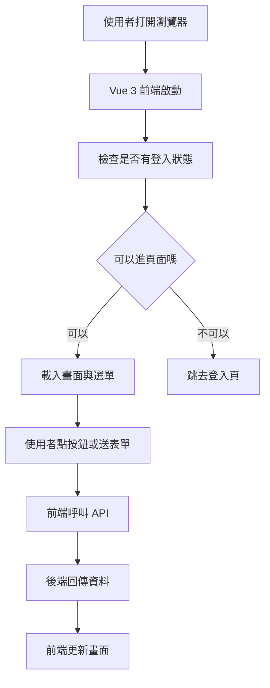

你可以先記住這句話：

> **前端的責任，是把使用者動作翻譯成 API 請求。**

---

## 二、前端專案是怎麼啟動的？

前端專案不是一打開就有畫面，通常會先經過一個入口檔案。  
在這個專案裡，最核心的入口是 [`src/main.js`](fpg-v3/src/main.js)。

它做的事情很像「把店開門前的準備工作做完」：

- 建立 Vue 應用
- 載入路由
- 載入狀態管理
- 載入國際化
- 載入元件
- 設定全域方法與全域元件
- 掛上權限控制
- 最後把畫面掛到頁面上

你可以用一句話理解它：

> **`main.js` 是前端的總開關。**

---

### 1. 建立 Vue 應用

先看最基本的部分：

```javascript
import { createApp } from 'vue'
import App from './App'

const app = createApp(App)
```

這段的意思是：

- 從 Vue 建立一個應用
- 以 `App` 作為整個網站的根元件

你可以把 `App` 想成整棟房子的主結構，其他頁面和元件都會圍繞它展開。

---

### 2. 掛上路由與狀態

再看這種寫法：

```javascript
app.use(router)
app.use(store)
app.use(i18n)
```

意思是：

- `router` 負責頁面切換
- `store` 負責共用狀態
- `i18n` 負責多語系

這就像是：

- 路由＝樓層導覽圖
- 狀態管理＝全店共用資訊板
- 多語系＝不同語言版本的菜單

---

### 3. 掛上全域方法與元件

你會看到類似這樣的設定：

```javascript
app.config.globalProperties.parseTime = parseTime
app.component('Pagination', Pagination)
```

意思是：

- `parseTime` 這種工具可以全站共用
- `Pagination` 這種分頁元件也能全站重複使用

這樣做的好處是：

- 少寫重複程式
- 每個頁面都能用同一套工具
- 畫面風格比較一致

---

## 三、開發時怎麼跑起來？

前端專案的開發設定在 [`fpg-v3/vite.config.js`](fpg-v3/vite.config.js) 與 [`fpg-v3/playwright.config.ts`](fpg-v3/playwright.config.ts)。

你現在不需要死背設定，只要知道它們主要在做三件事：

1. 設定開發伺服器
2. 設定前端的基底路徑
3. 設定 API 代理轉發

---

### 1. 開發伺服器與基底路徑

在 [`vite.config.js`](fpg-v3/vite.config.js) 裡，有一段很重要的概念：

```javascript
base: VITE_APP_ENV === 'production' ? '/vcpseos/' : '/vcpseosTest/'
```

意思是：

- 正式環境和測試環境使用不同的網站根路徑
- 這樣部署時不容易混淆

你可以把它想成：

> 正式店面和試營運店面，門牌不一樣。

---

### 2. API 代理轉發

同一個設定檔裡，還有這段概念：

```javascript
proxy: {
  '/dev-api': {
    target: 'http://localhost:8090',
    rewrite: (p) => p.replace(/^\/dev-api/, '')
  }
}
```

意思是：

- 前端先呼叫 `/dev-api`
- 開發伺服器幫你轉送到後端 `8090`
- 讓前端看起來像是在同網域呼叫

這樣的好處是：

- 開發時不用一直處理跨域問題
- 前後端分開開發更方便

你可以把它想成：

> 前台先把單子交給內部轉接員，再由轉接員送到廚房。

---

## 四、路由是怎麼控制頁面的？

路由就是「網址對應到哪個畫面」。  
這個專案在 [`src/permission.js`](fpg-v3/src/permission.js) 裡做了很重要的權限與路由控制。

你可以把路由理解成：

> **每個網址都像一扇門，路由決定你能不能進。**

---

### 1. 沒有登入時，先去登入頁

當使用者沒有 token 時，系統會先檢查目前要去的頁面是不是白名單。  
如果不是，就會導去登入頁。

概念像這樣：

```javascript
if (getToken()) {
  next()
} else {
  next('/login')
}
```

這段的意思是：

- 有登入憑證就可以繼續
- 沒有登入憑證就先去登入頁

你可以把 token 想成：

> 進門的會員卡。

---

### 2. 有登入時，還要看權限

有 token 不代表你能看所有頁面。  
系統還會載入你的角色與可訪問路由。

`src/permission.js` 裡的流程大致是：

- 先抓使用者資訊
- 再根據角色產生可用路由
- 動態把可進入的頁面加到路由表

這樣做的好處是：

- 不同角色看到的功能不同
- 不能亂進別人的功能頁

這很像公司門禁：

> 你有工牌，不代表你能進每一層樓；  
> 你還要看部門與權限。

---

### 3. 動態加入路由

這段概念很重要：

```javascript
router.addRoute(route)
```

意思是：

- 系統不是一開始就把所有功能頁都放好
- 而是登入後，根據權限再把能看的頁面加進來

這樣的設計更安全，也更靈活。

---

## 五、前端怎麼呼叫後端 API？

前端的 API 都放在 `src/api` 底下。  
這是整個章節最重要的地方。

你可以先把 `src/api` 想成：

> **前端和後端之間的「聯絡簿」。**

每一個檔案通常對應一個功能模組，例如：

- `src/api/login.js`：登入相關
- `src/api/menu.js`：路由與選單相關
- `src/api/f/faa3.js`：假日建檔
- `src/api/f/fab2.js`：經辦確認
- `src/api/a/eoa1.js`：承攬廠商
- `src/api/q/qaa1.js`：欄位對照
- `src/api/sd/sdaa.js`：關鍵字建檔

---

## 六、最基本的 API 寫法長什麼樣？

幾乎每一個 API 檔都長得很像。  
先看一個很簡單的例子：

```javascript
import request from '@/utils/request'

export function getRouters() {
  return request({ url: '/getRouters', method: 'get' })
}
```

這段的意思是：

- 使用共用的 `request`
- 發送 `GET /getRouters`
- 把結果回傳給呼叫者

你可以把它想成：

> 前端先寫好「這個功能要去哪裡送單」，  
> 真正送出的動作交給共用的請求工具處理。

---

## 七、登入頁怎麼對接？

登入相關的 API 在 [`src/api/login.js`](fpg-v3/src/api/login.js)。

這個檔案有幾個常見功能：

- 登入
- 登出
- 取得使用者資訊
- 取得驗證碼
- 變更語系
- 取得公告

---

### 1. 登入 API

```javascript
export function login(username, password, code, uuid) {
  return request({
    url: '/login',
    headers: { isToken: false },
    method: 'post',
    data: { username, password, code, uuid }
  })
}
```

這段的意思是：

- 把帳號、密碼、驗證碼、驗證碼編號一起送給後端
- 因為還沒登入，所以這支 API 不需要 token

如果使用者輸入：

- 帳號：`demo`
- 密碼：`123456`
- 驗證碼：`abcd`
- `uuid`：驗證碼識別碼

後端就會檢查這些資料是否正確。  
如果成功，就回傳登入成功與 token。

---

### 2. 取得驗證碼

```javascript
export function getCodeImg() {
  return request({
    url: '/captchaImage',
    headers: { isToken: false },
    method: 'get'
  })
}
```

這段的意思是：

- 登入頁需要先抓驗證碼圖片
- 因為還沒登入，所以也不需要 token

你可以把它想成：

> 先拿一張「進門前的小考題」，確認不是機器人。

---

### 3. 取得使用者資訊

```javascript
export function getInfo() {
  return request({
    url: '/getInfo',
    method: 'get'
  })
}
```

這支 API 會在登入後使用。  
它的用途是：

- 取得你的角色
- 取得你的權限
- 取得你的基本資訊

這些資訊會影響你能看到哪些選單與頁面。

---

## 八、列表頁怎麼對接？

列表頁是最常見的畫面類型。  
例如假日建檔、欄位對照、廠商資料，很多都會有「查詢列表」、「新增」、「修改」、「刪除」。

這種 API 通常都長得很像。  
以 [`src/api/f/faa3.js`](fpg-v3/src/api/f/faa3.js) 為例：

```javascript
export function listFaa3(query) {
  return request({ url: '/f/faa3/list', method: 'get', params: query })
}
```

這段的意思是：

- 從 `/f/faa3/list` 查詢資料
- 查詢條件放在 `query`
- 後端回傳一批列表資料

如果 `query` 裡有：

- 年份
- 月份
- 假日名稱

那前端就會把這些條件送出去，後端再回傳符合條件的資料。

---

### 1. 查單筆資料

```javascript
export function getFaa3(xuid) {
  return request({ url: '/f/faa3/' + xuid, method: 'get' })
}
```

這段的意思是：

- 用某筆資料的識別碼查詳細內容
- 常用在「編輯前先打開資料」或「看明細」

---

### 2. 新增資料

```javascript
export function addFaa3(data) {
  return request({ url: '/f/faa3', method: 'post', data: data })
}
```

這段的意思是：

- 把表單資料送到後端
- 請後端新增一筆假日資料

---

### 3. 修改資料

```javascript
export function updateFaa3(data) {
  return request({ url: '/f/faa3', method: 'put', data: data })
}
```

這段的意思是：

- 編輯完後把新的資料送回去
- 請後端更新原本那筆資料

---

### 4. 刪除資料

```javascript
export function delFaa3(xuid) {
  return request({ url: '/f/faa3/' + xuid, method: 'delete' })
}
```

這段的意思是：

- 用識別碼刪掉某筆資料
- 通常會搭配刪除確認視窗

---

## 九、前端頁面通常怎麼用這些 API？

你可以把一個頁面想成這樣的流程：

1. 進入頁面時先載入列表
2. 使用者輸入查詢條件
3. 按下查詢後重新抓資料
4. 按下新增打開表單
5. 送出表單時呼叫新增或修改 API
6. 按下刪除時呼叫刪除 API

下面用一個非常簡單的範例看概念：

```javascript
import { listFaa3 } from '@/api/f/faa3'

listFaa3({ year: 2026 }).then(res => {
  console.log(res)
})
```

這段的意思是：

- 呼叫假日列表 API
- 查詢條件是年份 2026
- 拿到結果後印出來

在實際畫面中，通常不會只是 `console.log`，而是會把資料放進表格。

---

## 十、表單送出時的概念是什麼？

表單通常會先做兩件事：

1. 驗證資料有沒有填對
2. 決定要呼叫新增還是修改 API

例如：

```javascript
if (form.id) {
  updateFaa3(form)
} else {
  addFaa3(form)
}
```

這段的意思是：

- 如果有 `id`，表示這是一筆已存在資料的修改
- 如果沒有 `id`，表示這是新增

這個判斷在很多頁面都會出現。

你可以把它想成：

> 有訂單編號＝改舊單；沒有訂單編號＝開新單。

---

## 十一、這個專案裡有哪些常見功能模組？

下面挑幾個來看，幫你建立整體印象。

---

### 1. 參考資料與欄位對照

相關檔案：

- [`src/api/q/qaa1.js`](fpg-v3/src/api/q/qaa1.js)
- [`src/api/q/qaa2.js`](fpg-v3/src/api/q/qaa2.js)

這類頁面通常是：

- 管理欄位對照資料
- 管理畫面顯示欄位
- 支援查詢、新增、修改、刪除、匯出

這就像：

> 系統字典表，讓前端知道每個欄位要怎麼顯示。

---

### 2. 多語係與關鍵字

相關檔案：

- [`src/api/sd/sdaa.js`](fpg-v3/src/api/sd/sdaa.js)
- [`src/api/sd/sdab.js`](fpg-v3/src/api/sd/sdab.js)
- [`src/api/sd/sdad.js`](fpg-v3/src/api/sd/sdad.js)

這類頁面通常是：

- 管理顯示文字
- 管理翻譯內容
- 管理關鍵字對照

你可以把它想成：

> 同一句話，在不同語言中有不同版本。

---

### 3. 單據參數與假日設定

相關檔案：

- [`src/api/f/faa1.js`](fpg-v3/src/api/f/faa1.js)
- [`src/api/f/faa2.js`](fpg-v3/src/api/f/faa2.js)
- [`src/api/f/faa3.js`](fpg-v3/src/api/f/faa3.js)
- [`src/api/f/faa4.js`](fpg-v3/src/api/f/faa4.js)

這些通常是主資料維護類型的頁面。  
例如：

- 單據金額
- 寬限天數
- 假日資料
- 通知名單

你可以把它想成：

> 先把規則和名單建好，後面的業務流程才有東西可用。

---

### 4. 廠商與報到資料

相關檔案：

- [`src/api/a/eoa1.js`](fpg-v3/src/api/a/eoa1.js)
- [`src/api/a/eoa3.js`](fpg-v3/src/api/a/eoa3.js)
- [`src/api/a/eoa4.js`](fpg-v3/src/api/a/eoa4.js)

這類頁面通常是：

- 建立廠商資料
- 維護人員與車輛
- 管理證照與複訓資料

這就像：

> 一家工廠要先確認廠商資料完整，後續流程才不會卡住。

---

### 5. 核簽與確認流程

相關檔案：

- [`src/api/f/fab2.js`](fpg-v3/src/api/f/fab2.js)
- [`src/api/f/fab3.js`](fpg-v3/src/api/f/fab3.js)
- [`src/api/f/fab4.js`](fpg-v3/src/api/f/fab4.js)

這些 API 跟流程動作有關，例如：

- 經辦確認
- 課長呈核
- 廠長核准
- 退回
- 查核簽歷程

這就像：

> 文件要一關一關蓋章，不能直接跳到最後一步。

---

## 十二、前端按鈕按下去後，為什麼會呼叫到某個後端功能？

這是很多新手最想知道的問題。

我們用最簡單的方式拆解：

1. 畫面上有一個按鈕
2. 按鈕綁定一個方法
3. 方法裡呼叫某個 API
4. API URL 對應到後端控制器
5. 控制器再呼叫服務層處理資料

可以用這張圖理解：

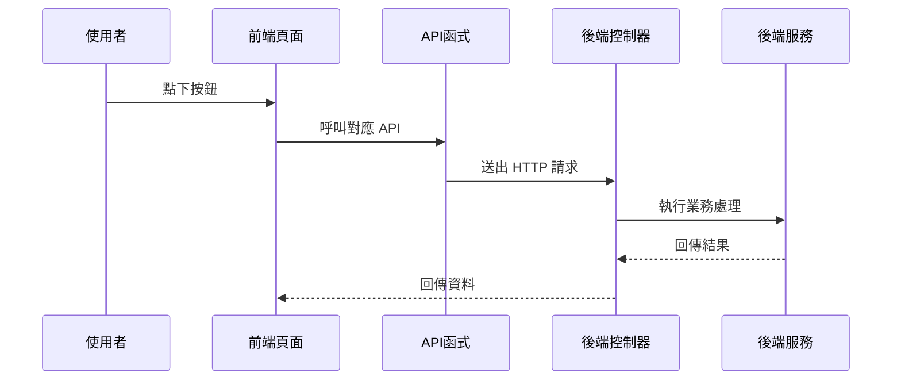

你可以把它想成：

> 你按的是「畫面上的按鈕」，  
> 真正動作是「前端方法 → API → 後端控制器」。

---

## 十三、來看一個很小的完整例子

假設你要做「查詢假日列表」。

### 第一步：前端先引用 API

```javascript
import { listFaa3 } from '@/api/f/faa3'
```

這表示你先把「查詢假日」這支 API 拿進來。

---

### 第二步：按查詢時呼叫它

```javascript
function handleQuery() {
  listFaa3(searchForm).then(res => {
    tableData.value = res.rows
  })
}
```

這表示：

- 使用搜尋表單作為查詢條件
- 把回來的資料放進表格

---

### 第三步：畫面更新

這時候使用者就會看到新的查詢結果。  
整個過程像是：

> 你把問題交給櫃台，櫃台幫你去查，  
> 查完再把結果端回來。

---

## 十四、這一章最常見的幾個名詞，你要先知道

### 1. 路由

網址與畫面的對應關係。  
簡單說，就是「這個網址要開哪一頁」。

---

### 2. 權限控制

不是每個人都能看每個功能。  
要看你的登入身分、角色、權限。

---

### 3. API

前端和後端溝通的接口。  
前端把需求送出去，後端把結果回來。

---

### 4. 請求

前端送出的動作。  
例如查詢、新增、修改、刪除。

---

### 5. 回應

後端回來的結果。  
通常會包含成功失敗、訊息、資料。

---

## 十五、如果你是新手，最該先記住什麼？

你不需要一開始就背完所有檔案。  
先記住這三件事就很好：

1. **畫面上的每個操作，通常都對應一支 API**
2. **`src/api` 是前端呼叫後端的集中地方**
3. **登入後還要看路由與權限，才能決定能看到哪些功能**

只要你有這三個概念，後面看任何模組都會容易很多。

---

## 十六、本章的小地圖：前端是怎麼組織的？

你可以把整個前端想成下面這樣：

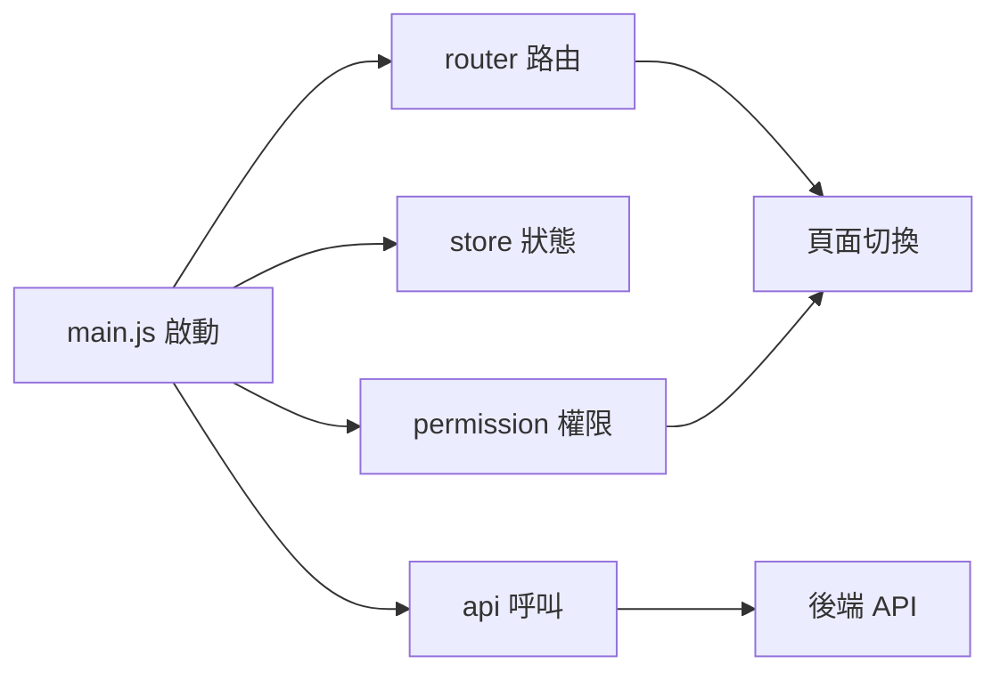

這張圖要表達的是：

- `main.js` 是入口
- `router` 負責頁面
- `permission` 負責能不能看
- `api` 負責資料溝通

---

## 十七、和下一章的銜接

現在你已經知道：

- 前端畫面如何啟動
- 路由與權限怎麼控制頁面
- `src/api` 裡的函式怎麼對應後端
- 按鈕、查詢、表單如何把資料送出去

接下來，你就可以進一步理解「資料與欄位是怎麼被管理的」，也就是下一章的主題：  
[參考資料與欄位對照平台](03_參考資料與欄位對照平台_.md)

---

## 本章總結

這一章我們用最簡單的方式認識了前端介面與 API 對接：

- `main.js` 負責啟動前端
- `vite.config.js` 負責開發環境與代理設定
- `permission.js` 負責登入與權限控制
- `src/api` 底下的檔案負責定義每個功能的 API
- 畫面上的查詢、新增、修改、刪除，其實都是呼叫對應的 API

如果你現在還沒有完全記住所有細節，沒關係。  
新手最重要的是先建立一個清楚的流程感：

> **使用者操作畫面 → 前端呼叫 API → 後端處理資料 → 前端更新結果**

只要這條路徑懂了，後面很多章節都會越看越順。


# Chapter 3：參考資料與欄位對照平台

接續上一章的 [前端介面與 API 對接](02_前端介面與_api_對接_.md)，你已經知道「畫面怎麼把資料送到後端」。  
這一章我們要往更深入一層，看一個很重要、但常被新手忽略的主題：

> **系統裡的欄位名稱、顯示名稱、資料型態、顯示格式，應該由誰來管理？**

如果沒有這一層，畫面就很容易出現：

- 同一個欄位，在不同頁面叫法不一樣
- 英文欄位名和中文顯示名對不起來
- 報表欄位寫死，改版時每個地方都要重改
- 不同角色、不同頁籤的欄位顯示邏輯分散在各處

所以這一章的核心，就是學會理解：

> **參考資料與欄位對照平台，就像系統的字典館與索引卡。**

你不用直接背每個欄位是什麼，  
而是先查字典、查對照表，讓系統知道「這個欄位是誰、要怎麼顯示、屬於哪一類」。

---

## 本章要解決的中心情境

先想像一個很實際的例子：

> 你要在畫面上顯示「使用者資料列表」，但這個列表有些欄位來自資料庫原始欄位，有些欄位要顯示中文名稱，有些欄位還要根據角色、頁籤、顯示區域來決定要不要出現。

如果你把這些規則都寫死在畫面裡，之後只要欄位一變，前端、後端、報表、匯出都要一起改。  
這會很痛苦。

所以這個平台的作用，就是把這些資訊集中起來：

- 系統欄位代碼
- 原始欄位名稱
- 中文顯示名稱
- 英文顯示名稱
- 資料型態
- 顯示格式
- 欄位分類
- 角色 / 頁籤 / 顯示區域 / 顯示順序
- 生效註記

簡單說：

> **它不是在存真正的業務資料，而是在存「資料怎麼被理解與顯示」的規則。**

---

## 先用白話認識這個平台

你可以把它想像成圖書館的索引卡：

- 你不一定一開始就去翻整本書
- 你先查索引卡
- 看書名、分類、位置、標籤
- 再去找真正的內容

這個平台也是一樣：

- 不直接處理業務內容
- 而是先整理欄位資訊
- 讓別的模組查得到正確欄位名稱與顯示方式

---

## 這一章會看到哪些資料表概念？

從程式碼來看，這一章主要有兩種資料：

### 1. `VGetcol`：欄位視圖

檔案位置：

- [`fpg-vcpseos/src/main/java/com/fpg/system/domain/VGetcol.java`](fpg-vcpseos/src/main/java/com/fpg/system/domain/VGetcol.java)
- [`fpg-vcpseos/src/main/java/com/fpg/system/controller/VGetcolController.java`](fpg-vcpseos/src/main/java/com/fpg/system/controller/VGetcolController.java)

它看起來像一個「欄位字典視圖」，主要整理：

- 欄位代號
- 欄位名稱
- 類型
- 長度
- 精度
- 小數位數

這很像是資料庫欄位的說明卡。

---

### 2. `Txdqaa11`：資料欄位對照建檔

檔案位置：

- [`fpg-vcpseos/src/main/java/com/fpg/q/domain/Txdqaa11.java`](fpg-vcpseos/src/main/java/com/fpg/q/domain/Txdqaa11.java)
- [`fpg-vcpseos/src/main/java/com/fpg/q/controller/Txdqaa11Controller.java`](fpg-vcpseos/src/main/java/com/fpg/q/controller/Txdqaa11Controller.java)

它是更進一步的對照建檔，會記錄：

- 系統欄位代碼
- 來源系統
- 原始欄位名稱
- 中文顯示名稱
- 英文顯示名稱
- 資料型態
- 顯示格式化
- 欄位分類

這表示它不只是「知道欄位叫什麼」，還知道「欄位要怎麼被解釋」。

---

### 3. `Txdqaa21`：盤體欄位顯示建檔

檔案位置：

- [`fpg-vcpseos/src/main/java/com/fpg/q/domain/Txdqaa21.java`](fpg-vcpseos/src/main/java/com/fpg/q/domain/Txdqaa21.java)
- [`fpg-vcpseos/src/main/java/com/fpg/q/controller/Txdqaa21Controller.java`](fpg-vcpseos/src/main/java/com/fpg/q/controller/Txdqaa21Controller.java)

這一份更偏向「畫面顯示規則」，會記錄：

- 角色類型
- 頁籤類型
- 顯示區域
- 顯示順序
- 系統欄位代碼
- 生效註記

它很像「這個人、在這個頁籤、這個區塊，應該看到哪些欄位，順序怎麼排」。

---

## 先抓住最重要的一句話

如果你今天只想記一句話，那就是：

> **`VGetcol` 管欄位字典，`Txdqaa11` 管欄位對照，`Txdqaa21` 管畫面顯示規則。**

這三個一起組成一個「參考資料與欄位對照平台」。

---

## 一、先看整體架構：它像一套字典系統

下面這張圖可以幫助你先建立整體感覺：

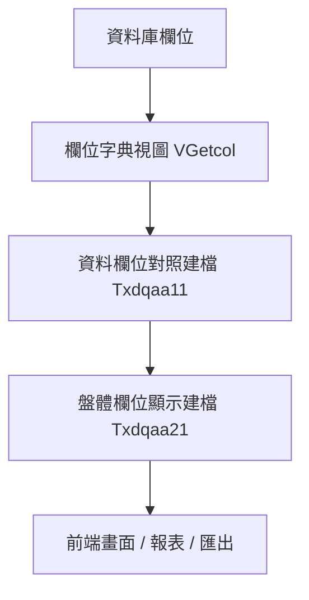

你可以這樣理解：

- `VGetcol`：先知道欄位原始資訊
- `Txdqaa11`：再把欄位對應成系統想要的名字
- `Txdqaa21`：最後決定畫面怎麼顯示

這很像：

- 第一層：書的索引
- 第二層：書的標題翻譯
- 第三層：書架擺放方式

---

## 二、`VGetcol` 是什麼？

先看 [`VGetcol`](fpg-vcpseos/src/main/java/com/fpg/system/domain/VGetcol.java)。

它的欄位很簡單：

- `columnName`：欄位代號
- `comments`：欄位名稱
- `dataType`：類型
- `dataLength`：長度
- `dataPrecision`：精度
- `dataScale`：小數位數

你可以把它想成「資料庫欄位的說明卡」。

---

### 1. `VGetcol` 的用途

當你要查某個欄位的基本資訊時，它可以告訴你：

- 這欄叫什麼
- 是字串還是數字
- 長度多少
- 小數點有幾位

這些資訊對於：

- 報表
- 匯出
- 欄位驗證
- 動態畫面

都很有幫助。

---

### 2. 簡單看欄位長相

```java
private String columnName;
private String comments;
private String dataType;
```

這三個欄位代表：

- 欄位代號
- 欄位名稱
- 資料型態

很像你在查字典時，先看到：

- 單字本身
- 中文解釋
- 詞性

---

## 三、`VGetcol` 的資料怎麼被查出來？

它有對應的 Mapper、Service、Controller：

- [`VGetcolMapper`](fpg-vcpseos/src/main/java/com/fpg/system/mapper/VGetcolMapper.java)
- [`IVGetcolService`](fpg-vcpseos/src/main/java/com/fpg/system/service/IVGetcolService.java)
- [`VGetcolServiceImpl`](fpg-vcpseos/src/main/java/com/fpg/system/service/impl/VGetcolServiceImpl.java)
- [`VGetcolController`](fpg-vcpseos/src/main/java/com/fpg/system/controller/VGetcolController.java)

這就是標準的「控制器 → 服務 → 資料存取」三層結構。

---

### `VGetcolController` 在做什麼？

它提供這些常見功能：

- 查詢列表
- 匯出 Excel
- 查單筆詳細
- 新增
- 修改
- 刪除

你可以把它想成一個「欄位字典管理櫃台」。

---

### 查詢列表的概念

```java
@PreAuthorize("@ss.hasPermi('system:getcol:list')")
@GetMapping("/list")
public TableDataInfo list(VGetcol vGetcol)
```

這段表示：

- 只有有權限的人能查
- 送出 `GET /system/getcol/list`
- 系統根據條件回傳列表

如果你輸入查詢條件，後端就會回傳符合條件的欄位資料。

---

### 匯出 Excel 的概念

```java
ExcelUtil<VGetcol> util = new ExcelUtil<VGetcol>(VGetcol.class);
util.exportExcel(response, list, "欄位視圖数据");
```

這表示：

- 把查到的欄位資料匯出成 Excel
- 每一列就是一筆欄位資訊

這對管理者很實用，因為可以直接把欄位清單帶走檢查。

---

## 四、`Txdqaa11`：資料欄位對照建檔

接下來看更重要的 [`Txdqaa11`](fpg-vcpseos/src/main/java/com/fpg/q/domain/Txdqaa11.java)。

它比 `VGetcol` 更像「正式建檔資料」，因為它不只看欄位本身，還看：

- 哪個系統來的
- 原始欄位怎麼叫
- 中文與英文顯示怎麼設
- 欄位分類是什麼
- 顯示格式要怎麼轉

---

### 1. 這個資料物件在記錄什麼？

你可以把它想成一張「欄位翻譯卡」。

例如，某個欄位在來源系統裡叫：

- `AMT`

但在前端要顯示成：

- 中文：金額
- 英文：Amount

而且它還可能是：

- 數字型態
- 顯示時要加千分位
- 屬於金額分類

這些資訊就很適合放在 `Txdqaa11`。

---

### 2. 重要欄位看一眼就懂

```java
private String sysfldcode;
private String srcsys;
private String orifldname;
```

這三個欄位分別是：

- 系統欄位代碼
- 來源系統
- 原始欄位名稱

意思就是：

> 「這個欄位從哪裡來、原本叫什麼、在系統中怎麼識別。」

---

### 3. 顯示名稱與格式

```java
private String chndispname;
private String engdispname;
private String dispformat;
```

這三個欄位分別是：

- 中文顯示名稱
- 英文顯示名稱
- 顯示格式化

這非常重要，因為同一個欄位可以在不同畫面有不同的呈現方式。

例如：

- 日期欄位可以顯示成 `2026-04-21`
- 金額欄位可以顯示成 `1,000,000`
- 狀態欄位可以顯示成 `啟用` 或 `停用`

---

## 五、`Txdqaa11` 的服務層在保護什麼？

看 [`Txdqaa11ServiceImpl`](fpg-vcpseos/src/main/java/com/fpg/q/service/impl/Txdqaa11ServiceImpl.java)。

這一層不只是單純轉呼叫 Mapper，  
它還會做資料檢查。

---

### 1. 為什麼新增前要檢查欄位代碼？

這段很重要：

```java
String normalizedSysfldcode = normalizeSysfldcode(txdqaa11.getSysfldcode());
if (!isValidSysfldcode(normalizedSysfldcode))
{
    throw new ServiceException("系統欄位代碼需為20碼內英數字");
}
```

意思是：

- 先把欄位代碼整理成標準格式
- 再檢查是不是合法
- 不合法就丟出錯誤

這就像你在建檔前先檢查身分證號格式，不對就不能送出。

---

### 2. 為什麼還要檢查重複？

```java
if (txdqaa11Mapper.selectTxdqaa11ByUk(txdqaa11) != null)
{
    throw new ServiceException("新增失敗，系統欄位代碼「" + normalizedSysfldcode + "」已存在");
}
```

意思是：

- 同一個系統欄位代碼不能重複建檔
- 避免資料混亂

你可以把它想成：

> 書架上不能有兩本一模一樣索引碼的書，否則找書會亂掉。

---

### 3. 為什麼修改時不能改鍵值欄位？

```java
if (StringUtils.isEmpty(dbData.getSysfldcode()) || !dbData.getSysfldcode().equalsIgnoreCase(normalizedSysfldcode))
{
    throw new ServiceException("系統欄位代碼為鍵值欄位，建檔後不可修改");
}
```

這表示：

- 系統欄位代碼是關鍵識別碼
- 建檔後不能亂改
- 否則對照關係會壞掉

這就像：

> 你的身分證號不能改，因為很多資料都靠它認人。

---

## 六、`Txdqaa11` 的流程長什麼樣子？

下面用一張很簡單的流程圖看新增時發生什麼事：

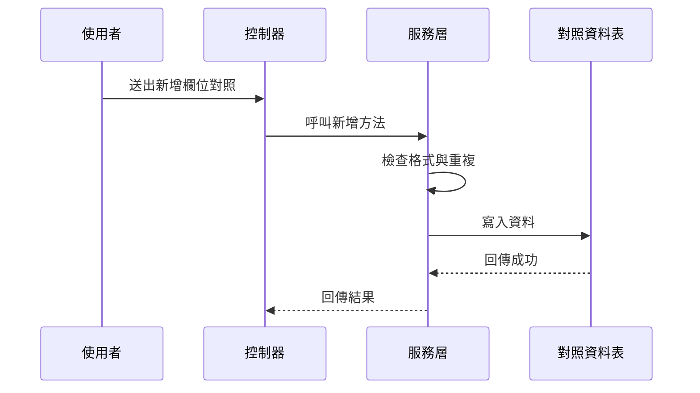

你可以這樣理解：

- 使用者送出資料
- 控制器收資料
- 服務層先做規則檢查
- 通過後才寫資料庫

這樣比較安全。

---

## 七、`Txdqaa21`：盤體欄位顯示建檔

接下來看 [`Txdqaa21`](fpg-vcpseos/src/main/java/com/fpg/q/domain/Txdqaa21.java)。

這一份資料更偏向「畫面怎麼顯示」。

它主要記錄：

- 角色類型
- 頁籤類型
- 顯示區域
- 顯示順序
- 系統欄位代碼
- 生效註記

你可以把它想成：

> 同一套資料，給不同角色看到的欄位排列順序不一樣。

---

### 1. 角色與頁籤的重要性

```java
private String roletype;
private String tabtype;
private String disparea;
```

這三個欄位代表：

- 哪一種角色
- 哪一個頁籤
- 顯示在哪個區域

例如：

- 經辦看到一套欄位
- 審核者看到另一套欄位
- 同一欄位在不同頁籤也可能顯示位置不同

---

### 2. 顯示順序很重要

```java
private Long dispseq;
private String sysfldcode;
private String activeflg;
```

這些欄位代表：

- 第幾個顯示
- 要顯示哪個欄位
- 是否生效

就像排隊一樣，  
就算都是同一批資料，順序不同，使用者感受就不同。

---

## 八、`Txdqaa21ServiceImpl` 在幫你做哪些檢查？

看 [`Txdqaa21ServiceImpl`](fpg-vcpseos/src/main/java/com/fpg/q/service/impl/Txdqaa21ServiceImpl.java)。

它的重點不只是存資料，還會檢查「顯示區域」是否合理。

---

### 1. 當頁籤類型是特定值時，顯示區域不能空白

```java
if ("MAINT".equals(txdqaa21.getTabtype()) || "CHECK".equals(txdqaa21.getTabtype()))
{
    if (StringUtils.isBlank(txdqaa21.getDisparea()))
    {
        throw new ServiceException("MAINT/CHECK tab type requires disparea");
    }
}
```

這段的意思是：

- 如果頁籤類型是 `MAINT` 或 `CHECK`
- 就必須填顯示區域
- 不然就丟錯

這就像：

> 某些房間一定要填樓層與位置，不然找不到。

---

### 2. 其他頁籤時，顯示區域會被清空

```java
else
{
    txdqaa21.setDisparea(null);
}
```

這表示：

- 不是特定頁籤時
- 顯示區域不需要保留
- 系統自動幫你清掉

這種做法可以避免資料混亂。

---

## 九、`Txdqaa21Controller` 如何避免重複資料？

看 [`Txdqaa21Controller`](fpg-vcpseos/src/main/java/com/fpg/q/controller/Txdqaa21Controller.java)。

它在新增前會先查一次是否已存在同樣的組合：

- 角色類型
- 頁籤類型
- 顯示區域
- 系統欄位代碼

如果重複，就直接回傳錯誤：

```java
if (dbTxdqaa21 != null)
{
    return error("重複資料，請確認角色/頁籤/顯示區域/系統欄位代碼組合");
}
```

這很重要，因為欄位顯示規則不能重複，不然畫面會不知道要套哪一筆。

---

## 十、三個資料物件怎麼分工？

你可以這樣記：

| 名稱 | 作用 | 類比 |
|---|---|---|
| `VGetcol` | 看欄位基本資訊 | 字典索引卡 |
| `Txdqaa11` | 管欄位對照與顯示名稱 | 翻譯字典 |
| `Txdqaa21` | 管角色與頁籤的顯示規則 | 座位表 |

---

## 十一、實際使用時，怎麼幫助前端？

前端常常會遇到這些問題：

- 欄位名稱從哪裡來？
- 表格標題要顯示中文還是英文？
- 某個角色看到哪些欄位？
- 某些欄位要不要顯示？
- 顯示順序如何調整？

這些問題如果都硬寫在前端，會很難維護。  
但如果資料都先放在這個平台，前端就可以先查對照表再畫畫面。

---

### 一個很簡單的想像

假設前端要顯示一個表格：

- 欄位 1：系統欄位代碼
- 欄位 2：中文顯示名稱
- 欄位 3：英文顯示名稱
- 欄位 4：顯示格式

如果管理者把某個欄位名稱改了，  
前端不用重新寫死，只要重新查這個平台的資料就行。

這就像：

> 不是每張地圖都重畫道路，而是更新路名資料。

---

## 十二、這個平台和上一章有什麼關係？

上一章我們講的是前端怎麼呼叫 API。  
這一章則是告訴你：

> **API 之後拿到的欄位資訊，常常不是直接寫死，而是來自這些對照資料。**

所以它們是上下相扣的：

- 前端負責發出請求
- 參考資料與欄位對照平台負責提供正確欄位規則
- 後端業務模組負責依規則運作

---

## 十三、你可以先記住的使用步驟

如果今天你要理解這個平台，可以用下面這個順序：

1. 先看 `VGetcol`，知道欄位基本資訊
2. 再看 `Txdqaa11`，知道欄位怎麼對照與命名
3. 再看 `Txdqaa21`，知道欄位在畫面怎麼顯示
4. 最後看 Controller、Service、Mapper，了解資料怎麼被管理

---

## 十四、三層式結構怎麼串起來？

這一章的程式碼很適合用「三層式」理解：

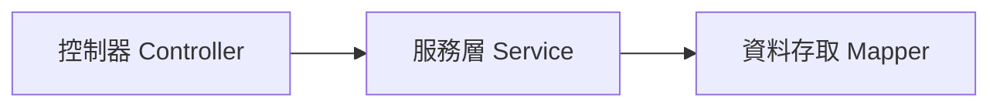

### 你可以這樣想：

- `Controller`：接收前端請求
- `Service`：檢查規則、處理邏輯
- `Mapper`：真正跟資料庫溝通

例如：

- 使用者按「新增」
- `Controller` 收到表單
- `Service` 檢查欄位是否合法、是否重複
- `Mapper` 寫入資料庫

---

## 十五、看一個最小的新增概念

下面是一個非常簡化的概念示意：

```java
Txdqaa11 data = new Txdqaa11();
data.setSysfldcode("AMT");
data.setChndispname("金額");
service.insertTxdqaa11(data);
```

這段的意思是：

- 建立一筆欄位對照資料
- 設定系統欄位代碼
- 設定中文顯示名稱
- 送進服務層新增

如果資料正確，系統就會把它存起來。  
如果格式錯誤或重複，就會回傳錯誤。

---

## 十六、再看一個很小的查詢概念

```java
Txdqaa21 query = new Txdqaa21();
query.setRoletype("A");
query.setTabtype("MAINT");
service.selectTxdqaa21List(query);
```

這段的意思是：

- 查某個角色、某個頁籤的欄位顯示規則
- 後端會回傳符合條件的顯示設定

這很像在問系統：

> 「這位使用者在這個頁籤裡，應該看到什麼？」

---

## 十七、初學者最容易搞混的地方

### 1. `VGetcol` 不是業務資料

它只是欄位資訊，不是某個功能的內容資料。

---

### 2. `Txdqaa11` 與 `Txdqaa21` 分工不同

- `Txdqaa11` 偏向欄位本身的對照與命名
- `Txdqaa21` 偏向不同角色與頁籤的顯示規則

---

### 3. `Service` 不只是轉呼叫

它還會做格式檢查、重複檢查、鍵值保護，這些都很重要。

---

### 4. `ExcelUtil` 只是輸出工具，不是資料來源

它負責把資料匯出成 Excel，資料還是來自這些對照表。

---

## 十八、本章小結

這一章我們認識了「參考資料與欄位對照平台」的核心概念：

- `VGetcol`：管理欄位字典資訊
- `Txdqaa11`：管理資料欄位對照與顯示名稱
- `Txdqaa21`：管理角色、頁籤與顯示區域的欄位規則
- `Controller`、`Service`、`Mapper` 三層結構如何合作
- 服務層如何做格式檢查、重複檢查、欄位保護

你可以把這一章記成一句話：

> **這個平台負責先把欄位的名字、型態、顯示方式、對照關係整理好，讓別的模組能安心查詢與顯示。**

---

下一章我們會接著看更貼近顯示層的內容：  
[多語係與關鍵字字典管理](04_多語係與關鍵字字典管理_.md)


# Chapter 4：多語係與關鍵字字典管理

接續上一章的 [參考資料與欄位對照平台](03_參考資料與欄位對照平台_.md)，我們已經知道系統如何管理「欄位名稱」與「顯示規則」。  
這一章要再往前走一步，來看一個更貼近畫面與文案的主題：

> **同一個功能，在不同語言、不同專案、不同畫面裡，怎麼維持一致又好管理？**

你可以先把這一章想成：

> **系統的「翻譯字典」加上「詞彙管理中心」。**

它不是只有翻譯，還包含：

- 關鍵字唯一性
- 中文關鍵字對照
- 專案代碼
- 多語係內容
- 菜單名稱轉換
- 匯出成前端與 Java 可用的語言檔

---

## 這一章要先解決的中心情境

先想像一個最常見的情況：

你正在做一個系統畫面，上面有很多按鈕與標籤，例如：

- 新增
- 修改
- 刪除
- 查詢
- 送出
- 核准

如果這些文字都直接寫死在畫面裡，之後只要要改成：

- 簡體中文
- 繁體中文
- 英文

或是要讓不同專案共用同一組詞彙，事情就會變得很麻煩。

所以這一章的重點，就是學會理解：

> **關鍵字先建檔，中文名稱再對照，多語係再統一管理。**

這樣就能讓畫面文字、系統訊息、按鈕名稱、選單名稱都可以被集中管理。

---

## 先用最白話的方式理解

你可以把它想成一本大型詞典：

- `關鍵字`：像是詞條編號
- `關鍵字中文`：像是中文解釋
- `多語係`：像是同一詞條在不同語言下的版本
- `專案編號`：像是哪一套字典
- `類型`：像是這個詞是按鈕、標籤、訊息，還是選單

如果沒有這個平台，大家就會各寫各的：

- 前端一份
- 後端一份
- 報表一份
- 匯出檔一份

最後一定會亂掉。

---

## 這一章你會看到的核心角色

本章主要有四個資料主體：

| 名稱 | 作用 | 類比 |
|---|---|---|
| `Txdsdaa1` | 關鍵字建檔 | 詞條主檔 |
| `Txdsdab1` | 關鍵詞建檔 | 中文詞彙對照本 |
| `Txdsdac1` | 專案模組建檔 | 詞彙屬於哪個模組 |
| `Txdsdad1` | 多語係建檔 | 多語版本字典 |

其中最重要的是：

- `Txdsdaa1`：管理關鍵字與中文名稱
- `Txdsdab1`：管理關鍵詞與欄位型態、長度等資訊
- `Txdsdac1`：管理專案模組
- `Txdsdad1`：真正放多語內容

---

## 一、先看整體流程

如果把整個功能想成一間翻譯中心，流程大概是這樣：

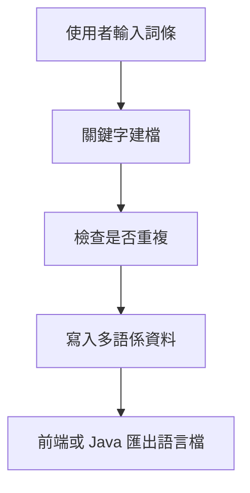

你可以先記住一句話：

> **先建關鍵字，再產生多語內容，最後再匯出給前端使用。**

---

## 二、先從最簡單的資料結構開始

### 1. `Txdsdaa1`：關鍵字建檔

檔案位置：

- [`fpg-vcpseos/src/main/java/com/fpg/sd/domain/Txdsdaa1.java`](fpg-vcpseos/src/main/java/com/fpg/sd/domain/Txdsdaa1.java)

這個類別很像最基本的詞條主檔。  
它主要欄位有：

- `keywd`：關鍵字
- `keywdc`：關鍵字中文
- `xrem`：備註
- `txemp`：異動人員
- `txdat`：異動日期

你可以把它想像成：

- `keywd`：英文代碼
- `keywdc`：中文名字
- `xrem`：補充說明

---

### 2. `Txdsdab1`：關鍵詞建檔

檔案位置：

- [`fpg-vcpseos/src/main/java/com/fpg/sd/domain/Txdsdab1.java`](fpg-vcpseos/src/main/java/com/fpg/sd/domain/Txdsdab1.java)

這個類別比上一個多一點點資訊，除了詞彙外，還包含：

- `kywrdc`：關鍵詞中文
- `kywrd`：關鍵詞
- `fldplty`：欄位型態
- `fldpll`：欄位長度
- `fldpldeci`：欄位小數
- `comt`：說明
- `pjno`：專案編號

你可以把它理解成：

> 這不只是詞彙本身，還帶有「這個詞要怎麼用」的規則。

---

### 3. `Txdsdac1`：專案模組建檔

檔案位置：

- [`fpg-vcpseos/src/main/java/com/fpg/sd/domain/Txdsdac1.java`](fpg-vcpseos/src/main/java/com/fpg/sd/domain/Txdsdac1.java)

這個類別是用來記錄專案模組資訊，例如：

- `ulaymodid`：上層模組代號
- `modid`：模組代號
- `modnm`：模組名稱
- `modclass`：模組類別
- `prgid`：程式代號

它像什麼？

> 像一本字典的章節分類表，告訴你這些詞屬於哪個區塊。

---

### 4. `Txdsdad1`：多語係建檔

檔案位置：

- [`fpg-vcpseos/src/main/java/com/fpg/sd/domain/Txdsdad1.java`](fpg-vcpseos/src/main/java/com/fpg/sd/domain/Txdsdad1.java)

這個類別是真正的多語內容主體。  
它的欄位很多，但新手先抓重點就好：

- `pjno`：專案編號
- `lngid`：訊息代號
- `type`：類型
- `strghtbdymsg`：正體訊息
- `cnmsg`：簡體訊息
- `emsg`：英文訊息
- `lngmsgone`、`lngmsgtwo`、`lngmsgthree`：其他語係欄位
- `comt`：說明

它像一個「多版本翻譯卡」。

---

## 三、先用最簡單的例子理解它怎麼用

假設你想建立一個按鈕文字：

- 關鍵字：`save`
- 中文：`儲存`
- 英文：`Save`
- 專案：`XD`
- 類型：`button`

你可以先理解成三步：

1. 先建詞條
2. 再建多語內容
3. 最後匯出給前端

---

### 1. 先建立關鍵字資料

```java
Txdsdaa1 data = new Txdsdaa1();
data.setKeywd("save");
data.setKeywdc("儲存");
```

這段的意思是：

- 建立一筆關鍵字資料
- 關鍵字是 `save`
- 中文是 `儲存`

這就像詞典裡先放一筆詞條主記錄。

---

### 2. 再建立多語係資料

```java
Txdsdad1 lang = new Txdsdad1();
lang.setLngid("SAVE");
lang.setCnmsg("儲存");
lang.setEmsg("Save");
```

這段的意思是：

- 建立一筆多語內容
- 中文是 `儲存`
- 英文是 `Save`

這樣前端切換語言時，就能顯示對應文字。

---

### 3. 最後存進系統

實際上會交給服務層與控制器處理。  
你不需要自己手動一筆一筆寫資料庫。

你只要先知道概念：

> **資料先建檔，系統再幫你轉成不同語言版本。**

---

## 四、這些模組各自負責什麼？

---

### `Txdsdaa1`：關鍵字建檔

相關檔案：

- [`Txdsdaa1Mapper`](fpg-vcpseos/src/main/java/com/fpg/sd/mapper/Txdsdaa1Mapper.java)
- [`ITxdsdaa1Service`](fpg-vcpseos/src/main/java/com/fpg/sd/service/ITxdsdaa1Service.java)
- [`Txdsdaa1ServiceImpl`](fpg-vcpseos/src/main/java/com/fpg/sd/service/impl/Txdsdaa1ServiceImpl.java)
- [`Txdsdaa1Controller`](fpg-vcpseos/src/main/java/com/fpg/sd/controller/Txdsdaa1Controller.java)

這組主要負責：

- 關鍵字查詢
- 新增
- 修改
- 刪除
- 檢查唯一性
- 翻譯查詢

---

### `Txdsdab1`：關鍵詞建檔

相關檔案：

- [`Txdsdab1Mapper`](fpg-vcpseos/src/main/java/com/fpg/sd/mapper/Txdsdab1Mapper.java)
- [`ITxdsdab1Service`](fpg-vcpseos/src/main/java/com/fpg/sd/service/ITxdsdab1Service.java)
- [`Txdsdab1ServiceImpl`](fpg-vcpseos/src/main/java/com/fpg/sd/service/impl/Txdsdab1ServiceImpl.java)
- [`Txdsdab1Controller`](fpg-vcpseos/src/main/java/com/fpg/sd/controller/Txdsdab1Controller.java)

這組主要負責：

- 關鍵詞查詢
- 新增
- 修改
- 刪除
- 中文唯一性檢查

而且它還會同步寫入多語係資料。

---

### `Txdsdac1`：專案模組建檔

相關檔案：

- [`Txdsdac1Mapper`](fpg-vcpseos/src/main/java/com/fpg/sd/mapper/Txdsdac1Mapper.java)
- [`ITxdsdac1Service`](fpg-vcpseos/src/main/java/com/fpg/sd/service/ITxdsdac1Service.java)
- [`Txdsdac1ServiceImpl`](fpg-vcpseos/src/main/java/com/fpg/sd/service/impl/Txdsdac1ServiceImpl.java)
- [`Txdsdac1Controller`](fpg-vcpseos/src/main/java/com/fpg/sd/controller/Txdsdac1Controller.java)

這組主要負責：

- 專案模組資料維護
- 讓關鍵字或多語資料知道自己屬於哪個模組

---

### `Txdsdad1`：多語係建檔

相關檔案：

- [`Txdsdad1Mapper`](fpg-vcpseos/src/main/java/com/fpg/sd/mapper/Txdsdad1Mapper.java)
- [`ITxdsdad1Service`](fpg-vcpseos/src/main/java/com/fpg/sd/service/ITxdsdad1Service.java)
- [`Txdsdad1ServiceImpl`](fpg-vcpseos/src/main/java/com/fpg/sd/service/impl/Txdsdad1ServiceImpl.java)
- [`Txdsdad1Controller`](fpg-vcpseos/src/main/java/com/fpg/sd/controller/Txdsdad1Controller.java)

這組主要負責：

- 多語資料管理
- 生成前端語言檔
- 生成 Java properties 檔
- 匯出壓縮檔

---

## 五、先看最重要的：關鍵字唯一性

系統最怕什麼？  
最怕同一個關鍵字重複出現。

例如：

- `save` 已經存在
- 你又新增一筆 `save`
- 那系統就不知道該用哪個版本

所以這些模組會先做唯一性檢查。

---

### `Txdsdaa1ServiceImpl` 的唯一性檢查

檔案位置：

- [`fpg-vcpseos/src/main/java/com/fpg/sd/service/impl/Txdsdaa1ServiceImpl.java`](fpg-vcpseos/src/main/java/com/fpg/sd/service/impl/Txdsdaa1ServiceImpl.java)

它有兩個常見檢查：

- 關鍵字是否重複
- 關鍵字中文是否重複

簡化後可以看成這樣：

```java
Txdsdaa1 info = txdsdaa1Mapper.checkKeywdUnique(txdsdaa1);
if (info != null) {
    return false;
}
```

意思是：

- 先去資料庫查
- 如果查得到資料，表示重複
- 如果查不到，才可以新增

這就像：

> 書架上已經有一本叫「儲存」的字典條目，就不能再放第二本同名條目。

---

### `Txdsdab1Controller` 新增時也會先檢查

檔案位置：

- [`fpg-vcpseos/src/main/java/com/fpg/sd/controller/Txdsdab1Controller.java`](fpg-vcpseos/src/main/java/com/fpg/sd/controller/Txdsdab1Controller.java)

它在新增前先檢查中文是否唯一。  
如果已存在，就直接回錯誤。

簡化概念如下：

```java
if (!txdsdab1Service.checkKywrdcUnique(txdsdab1)) {
    return error("關鍵詞中文已存在");
}
```

意思是：

- 不能讓相同中文詞彙重複建檔
- 避免前端顯示與翻譯混亂

---

## 六、建立資料時，系統還會幫你做什麼？

這裡很重要，因為它不是只有「存資料」而已。

---

### `Txdsdaa1ServiceImpl` 會自動補欄位

```java
txdsdaa1.setId(IdUtils.randomUUID());
txdsdaa1.setTxdat(DateUtils.getNowDate());
```

這段代表：

- 系統自動產生主鍵
- 系統自動填入異動日期

你不用自己手動填這些欄位。  
這就像銀行櫃台幫你自動蓋章，不用每個人自己帶印章。

---

### `Txdsdab1ServiceImpl` 會順便寫入多語係資料

這是本章非常關鍵的一段。

檔案位置：

- [`fpg-vcpseos/src/main/java/com/fpg/sd/service/impl/Txdsdab1ServiceImpl.java`](fpg-vcpseos/src/main/java/com/fpg/sd/service/impl/Txdsdab1ServiceImpl.java)

它在新增關鍵詞時，會先建立 `Txdsdad1`：

```java
Txdsdad1 aTxdsdad1 = new Txdsdad1();
aTxdsdad1.setLngid(txdsdab1.getKywrd().toUpperCase());
aTxdsdad1.setCnmsg(txdsdab1.getKywrdc());
aTxdsdad1.setEmsg(txdsdab1.getKywrd());
```

這段的意思是：

- 把關鍵詞轉成多語主檔
- 讓中文、英文與代號一起存進去

它就像：

> 你在字典裡新增一個詞條，系統同時幫你建立翻譯卡。

---

### `Txdsdab1ServiceImpl` 還會更新多語資料

修改時也一樣，會先找到對應的多語係資料，再更新內容。

這表示：

- 關鍵詞改了
- 多語內容也要跟著改
- 不然前端顯示會不一致

這種同步更新的設計非常重要。

---

## 七、看看它們怎麼串在一起

下面用一張簡單的圖理解新增流程：

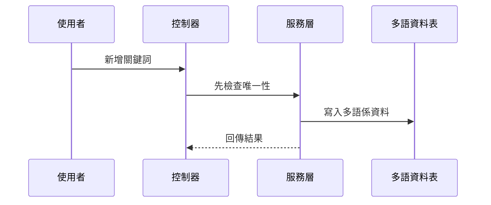

你可以把它理解成：

1. 使用者在畫面上輸入詞彙
2. 控制器接收資料
3. 服務層先檢查有沒有重複
4. 通過後寫入主檔與多語資料
5. 最後回傳結果

---

## 八、`Txdsdad1`：真正存多語內容的地方

現在來看最核心的多語資料。

---

### 多語資料長什麼樣？

`Txdsdad1` 的欄位很多，但新手先只要記住幾個：

- `pjno`：專案編號
- `lngid`：語言識別代號
- `type`：類型
- `strghtbdymsg`：正體訊息
- `cnmsg`：簡體訊息
- `emsg`：英文訊息

你可以把它想像成一筆字典的三語版本：

| 語言 | 內容 |
|---|---|
| 正體 | 儲存 |
| 簡體 | 保存 |
| 英文 | Save |

---

### 為什麼要有 `type`？

`type` 很像分類標籤。

例如：

- `label`：畫面標籤
- `button`：按鈕
- `message`：提示訊息
- `menu`：選單

這樣同一個詞彙就可以依照用途分類。  
就像書店會把書分成：

- 語言學
- 工具書
- 小說
- 教材

---

## 九、`Txdsdad1Controller` 做了什麼特別的事？

檔案位置：

- [`fpg-vcpseos/src/main/java/com/fpg/sd/controller/Txdsdad1Controller.java`](fpg-vcpseos/src/main/java/com/fpg/sd/controller/Txdsdad1Controller.java)

它除了基本的查詢、匯出、新增、修改、刪除外，還有兩個很重要的功能：

- `updateByMenu`：更新菜單名稱多語係
- `downloadForAll`：生成整包多語檔

---

### 1. `updateByMenu`

這支功能可以想成：

> 把系統菜單名稱重新套用多語資料。

簡單講就是，當菜單文字有調整時，系統可以批次更新。

---

### 2. `downloadForAll`

這支功能非常重要，因為它會把資料整理成前端和 Java 兩邊都能用的檔案。

它會產生：

- `zh-CN.js`
- `zh-TW.js`
- `en-US.js`
- `messages_zh_CN.properties`
- `messages_zh_TW.properties`
- `messages_en_US.properties`

這表示：

- 前端可以直接拿語言檔使用
- Java 端也可以拿 properties 使用

你可以把它想成：

> 系統把詞典整理成不同格式的複製本，方便不同程式直接拿去用。

---

## 十、`downloadForAll` 的運作方式

這個流程可以簡化成四步：

1. 從資料庫查出所有多語資料
2. 整理成前端要用的語言物件
3. 整理成 Java 要用的字串檔
4. 壓縮成 zip 讓使用者下載

---

### `convertMap`：先把資料轉成三種語言的 JSON

```java
Map<String, String> str = convertMap(list);
```

這段的意思是：

- 把資料清單轉成三份內容
- 分別對應簡體、繁體、英文

這就像：

> 同一份菜單，印三種語言版本。

---

### `createChildNodeZh`：把中文資料塞進 JSON

```java
String category = txdsdad1.getType();
String key = txdsdad1.getLngid().toLowerCase();
String value = txdsdad1.getCnmsg();
```

意思是：

- 依照 `type` 分類
- 用 `lngid` 當 key
- 用中文訊息當 value

這樣前端就能直接讀取。

---

### `string2Unicode`：轉成 Unicode 字串

```java
public static String string2Unicode(String string)
```

這個方法會把中文字轉成 Unicode 格式。  
它的用途是讓 `.properties` 檔更安全地保存中文。

你可以把它想成：

> 把中文翻成系統比較容易保存的格式。

---

## 十一、`Txdsdad1Controller` 為什麼要先建立臨時檔案？

在下載前，它會先把語言檔寫到暫存資料夾，再打包成 zip。

這樣做的原因很簡單：

- 方便先整理內容
- 方便打包
- 方便最後一次性下載

你可以把它想像成：

> 先把所有書整理到箱子裡，再整箱搬走。

---

## 十二、用一個超簡單的例子理解整體流程

假設你想讓系統支援「登入」這個詞：

### 第一步：建關鍵字

```java
data.setKeywd("login");
data.setKeywdc("登入");
```

這代表詞條主檔先建立。

---

### 第二步：建多語係資料

```java
lang.setLngid("LOGIN");
lang.setCnmsg("登入");
lang.setEmsg("Login");
```

這代表這個詞有三種語言版本。

---

### 第三步：前端下載語言檔

系統會把資料整理成：

- `zh-CN.js`
- `zh-TW.js`
- `en-US.js`

這樣前端畫面就可以直接顯示：

- 簡體：登录
- 繁體：登入
- 英文：Login

---

## 十三、為什麼這個設計很實用？

因為它把「文字」跟「畫面」分開了。

如果文字都直接寫在前端，會有這些問題：

- 改一個字，要改很多頁
- 多語系很難管理
- 報表與訊息容易不一致

但如果統一放在字典系統裡，就變成：

- 一處修改
- 多處同步
- 維護成本降低

這就像：

> 不是每個人都自己背整本詞典，而是共用一本標準詞典。

---

## 十四、這一章和上一章的關係

上一章的 [參考資料與欄位對照平台](03_參考資料與欄位對照平台_.md) 主要在管：

- 欄位叫什麼
- 欄位怎麼顯示
- 欄位順序如何安排

這一章的多語係管理則更進一步：

- 文字內容如何翻譯
- 不同語言如何共用
- 如何輸出給前端與後端

你可以這樣記：

> **上一章管欄位，這一章管文字。**

---

## 十五、從程式碼看內部實作

下面我們用很簡單的方式看幾個重點實作。

---

### 1. `Txdsdaa1Controller` 如何做新增與唯一檢查？

```java
if (!txdsdaa1Service.checkKeywdUnique(txdsdaa1)) {
    return error("關鍵字已存在");
}
txdsdaa1.setTxemp(getUsername());
```

這段意思是：

- 先檢查是否重複
- 不重複才繼續
- 再把操作人員記錄進去

這樣就不會出現兩筆一樣的資料。

---

### 2. `Txdsdab1ServiceImpl` 如何同步寫入多語資料？

```java
Txdsdad1 aTxdsdad1 = new Txdsdad1();
aTxdsdad1.setLngid(txdsdab1.getKywrd().toUpperCase());
aTxdsdad1.setCnmsg(txdsdab1.getKywrdc());
```

這段意思是：

- 建立對應的多語主檔
- 用關鍵詞當識別代號
- 存入中文內容

這樣主檔與翻譯資料就能連在一起。

---

### 3. `Txdsdad1Controller` 如何產出下載檔？

```java
Map<String,String> str = convertMap(list);
Writer writer_cn_json = new OutputStreamWriter(new FileOutputStream(file_cn_json), "UTF-8");
writer_cn_json.write(str.get("json_zh"));
```

這段意思是：

- 先整理成 JSON 字串
- 再寫入檔案
- 最後打包給使用者下載

這就像把整理好的詞典印成不同版本的小冊子。

---

## 十六、這個平台背後的關鍵觀念

你只要先抓住這三件事就好：

### 1. 關鍵字是主索引

`keywd`、`kywrd`、`lngid` 這些欄位都像索引號。  
它們負責把詞條定位出來。

---

### 2. 中文名稱是人類看得懂的內容

`keywdc`、`cnmsg`、`strghtbdymsg` 這些欄位，是給人看的。  
系統真正用的，常常是代號；人真正看的，是中文或其他語言。

---

### 3. 多語係是輸出成果

`Txdsdad1Controller` 最後匯出的語言檔，才是前端真正會用到的內容。  
也就是說：

> 先有資料主檔，再有多語資料，最後才有畫面顯示。

---

## 十七、初學者最容易混淆的地方

### 1. `Txdsdaa1` 和 `Txdsdab1` 都像關鍵字，但用途不同

- `Txdsdaa1` 偏向一般關鍵字建檔
- `Txdsdab1` 偏向關鍵詞與欄位資訊，還會帶多語同步

---

### 2. `Txdsdac1` 不是翻譯資料

它是專案模組資料，主要在說「這個詞屬於哪個模組」。

---

### 3. `Txdsdad1` 才是真正的多語內容主表

如果你要找簡體、繁體、英文對照，主要看它。

---

### 4. 匯出的 `js` 檔和 `properties` 檔用途不同

- `js`：給前端用
- `properties`：給 Java 用

---

## 十八、你可以怎麼記住整個流程？

最簡單的記法是：

1. **先建關鍵字**
2. **再建多語係**
3. **再匯出語言檔**
4. **前端依語系顯示文字**

如果你只記住這句話，就已經掌握本章大半內容了。

---

## 十九、整個流程的小地圖

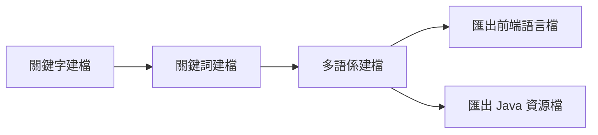

這張圖想表達的是：

- 主檔與對照資料先建立
- 再轉成可供不同系統使用的檔案

---

## 二十、本章小結

這一章我們學到了「多語係與關鍵字字典管理」的基本概念：

- `Txdsdaa1`：關鍵字建檔，管理詞條主資料
- `Txdsdab1`：關鍵詞建檔，並同步建立多語資料
- `Txdsdac1`：專案模組建檔，管理詞彙所屬模組
- `Txdsdad1`：多語係建檔，真正存放不同語言內容
- 控制器、服務層、資料存取層如何合作
- 如何檢查唯一性、同步更新、匯出語言檔

你可以把這一章記成一句很簡單的話：

> **先把詞條建好，再把不同語言版本整理好，最後讓前端與系統共用同一套字典。**

下一章我們會開始進入更偏向業務主資料的內容：  
[單據參數建檔主資料](05_單據參數建檔主資料_.md)


--- 

Generated by [AI Codebase Knowledge Builder](https://github.com/The-Pocket/Tutorial-Codebase-Knowledge)
