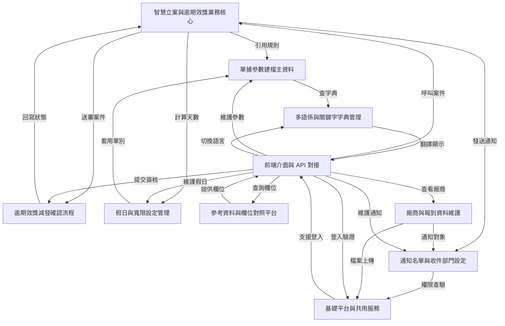

# Tutorial: code_to_analyze

這個專案是用來做 **配電盤智慧立案與逾期效獎減發管理** 的系統，核心目標是把原本靠人工追蹤的案件流程，改成由系統自動判斷、通知與簽核。
它會先依照 *單據規則、假日、寬限天數* 計算案件是否逾期，再把逾期案件送進經辦、課長、廠長的分層確認流程，最後視結果決定是否要減發獎金或拋轉到外部系統。
同時系統也提供 **基礎資料維護**、**參考欄位對照**、**多語係管理** 與 **前端 API 串接**，讓整體功能可以穩定運作並方便使用者操作。

**Source Repository:** [None](None)

## Chapters

1. [基礎平台與共用服務
](01_基礎平台與共用服務_.md)
2. [前端介面與 API 對接
](02_前端介面與_api_對接_.md)
3. [參考資料與欄位對照平台
](03_參考資料與欄位對照平台_.md)
4. [多語係與關鍵字字典管理
](04_多語係與關鍵字字典管理_.md)
5. [單據參數建檔主資料
](05_單據參數建檔主資料_.md)
6. [假日與寬限設定管理
](06_假日與寬限設定管理_.md)
7. [通知名單與收件部門設定
](07_通知名單與收件部門設定_.md)
8. [廠商與報到資料維護
](08_廠商與報到資料維護_.md)
9. [智慧立案與逾期效獎業務核心
](09_智慧立案與逾期效獎業務核心_.md)
10. [逾期效獎減發確認流程
](10_逾期效獎減發確認流程_.md)

---

Generated by [AI Codebase Knowledge Builder](https://github.com/The-Pocket/Tutorial-Codebase-Knowledge)