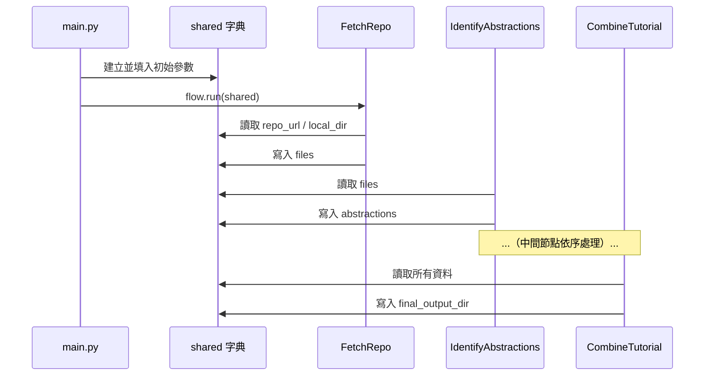

# 第 1 章：CLI 入口與 `shared` 字典

← 回到 [教學總覽](../TUTORIAL_ZH.md)

---

## 🎯 本章目標

了解程式如何**啟動**，以及各個處理步驟之間如何**傳遞資料**。

---

## 1.1 程式從哪裡開始？

當你在終端機執行以下指令時：

```bash
python main.py --repo https://github.com/user/repo --language "traditional chinese"
```

Python 會進入 `main.py` 的 `main()` 函式。這就是整個系統的**入口點（Entry Point）**。

---

## 1.2 命令列參數解析

`main.py` 使用 Python 內建的 `argparse` 模組來解析你輸入的參數：

```python
# ① 建立解析器
parser = argparse.ArgumentParser(...)

# ② 來源（二選一）：GitHub 網址 或 本地目錄
source_group = parser.add_mutually_exclusive_group(required=True)
source_group.add_argument("--repo", ...)
source_group.add_argument("--dir", ...)

# ③ 其他選項
parser.add_argument("--language", default="english", ...)
parser.add_argument("--no-cache", action="store_true", ...)
parser.add_argument("--max-abstractions", type=int, default=10, ...)
```

> **比喻**：`argparse` 就像點餐系統——你告訴它你想要什麼（餐點 = 參數），它幫你整理成一份清單（`args` 物件）。

---

## 1.3 `shared` 字典 — 系統的資料中樞

解析完參數後，`main.py` 建立一個名為 `shared` 的 Python 字典：

```python
shared = {
    # 輸入參數
    "repo_url":    args.repo,       # GitHub 網址（或 None）
    "local_dir":   args.dir,        # 本地目錄（或 None）
    "language":    args.language,   # 輸出語言
    "use_cache":   not args.no_cache,
    "output_dir":  args.output,

    # 各節點會依序填入的輸出
    "files":          [],   # ← FetchRepo 填入
    "abstractions":   [],   # ← IdentifyAbstractions 填入
    "relationships":  {},   # ← AnalyzeRelationships 填入
    "chapter_order":  [],   # ← OrderChapters 填入
    "chapters":       [],   # ← WriteChapters 填入
    "final_output_dir": None  # ← CombineTutorial 填入
}
```

> **比喻**：`shared` 字典就像一條**流水線上的托盤**。每個工站（節點）從托盤上取走它需要的材料、加工完成後再放回去，傳給下一個工站。



---

## 1.4 啟動流程

```python
# ① 建立流程（見 flow.py）
tutorial_flow = create_tutorial_flow()

# ② 執行流程，傳入 shared 字典
tutorial_flow.run(shared)
```

`flow.py` 負責將所有節點串接起來（詳見[第 2 章](02_pocketflow_nodes.md)）。呼叫 `run(shared)` 後，六個節點會依序自動執行。

---

## 📝 本章小結

| 概念 | 說明 |
|------|------|
| `main.py` | CLI 入口，解析參數並建立 `shared` |
| `argparse` | 解析命令列參數的標準庫 |
| `shared` 字典 | 所有節點共用的資料容器，貫穿整個流程 |
| `flow.run(shared)` | 啟動整個節點管線 |

下一章：[PocketFlow 節點與流程](02_pocketflow_nodes.md) — 了解 Node、BatchNode、Flow 的設計原理。

---

*由 [AI Codebase Knowledge Builder](https://github.com/The-Pocket/Tutorial-Codebase-Knowledge) 生成*
