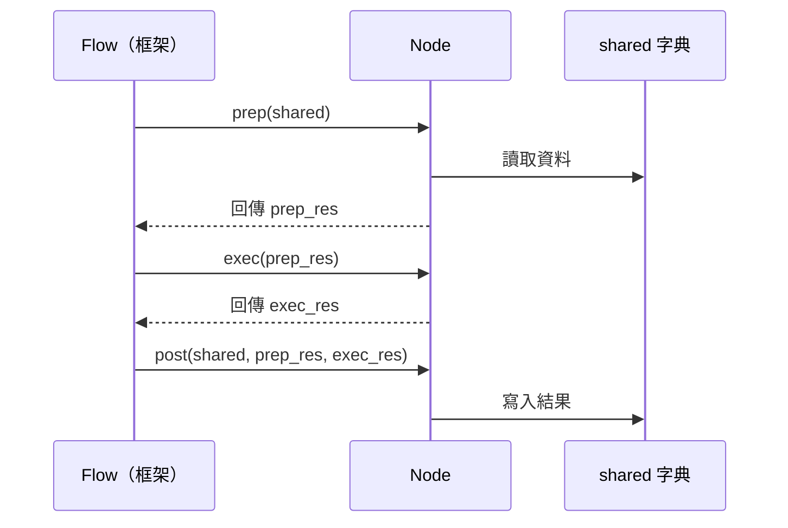
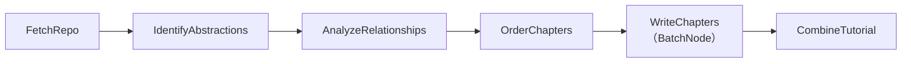

# 第 2 章：PocketFlow 節點與流程

← [第 1 章：CLI 入口與 shared 字典](01_cli_shared.md)

---

## 🎯 本章目標

了解 PocketFlow 框架的三大核心構件：**Node**、**BatchNode**、**Flow**，以及本專案如何用它們組成完整管線。

---

## 2.1 為什麼需要 PocketFlow？

建構 LLM 應用時，我們常常需要：

- 將複雜任務切分為多個步驟
- 在步驟之間傳遞資料
- 處理 LLM 偶爾失敗時的重試邏輯

PocketFlow 是一個**約 100 行的輕量圖狀框架**，解決了上述問題。

---

## 2.2 Node — 單一處理步驟

每個 `Node` 有三個生命週期方法：

```python
class MyNode(Node):
    def prep(self, shared):
        # ① 從 shared 讀取資料，回傳給 exec 使用
        return shared["some_key"]

    def exec(self, prep_res):
        # ② 純邏輯：呼叫 LLM、運算等（不直接存取 shared）
        result = do_something(prep_res)
        return result

    def post(self, shared, prep_res, exec_res):
        # ③ 將 exec 結果寫回 shared
        shared["output_key"] = exec_res
```

> **比喻**：Node 就像工廠流水線上的**一個工站**：
> - `prep()` = 從輸送帶取走材料
> - `exec()` = 加工處理
> - `post()` = 放回輸送帶傳給下一站



### 重試機制

LLM 節點在 `flow.py` 中設定了重試：

```python
identify_abstractions = IdentifyAbstractions(max_retries=5, wait=20)
```

當 `exec()` 拋出例外時，框架會自動等待 20 秒後重試，最多 5 次。節點可透過 `self.cur_retry` 判斷目前是第幾次重試：

```python
# 重試時跳過快取，強制重新呼叫 LLM
call_llm(prompt, use_cache=(use_cache and self.cur_retry == 0))
```

---

## 2.3 BatchNode — 批次處理版 Node

`WriteChapters` 需要為**每個章節**分別呼叫 LLM，使用 `BatchNode`：

```python
class WriteChapters(BatchNode):
    def prep(self, shared):
        # 回傳一個「清單」，每個元素是一個 item
        return [item1, item2, item3, ...]

    def exec(self, item):
        # 對清單中的每個 item 各執行一次
        return write_one_chapter(item)

    def post(self, shared, prep_res, exec_res_list):
        # exec_res_list 是所有 exec 結果組成的清單
        shared["chapters"] = exec_res_list
```

> **比喻**：`BatchNode` 像是**影印機**，你一次放入多張原稿，它依序輸出每一份複印件。

---

## 2.4 Flow — 節點的串接

`flow.py` 使用 `>>` 運算子將節點串接：

```python
from pocketflow import Flow
from nodes import FetchRepo, IdentifyAbstractions, ...

def create_tutorial_flow():
    # ① 實例化節點
    fetch_repo             = FetchRepo()
    identify_abstractions  = IdentifyAbstractions(max_retries=5, wait=20)
    analyze_relationships  = AnalyzeRelationships(max_retries=5, wait=20)
    order_chapters         = OrderChapters(max_retries=5, wait=20)
    write_chapters         = WriteChapters(max_retries=5, wait=20)
    combine_tutorial       = CombineTutorial()

    # ② 串接（>> 定義執行順序）
    fetch_repo >> identify_abstractions
    identify_abstractions >> analyze_relationships
    analyze_relationships >> order_chapters
    order_chapters >> write_chapters
    write_chapters >> combine_tutorial

    # ③ 建立 Flow，指定起始節點
    return Flow(start=fetch_repo)
```



> 呼叫 `flow.run(shared)` 後，框架從 `FetchRepo` 開始，依序執行每個節點的 `prep → exec → post`，直到最後一個節點完成。

---

## 2.5 設計原則

| 原則 | 說明 |
|------|------|
| `prep()` 無副作用 | 只讀取 `shared`，不修改它 |
| `exec()` 不碰 `shared` | 保持純邏輯，方便測試和重試 |
| `post()` 寫入 `shared` | 是唯一修改 `shared` 的地方 |
| 無 `try/except` in `exec()` | 讓錯誤直接浮現，由框架的重試機制處理 |

---

## 📝 本章小結

| 概念 | 說明 |
|------|------|
| `Node` | 單一步驟，三方法：`prep / exec / post` |
| `BatchNode` | `prep` 回傳清單，`exec` 對每項各執行一次 |
| `Flow` | 用 `>>` 串接節點，`run(shared)` 啟動 |
| `max_retries / wait` | LLM 節點自動重試機制 |

下一章：[FetchRepo — 抓取程式碼](03_fetch_repo.md)

---

*由 [AI Codebase Knowledge Builder](https://github.com/The-Pocket/Tutorial-Codebase-Knowledge) 生成*
