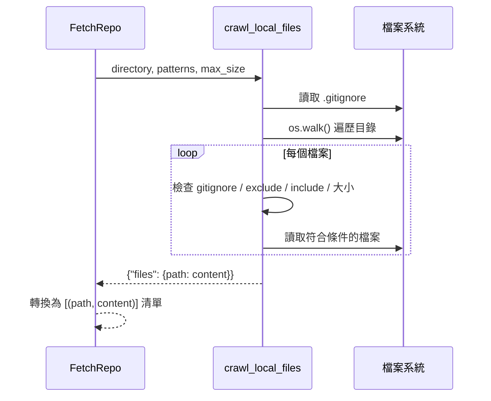

# 第 3 章：FetchRepo — 抓取程式碼

← [第 2 章：PocketFlow 節點與流程](02_pocketflow_nodes.md)

---

## 🎯 本章目標

了解第一個節點 `FetchRepo` 如何從 **GitHub 儲存庫**或**本地目錄**抓取原始碼，並整理成後續節點可使用的格式。

---

## 3.1 這個節點解決什麼問題？

在產生教學之前，系統必須先**讀取所有相關原始碼**。程式碼可能來自：

- 🌐 **GitHub 儲存庫**（透過 GitHub API 下載）
- 📁 **本地目錄**（直接讀取本機檔案）

`FetchRepo` 節點統一處理這兩種來源，輸出格式也完全一致。

---

## 3.2 prep() — 準備參數

```python
def prep(self, shared):
    repo_url   = shared.get("repo_url")    # GitHub 網址或 None
    local_dir  = shared.get("local_dir")   # 本地路徑或 None

    # 若未指定專案名稱，自動從 URL 或目錄名稱推導
    if not shared.get("project_name"):
        if repo_url:
            project_name = repo_url.split("/")[-1].replace(".git", "")
        else:
            project_name = os.path.basename(os.path.abspath(local_dir))
        shared["project_name"] = project_name

    return {
        "repo_url":         repo_url,
        "local_dir":        local_dir,
        "token":            shared.get("github_token"),
        "include_patterns": shared["include_patterns"],  # 例如 {"*.py", "*.md"}
        "exclude_patterns": shared["exclude_patterns"],  # 例如 {"*test*", ".git/*"}
        "max_file_size":    shared["max_file_size"],     # 預設 100KB
    }
```

> **注意**：`prep()` 在這裡破例直接修改了 `shared["project_name"]`——這是因為後續節點在 `prep` 階段就需要這個值，屬於初始化的一部分。

---

## 3.3 exec() — 執行抓取

```python
def exec(self, prep_res):
    if prep_res["repo_url"]:
        # 🌐 從 GitHub 抓取
        result = crawl_github_files(
            repo_url=prep_res["repo_url"],
            token=prep_res["token"],
            include_patterns=prep_res["include_patterns"],
            exclude_patterns=prep_res["exclude_patterns"],
            max_file_size=prep_res["max_file_size"],
        )
    else:
        # 📁 從本地目錄讀取
        result = crawl_local_files(
            directory=prep_res["local_dir"],
            include_patterns=prep_res["include_patterns"],
            exclude_patterns=prep_res["exclude_patterns"],
            max_file_size=prep_res["max_file_size"],
        )

    # 轉換成 [(path, content), ...] 的清單格式
    files_list = list(result.get("files", {}).items())
    if len(files_list) == 0:
        raise ValueError("Failed to fetch files")
    return files_list
```

兩個爬取函式都回傳 `{"files": {path: content}}` 字典，`exec()` 將其轉換為**有順序的 tuple 清單**，以便後續透過整數索引引用。

---

## 3.4 輸出格式：files 清單

```python
# shared["files"] 的結構：
[
    ("main.py",            "import argparse\n..."),   # index 0
    ("flow.py",            "from pocketflow..."),     # index 1
    ("nodes.py",           "class FetchRepo..."),     # index 2
    ("utils/call_llm.py",  "def call_llm..."),        # index 3
    # ...
]
```

後續節點用**整數索引**（0, 1, 2...）來引用特定檔案，輔助函式 `get_content_for_indices()` 負責將索引轉換為實際內容：

```python
def get_content_for_indices(files_data, indices):
    content_map = {}
    for i in indices:
        path, content = files_data[i]
        content_map[f"{i} # {path}"] = content
    return content_map
```

---

## 3.5 過濾規則

### 包含模式（include_patterns）
預設包含常見程式碼副檔名：

```python
{"*.py", "*.js", "*.ts", "*.go", "*.java", "*.md", "*.yaml", ...}
```

### 排除模式（exclude_patterns）
預設排除雜訊目錄：

```python
{"*venv/*", "*test*", "*docs/*", ".git/*", "*node_modules/*", ...}
```

### 本地爬取的額外機制
`crawl_local_files.py` 還會自動讀取 `.gitignore` 並套用其規則，確保版本控制忽略的檔案也不會被收錄。



---

## 3.6 post() — 寫回 shared

```python
def post(self, shared, prep_res, exec_res):
    shared["files"] = exec_res  # List of (path, content) tuples
```

---

## 📝 本章小結

| 概念 | 說明 |
|------|------|
| `FetchRepo` | 第一個節點，統一抓取 GitHub 或本地程式碼 |
| `crawl_github_files` | 透過 GitHub API 下載檔案 |
| `crawl_local_files` | 遍歷本地目錄，支援 `.gitignore` |
| `shared["files"]` | `[(path, content)]` 清單，用整數索引引用 |
| `get_content_for_indices()` | 輔助函式，將索引清單轉換為內容字典 |

下一章：[IdentifyAbstractions — 識別抽象](04_identify_abstractions.md)

---

*由 [AI Codebase Knowledge Builder](https://github.com/The-Pocket/Tutorial-Codebase-Knowledge) 生成*
