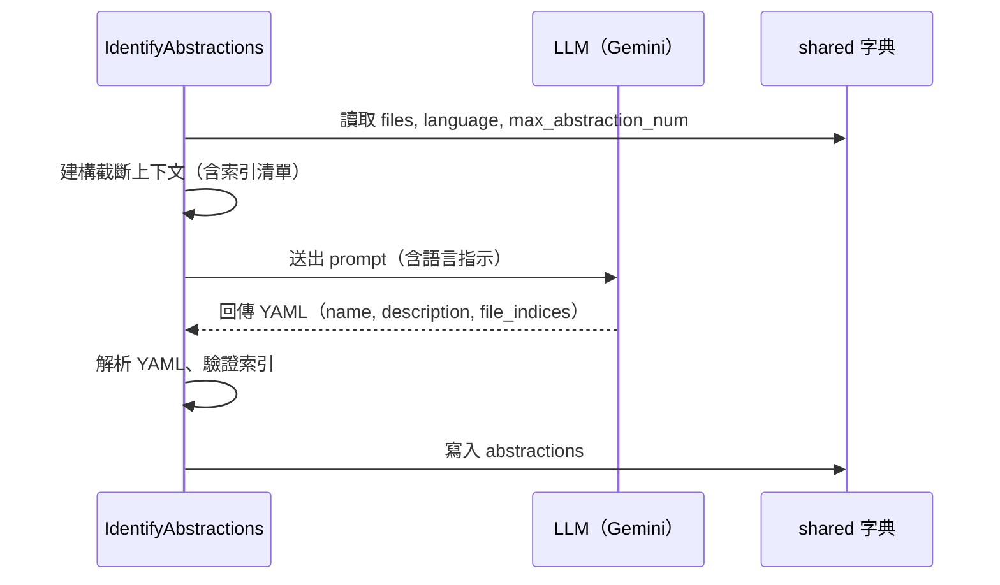

# 第 4 章：IdentifyAbstractions — 識別核心抽象

← [第 3 章：FetchRepo — 抓取程式碼](03_fetch_repo.md)

---

## 🎯 本章目標

了解 `IdentifyAbstractions` 節點如何利用 LLM **從原始碼中找出 5~10 個核心概念**，並將結果結構化儲存。

---

## 4.1 這個節點解決什麼問題？

一份大型程式碼庫可能有數十個模組。初學者不需要全部了解——他們需要的是**最重要的 5~10 個核心概念**，以及每個概念的簡單說明。

這個節點讓 LLM 扮演「資深工程師」的角色，為初學者挑選最值得優先理解的抽象。

---

## 4.2 prep() — 建構 LLM 上下文

### 問題：LLM 有 Token 上限

直接將所有檔案內容丟給 LLM 可能超過 Token 限制。`prep()` 使用兩個環境變數控制：

```python
max_context_chars     = int(os.getenv("MAX_LLM_CONTEXT_CHARS", "200000"))
max_file_snippet_chars = int(os.getenv("MAX_FILE_SNIPPET_CHARS", "2000"))
```

### 建構截斷後的上下文

```python
for i, (path, content) in enumerate(files_data):
    snippet = content[:max_file_snippet_chars]   # 每個檔案最多 2000 字元
    entry = f"--- File Index {i}: {path} ---\n{snippet}\n\n"

    if context_chars + len(entry) > max_context_chars:
        break   # 超過總上限就停止

    context_parts.append(entry)
```

### 同時提供完整的檔案索引清單

即使某些檔案因上下文限制未被展示，LLM 仍可透過索引引用它們：

```python
file_listing_for_prompt = "\n".join(
    [f"- {idx} # {path}" for idx, (path, _) in enumerate(files_data)]
)
```

---

## 4.3 exec() — 呼叫 LLM 並解析結果

### Prompt 結構

```python
prompt = f"""
For the project `{project_name}`:

Codebase Context:
{context}

{language_instruction}Analyze the codebase context.
Identify the top 5-{max_abstraction_num} core most important abstractions...

Format the output as a YAML list:
```yaml
- name: |
    概念名稱
  description: |
    簡單說明（約 100 字）...
  file_indices:
    - 0 # path/to/file.py
    - 3 # path/to/related.py
```
"""
```

### 多語言支援

當 `language` 不是 `"english"` 時，自動在 prompt 中加入語言指示：

```python
if language.lower() != "english":
    language_instruction = (
        f"IMPORTANT: Generate the `name` and `description` "
        f"in **{language.capitalize()}** language. Do NOT use English.\n\n"
    )
```

### 解析 YAML 回應

```python
# LLM 回應格式：```yaml ... ```
yaml_str = response.strip().split("```yaml")[1].split("```")[0].strip()
abstractions = yaml.safe_load(yaml_str)
```

---

## 4.4 驗證與清理

節點對每個抽象進行嚴格驗證：

```python
for item in abstractions:
    # ① 確認必要欄位存在
    assert all(k in item for k in ["name", "description", "file_indices"])

    # ② 驗證並清理檔案索引
    validated_indices = []
    for idx_entry in item["file_indices"]:
        # 支援多種格式：整數、"0 # path" 字串
        idx = int(str(idx_entry).split("#")[0].strip())
        assert 0 <= idx < file_count
        validated_indices.append(idx)

    item["files"] = sorted(list(set(validated_indices)))
```

---

## 4.5 輸出格式

```python
# shared["abstractions"] 的結構：
[
    {
        "name":        "Flow（流程）",
        "description": "Flow 是節點的容器，負責按順序執行每個節點...",
        "files":       [1, 2]   # 整數索引，對應 shared["files"]
    },
    {
        "name":        "shared 字典",
        "description": "貫穿整個流程的資料容器...",
        "files":       [0, 2]
    },
    # ... 最多 max_abstraction_num 個
]
```



---

## 📝 本章小結

| 概念 | 說明 |
|------|------|
| 上下文截斷 | 用 `MAX_LLM_CONTEXT_CHARS` 和 `MAX_FILE_SNIPPET_CHARS` 避免超過 Token 上限 |
| 語言指示 | 非英文時自動在 prompt 加入翻譯指令 |
| YAML 解析慣例 | 從 ` ```yaml ... ``` ` 區塊提取並用 `yaml.safe_load()` 解析 |
| 索引驗證 | 確保 LLM 回傳的檔案索引合法 |
| `shared["abstractions"]` | `[{name, description, files:[int]}]` 清單 |

下一章：[AnalyzeRelationships — 分析關係](05_analyze_relationships.md)

---

*由 [AI Codebase Knowledge Builder](https://github.com/The-Pocket/Tutorial-Codebase-Knowledge) 生成*
