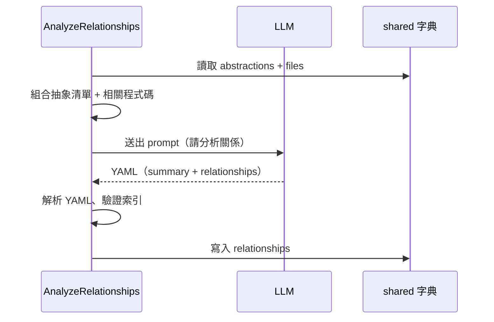

# 第 5 章：AnalyzeRelationships — 分析關係

← [第 4 章：IdentifyAbstractions — 識別抽象](04_identify_abstractions.md)

---

## 🎯 本章目標

了解 `AnalyzeRelationships` 節點如何讓 LLM **找出各抽象之間的互動關係**，並產生整個專案的概述摘要。

---

## 5.1 這個節點解決什麼問題？

上一步找出了各個核心概念，但它們之間**如何互動**？

- `FetchRepo` 輸出資料給誰？
- `call_llm` 被哪些節點使用？
- `shared` 字典扮演什麼中介角色？

`AnalyzeRelationships` 讓 LLM 分析這些關係，並用圖形關係（`from → to`）來表達。這些關係最終會呈現為 `index.md` 中的 Mermaid 關係圖。

---

## 5.2 prep() — 建構上下文

`prep()` 把已識別的抽象資訊和相關程式碼片段組合在一起：

```python
# ① 列出所有抽象
context = "Identified Abstractions:\n"
for i, abstr in enumerate(abstractions):
    file_indices_str = ", ".join(map(str, abstr["files"]))
    context += f"- Index {i}: {abstr['name']} (Files: [{file_indices_str}])\n"

# ② 收集所有相關檔案的內容
all_relevant_indices = set()
for abstr in abstractions:
    all_relevant_indices.update(abstr["files"])

relevant_files_map = get_content_for_indices(
    files_data, sorted(all_relevant_indices)
)
# 附加到上下文
context += "\nRelevant File Snippets:\n" + ...
```

---

## 5.3 exec() — LLM 分析關係

### Prompt 要求 LLM 輸出兩件事

```yaml
summary: |
  一段簡單的專案摘要，說明專案的主要目的和功能。
  支援 **粗體** 和 *斜體* 強調重要概念。
relationships:
  - from_abstraction: 0 # FetchRepo
    to_abstraction: 2 # shared 字典
    label: "寫入 files"
  - from_abstraction: 1 # IdentifyAbstractions
    to_abstraction: 2 # shared 字典
    label: "讀取 files，寫入 abstractions"
  # ...
```

### 關鍵約束

```
IMPORTANT: Make sure EVERY abstraction is involved in at least ONE relationship
(either as source or target).
```

這確保 Mermaid 圖中不會有孤立的節點。

---

## 5.4 驗證

```python
# ① 確認回傳結構
assert isinstance(relationships_data, dict)
assert "summary" in relationships_data
assert "relationships" in relationships_data

# ② 驗證每個關係的索引合法
for rel in relationships_data["relationships"]:
    from_idx = int(str(rel["from_abstraction"]).split("#")[0].strip())
    to_idx   = int(str(rel["to_abstraction"]).split("#")[0].strip())
    assert 0 <= from_idx < num_abstractions
    assert 0 <= to_idx   < num_abstractions
```

---

## 5.5 輸出格式

```python
# shared["relationships"] 的結構：
{
    "summary": "這個專案是一個 AI 工具...\n**PocketFlow** 作為...",
    "details": [
        {"from": 0, "to": 2, "label": "寫入 files"},
        {"from": 1, "to": 2, "label": "讀取、寫入"},
        {"from": 3, "to": 1, "label": "提供 LLM 回應"},
        # ...
    ]
}
```

> `"from"` 和 `"to"` 都是整數，對應 `shared["abstractions"]` 的索引位置。



---

## 5.6 為什麼用索引而非名稱？

整個流程中始終使用**整數索引**而非抽象名稱，原因是：

1. **名稱可能是翻譯過的**（非英文），索引不受語言影響
2. **一致性**：`files`、`abstractions`、`relationships` 都用同樣的索引系統互相引用
3. **避免 LLM 拼字錯誤**：「0 # FetchRepo」比直接用名稱更可靠

---

## 📝 本章小結

| 概念 | 說明 |
|------|------|
| `AnalyzeRelationships` | 分析抽象之間的互動，產生摘要和關係清單 |
| `summary` | 專案整體說明，會顯示在 `index.md` 頂部 |
| `details` | `[{from: int, to: int, label: str}]` 關係清單 |
| 索引系統 | 跨節點的統一引用方式，不受語言影響 |
| `get_content_for_indices()` | 將整數索引轉換為 `{"idx # path": content}` 字典 |

下一章：[OrderChapters & WriteChapters — 排序與撰寫](06_order_write_chapters.md)

---

*由 [AI Codebase Knowledge Builder](https://github.com/The-Pocket/Tutorial-Codebase-Knowledge) 生成*
