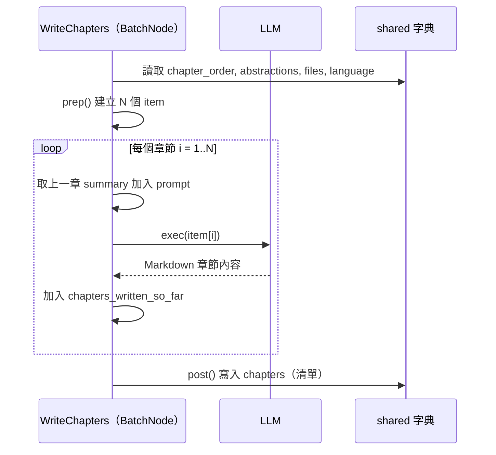

# 第 6 章：OrderChapters & WriteChapters — 排序與撰寫

← [第 5 章：AnalyzeRelationships — 分析關係](05_analyze_relationships.md)

---

## 🎯 本章目標

了解系統如何**決定章節的最佳學習順序**，以及如何用 `BatchNode` **批次產生每一個章節的 Markdown 內容**。

---

## Part A：OrderChapters — 排列章節順序

### 問題

抽象的識別順序不代表最佳學習順序。LLM 需要根據**概念的基礎性**重新排列：先教最重要、最基礎的概念，再逐步深入細節。

### exec() — 向 LLM 詢問最佳順序

```python
prompt = f"""
Abstractions (Index # Name):
{abstraction_listing}

Context:
{context}

What is the best order to explain these abstractions for a tutorial?
Output as YAML:

```yaml
- 2 # FoundationalConcept
- 0 # CoreClassA
- 1 # DetailImplementation
```
"""
```

LLM 只需回傳**索引的有序清單**，不需要重新描述每個概念。

### 驗證

```python
# 確認：① 沒有重複索引 ② 沒有遺漏索引 ③ 數量與抽象總數相符
if len(ordered_indices) != num_abstractions:
    raise ValueError(f"Missing indices: {set(range(num_abstractions)) - seen_indices}")
```

### 輸出

```python
# shared["chapter_order"]：索引的有序清單
[2, 0, 4, 1, 3]  # 代表「第1章=抽象2, 第2章=抽象0, ...」
```

---

## Part B：WriteChapters — 批次撰寫章節

### 為什麼用 BatchNode？

每個章節都需要一次獨立的 LLM 呼叫。使用 `BatchNode` 可以：

- `prep()` 一次準備好所有章節的輸入資料
- `exec()` 對每個章節各執行一次（依序）
- `post()` 收集所有結果

### prep() — 準備批次資料

```python
items_to_process = []
for i, abstraction_index in enumerate(chapter_order):
    items_to_process.append({
        "chapter_num":           i + 1,
        "abstraction_details":   abstractions[abstraction_index],
        "related_files_content": get_content_for_indices(...),
        "full_chapter_listing":  full_chapter_listing,  # 完整目錄，供章節交叉引用
        "prev_chapter":          chapter_filenames[prev_idx],
        "next_chapter":          chapter_filenames[next_idx],
        "language":              language,
        "use_cache":             use_cache,
    })
return items_to_process  # BatchNode 會對每個 item 呼叫一次 exec()
```

### exec() — 為單一章節呼叫 LLM

每次呼叫產生一個章節的 Markdown：

```python
prompt = f"""
Write a beginner-friendly tutorial chapter in Markdown for:
- Chapter {chapter_num}: {abstraction_name}
- Description: {abstraction_description}

Previous chapters context:
{previous_chapters_summary}

Relevant code:
{file_context_str}

Instructions:
- Use ## headings, analogies, annotated code snippets (①②③)
- Include a sequenceDiagram showing internal flow
- Link to other chapters using [Chapter Title](filename.md)
- End with transition to next chapter
- Keep code blocks under 10 lines
"""
chapter_content = call_llm(prompt, use_cache=...)
```

### 章節之間的上下文傳遞

`WriteChapters` 使用一個**實例變數**在批次執行中傳遞累積的摘要：

```python
# prep() 初始化
self.chapters_written_so_far = []

# exec() 每次執行後
self.chapters_written_so_far.append(chapter_content)
previous_chapters_summary = "\n---\n".join(self.chapters_written_so_far)
# 這份摘要會放入下一章節的 prompt，讓 LLM 知道前面教了什麼
```

> **比喻**：這就像老師在寫每一課的教材時，會先回顧之前的課程內容，確保新章節與前面的脈絡一致。



### 章節連結生成

`prep()` 預先計算每個章節的**安全檔名**，確保章節間的 Markdown 連結正確：

```python
safe_name = "".join(c if c.isalnum() else "_" for c in chapter_name).lower()
filename = f"{i+1:02d}_{safe_name}.md"
# 例如：章節名 "shared 字典" → "02_shared_____.md"
```

這些檔名會被加入 prompt，讓 LLM 生成正確的 `[Chapter Title](filename.md)` 連結。

---

## 📝 本章小結

| 概念 | 說明 |
|------|------|
| `OrderChapters` | LLM 決定最佳學習順序，輸出索引有序清單 |
| `WriteChapters` | `BatchNode`，對每個章節各呼叫一次 LLM |
| `chapters_written_so_far` | 實例變數，傳遞前幾章的摘要作為上下文 |
| 安全檔名 | 非字母數字字元替換為 `_`，確保檔案系統相容 |
| `shared["chapters"]` | `[str]`，每個元素是一章的 Markdown 內容 |

下一章：[CombineTutorial — 輸出結果](07_combine_tutorial.md)

---

*由 [AI Codebase Knowledge Builder](https://github.com/The-Pocket/Tutorial-Codebase-Knowledge) 生成*
