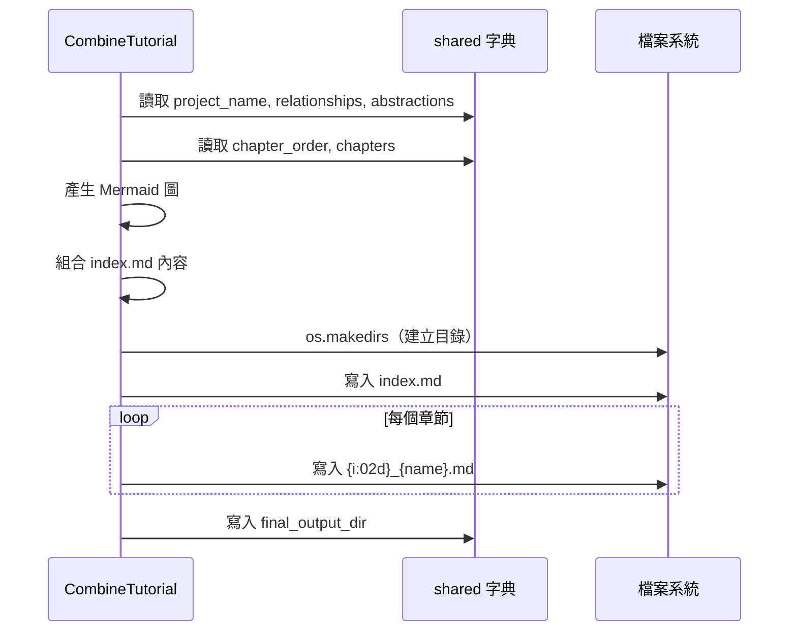

# 第 7 章：CombineTutorial — 組合並輸出結果

← [第 6 章：OrderChapters & WriteChapters](06_order_write_chapters.md)

---

## 🎯 本章目標

了解最後一個節點 `CombineTutorial` 如何把所有產生的內容**組合成完整的教學文件**並寫入磁碟。

---

## 7.1 這個節點做什麼？

前面的節點都在「思考」和「產生內容」，`CombineTutorial` 是唯一負責**寫入檔案**的節點。它的工作包括：

1. 建立輸出目錄（`output/<project_name>/`）
2. 產生 `index.md`（包含摘要和 Mermaid 關係圖）
3. 將每個章節寫入獨立的 `.md` 檔案

---

## 7.2 prep() — 產生 index.md 內容

### 建立 Mermaid 關係圖

從 `shared["relationships"]` 的 `details` 清單自動生成 Mermaid flowchart：

```python
mermaid_lines = ["flowchart TD"]

# 節點：每個抽象
for i, abstr in enumerate(abstractions):
    node_id = f"A{i}"
    sanitized_name = abstr["name"].replace('"', "")
    mermaid_lines.append(f'    {node_id}["{sanitized_name}"]')

# 邊：每個關係
for rel in relationships_data["details"]:
    edge_label = rel["label"].replace('"', "").replace("\n", " ")
    if len(edge_label) > 30:
        edge_label = edge_label[:27] + "..."
    mermaid_lines.append(
        f'    A{rel["from"]} -- "{edge_label}" --> A{rel["to"]}'
    )
```

### 組合 index.md

```python
index_content  = f"# Tutorial: {project_name}\n\n"
index_content += relationships_data["summary"] + "\n\n"
index_content += f"**Source Repository:** [{repo_url}]({repo_url})\n\n"
index_content += "```mermaid\n" + mermaid_diagram + "\n```\n\n"
index_content += "## Chapters\n\n"

for i, abstraction_index in enumerate(chapter_order):
    name     = abstractions[abstraction_index]["name"]
    filename = f"{i+1:02d}_{safe_name}.md"
    index_content += f"{i+1}. [{name}]({filename})\n"
```

### 為每個章節附加版權聲明

```python
chapter_content += "\n\n---\n\nGenerated by [AI Codebase Knowledge Builder](...)"
```

---

## 7.3 exec() — 實際寫入檔案

```python
def exec(self, prep_res):
    output_path   = prep_res["output_path"]
    index_content = prep_res["index_content"]
    chapter_files = prep_res["chapter_files"]  # [{filename, content}]

    # ① 建立輸出目錄
    os.makedirs(output_path, exist_ok=True)

    # ② 寫入 index.md
    with open(os.path.join(output_path, "index.md"), "w", encoding="utf-8") as f:
        f.write(index_content)

    # ③ 寫入各章節
    for chapter_info in chapter_files:
        filepath = os.path.join(output_path, chapter_info["filename"])
        with open(filepath, "w", encoding="utf-8") as f:
            f.write(chapter_info["content"])
```

---

## 7.4 最終輸出結構

執行完成後，輸出目錄如下：

```
output/
└── PocketFlow-Tutorial-Codebase-Knowledge/
    ├── index.md            ← 摘要 + Mermaid 圖 + 章節目錄
    ├── 01_flow___.md       ← 第 1 章
    ├── 02_shared___.md     ← 第 2 章
    ├── 03_fetchrepo.md     ← 第 3 章
    ├── ...
    └── 08_call_llm___.md   ← 最後一章
```

> 輸出目錄由 `--output` 參數控制（預設為 `./output`）。



---

## 7.5 後記：固定字串保持英文

程式碼中有一個設計決策值得注意：即使語言設定為非英文，部分固定字串仍保持英文：

```python
# 保持英文的部分：
index_content += f"**Source Repository:** [{repo_url}]({repo_url})\n\n"
index_content += f"## Chapters\n\n"
chapter_content += "Generated by [AI Codebase Knowledge Builder](...)"
```

> 這些是 Markdown 結構標籤和版權聲明，屬於**系統固定字串**，不需要翻譯。LLM 產生的摘要、關係標籤、章節內容才是需要多語言支援的部分。

---

## 📝 本章小結

| 概念 | 說明 |
|------|------|
| `CombineTutorial` | 唯一負責寫入檔案的節點 |
| `index.md` | 包含摘要、Mermaid 圖、章節連結 |
| Mermaid 自動生成 | 從 `relationships.details` 建立 `flowchart TD` |
| 章節檔名 | `{num:02d}_{safe_name}.md`，非字母數字轉為 `_` |
| `final_output_dir` | 寫入 `shared` 的最終輸出路徑 |

下一章：[工具程式：LLM 呼叫與快取](08_utils.md)

---

*由 [AI Codebase Knowledge Builder](https://github.com/The-Pocket/Tutorial-Codebase-Knowledge) 生成*
