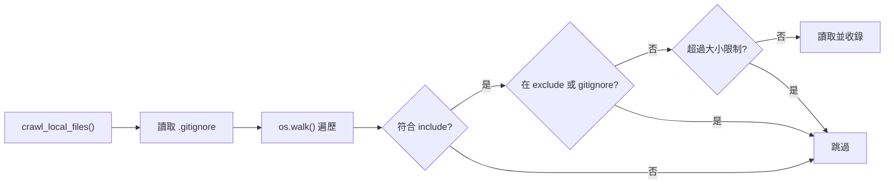

# 第 8 章：工具程式 — LLM 呼叫、快取與爬取

← [第 7 章：CombineTutorial — 輸出結果](07_combine_tutorial.md)

---

## 🎯 本章目標

深入了解 `utils/` 目錄下三個核心工具程式，它們是整個系統的**基礎設施層**。

---

## 8.1 call_llm.py — LLM 的統一入口

所有 LLM 呼叫都透過 `call_llm()` 這一個函式，它提供：

- **多 Provider 支援**：Gemini（預設）或任何 OpenAI 相容 API
- **磁碟快取**：相同 prompt 直接回傳快取結果
- **結構化日誌**：所有 prompt 和回應都記錄到 `logs/` 目錄

### 快取機制

```python
def call_llm(prompt: str, use_cache: bool = True) -> str:
    if use_cache:
        cache = load_cache()        # ① 從 llm_cache.json 讀取
        if prompt in cache:
            return cache[prompt]    # ② 命中快取，直接回傳

    # ③ 呼叫 LLM Provider
    response_text = _call_llm_gemini(prompt)  # 或 _call_llm_provider()

    if use_cache:
        cache = load_cache()        # ④ 重新載入（避免覆寫並發寫入）
        cache[prompt] = response_text
        save_cache(cache)           # ⑤ 以 prompt 為 key 存入 JSON

    return response_text
```

> **比喻**：快取就像**考試記憶卡**——第一次遇到問題時努力思考（呼叫 LLM），之後再看到相同問題直接背答案（快取）。開發時節省大量 API 費用！

### 快取的鍵值設計

快取以**完整 prompt 字串**作為 key，存入 `llm_cache.json`：

```json
{
  "For the project `example`:\n\nCodebase Context:\n...": "回應內容...",
  "另一個 prompt...": "另一個回應..."
}
```

**重試時跳過快取**：

```python
# 在各節點的 exec() 中
call_llm(prompt, use_cache=(use_cache and self.cur_retry == 0))
# 第一次嘗試使用快取；重試時（cur_retry > 0）強制重新呼叫 LLM
```

---

## 8.2 多 Provider 配置

### Gemini（預設）

```python
def _call_llm_gemini(prompt: str) -> str:
    if os.getenv("GEMINI_PROJECT_ID"):
        # Vertex AI 認證
        client = genai.Client(vertexai=True, project=..., location=...)
    elif os.getenv("GEMINI_API_KEY"):
        # API Key 認證
        client = genai.Client(api_key=os.getenv("GEMINI_API_KEY"))

    model = os.getenv("GEMINI_MODEL", "gemini-2.5-pro-exp-03-25")
    response = client.models.generate_content(model=model, contents=[prompt])
    return response.text
```

### 其他 OpenAI 相容 API（Ollama、xAI 等）

當 `LLM_PROVIDER` 設為非 `GEMINI` 時，使用通用 HTTP 呼叫：

```python
def _call_llm_provider(prompt: str) -> str:
    provider = os.environ["LLM_PROVIDER"]  # 例如 "XAI"、"OLLAMA"
    model    = os.environ[f"{provider}_MODEL"]
    base_url = os.environ[f"{provider}_BASE_URL"]
    api_key  = os.environ.get(f"{provider}_API_KEY", "")

    url = f"{base_url.rstrip('/')}/v1/chat/completions"
    payload = {"model": model, "messages": [{"role": "user", "content": prompt}]}
    response = requests.post(url, headers={"Authorization": f"Bearer {api_key}"}, json=payload)
    return response.json()["choices"][0]["message"]["content"]
```

### `.env` 設定範例

```dotenv
# Gemini（預設）
GEMINI_API_KEY=your-api-key
GEMINI_MODEL=gemini-2.5-pro-exp-03-25

# 或切換為 xAI
LLM_PROVIDER=XAI
XAI_MODEL=grok-beta
XAI_BASE_URL=https://api.x.ai
XAI_API_KEY=your-xai-key

# GitHub API Token（避免速率限制）
GITHUB_TOKEN=ghp_...
```

---

## 8.3 crawl_local_files.py — 本地目錄爬取



**關鍵特性**：
- `.gitignore` 使用 `pathspec` 套件解析，完整支援 gitignore 語法
- 進度條：`Progress: 42/100 (42%) main.py [processed]`（綠色輸出）
- 遇到讀取錯誤只警告，不中斷整個流程

---

## 8.4 crawl_github_files.py — GitHub API 爬取

透過 GitHub REST API 遞迴下載儲存庫檔案：

```
GET /repos/{owner}/{repo}/git/trees/{sha}?recursive=1
```

**關鍵特性**：
- 需要 `GITHUB_TOKEN` 以提高速率限制（每小時 5000 次 vs 60 次）
- 自動套用 include/exclude 過濾和大小限制
- 支援大型儲存庫的分頁（tree truncated 情況）

---

## 8.5 日誌系統

`call_llm.py` 自動建立日誌：

```python
log_file = f"logs/llm_calls_{datetime.now().strftime('%Y%m%d')}.log"
logger.info(f"PROMPT: {prompt}")
logger.info(f"RESPONSE: {response_text}")
```

每天一個日誌檔，方便除錯和審核 LLM 的輸入輸出。

---

## 📝 本章小結（也是整體總結）

| 工具 | 職責 |
|------|------|
| `call_llm()` | 統一 LLM 入口，含快取和日誌 |
| `_call_llm_gemini()` | Gemini / Vertex AI 實作 |
| `_call_llm_provider()` | OpenAI 相容 API 實作 |
| `crawl_local_files()` | 本地爬取，支援 `.gitignore` |
| `crawl_github_files()` | GitHub API 爬取 |
| `llm_cache.json` | 磁碟快取，以 prompt 為 key |
| `logs/` | LLM 呼叫日誌，每天一個檔案 |

---

## 🚀 推薦閱讀順序

如果你想深入理解這個程式碼庫，建議按以下順序閱讀：

1. `README.md` — 專案目標和快速上手
2. `main.py` — 入口點，看整體如何啟動
3. `flow.py` — 6 個節點如何串接
4. `nodes.py` — 每個節點的實作細節（按 `FetchRepo → CombineTutorial` 順序）
5. `utils/call_llm.py` — LLM 介面和快取機制
6. `utils/crawl_local_files.py` — 本地爬取邏輯
7. `utils/crawl_github_files.py` — GitHub API 爬取邏輯

---

← 回到 [教學總覽](../TUTORIAL_ZH.md)

---

*由 [AI Codebase Knowledge Builder](https://github.com/The-Pocket/Tutorial-Codebase-Knowledge) 生成*
