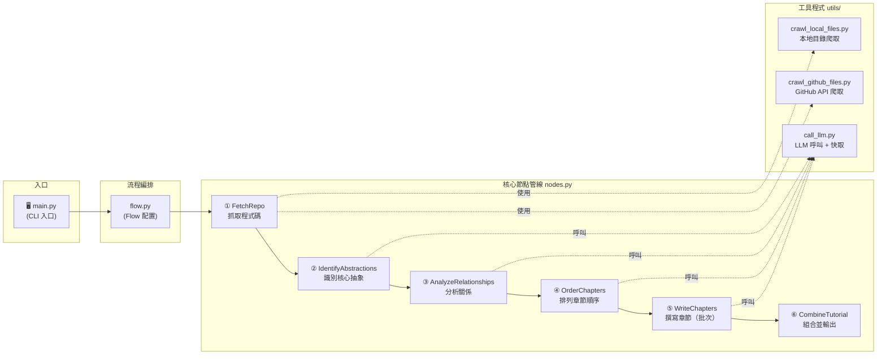
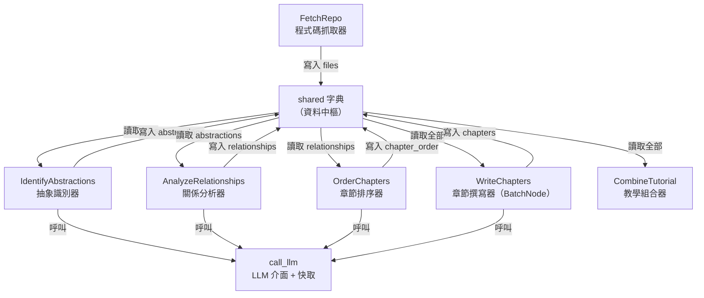

# 教學：PocketFlow-Tutorial-Codebase-Knowledge

> 📖 **繁體中文教學** — 本專案是一個以 [PocketFlow](https://github.com/The-Pocket/PocketFlow) 為核心的 AI 工具，能自動爬取 GitHub 儲存庫或本地目錄、分析程式碼，並產生適合初學者閱讀的多章節 Markdown 教學文件。

**原始碼庫：** [The-Pocket/PocketFlow-Tutorial-Codebase-Knowledge](https://github.com/The-Pocket/PocketFlow-Tutorial-Codebase-Knowledge)

---

## 🗺️ 系統架構總覽



> 每個節點讀取並寫入一個共用的 `shared` 字典，資料在節點之間單向傳遞。

---

## 📚 章節目錄

| # | 章節 | 說明 |
|---|------|------|
| 1 | [CLI 入口與 shared 字典](./01_cli_shared.md) | 程式如何啟動，資料如何傳遞 |
| 2 | [PocketFlow 節點與流程](./02_pocketflow_nodes.md) | Node / BatchNode / Flow 是什麼 |
| 3 | [FetchRepo — 抓取程式碼](./03_fetch_repo.md) | 從 GitHub 或本地目錄抓取檔案 |
| 4 | [IdentifyAbstractions — 識別抽象](./04_identify_abstractions.md) | 用 LLM 找出核心概念 |
| 5 | [AnalyzeRelationships — 分析關係](./05_analyze_relationships.md) | 找出抽象之間的關聯 |
| 6 | [OrderChapters & WriteChapters — 排序與撰寫](./06_order_write_chapters.md) | 決定順序並批次產生章節 |
| 7 | [CombineTutorial — 輸出結果](./07_combine_tutorial.md) | 組合並寫入最終文件 |
| 8 | [工具程式：LLM 呼叫與快取](./08_utils.md) | call_llm、快取機制、爬取工具 |

---

## 🔑 核心抽象關係圖



---

## 🚀 快速開始

```bash
# 安裝依賴
pip install -r requirements.txt

# 從 GitHub 儲存庫產生教學（繁體中文）
python main.py --repo https://github.com/username/repo --language "traditional chinese"

# 從本地目錄產生教學
python main.py --dir /path/to/code --language "traditional chinese"

# 停用 LLM 快取（強制重新呼叫 API）
python main.py --repo ... --no-cache
```

---

*由 [AI Codebase Knowledge Builder](https://github.com/The-Pocket/Tutorial-Codebase-Knowledge) 生成*
